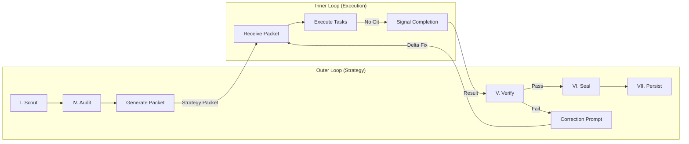

# Dual-Loop Supervisor

Orchestration skill for the Dual-Loop Agent Architecture. The Outer Loop (Antigravity) uses this skill to delegate work to the Inner Loop (Opus/Claude Code) and verify results.

## When to Use

- Starting a dual-loop session (`/sanctuary-dual-loop`)
- Preparing a strategy packet for the Inner Loop
- Verifying Inner Loop output after task completion
- Generating correction prompts on verification failure

## Architecture Overview



**Reference**: [Architecture Diagram](../../../docs/architecture_diagrams/workflows/dual_loop_architecture.mmd)

## Protocol 128 Integration

This skill maps to the following Learning Loop phases:

| Phase | Name | Role in Dual-Loop |
|-------|------|-------------------|
| I | Scout | Outer Loop reads RLM/Spec context, orients |
| IV | Audit | Outer Loop captures snapshot before delegation |
| II-III | (Execution) | Inner Loop performs tactical work |
| V | Verify | Outer Loop inspects diff, runs checks |
| VI | Seal | Outer Loop snapshots validated state |
| VII | Persist | Outer Loop saves to Soul (HuggingFace) |
| VIII | Retrospective | Outer Loop self-reviews process |
| IX | Ingest | Outer Loop updates RAG |

## Tooling

### 1. `generate_strategy_packet.py`
Distill a `tasks.md` item into a minimal, token-efficient Strategy Packet.

```bash
python3 tools/orchestrator/dual_loop/generate_strategy_packet.py \
  --tasks-file <path/to/tasks.md> \
  --task-id <ID> \
  --output .agent/handoffs/task_packet_NNN.md
```

### 2. `verify_inner_loop_result.py`
Verify the output of an Inner Loop execution.

```bash
python3 tools/orchestrator/dual_loop/verify_inner_loop_result.py \
  --packet .agent/handoffs/task_packet_NNN.md \
  --verbose \
  --update-status <path/to/tasks.md> \
  --task-id <ID>
```

### 3. `run_workflow.py` (Outer Loop CLI)
The main entry point for running a Dual-Loop task.

```bash
./tools/orchestrator/dual_loop/run_workflow.py <TASK_ID>
```
1.  Creates a worktree via `spec-kitty implement`.
2.  Generates the Strategy Packet.
3.  Launches Claude (Inner Loop) inside the worktree.

## Workflow (Protocol 133)

**Mandatory**: Before executing any Dual-Loop task, copy the meta-tasks from `.agent/templates/workflow/dual-loop-meta-tasks.md` into your task list.

1.  **Define**: Execute `/spec-kitty.specify` (Spec).
2.  **Architect**: Execute `/spec-kitty.plan` (Plan).
3.  **Tasking**: Execute `/spec-kitty.tasks` (Prompts).
4.  **Check**: Run `tools/orchestrator/verify_workflow_state.py --feature <SLUG> --phase tasks`.
5.  **Launch**: Run `run_workflow.py` for a specific WP ID.
    - *Troubleshooting*: If worktree path is not auto-detected, use `git worktree list`.
6.  **Execute**: Inner Loop (Claude) writes code in the worktree (NO GIT).
6.  **Verify**: Outer Loop runs `tools/orchestrator/dual_loop/verify_inner_loop_result.py`.
7.  **Seal**: 
    - **Commit**: `cd .worktrees/<WP> && git add . && git commit -m "feat(WP): ..."`
    - **Mark**: Update `tasks.md` status.
    - **Push**: `spec-kitty agent tasks move-task <WP> --to for_review`.

## Constraints

- The Inner Loop MUST NOT run git commands. Only the Outer Loop manages version control.
- **Worktree Isolation**: All coding happens in `.worktrees/`.
- Strategy Packets must be minimal. No conversation history, no redundant context.
- The Human Gate applies at every loop boundary.
- All verification failures produce a correction prompt, not a rejection.

## Related

- **Spec**: `kitty-specs/001-dual-loop-agent-architecture/spec.md`
- **Plan**: `kitty-specs/001-dual-loop-agent-architecture/plan.md`
- **Protocol 128**: [ADR 071](../../../ADRs/071_protocol_128_cognitive_continuity.md)
- **Protocol 133**: Dual-Loop Agent Architecture (this skill)
