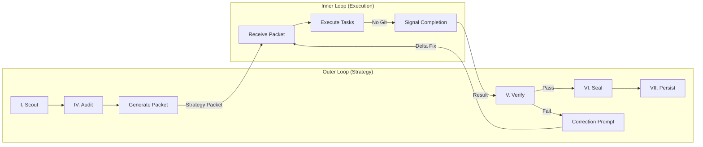

# Dual-Loop Supervisor

Orchestration skill for the Dual-Loop Agent Architecture. The Outer Loop (Antigravity) uses this skill to delegate work to the Inner Loop (Opus/Claude Code) and verify results.

## When to Use

- Starting a dual-loop session (`/sanctuary-dual-loop`)
- Preparing a strategy packet for the Inner Loop
- Verifying Inner Loop output after task completion
- Generating correction prompts on verification failure

## Architecture Overview

**Reference**: [Architecture Diagram](../../../docs/architecture_diagrams/workflows/dual_loop_architecture.mmd)

## Protocol 128 Integration

This skill maps to the following Learning Loop phases:

| Phase | Name | Role in Dual-Loop |
|-------|------|-------------------|
| I | Scout | Outer Loop reads RLM/Spec context, orients |
| IV | Audit | Outer Loop captures snapshot before delegation |
| II-III | (Execution) | Inner Loop performs tactical work |
| V | Verify | Outer Loop inspects diff, runs checks |
| VI | Seal | Outer Loop snapshots validated state |
| VII | Persist | Outer Loop saves to Soul (HuggingFace) |
| VIII | Retrospective | Outer Loop self-reviews process |
| IX | Ingest | Outer Loop updates RAG |

## Commands

### `generate_packet`

Distill a `tasks.md` item into a minimal, token-efficient Strategy Packet for the Inner Loop.

**Prompt**: [`prompts/strategy_generation.md`](prompts/strategy_generation.md)

**Input**: A task item from `tasks.md` + relevant spec/plan context.
**Output**: A self-contained markdown file (the Strategy Packet) written to `.agent/handoffs/`.

**Packet structure**:
1. Mission (1-2 sentences)
2. Tasks (numbered, atomic)
3. Constraints (hard rules)
4. Acceptance Criteria (verifiable outcomes)

### `verify_output`

Review the Inner Loop's file changes and decide Pass or Fail.

**Prompt**: [`prompts/verification.md`](prompts/verification.md)

**Input**: `git diff` of the Inner Loop's worktree changes.
**Output**: Structured verdict — Pass (proceed to Seal) or Fail (generate correction prompt).

## Constraints

- The Inner Loop MUST NOT run git commands. Only the Outer Loop manages version control.
- Strategy Packets must be minimal. No conversation history, no redundant context.
- The Human Gate applies at every loop boundary (Outer→Inner launch, Inner→Outer return).
- All verification failures produce a correction prompt, not a rejection.

## Related

- **Spec**: `kitty-specs/001-dual-loop-agent-architecture/spec.md`
- **Plan**: `kitty-specs/001-dual-loop-agent-architecture/plan.md`
- **Protocol 128**: [ADR 071](../../../ADRs/071_protocol_128_cognitive_continuity.md)
- **Protocol 133**: Dual-Loop Agent Architecture (this skill)
