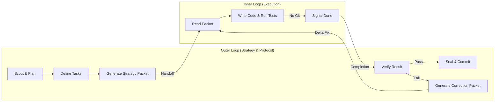

# Dual-Loop (Inner/Outer Agent Delegation)

This skill defines the orchestration pattern for the **Dual-Loop Agent Architecture**. The **Outer Loop** (the directing agent) uses this protocol to organize work, delegate execution to an **Inner Loop** (the coding/tactical agent), and rigorously verify the results before merging.

This architecture is entirely framework-agnostic and can be utilized by any AI agent pairing (e.g., Antigravity directing Claude Code, or an OpenHands agent directing a specialized CLI sub-agent).

## CRITICAL: Anti-Simulation Rules

> **YOU MUST ACTUALLY PERFORM THE VALIDATIONS LISTED BELOW.**
> Describing what you "would do" or marking a step complete without actually doing the verification is a **PROTOCOL VIOLATION**.

---

## Architecture Overview

**Reference**: [Architecture Diagram](../../resources/diagrams/dual_loop_architecture.mmd)

---

## The Workflow Loop

### Step 1: The Plan (Outer Loop)

1. **Orientation**: The Outer Loop agent reads the project requirements or goals.
2. **Decomposition**: Break the goal down into distinct Work Packages (WPs) or sub-tasks.
3. **Verification**: Confirm that the tasks are atomic, testable, and do not overlap.

### Step 2: Prepare Execution Environment

1. **Isolation**: Ensure a safe workspace exists for the Inner Loop. Workspace creation (e.g., worktrees, branching, ephemeral containers) is strictly a delegated responsibility of the Orchestrator or external tooling. The Dual-Loop just receives the environment.
2. **Update State**: Mark the current Work Package as "In Progress" in whatever task-tracking system the project uses.

### Step 3: Generate Strategy Packet (Outer Loop)

1. Write a tightly scoped markdown document (the "Strategy Packet") specifically for the Inner Loop.
2. **Requirements for the Packet**:
   - The exact goal.
   - Only the specific file paths the sub-agent needs to care about.
   - Strict "NO GIT" constraints (the Inner Loop must not commit).
   - Clear Acceptance Criteria.
3. Save the packet (e.g., `handoffs/task_packet_001.md`).

### Step 4: Hand-off (The Bridge)

The Outer Loop invokes the Inner Loop. Depending on the environment, this is either done by spawning a sub-process (e.g., `claude "Read handoffs/task_packet_001.md"`), calling an API, or asking the Human User to switch terminals.

### Step 5: Execute (Inner Loop)

The Inner Loop agent:
1. Reads the packet.
2. Writes the code.
3. Runs the tests.
4. Signals "Done" when the Acceptance Criteria are met (or if it gets fundamentally stuck).

> *Constraint: The Inner Loop MUST NOT run version control commands.*

### Step 6: Verify (Outer Loop)

Once the Inner Loop signals completion, the Outer Loop must verify the results:
1. **Delta Check**: Inspect the changes (e.g., via diff tools or system state checks) to see what the Inner Loop actually altered.
2. **Test Check**: Run the test suite mechanically to ensure nothing broke.
3. **Lint Check**: Validate the syntax.

#### On Verification PASS:
1. The Outer Loop accepts the changes.
2. The task tracker is updated to "Done".

#### On Verification FAIL:
1. The Outer Loop generates a **Correction Packet** explaining exactly what failed (test logs, lint errors).
2. The Outer Loop loops back to Step 4, handing the Correction Packet to the Inner Loop.

### Step 7: Completion & Handoff

Once all Work Packages are verified, the Dual-Loop pattern is complete. The Outer Loop terminates and returns control to the global lifecycle manager (Orchestrator) for Retrospectives and ecosystem sealing.

---

## Task Lane Management

Throughout the process, the Outer Loop must maintain discipline over task states. If you are operating this loop, you must ensure you or the task tracker accurately reflects:

1. **Backlog** -> **Doing** (When Strategy Packet is generated)
2. **Doing** -> **Review** (When Inner Loop signals completion)
3. **Review** -> **Done** (When Outer Loop verifies and commits)
4. **Review** -> **Doing** (If verification fails and a Correction Packet is sent)

---

## Workspace Isolation

> **Dual-Loop (Agent-Loops) does not manage workspaces.** It receives an isolated directory or execution context from the Orchestrator and runs the loop inside it. Workspace creation (e.g., git worktrees, branches) is a delegated responsibility of the Orchestrator or Guardian level tools.

### Fallback: In-Place Execution

If an isolated workspace cannot be provided:
1. The Inner Loop codes directly in the main directory.
2. The Outer Loop must log this lack of isolation in a friction log for the handoff to the Orchestrator.
3. All other constraints (no system manipulation from Inner Loop out of scope, verification gate, correction packets) still apply.

---

## Fundamental Constraints

- **No Protocol Crossing**: The Inner Loop manages tacticals (code compilation, tests). The Outer Loop manages strategy (git, architecture decisions, human interactions).
- **Isolation**: Strategy Packets must be minimal. Do not send the Inner Loop thousands of lines of conversation history. Give it exactly what it needs to execute the specific Work Package.
