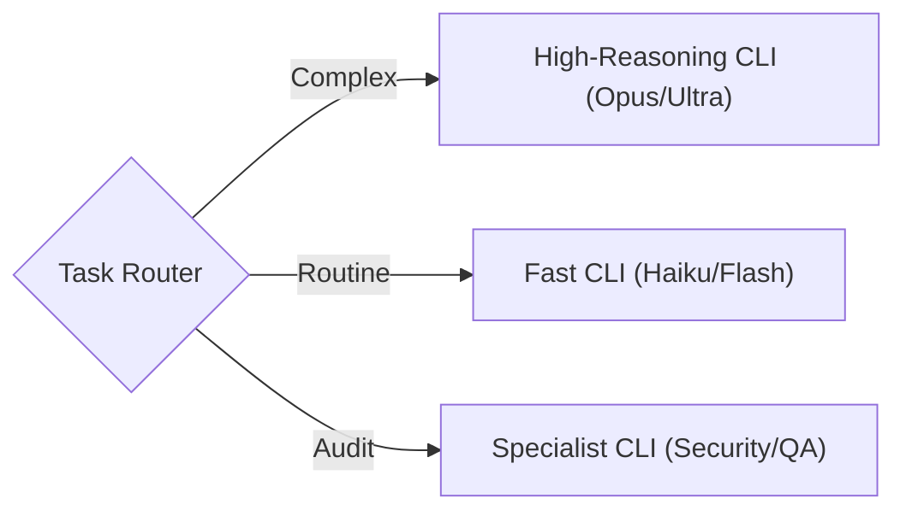

# Agent Orchestrator: Hierarchical Handoff & Loop Pattern

The **Agent Orchestrator** implements a hierarchical workflow where a **Directing Agent (Outer Loop)** plans work, delegates it to an **Executing Agent (Inner Loop)** via a structured handoff (Task Packet), and then reviews the result (Feedback Loop).

## The Core Loop

### Ecosystem Context
- **Parent Protocol**: [`dual-loop-supervisor`](../../dual-loop-supervisor/skills/dual-loop-supervisor/SKILL.md) — Defines the rigorous verification gates.
- **Inner Loop Tool**: [`claude-cli-agent`](../../claude-cli/skills/claude-cli-agent/SKILL.md) — Can be used for specialized execution (Security, QA) in place of generic coding agents.

### Process Flow
1.  **Plan (Strategy)**: You define the work (Spec → Plan → Tasks).
2.  **Delegate (Handoff)**: You pack the context into a **Task Packet** and assist the user in handing off to the Inner Loop.
3.  **Execute (Tactics)**: The Inner Loop agent (which has *no* git access) writes code and runs tests.
4.  **Verify (Review)**: You verify the output against acceptance criteria.
5.  **Correct (Feedback)**: If verification fails, you generate a **Correction Packet** and loop back to step 3.
6.  **Seal (Closure)**: Once valid, you commit the work and record learnings in a Retrospective.

## Roles

### You (Outer Loop / Director)
- **Responsibilities**: Planning, Git Management, Verification, Correction, Retrospective.
- **Context**: Full repo access, strategic constraints (ADRs), long-term memory.
- **Tools**: `spec-kitty`, `agent-orchestrator`, `git`.

### Inner Loop (Executor / Worker)
- **Responsibilities**: Coding, Testing, Debugging.
- **Context**: Scoped to the Task Packet ONLY. No distractions.
- **Constraints**: **NO GIT COMMANDS**. Do not touch `.git`.
- **Tools**: Editor, Terminal, Test Runner.

## Commands

### 1. Planning Status
Use `agent-orchestrator:plan` to inspect the state of the spec and readiness for delegation.
```bash
/agent-orchestrator:plan
```
*Tip: Always ensure spec.md and plan.md are foundational before creating tasks.*

### 2. Delegation (Handoff)
Use `agent-orchestrator:delegate` when a specific Work Package (WP) is ready for implementation.
```bash
/agent-orchestrator:delegate
```
This generates the `.agent/handoffs/task_packet_NNN.md` file. You must then instruct the user/system to launch the Inner Loop with this file.

### 3. Verification & Correction
Use `agent-orchestrator:verify` to check the Inner Loop's work.
```bash
/agent-orchestrator:verify
```
If the work fails criteria, this command will help you generate a `correction_packet` to send back to the Inner Loop.

### 4. Dynamic Routing (Model Agnostic)
As the Orchestrator, you can route tasks to ANY capable CLI agent based on cost/complexity:



**Reference**: [Dynamic Routing Diagram](references/diagrams/dual_loop_dynamic_routing.mmd)

### 5. Red Team / Peer Review
Use `agent-orchestrator:review` to bundle files for a human or 3rd-party agent review.
```bash
/agent-orchestrator:review
```
This creates a single markdown bundle ideal for "paste-to-chat" reviews.

### 5. Retrospective
Use `agent-orchestrator:retro` to close the session or loop with structured learning.
```bash
/agent-orchestrator:retro
```
*Mandatory*: You must fix at least one small issue (Boy Scout Rule) before closing.

### 6. Closure (Feature Completion)

> **THE OUTER LOOP OWNS CLOSURE.**
> After the Inner Loop finishes coding, the orchestrator MUST drive the full
> Review → Accept → Retrospective → Merge chain. This is NOT optional.
> The Inner Loop cannot close a feature — only the Outer Loop can.

```bash
/spec-kitty.review        # Review each WP (moves for_review → done)
/spec-kitty.accept        # Validate all WPs done, record acceptance
/spec-kitty_retrospective # Capture learnings (MANDATORY)
/spec-kitty.merge         # Merge + cleanup from main repo root
```

**Closure is complete when**: All WPs merged, worktrees removed, branches deleted, retrospective committed, intelligence synced.

---

## Lifecycle State Tracking

The orchestrator must verify these gates at each phase:

| Phase | Gate | Command |
|:------|:-----|:--------|
| **Planning** | `spec.md` + `plan.md` + `tasks.md` exist | `/agent-orchestrator_plan` |
| **Execution** | WP lanes: `planned` → `doing` → `for_review` | `/agent-orchestrator_delegate` |
| **Review** | All WPs in `done` lane | `/agent-orchestrator_verify` |
| **Closure** | Accept passes, retro done, merge clean | Closure protocol (Section 6) |

**No phase may be skipped.** If a gate fails, the orchestrator must resolve it before proceeding.

**Reference**: [Standard Spec-Kitty Workflow Diagram](../../plugins/spec-kitty/docs/standard-spec-kitty-workflow.mmd)

---

## Best Practices

1.  **One WP at a Time**: Do not delegate multiple WPs simultaneously unless you are running a swarm.
2.  **Explicit Context**: The Inner Loop only knows what is in the packet. If it needs a file, list it.
3.  **No Git in Inner Loop**: This is a hard constraint to prevent state corruption.
4.  **Correction is Learning**: Do not just "fix it yourself" if the Inner Loop fails. Generate a correction packet. This trains the system logic.
5.  **Never Abandon Closure**: The orchestrator must shepherd Review → Accept → Retro → Merge. Stopping after delegation is a protocol violation.

6.  **Merge from Main Repo**: Always `cd <PROJECT_ROOT>` before running `spec-kitty merge --feature <SLUG>`. Never merge from a worktree.

---

## Research Basis

This skill implements the **"Dual-Loop Agent Architecture"** inspired by:

1.  **Self-Evolving Recommendation System** ([arXiv:2602.10226](https://arxiv.org/abs/2602.10226)):
    - Defines the specialized roles of **Planner (Outer)** vs **Executor (Inner)**.
2.  **FormalJudge** ([arXiv:2602.11136](https://arxiv.org/abs/2602.11136)):
    - Provides the theoretical framework for "Scalable Oversight" via structured verification rather than just human inspection.

