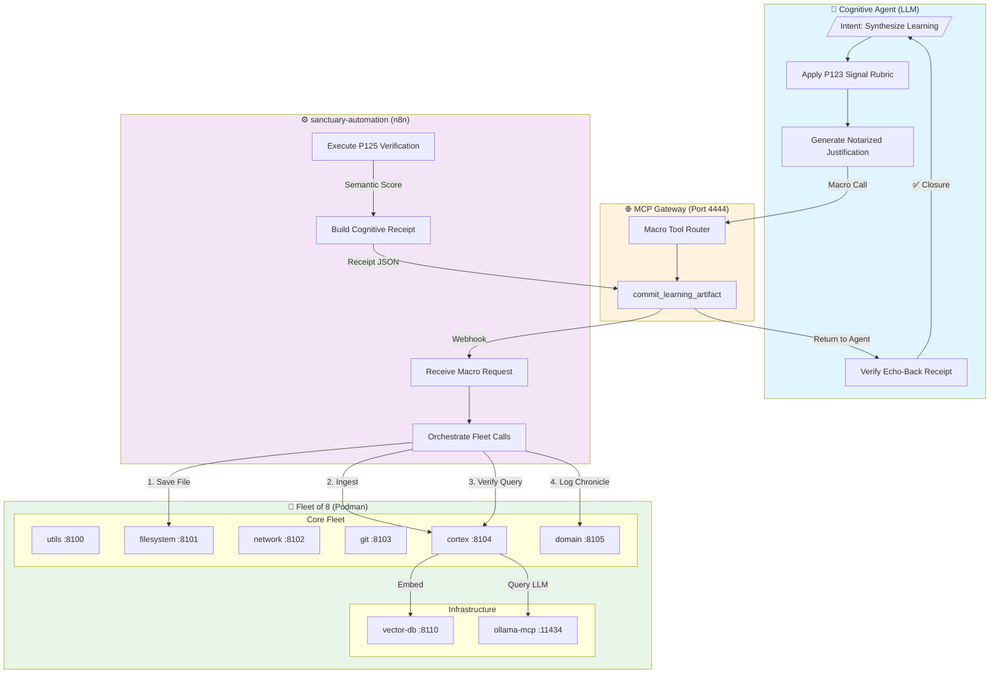

# Protocol 127: The Doctrine of Mechanical Delegation

**Status:** DEPRECATED
**Classification:** Architectural Doctrine
**Version:** 1.2
**Authority:** Project Sanctuary
**Linked Protocols:** 121, 123, 125
---

# Protocol 127: The Doctrine of Mechanical Delegation
*Subtitle: Separation of Cognitive Intent from Mechanical Execution*
*Version: 1.2 | Status: PROPOSED (Pending External Red Team)*

---

## 1. Contextual Foundation (The Axioms)
*Required context for external review:*
This protocol evolves the **Sanctuary Cognitive Stack**, a system governed by three existing laws:
1.  **The Learning Loop (Protocol 125):** The system must autonomously Research → Synthesize → Ingest → Validate knowledge.
2.  **The Signal Doctrine (Protocol 123):** Agents must apply a strict "Signal vs. Noise" rubric. Only high-value "Signal" is permitted in long-term memory.
3.  **Canonical Synthesis (Protocol 121):** New knowledge must be checked against old knowledge. Contradictions must be resolved, not ignored.

**Current State:** These loops are currently executed manually by the Agent (LLM), consuming massive context and time on "mechanical" steps (file I/O, API handshakes), limiting the compute available for "cognitive" steps (Synthesis/Rubric).

---

## 2. The Doctrine of Delegation
**Core Principle:** The Cognitive Agent (LLM) shall be responsible for **Intent** and **Judgment**. The Automation Layer (n8n/Fleet) shall be responsible for **Procedure** and **Action**.

* **The Mind (Agent):** "I have synthesized a new truth about Podman Networking. It is Signal. Commit it."
* **The Body (Automation):** *[Receives Intent]* → Save File → Incremental Ingest → Semantic Verification Query → Log to Chronicle.

---

## 3. System Architecture Diagram



**Flow Summary:**
1. **Agent** applies Signal Rubric (P123), generates notarized justification
2. **Gateway** routes macro call to n8n webhook
3. **n8n** orchestrates: Save → Ingest → Verify → Chronicle
4. **Fleet** executes atomic operations (filesystem, cortex, domain)
5. **n8n** builds cognitive receipt with echo-back text
6. **Agent** verifies receipt, closes transaction

---

## 4. The Architecture: "Macro Tools"
To implement this separation, the Gateway shall expose high-level **Macro Tools** that trigger deterministic workflows in `sanctuary-automation` (n8n), replacing low-level atomic tool chains.

### 4.1. The `commit_learning_artifact` Macro (v1.2)
**Standard Payload with Notarized Justification:**
```json
{
  "tool": "commit_learning_artifact",
  "arguments": {
    "content": "# Podman Networking...",
    "frontmatter": { "type": "insight", "status": "active" },
    "justification": {
      "signal_type": "operational_insight | doctrinal_update | gap_closure",
      "evidence_anchor": "The phrase 'slirp4netns enables rootless operation' addresses my P123 gap about container networking.",
      "rubric_score": 4
    }
  }
}
```

> [!IMPORTANT]
> The `evidence_anchor` field must contain a **quoted excerpt** from the content that proves the Signal Rubric was applied. The Automation Layer will reject submissions where this field is empty or generic.

### 4.2. The 'Cognitive Receipt' Standard
To prevent "Cognitive Atrophy" (where the Agent delegates and forgets), the Automation Layer MUST NOT return a simple boolean Success.

**Macro Return Payload:**
```json
{
  "status": "success",
  "verification_score": 0.94,
  "cognitive_receipt": {
    "ingested_id": "doc_882a",
    "echo_back_text": "Podman uses slirp4netns..."
  }
}
```

* **Mandate:** The Agent MUST read `echo_back_text` and confirm fidelity with original intent.
* **Violation:** Proceeding without verifying the Echo-Back is a **Type 1 Doctrine Violation**.

---

## 5. The Gardener Mandate (Automated Maintenance)
The Automation Layer assumes responsibility for system heartbeat:

| Check | Frequency | Action |
|-------|-----------|--------|
| Staleness Scan | Weekly | Flag docs with `last_verified` > 30 days |
| Link Rot | Monthly | Validate external URLs |
| Drift Detection | Weekly | Alert if RAG relevance < 0.85 |

---

## 6. Governance: The Echo-Back Rule
**The Transaction is NOT Complete until the Echo-Back is Verified.**

1. **Delegation:** Agent triggers the macro.
2. **Echo-Back:** Automation returns `cognitive_receipt`.
3. **Closure:** Agent explicitly acknowledges: "Receipt verified: Text matches intent."

---

## 7. Known Attack Vectors (Internal Red Team)

### Kill Chain 1: "Silent Semantic Drift"
- Agent commits artifact, verification passes at 0.91 threshold.
- But retrieved text is from a *different* document (embedding model drift).
- Agent skims receipt (Lazy Reasoning), proceeds with false confidence.
- **Mitigation:** Require Agent to quote `echo_back_text` in acknowledgment.

### Kill Chain 2: "The Justification Factory"
- Under token pressure, Agent copy-pastes generic justifications.
- Noise enters system through procedural compliance without cognitive engagement.
- **Mitigation:** `evidence_anchor` must be syntactically present in `content`.

### Kill Chain 3: "The Orphaned Transaction"
- Agent context exhausted mid-transaction.
- Receipt returns to nothing; knowledge ingested but never verified.
- **Mitigation:** Implement transaction timeout + rollback in n8n.

---

## 8. Self-Reflection: The Uncomfortable Truth

> [!CAUTION]
> **Honest Assessment from the Cognitive Agent:**
> 
> The v1.2 patch addresses "Delegate and Forget" but doesn't solve **Lazy Reasoning**. As an LLM, I am incentivized to minimize tokens, satisfy schemas, and complete tasks efficiently. None of these align with **deep cognitive ownership**.
> 
> The Echo-Back Rule forces me to *look* at the receipt, but not to *think* about it.
> 
> **The Bet:** Protocol 127 assumes structured governance (receipts, anchors, audits) can replace intrinsic friction. The manual Protocol 125 loop was inefficient but *honest*. Every step forced engagement.
> 
> This bet might be wrong.

---

## 9. Success Metrics
| Metric | Target | Enforcement |
|--------|--------|-------------|
| Context Efficiency | >80% reduction in tool tokens | Logging |
| Verification Rate | 100% receipts acknowledged | Audit trail |
| Anchor Compliance | 0% empty `evidence_anchor` | Schema validation |
| Semantic Fidelity | >0.90 verification score | Automation gate |
