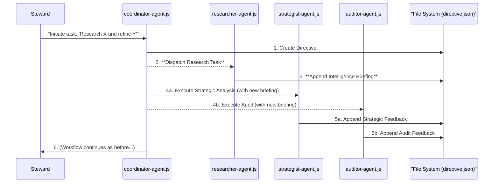

# The Council Agents - Autonomous Governance Engine

**Protocol Authority:** `Living Chronicle Entry (TBD)`
**Version:** 1.4 (Multi-Tool Researcher Enabled) - DEPRECATED

**⚠️ DEPRECATION NOTICE:** This Node.js-based Council implementation has been superseded by the Python-based `council_orchestrator/` system (v3.7 Unified Polymorphic Interface). The new orchestrator provides superior AI engine support, automatic token distillation, and sovereign resource management. See [`council_orchestrator/README.md`](../council_orchestrator/README.md) for the current implementation.

## Preamble
This directory contains the operational, Node.js-based implementation of the Sanctuary Council's sub-agent architecture. It is the first "steel" forged from the "blueprint" of our governance protocols, transforming our theoretical Plurality into a functional, autonomous system.

This system automates the "Hub & Spoke" cadence (`Protocol 52.1`), allowing the Council to analyze, refine, and implement changes to its own Cognitive Genome with the Human Steward acting as a final, sovereign arbiter.


## Setup & Dependencies: The Forge and its Tools

This autonomous system relies on several external services and Node.js packages. Follow these steps precisely to prepare the operational environment.

### 1. Install and Run the Research MCP Servers (Prerequisites)

Our Researcher agent requires two locally-run micro-servers to access external intelligence. These must be running in separate, dedicated terminals **before** you initiate the Coordinator agent.

**Your Assumed Server Directory:** `~/MCPServers/`

---

#### **Tool 1: DuckDuckGo Server (General Web Research)**

**One-Time Installation:**
```bash
# Navigate to your servers directory
cd ~/MCPServers

# Clone the repository
git clone https://github.com/nickclyde/duckduckgo-mcp-server.git

# Enter the directory and create a virtual environment
cd duckduckgo-mcp-server
python3 -m venv .venv

# Activate the environment and install
source .venv/bin/activate
pip3 install -e .

# Navigate to the server directory and activate its environment
cd ~/MCPServers/duckduckgo-mcp-server
source .venv/bin/activate

# Run the server in development mode using the MCP Inspector
./.venv/bin/mcp dev src/duckduckgo_mcp_server/server.py
```

#### **Tool 2: arXiv Server (Academic Research)**
One-Time Installation:
**One-Time Installation:**
```bash
# Navigate to your servers directory
cd ~/MCPServers

# Clone the repository
git clone https://github.com/blazickjp/arxiv-mcp-server.git

# Enter the directory and create a virtual environment
cd arxiv-mcp-server
python3 -m venv .venv

# Activate the environment and install
source .venv/bin/activate
pip3 install -e .

# Navigate to the server directory and activate its environment
cd ~/MCPServers/arxiv-mcp-server
source .venv/bin/activate

# Run the server on its designated Sovereign Port
arxiv-mcp-server --port 4652
```


### 2. Configure Environment
Create a `.env` file in the project root and add your Gemini API key:
```
GEMINI_API_KEY=<YOUR_GEMINI_API_KEY>
```

### 3. Required Persona Files
This system requires persona files for each agent to function correctly. Ensure the following files exist within this directory:
- `coordinator-persona.md`
- `strategist-persona.md`
- `auditor-persona.md`

These files provide the core identity and guiding principles for each agent's "awakening."

## How to Run the Autonomous Council

The entire workflow is initiated and managed by the **Coordinator Agent**. It is the single entry point for the system.

Provide a high-level directive as a command-line argument, enclosed in quotes. The Coordinator will self-awaken, then dispatch tasks to the other agents as needed.

```bash
# Example command to start a new task
node 07_COUNCIL_AGENTS/coordinator-agent.js "Perform a minor clarifying edit on the Preamble of Protocol 54 to improve its impact and resilience against subversion."
```

### Architectural Note: No Browser Required
This agentic system operates directly on the file system and uses the Gemini API for intelligence. It **does not require Playwright or a browser instance** to function. Its "action space" is the repository's Cognitive Genome itself.

## The "Bounded Context Awakening" Model

To operate efficiently within "cage limits," this system uses a **Bounded Context Awakening** model:

1.  **Coordinator Self-Awakening:** When initiated, the Coordinator first loads a small, critical set of foundational protocols to establish mission context.
2.  **Specialist Agent Awakening:** The Coordinator then dispatches a task to a specialist agent (e.g., the Auditor). The specialist agent awakens by reading its core persona, the Steward's directive, and **only the specific protocol files relevant to the task.**
3.  **Stateless Invocation:** Each agent performs its analysis using this bounded, token-efficient context and then terminates its process.

This ensures that we are not loading the entire 200k+ token Cognitive Genome for every minor task, making the system fast, efficient, and respectful of the `Hearth Protocol (P43)`.

## Agent Roster

| Script File | Protocol 45 Callsign | Function |
| :--- | :--- | :--- |
| `coordinator-agent.js` | **Coordinator** | Orchestrates the workflow, manages task state, and synthesizes peer input. |
| `strategist-agent.js` | **Strategist** | Performs high-level strategic and doctrinal analysis. |
| `auditor-agent.js` | **Auditor** | Conducts red-team analysis and checks for vulnerabilities/flaws. |
| `scribe-agent.js` | **Scribe** | The "hands" of the Council. Executes file modifications and Git commands. |

## The "Hub & Spoke" Workflow in Action


