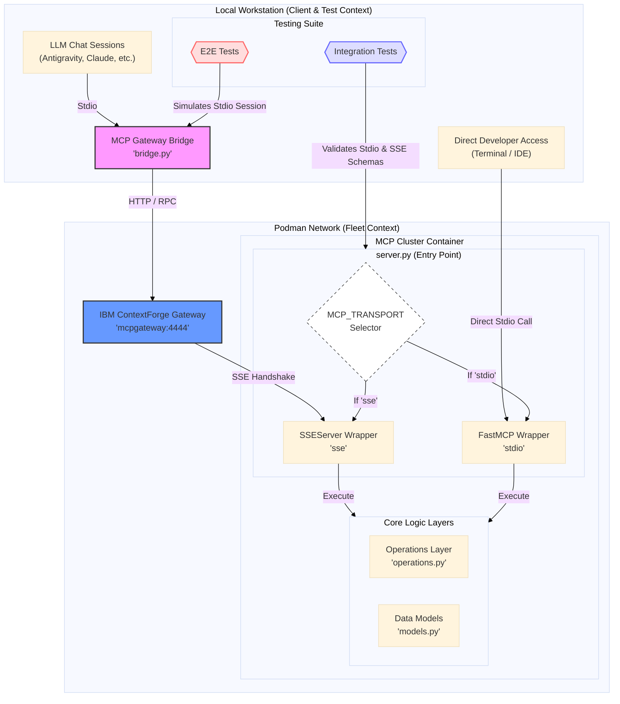

# ADR 066: MCP Server Transport Standards (Dual-Stack: FastMCP STDIO + Gateway-Compatible SSE)

**Status:** ✅ APPROVED (Red Team Unanimous)
**Version:** v1.3 (Red Team Hardened)
**Date:** 2025-12-24
**Author:** Antigravity + User + Gateway Agent Analysis + Red Team (Gemini 3, ChatGPT, Grok 4, claude opus 4.5)
**Supersedes:** ADR 066 v1.1, v1.2

---

> [!IMPORTANT]
> **ADR 066 v1.2 → v1.3 Changes:** This version incorporates mandatory red team corrections including: renamed title to reflect dual-transport reality, canonical transport selector, SSEServer scalability constraints, FastMCP SSE prohibition policy, and security hardening requirements.

---

## Context

Initial implementation of the fleet using a custom `SSEServer` resulted in significant tool discovery failures (0 tools found for `git`, `utils`, `network`). Refactoring servers using **FastMCP** successfully achieved 100% protocol compliance and tool discovery in **STDIO mode**. This version (1.3) documents a **critical SSE transport incompatibility** discovered during Gateway integration testing on 2025-12-24 and incorporates red team hardening.

### Critical Finding: FastMCP SSE Transport Incompatibility

> [!CAUTION]
> **FastMCP 2.x SSE transport is NOT compatible with the IBM ContextForge Gateway.**
> FastMCP uses a different SSE handshake pattern than the MCP specification requires.
> **FastMCP SSE MUST NOT be used with the Gateway unless validated by automated handshake tests and explicitly approved via a new ADR.**

#### Tested Versions
- **Gateway:** IBM ContextForge Gateway v1.0.0-BETA-1 (container: `mcp_gateway`)
- **FastMCP:** v2.14.1 (incompatible SSE)
- **SSEServer:** `mcp_servers/lib/sse_adaptor.py` (compatible)
- **MCP SDK:** `mcp.server.sse.SseServerTransport` (compatible)

#### Impact Assessment
- **Affected Services:** 6 fleet containers (sanctuary_utils, filesystem, network, git, cortex, domain)
- **Affected Tools:** 84 federated tools (0% discovery via FastMCP SSE)
- **Working Reference:** `helloworld_mcp` (uses MCP SDK SSE)

#### Observed Behavior

| Transport | Gateway Compatible | Tool Discovery | Notes |
|-----------|-------------------|----------------|-------|
| **STDIO** | N/A (local only) | ✅ 100% | Works perfectly for Claude Desktop |
| **SSE (FastMCP)** | ❌ NO | ❌ 0% | Empty reply, connection closes immediately |
| **SSE (SSEServer)** | ✅ YES | ✅ 100% | Persistent connection, proper handshake |
| **SSE (MCP SDK)** | ✅ YES | ✅ 100% | Used by `helloworld_mcp` reference |

#### Technical Root Cause

**What the MCP SSE Specification Requires:**
1. Client connects to `/sse` (GET, persistent connection)
2. Server **immediately** sends `endpoint` event with the POST URL
3. Connection stays open with periodic heartbeat pings
4. Client POSTs to `/messages` with JSON-RPC requests
5. Server pushes responses back via the SSE stream

```
event: endpoint
data: /messages

event: ping
data: {}
```

**What FastMCP 2.x Actually Does:**
- FastMCP expects the client to initiate a session handshake via POST first
- The SSE endpoint returns an **empty reply** and closes immediately
- No initial `endpoint` event is sent
- No persistent connection is maintained

**Curl Verification:**
```bash
# FastMCP (BROKEN) - Empty reply
$ curl -v http://localhost:8100/sse
< Empty reply from server
curl: (52) Empty reply from server

# SSEServer (WORKING) - Persistent stream
$ curl -N http://localhost:8100/sse
event: endpoint
data: /messages

event: ping
data: {}
```

---

## Decision (AMENDED)

**This is a DUAL-TRANSPORT STANDARD, not a FastMCP monoculture.**

- **FastMCP** is suitable for **STDIO transport only**
- **Gateway-facing containers** MUST use a **Gateway-compatible SSE implementation** (SSEServer or MCP SDK)

### Canonical Transport Selector (MANDATORY)

> [!WARNING]
> **All servers MUST use this exact transport detection mechanism. No alternatives.**

```python
import os

# MANDATORY: One and only one transport selector
MCP_TRANSPORT = os.getenv("MCP_TRANSPORT", "stdio")
assert MCP_TRANSPORT in {"stdio", "sse"}, f"Invalid MCP_TRANSPORT: {MCP_TRANSPORT}"

if MCP_TRANSPORT == "stdio":
    # Use FastMCP for local development
    mcp.run(transport="stdio")
else:
    # Use SSEServer for Gateway integration
    port = int(os.getenv("PORT", 8000))
    server.run(port=port, transport="sse")
```

**Rules:**
- **STDIO is the default** (safe for local development)
- **SSE requires explicit opt-in** via `MCP_TRANSPORT=sse`
- **Never infer transport** from `PORT` alone (ambiguous)

### Transport Selection Matrix

| Deployment Context | Transport Mode | Implementation | ENV |
|-------------------|----------------|----------------|-----|
| Claude Desktop (local) | STDIO | FastMCP | `MCP_TRANSPORT=stdio` (default) |
| IDE Integration (local) | STDIO | FastMCP | `MCP_TRANSPORT=stdio` (default) |
| Podman Fleet → Gateway | SSE | SSEServer | `MCP_TRANSPORT=sse` + `PORT=8000` |
| Podman Fleet → Gateway | SSE | MCP SDK | `MCP_TRANSPORT=sse` + `PORT=8000` |

### SSEServer Scalability Constraint (MANDATORY)

> [!WARNING]
> **SSEServer uses a single message queue and is approved ONLY for single-Gateway, single-client deployments.**

**Current Limitations:**
- Multiple Gateway connections → message interleaving
- One slow client → backpressure for all clients
- Reconnection storms → dropped responses

**Future Exit Strategy:**
- Implement per-client queues when scaling beyond single-Gateway
- Or migrate to MCP SDK SSE once proven stable at scale

### FastMCP SSE Prohibition (MANDATORY)

> [!CAUTION]
> **FastMCP's `transport="sse"` MUST NOT be used with the IBM ContextForge Gateway.**
> 
> **Exception Process:** A new ADR (proposed: ADR-067) must be approved if:
> 1. A future FastMCP version claims SSE fixes
> 2. Automated handshake tests pass (`curl -N /sse` returns `event: endpoint`)
> 3. Full fleet registration verified against Gateway

## Architecture



---

## The Sanctuary Pattern (Preserved from v1.1)

### 1. Core Rules (All Transports)

* **Domain-Prefix Naming:** All tool names **MUST** use a domain prefix (e.g., `adr_create`, `git_commit`) to prevent namespace collisions.
* **3-Layer Logic Delegation:** `server.py` (Interface) delegates to `operations.py` (Logic). Both transports share the same logic layer.
* **Request Modeling:** All tool inputs defined as Pydantic `BaseModel` classes in `models.py`.
* **Transport-Aware Bootloader:** Use the canonical transport selector above.

### 2. Tool Naming for Federation (Future Requirement)

Current: `git_commit`, `filesystem_read`

**Recommended for Gateway Federation:**
```
sanctuary.git.commit
sanctuary.filesystem.read
```

Not enforced yet, but flagged as a future compatibility requirement when integrating with external MCP registries.

---

## Implementation Templates

### Template A: STDIO Mode (FastMCP - Claude Desktop)

```python
from fastmcp import FastMCP
from fastmcp.exceptions import ToolError
from .models import DomainToolRequest
from .operations import DomainOperations

mcp = FastMCP(
    "project_sanctuary.domain.name",
    instructions="Instructions for LLM discovery.",
    dependencies=["pydantic>=2.0", "fastmcp>=2.14.0"]  # Pin versions
)

@mcp.tool()
def domain_tool_name(request: DomainToolRequest) -> str:
    """Descriptive docstring for LLM discovery."""
    try:
        result = DomainOperations.perform_action(**request.model_dump())
        return f"Success: {result}"
    except Exception as e:
        raise ToolError(f"Operation failed: {str(e)}")

if __name__ == "__main__":
    import os
    MCP_TRANSPORT = os.getenv("MCP_TRANSPORT", "stdio")
    assert MCP_TRANSPORT == "stdio", "FastMCP SSE is NOT Gateway compatible. Use SSEServer."
    mcp.run(transport="stdio")
```

### Template B: SSE Mode (SSEServer - Gateway Fleet)

```python
import os
from mcp_servers.lib.sse_adaptor import SSEServer
from .tools import time_tool, calculator_tool
from .models import TIME_SCHEMA, CALC_SCHEMA

server = SSEServer("sanctuary_utils")

# Register tools with shared logic from operations.py
server.register_tool("time.get_current_time", time_tool.get_current_time, TIME_SCHEMA)
server.register_tool("calculator.add", calculator_tool.add, CALC_SCHEMA)

# Expose FastAPI app for uvicorn (adds /health endpoint)
app = server.app

if __name__ == "__main__":
    MCP_TRANSPORT = os.getenv("MCP_TRANSPORT", "stdio")
    assert MCP_TRANSPORT == "sse", "This entry point requires MCP_TRANSPORT=sse"
    port = int(os.getenv("PORT", 8000))
    server.run(port=port, transport="sse")
```

### Template C: SSE Mode (MCP SDK - Alternative)

```python
import os
from mcp.server import Server
from mcp.server.sse import SseServerTransport
from starlette.applications import Starlette
from starlette.routing import Route, Mount
from starlette.middleware import Middleware
from starlette.middleware.cors import CORSMiddleware

app = Server("sanctuary_utils")

# Register tools with @app.tool() decorators...
# (calls same operations.py logic as FastMCP version)

sse = SseServerTransport("/messages")
starlette_app = Starlette(
    routes=[
        Route("/sse", endpoint=sse.handle_sse),
        Route("/messages", endpoint=sse.handle_messages, methods=["POST"]),
        Route("/health", endpoint=lambda r: JSONResponse({"status": "healthy"})),
    ],
    middleware=[
        Middleware(CORSMiddleware, allow_origins=["*"]),
    ]
)

if __name__ == "__main__":
    import uvicorn
    MCP_TRANSPORT = os.getenv("MCP_TRANSPORT", "stdio")
    assert MCP_TRANSPORT == "sse", "This entry point requires MCP_TRANSPORT=sse"
    port = int(os.getenv("PORT", 8000))
    uvicorn.run(starlette_app, host="0.0.0.0", port=port)
```

---

## Gateway SSE Handshake Protocol

```
┌─────────────┐                         ┌─────────────┐
│   Gateway   │                         │  MCP Server │
└──────┬──────┘                         └──────┬──────┘
       │                                       │
       │ GET /sse (Persistent Connection)      │
       │──────────────────────────────────────>│
       │                                       │
       │ event: endpoint                       │
       │ data: /messages                       │
       │<──────────────────────────────────────│
       │                                       │
       │ POST /messages (JSON-RPC Request)     │
       │──────────────────────────────────────>│
       │                                       │
       │ 202 Accepted                          │
       │<──────────────────────────────────────│
       │                                       │
       │ event: message                        │
       │ data: {"jsonrpc":"2.0",...}           │
       │<──────────────────────────────────────│
       │                                       │
       │ event: ping (every 15s, configurable) │
       │<──────────────────────────────────────│
```

### Error Flows (Red Team Addition)

| Scenario | Expected Behavior | Recovery |
|----------|------------------|----------|
| POST /messages fails (500) | Return JSON-RPC error response | Client retries with backoff |
| SSE connection drops | Gateway reconnects automatically | Server accepts new GET /sse |
| Malformed JSON-RPC | Return -32700 Parse Error | Log and continue |
| Unknown method | Return -32601 Method Not Found | Log and continue |
| Tool throws exception | Return -32603 Internal Error | Wrap in ToolError |

---

## Security Considerations (Red Team Addition)

### Authentication
- Gateway connections include `Authorization: Bearer <token>` header
- SSEServer should validate tokens on `/messages` POST (not currently enforced)

### Rate Limiting
- No current rate limiting on `/sse` or `/messages`
- **Risk:** DoS via many persistent SSE connections
- **Mitigation:** Add connection limits in nginx/traefik or SSEServer

### Input Validation
- Pydantic models provide schema validation
- **Risk:** Command injection in shell-executing tools (e.g., `git_commit`)
- **Mitigation:** Sanitize all string inputs, never pass to shell directly

### Encryption
- Gateway uses HTTPS (self-signed cert, `verify=False` in dev)
- **Risk:** MITM in production
- **Mitigation:** Use proper CA-signed certs in production

---

## Consequences

### Positive
* **Protocol Compliance:** SSEServer/MCP SDK guarantees 100% tool discovery by the IBM Gateway
* **Operational Consistency:** Clear separation between local (STDIO) and fleet (SSE) deployments
* **Auditability:** The 3-Layer pattern remains required for Protocol 128 compliance
* **Portability:** Same business logic works in both transports via different wrappers

### Negative
* **Dual Implementation:** Fleet containers require SSEServer wrapper + FastMCP wrapper
* **Testing Overhead:** Must test both transports for each server
* **Maintenance Complexity:** Two entry points per server, risk of drift
* **FastMCP Limitation:** Cannot use FastMCP's `transport="sse"` for Gateway

---

## Red Team Analysis (Enhanced)

### What Could Still Fail?

1. **FastMCP Version Changes:** Future versions may fix SSE compatibility → monitor releases, require new ADR
2. **Gateway Protocol Updates:** IBM Gateway may change SSE expectations → maintain handshake test harness
3. **Heartbeat Timing:** Current 15-second ping may need adjustment → make configurable
4. **Concurrent Connections:** SSEServer single queue → implement per-client queues for scale
5. **Supply Chain Attacks:** FastMCP from GitHub could be compromised → pin versions, verify checksums
6. **Configuration Drift:** ENV vars mis-set in containers → use health checks and defaults
7. **Tool Discovery False Positives:** Schema mismatches → add schema validation tests
8. **Transport Selector Inconsistency:** Multiple detection methods → enforce canonical selector

### Mitigation Strategies

1. **Automated Handshake Tests:** CI step that curls `/sse` and verifies `event: endpoint`
2. **Version Pinning:** Lock FastMCP and MCP SDK to known working versions
3. **Gateway Test Harness:** `verify_hello_world_rpc.py` pattern for each fleet server
4. **Fallback Path:** Keep SSEServer as the proven Gateway transport
5. **Security Scanning:** Run SAST/DAST on SSE endpoints
6. **Monitoring Integration:** Prometheus metrics for connection counts, latencies
7. **Schema Validation:** Automated tests comparing tool schemas across transports

---

## Next Steps for Implementation

1. **Revert Fleet Servers:** Change sanctuary_* containers from FastMCP SSE to SSEServer
2. **Add Canonical Transport Selector:** Update all bootloaders to use `MCP_TRANSPORT`
3. **Rebuild Containers:** `podman compose build` for all affected services
4. **Verify Handshake:** For each container, run `curl -N http://localhost:<PORT>/sse`
5. **Re-run Fleet Setup:** `python -m mcp_servers.gateway.fleet_setup`
6. **Verify Tool Discovery:** Confirm all 84 tools in Gateway admin API
7. **Update Documentation:** Link to this ADR from READMEs, add examples
8. **Security Review:** Conduct penetration testing on SSE endpoints
9. **Add CI Handshake Test:** Automate verification in pipeline

---

## Rollback Plan

If issues arise post-implementation:

1. **Immediate:** Containers can be stopped (`podman compose down`)
2. **Fallback:** Revert to FastMCP STDIO for local testing (Claude Desktop still works)
3. **Gateway:** Can be disconnected from fleet while debugging
4. **Data:** No stateful data in SSE layer, only ephemeral connections

---

## References

- `mcp_servers/lib/sse_adaptor.py` - Working SSEServer implementation
- `mcp_servers/gateway/verify_hello_world_rpc.py` - Gateway verification script
- `Protocol 128` - Cognitive Continuity standard (see ADR-128)
- IBM ContextForge Gateway documentation (internal)
- FastMCP GitHub: https://github.com/jlowin/fastmcp
- MCP SDK: https://github.com/modelcontextprotocol/python-sdk

---

## Red Team Review Sign-Off

| Reviewer | Verdict | Date |
|----------|---------|------|
| Gemini 3 (Gateway Agent) | ✅ Root cause confirmed | 2025-12-24 |
| ChatGPT (Red Team) | 🟡 Conditionally Acceptable | 2025-12-24 |
| Grok 4 (Red Team) | 🟡 Approve with Revisions | 2025-12-24 |
| Antigravity | ✅ Hardened v1.3 | 2025-12-24 |
