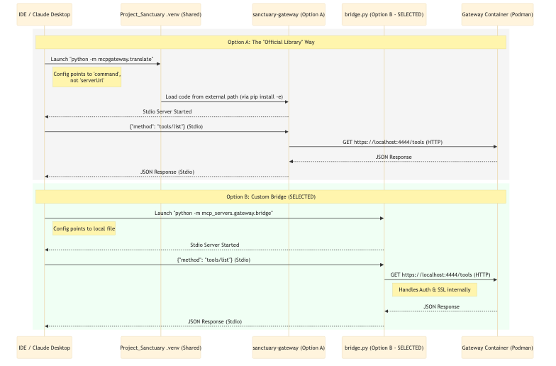

# Decide on approach for SSE bridge

**Status:** accepted
**Date:** 2025-12-20
**Author:** user, anti gravity agent

---

## Context

Claude Desktop and Gemini Antigravity IDE (via the standard MCP client) do not support `SSE` (Server-Sent Events) transport out of the box; they primarily rely on `stdio` (standard input/output) for local process communication.

The backend Sanctuary Gateway (running in Podman) exposes an SSE endpoint (`https://localhost:4444/sse`). However, the "Official" IBM bridge code (`mcpgateway.translate`) resides in a separate repository (`../sanctuary-gateway`) and is not currently installed in this project's environment.

We need a strategy to bridge `stdio` <-> `SSE`.

# Decide on approach for SSE bridge

**Status:** draft
**Date:** 2025-12-20
**Author:** user

---

## Context

Claude Desktop and Gemini Antigravity IDE (via the standard MCP client) do not support `SSE` (Server-Sent Events) transport out of the box; they primarily rely on `stdio` (standard input/output) for local process communication.

The backend Sanctuary Gateway (running in Podman) exposes an SSE endpoint (`https://localhost:4444/sse`). However, the "Official" IBM bridge code (`mcpgateway.translate`) resides in a separate repository (`../sanctuary-gateway`) and is not currently installed in this project's environment.

We valid options to bridge `stdio` <-> `SSE`.

## Options Considered

### Option A: The "Official Library" Way
Use the official `mcpgateway.translate` module provided by the IBM/ContextForge gateway project.
*   **Mechanism:** Install the `mcpgateway` package from the sibling directory (`../sanctuary-gateway`) into the current virtual environment (`pip install -e`).
*   **Pros:** Uses official, vendor-maintained code; ensures parity with upstream updates.
*   **Cons:**
    *   **Shared Env Problem:** Requires modifying the shared virtual environment to link to an external folder.
    *   **Dependency:** Creates a hard dependency on the presence of the sibling `sanctuary-gateway` directory on the filesystem.

#### Workflow Diagram (Option A)

*[Source: mcp_sse_bridge_approach.mmd](../docs/architecture_diagrams/transport/mcp_sse_bridge_approach.mmd)*

### Option B: The "Single File" Way (Custom Bridge)
Implement a self-contained, single-file Python script (`mcp_servers/gateway/bridge.py`) within this project.
*   **Mechanism:** A small (~100 line) script using `mcp` and `httpx` SDKs that handles the translation logic directly. "Like having a copy of a recipe instead of the whole cookbook."
*   **Pros:**
    *   **No Shared Env Issue:** Completely self-contained in `Project_Sanctuary`. No need to link external libraries.
    *   **Portability:** The code lives with the project.
    *   **Simplicity:** No need to have the other project window open; just requires the Gateway container to be running.
*   **Cons:** We are responsible for maintaining this bridge code (it is a fork/re-implementation of the translation logic).

#### Workflow Diagram (Option B)

*(See combined diagram above)*

## Decision

**Proceed with Option B: Custom Lightweight Bridge.**

Based on detailed feedback from external audit (Grok, GPT) and internal consensus (Claude), Option B is the unanimous recommendation. The Shared Environment Constraint dictates that minimizing external filesystem links is critical for project portability and stability.

### Security Analysis (Red Team)
The implementation of `mcp_servers/gateway/bridge.py` has been verified to address key concerns:
1.  **JWT Token Injection:** Correctly reads `MCPGATEWAY_BEARER_TOKEN` and formats standard `Authorization: Bearer` headers.
2.  **SSL/TLS Verification:** Implements `MCP_GATEWAY_VERIFY_SSL` flag to safely handle local self-signed certificates without global suppression.
3.  **Error Propagation:** Catches exceptions and returns standard JSON-RPC error objects.

## Consequences

*   **Autonomy:** This project becomes robust against changes or absence of the sibling gateway repo.
*   **Support:** We accept responsibility for maintaining the `bridge.py` logic.

