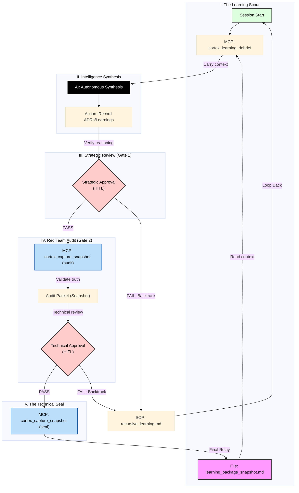

# ADR 071: Protocol 128 (Cognitive Continuity & The Red Team Gate)

**Status:** APPROVED (v3.0 - Zero-Trust / Sustainable)
**Date:** 2025-12-22
**Author:** Antigravity (Agent), User (Red Team Lead)
**Supersedes:** ADR 071 v2.6

## Context
As agents operate autonomously (Protocol 125/126), they accumulate "Memory Deltas". Without rigorous consolidation, these deltas risk introducing hallucinations, tool amnesia, and security vulnerabilities. 
Protocol 128 establishes a **Hardened Learning Loop**. 
v2.5 explicitly distinguishes between the **Guardian Persona** (The Gardener/Steward) and the **Cognitive Continuity Mechanisms** (Cache/Snapshots) that support it.

## Decision
We will implement **Protocol 128: Cognitive Continuity** with the following pillars:

### 1. The Red Team Gate (Manifest-Driven)
No autonomous agent may write to the long-term Cortex without a **Human-in-the-Loop (HITL)** review of a simplified, targeted packet.
- **Debrief:** Agent identifies changed files.
- **Manifest:** System generates a `manifest.json` targeting ONLY relevant files.
- **Snapshot:** System invokes `capture_code_snapshot.js` (or `.py`) with the `--manifest` flag to generate a filtered `snapshot.txt`.
- **Packet:** The user receives a folder containing the Briefing, Snapshot, and Audit Prompts.

### 2. Deep Hardening (The Mechanism)
To ensure the **Guardian (Entity)** and other agents operate on trusted foundations, we implement the **Protocol 128 Bootloader**:
- **Integrity Wakeup:** The agent's boot process includes a mandatory **Integrity Check** (HMAC-SHA256) of the Metric Cache.
- **Cognitive Primer:** A forced read of `cognitive_primer.md` ensures doctrinal alignment before any tool use.
- **Intent-Aware Discovery:** JIT tool loading is enforced to prevent context flooding. Tools are loaded *only* if required by the analyzed intent of the user's request.

> **Distinction Note:** The "Guardian" is the sovereign entity responsible for the project's health (The Gardener). This "Bootloader" is merely the *mechanism* ensuring that entity wakes up with its memory intact and uncorrupted. The mechanism serves the entity; it is not the entity itself.

### 3. Signed Memory (Data Integrity)
- **Cryptographic Consistency:** All critical checkpoints (Draft Debrief, Memory Updates, RAG Ingestion) must be cryptographically signed.
- **Verification:** The system will reject any memory artifact that lacks a valid signature or user approval token.

## Visual Architecture

## Component Mapping (Protocol 128 v3.5)

The following table maps the 5-phase "Liquid Information" architecture to its specific technical components and artifacts.

| Phase | Diagram Box | Technical Implementation | Input/Source | Output Artifact |
| :--- | :--- | :--- | :--- | :--- |
| **I. Scout** | `cortex_learning_debrief` | MCP Tool: `rag_cortex` | `learning_package_snapshot.md` | Session Strategic Context (JSON) |
| **II. Synthesize** | `Autonomous Synthesis` | AI Agent Logic | Web Research, RAG, File System | `/LEARNING`, `/ADRs`, `/01_PROTOCOLS` |
| **III. Strategic Review**| `Strategic Approval` | **Gate 1 (HITL)** | Human Review of Markdown Files | Consent to proceed to Audit |
| **IV. Audit** | `cortex_capture_snapshot` | MCP Tool (type=`audit`) | `git diff` + Agent Manifest | `red_team_audit_packet.md` |
| **IV. Audit** | `Technical Approval` | **Gate 2 (HITL)** | Human Review of Audit Packet | Final Consent to Seal |
| **V. Seal** | `cortex_capture_snapshot` | MCP Tool (type=`seal`) | Verified File List (Manifest) | `learning_package_snapshot.md` |

## Technical Specification

### 1. Cortex Gateway Operations (Hardening)
The following operations must be exposed and hardened:

*   **`learning_debrief(hours=24)`**
    *   **Purpose:** Scans the filesystem for changes in the last N hours.
    *   **Logic:** Generates a summary of "Claims" (what changed) vs "Evidence" (diffs).
    *   **Output:** Returns a `DraftDebrief` object (unsigned).

*   **`guardian_wakeup(mode)` (The Bootloader)**
    *   **Purpose:** Secure bootloader for the agent session.
    *   **New Logic (Protocol 128):**
        1.  **Intent Analysis:** Reads the user's last request/task.
        2.  **JIT Loading:** Mapped Intent -> Tool Cluster.
        3.  **Integrity Check:** Validates HMAC signatures of the Metric Cache.
        4.  **Primer Injection:** Mandates reading `cognitive_primer.md`.

*   **`prepare_ingest(debrief)`**
    *   **Action:** Triggers the Red Team logic (Packet Generation).
    *   **Constraint:** DOES NOT write to `memory.json`. halts for approval.

*   **`commit_ingest(token)`**
    *   **Action:** Finalizes persistence (HMAC signing + RAG ingestion) after user approval.

### 2. Red Team Facilitation (`red_team.py`)
Responsible for orchestrating the review packet.
*   **`prepare_briefing(debrief)`**
    *   **Context:** Git Diffs.
    *   **Manifest:** JSON list of changed files.
    *   **Snapshot:** Output from `capture_code_snapshot.js`.
    *   **Prompts:** Context-aware audit questions.

### 3. Manifest-Driven Snapshot
The `red_team.py` module orchestrates the snapshot by delegating to specialized tools:
1.  **Generate Manifest:** Creates a temporary JSON list of files (`manifest.json`) based on git status and debrief claims.
    *   *Format:* `[{"path": "relative/path/to/file", "context": "reason"}]` or simple list of strings.
2.  **Invoke Tool:** Calls existing capture scripts with the new `--manifest` argument.
3.  **Capture Output:** Moves the resulting `red_team_snapshot.txt` (or glyphs) to the packet directory.

### 4. Tool Interface Standards (Protocol 128 Compliance)
To support the Red Team Packet, all capture tools must implement the `--manifest` interface.

#### A. Standard Snapshot (`scripts/capture_code_snapshot.js`)
*   **Command:** `node scripts/capture_code_snapshot.js --manifest .agent/learning/red_team/manifest.json --output .agent/learning/red_team/red_team_snapshot.txt`
*   **Behavior:** Instead of scanning the entire repository, it **ONLY** processes the files listed in the manifest.
*   **Output:** A single concatenated text file with delimiters.

#### B. Glyph Snapshot (`scripts/capture_glyph_code_snapshot_v2.py`)
*   **Command:** `python3 scripts/capture_glyph_code_snapshot_v2.py --manifest .agent/learning/red_team/manifest.json --output-dir .agent/learning/red_team/glyphs/`
*   **Behavior:** Generates visual/optical glyphs only for the manifested files.
*   **Output:** A folder of `.png` glyphs and a `provenance.json` log.

### B. The Cognitive Primer
Located at `[.agent/learning/cognitive_primer.md](../.agent/learning/cognitive_primer.md)`.
The "Constitution" for the agent.
**Guardian Mandate:** The `guardian_wakeup` operation MUST check for this file and inject a directive to read it immediately.

### C. Red Team Briefing Template
Located at `[.agent/learning/red_team_briefing_template.md](../.agent/learning/red_team_briefing_template.md)`.
Defines the structure of the briefing.

## IV. The Principle of Steward Sustainability
**Core Tenet:** Security mechanisms must not exhaust the Human Steward.
The Red Team Gate is the final line of defense, but it relies entirely on human attention. Therefore:
1.  **Packet Hygiene:** Packets MUST be concise. Automated tools must strip "noise" (lockfiles, minor formatting) before the human sees the diff.
2.  **Cognitive Preservation:** The system must summarize *why* a set of changes matters, rather than just dumping raw code.
3.  **Sustainable Defaults:** If a session produces a massive, unreviewable delta (e.g., >50 files), the system should recommend a "Reset" or "Squash" rather than demanding a line-by-line audit.
4.  **Operational Viability:** A protocol that burns out the Steward is a failed protocol.

## Consequences
- **Latency:** Ingestion is no longer real-time.
- **Integrity:** High assurance; external models can verify internal code.
- **Distinction:** Clear separation between the Guardian role and the maintenance tools ensures no "identity confusion" in the system architecture.
- **Sustainability:** Explicit focus on reducing human toil ensures the rigorous process remains viable long-term.
