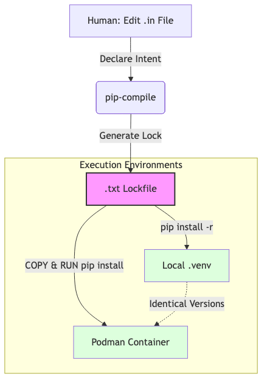

# Standardization of Python Dependency Management Across Environments

**Status:** Approved
**Date:** 2025-12-26
**Author:** AI Assistant
**Related tasks:** Task 146, Task 147

**Summary:** Each service owns one runtime `requirements.txt` used consistently across all execution environments, while shared dependencies are versioned centrally via a common core.

---

## Core Principles

1.  **Every service/container owns its runtime dependencies**
    *   Ownership is expressed via one `requirements.txt` per service.
    *   This file is the single source of truth, regardless of how the service is run.
2.  **Execution environment does not change dependency logic**
    *   Docker, Podman, .venv, and direct terminal execution must all install from the same `requirements.txt`.
    *   "Each service defines its own runtime world."
3.  **Shared versions are centralized, runtime ownership remains local**

---

## Context

To reduce "Dependency Chaos" across the Project Sanctuary fleet, we are standardizing Python requirements management. This ADR addresses the following problems:

1.  **Fragmented Container Dependencies**: 8 separate Dockerfiles with inconsistent approaches — some use manual `pip install`, others use `requirements.txt`. *Solved: Single source of truth per service.*
2.  **Local/Container Drift**: Root `/requirements.txt` doesn't match container environments. *Solved: Locked files guarantee identical versions everywhere.*
3.  **Scattered Requirements**: Individual directories maintain their own lists with no coordination. *Solved: Tiered hierarchy with shared baseline.*
4.  **Redundant Installations**: `sanctuary_cortex/Dockerfile` installs from both `requirements.txt` AND inline `pip install`. *Solved: No manual installs in Dockerfiles.*
5.  **Cache Invalidation**: Incorrect Dockerfile ordering (`COPY code` → `RUN pip install`) broke caching. *Solved: Proper layer ordering.*

**Scope**: This policy applies equally to:
*   Docker / Podman
*   .venv-based execution
*   Direct terminal execution

Dockerfiles are not special — they are just one consumer of `requirements.txt`.

## Options Analysis

### Option A: Distributed/Manual (Current Status Quo)
- **Description**: Each Dockerfile manually lists its own packages (`RUN pip install fastapi uvicorn...`).
- **Pros**: Zero coupling between services.
- **Cons**: High maintenance. Inconsistent versions across the fleet. High risk of "it works on my machine" vs. container. Redundant layer caching is minimal.

### Option B: Unified "Golden" Requirements
- **Description**: A single `requirements-fleet.txt` used by ALL 8 containers.
- **Pros**: Absolute consistency. Simplified logic. Maximum Docker layer sharing if base images match.
- **Cons**: Bloated images. `sanctuary_utils` (simple) inherits heavy ML deps from `rag_cortex` (complex). Security risk surface area increases unnecessarily for simple tools.

### Option C: Tiered "Base vs. Specialized" (Recommended)
- **Description**:
    *   **Tier 1 (Common)**: A `requirements-common.txt` (fastapi, uvicorn, pydantic, mcp) used by all.
    *   **Tier 2 (Specialized)**: Specific files for heavy lifters (e.g., `requirements-cortex.txt` for ML/RAG).
- **Pros**: Balances consistency with efficiency. Keeps lightweight containers light.
- **Cons**: Slightly more complex build context (need to mount/copy the common file).

### Option D: Dockerfile-Specific Requirements (Strict Mapping)
- **Description**: Every Dockerfile `COPY`s exactly one `requirements.txt` that lives next to it. No manual `pip install` lists allowed in Dockerfiles.
- **Pros**: Explicit, declarative. Clean caching.
- **Cons**: Can lead to version drift if not managed by a central lockfile or policy.

### Dependency Locking Tools: pip-compile and uv

To achieve deterministic builds, we use tools like `pip-compile` (from `pip-tools`) or `uv` to manage the translation between intent (`.in`) and lock (`.txt`).

1.  **Purpose**:
    *   `pip-compile` reads high-level dependency intent from `.in` files (e.g., `fastapi`, `pydantic`).
    *   It resolves the entire dependency graph and generates a locked `requirements.txt` containing exact versions (e.g., `fastapi==0.109.0`, `starlette==0.36.3`) and hashes.
    *   It **does not install** packages; it strictly generates the artifact.

2.  **Why this matters for Sanctuary**:
    *   **Determinism**: Ensures that Docker containers, local `.venv`s, and CI pipelines install mathematically identical environments.
    *   **Prevention**: Eliminates the class of bugs where a transitive dependency updates silently and breaks a service ("works on my machine" but fails in prod).
    *   **Alignment**: Supports the core principle that "every service defines one runtime world."

3.  **Understanding Transitive Dependencies**:
    *   `.in` files list only **direct dependencies** — packages your code explicitly imports (e.g., `langchain`, `chromadb`).
    *   `pip-compile` resolves the **entire dependency tree**, discovering all sub-dependencies automatically.
    *   Example: `chromadb` depends on `kubernetes`, which depends on `urllib3`. You never list `urllib3` in your `.in` file — pip-compile finds it and locks a specific version in the `.txt` file.
    *   **Security fixes for transitive deps**: Use `--upgrade-package <name>` to force an upgrade without polluting your `.in` file with packages you don't directly use.

4.  **Workflow Example**:
    ```bash
    # Generate locked requirements (Do this when dependencies change)
    pip-compile requirements-core.in --output-file requirements-core.txt
    pip-compile requirements-dev.in --output-file requirements-dev.txt
    pip-compile mcp_servers/gateway/clusters/sanctuary_cortex/requirements.in \
      --output-file mcp_servers/gateway/clusters/sanctuary_cortex/requirements.txt
    
    # Install (Do this to run)
    pip install -r requirements.txt
    ```

### Local Environment Synchronization

ADR 073 mandates that **Core Principle #2 ("Execution environment does not change dependency logic")** applies strictly to local `.venv` and terminal execution. Pure Docker consistency is insufficient.

1.  **Policy**:
    *   Docker, Podman, and Local `.venv` must instal from the exact same locked artifacts.
    *   Local environments MAY additionally install `requirements-dev.txt` (which containers MUST skip).

2.  **Setup Strategies**:

    *   **Option A: Single Service Mode** (Focus on one component):
        ```bash
        source .venv/bin/activate
        # Install runtime
        pip install -r mcp_servers/gateway/clusters/sanctuary_cortex/requirements.txt
        # Install dev tooling
        pip install -r requirements-dev.txt
        ```

    *   **Option B: Full Monorepo Mode** (Shared venv):
        ```bash
        source .venv/bin/activate
        # Install shared baseline
        pip install -r mcp_servers/requirements-core.txt
        # Install all service extras (potentially conflicting, use with care)
        pip install -r mcp_servers/gateway/clusters/*/requirements.txt
        # Install dev tooling
        pip install -r requirements-dev.txt
        ```

3.  **Automation & Enforcement**:
    *   We will introduce a Makefile target `install-env` to standardize this.
    *   Agents must detect drift between `pip freeze` and locked requirements in active environments.

## Reference Directory Structure (Example)

```
mcp_servers/
  gateway/
    requirements-core.txt  <-- Shared Baseline

  filesystem/
    requirements.txt       <-- Service specific (installs core + extras)
    Dockerfile

  utils/
    requirements.txt

  cortex/
    requirements.txt
    Dockerfile

requirements-dev.txt       <-- Local Dev only
```

## Decision & Recommendations

We recommend **Option D** (Strict Mapping) enhanced with a **Tiered Policy**:

1.  **Eliminate Manual `pip install`**: All Dockerfiles must `COPY requirements.txt` and `RUN pip install -r`. No inline package lists.
2.  **Harmonize Versions**: We will create a `requirements-core.txt` at the `mcp_servers/gateway` level to define the **shared baseline**.
    *   Individual services MAY reference it (`-r requirements-core.txt`) or copy it explicitly.
    *   The mechanism is less important than the rule: Shared versions are centralized, runtime ownership remains local.
3.  **Locking Requirement (Critical)**: All `requirements.txt` files MUST be generated artifacts from `.in` files using a single approved tool (e.g., `pip-tools` or `uv`).
    *   `.in` files represent **human-edited dependency intent**.
    *   `.txt` files are **machine-generated locks** to ensure reproducible builds.
    *   Manual editing of `.txt` files is prohibited.
4.  **Dev vs Runtime Separation**: explicit `requirements-dev.txt` for local/test dependencies. Containers must NEVER install dev dependencies.
    *   Avoids the "Superset" risk where local logic relies on tools missing in production.
5.  **CI Enforcement**: CI pipelines must fail if any Dockerfile contains inline `pip install` commands not referencing a requirements file.
6.  **Clean Up**: Remove the redundant manual `pip install` block from `sanctuary_cortex/Dockerfile` immediately.

## Sanctuary Dependency Update Workflow

This is the "Tiered Policy" approach (Option D) to maintain consistency across local Mac and Podman containers.



*[Source: python_dependency_workflow.mmd](../docs/architecture_diagrams/workflows/python_dependency_workflow.mmd)*

### Step-by-Step Process

1. **Identify Intent**: Open the relevant `.in` file (e.g., `requirements-core.in` for shared tools or `sanctuary_cortex/requirements.in` for RAG-specific tools).

2. **Declare Dependency**: Add the package name (e.g., `langchain`). This is the "Human Intent" phase.

3. **Generate Lockfile**: Run the compilation command:
   ```bash
   pip-compile <path_to_in_file> --output-file <path_to_txt_file>
   ```
   This resolves all sub-dependencies and creates a deterministic "Machine Truth" file.

4. **Local Sync**: Update your local `.venv` by running `pip install -r <path_to_txt_file>`.

5. **Container Sync**: Rebuild the Podman container. Because the Dockerfile uses `COPY requirements.txt`, it will automatically pull the exact same versions you just locked locally.

6. **Commitment**: Commit both the `.in` (Intent) and `.txt` (Lock) files to Git.

### Why This is the "Sanctuary Way"

- **No Manual Installs**: You never run `pip install <package>` directly in a Dockerfile; everything is declared in the requirements file.
- **No Drift**: If a tool works on your MacBook Pro, it is mathematically guaranteed to work inside the `sanctuary_cortex` container because they share the same `.txt` lock.

## Consequences

- **Immediate**: `sanctuary_cortex/Dockerfile` becomes cleaner and builds slightly faster (no double install checks).
- **Long-term**: Dependency updates (e.g., bumping `fastapi`) can be done in one place for 80% of the fleet.
- **Why**: ".in files exist to make upgrades safe and reproducible, not to change how services are run."
- **Determinism**: Builds become reproducible across machines and time (via locking).
- **Safety**: "Works on my machine" bugs reduced by strict dev/runtime separation.
- **Risk**: Needs careful audit of `sanctuary_cortex/requirements.txt` to ensuring nothing from the manual list is missing before deletion.

## Developer / Agent Checklist (Future Reference)

**Purpose**: Ensure all environments (Docker, Podman, local .venv) remain consistent with locked requirements.

### Verify Locked Files
- [ ] **Confirm `.in` files exist** for core, dev, and each service.
- [ ] **Confirm `.txt` files were generated** via `pip-compile` (or `uv`) from `.in` files.
- [ ] **Check that Dockerfiles point to the correct `requirements.txt`.**

### Update / Install Dependencies
#### Local venv / Terminal:
```bash
source .venv/bin/activate
pip install --no-cache-dir -r mcp_servers/requirements-core.txt
pip install --no-cache-dir -r mcp_servers/gateway/clusters/<service>/requirements.txt
pip install --no-cache-dir -r requirements-dev.txt  # optional for dev/test
```

#### Containers:
- [ ] Ensure Dockerfiles use:
    ```dockerfile
    COPY requirements.txt /tmp/requirements.txt
    RUN pip install --no-cache-dir -r /tmp/requirements.txt
    ```
- [ ] **Dev dependencies must not be installed in containers.**

### Check for Drift
- [ ] Compare `pip freeze` in active environments vs locked `.txt` files.
- [ ] Warn if any packages or versions differ.

### Regenerate Locks When Updating Dependencies
1.  Update `.in` files with new intent.
2.  Run `pip-compile` to produce updated `.txt` files.
3.  Verify Dockerfiles and local environments still match.

### Automation
- [ ] Use `make install-env TARGET=<service>` to sync venv for a specific service.
- [ ] CI pipelines should enforce: no inline `pip install`, only locked files allowed.

### Pre-Commit / Pre-Build
- [ ] Confirm all `.txt` files are up-to-date.
- [ ] Ensure Dockerfiles reference correct files.
- [ ] Optional: run `make verify` to validate local and container environments.
## How to Add a New Python Dependency (Standard Practice)

Follow this exact workflow to add or update a dependency in Project Sanctuary. This ensures determinism, consistency across local/container environments, and compliance with the locked-file policy.

### Step-by-Step: Adding a New Requirement

1.  **Identify the correct .in file (human intent file)**
    *   **Shared baseline** (e.g., fastapi, pydantic, MCP libs): Edit `mcp_servers/gateway/requirements-core.in`
    *   **Service-specific** (e.g., chromadb, langchain for RAG cortex): Edit the service’s own file, e.g. `mcp_servers/gateway/clusters/sanctuary_cortex/requirements.in`
    *   **Local development/testing only** (e.g., black, ruff): Edit `requirements-dev.in` (root or appropriate location)
    *   **Note**: If a service needs testing tools *inside* its container (e.g., for Protocol 101 gates), add them to the service-specific `.in` file.

2.  **Add the dependency intent**
    Write only the high-level package name and optional version constraint in the `.in` file.
    *   Examples: `fastapi>=0.110.0`, `chromadb`, `langchain-huggingface`
    *   Do not add transitive deps or exact pins here.

3.  **Regenerate the locked .txt file(s)**
    Run `pip-compile` (or `uv`) to produce the deterministic lockfile:
    ```bash
    # Example for a specific service
    pip-compile mcp_servers/gateway/clusters/sanctuary_git/requirements.in \
      --output-file mcp_servers/gateway/clusters/sanctuary_git/requirements.txt
    ```

4.  **Commit both files**
    Commit the edited `.in` file and the regenerated `.txt` file. Never hand-edit `.txt` files.

5.  **Verify installation**
    *   **Local**: `pip install -r <service>/requirements.txt`
    *   **Container**: Rebuild the image (`make up force=true TARGET=<service>`).

### Quick Reference Table

| Dependency Type | Edit This File | Regenerate Command Example | Install Command (Local) |
| :--- | :--- | :--- | :--- |
| **Shared baseline** | `requirements-core.in` | `pip-compile ... --output-file requirements-core.txt` | `pip install -r requirements-core.txt` |
| **Service-specific** | `<service>/requirements.in` | `pip-compile <service>/requirements.in --output-file <service>/requirements.txt` | `pip install -r <service>/requirements.txt` |
| **Dev / testing** | `requirements-dev.in` | `pip-compile requirements-dev.in --output-file requirements-dev.txt` | `pip install -r requirements-dev.txt` |

**Golden Rule**: `.in` = what humans edit (intent). `.txt` = what machines generate and everything installs from (truth).

## How to Update Dependencies (e.g., Security Fixes / Dependabot)

When security vulnerabilities (CVEs) are reported or Dependabot suggests updates:

1.  **Do NOT edit .txt files manually.**
    *   Dependabot often tries to edit `requirements.txt` directly. This breaks the link with `.in` files.
    *   You must update via the `.in` file -> `pip-compile` workflow.

2.  **Workflow**:
    *   **Option A: Update All**: Run `pip-compile --upgrade mcp_servers/requirements-core.in` to pull latest compatible versions for everything.
    *   **Option B: Targeted Update**: Run `pip-compile --upgrade-package <package_name> mcp_servers/requirements-core.in` (e.g., `pip-compile --upgrade-package uvicorn mcp_servers/requirements-core.in`).

3.  **Verify**:
    *   Check the generated `requirements-core.txt` to confirm the version bump.
    *   Rebuild affected containers or reinstall local environment.

4.  **Troubleshooting Dependency Conflicts**:
    *   If `pip-compile --upgrade-package` fails with `ResolutionImpossible`, a transitive dependency has a conflicting constraint.
    *   **Identify the constraint**:
        ```bash
        # Check what requires the problem package
        pip show <package> | grep -i required-by
        # Check what version constraints exist
        pip index versions <package>
        ```
    *   **Common pattern**: Package A (e.g., `kubernetes`) pins package B (e.g., `urllib3<2.6`). Fix requires upgrading both A and B together: `pip-compile --upgrade-package kubernetes --upgrade-package urllib3 ...`
    *   **If still blocked**: The constraint is upstream. File an issue with the constraining package or wait for their release.

### Real-World Example: urllib3 Security Advisory (2025-12-26)

**Situation**: Dependabot flagged 4 urllib3 vulnerabilities (CVE-2025-66418, CVE-2025-66471, etc.) requiring urllib3 ≥2.6.0. Current lock has urllib3==2.3.0.

**Attempted fixes**:
1. `pip-compile --upgrade-package urllib3` → No change (stayed at 2.3.0)
2. `pip-compile --upgrade-package 'urllib3>=2.6.0'` → `ResolutionImpossible`
3. `pip-compile --upgrade` (full upgrade) → Still 2.3.0

**Root cause**: `chromadb` → `kubernetes` has an upstream version constraint incompatible with urllib3 2.6+. The kubernetes Python client had breaking changes with urllib3 2.6.0 (removed `getheaders()` method).

**Resolution options**:
- **Wait for upstream**: Monitor kubernetes-client/python for a release compatible with urllib3 2.6+
- **Security override** (if critical): Add `urllib3>=2.6.0` to `.in` file, then investigate which direct dependency to upgrade/replace
- **Accept risk with mitigation**: Document the advisory, monitor for upstream fix, apply when available

**Status**: Blocked pending upstream kubernetes/chromadb compatibility update.
