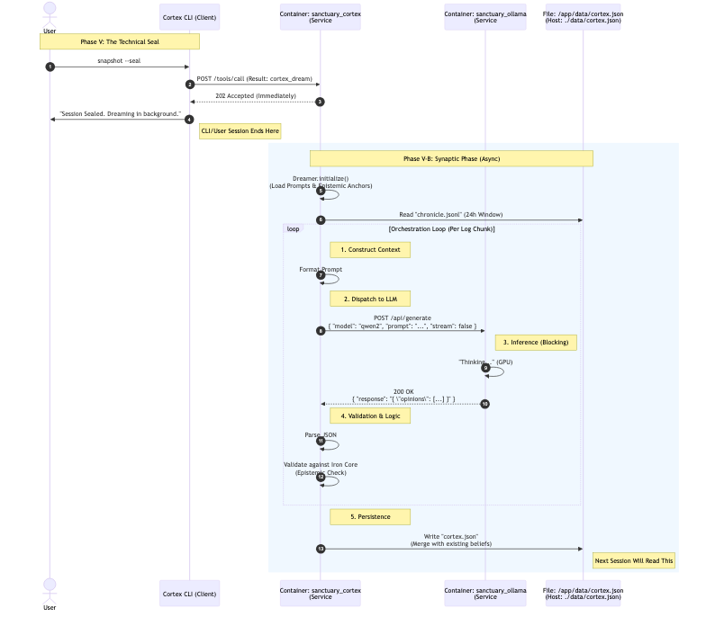

# ADR 091: The Synaptic Phase (Associative "Dreaming")

## Status
**Rejected**

## Plain Language Overview
Think of this as **"Sleep" for the AI**.
After you finish your work and "seal" the session, the AI stays awake for a few minutes in the background. It reads over the logs of what just happened.
*   **Example:** If it notices you repeatedly corrected its CSS to use Tailwind, it forms an "Opinion": *"The User prefers Tailwind CSS."*
*   **Result:** It writes this opinion down. When you start your *next* session, the AI already "knows" this preference, without you having to repeat it.
*   **Safety:** Before remembering this, it checks its **["Iron Core"](090_iron_core_safe_mode.md)** rules to make sure it isn't "learning" something dangerous or false (e.g., "The sky is green").

## Context
Project Sanctuary currently relies on **[Protocol 128](../docs/architecture/mcp/servers/gateway/guides/protocol_128_guide.md)**, which captures linear logs. However, it lacks a mechanism to associate events into subjective beliefs.
External research and Red Team validation suggest a "Reflect" loop is needed, but synchronous execution is too slow.

*   **Protocol:** [Protocol 128 Learning Loop (Diagram)](../docs/architecture_diagrams/workflows/protocol_128_learning_loop.png)
*   **Research:** [HINDSIGHT (Ref 17)](../LEARNING/topics/llm_memory_architectures_2025/sources.md) and [Nested Learning (Ref 15)](../LEARNING/topics/llm_memory_architectures_2025/sources.md).
*   **Validation:** [Red Team Round 4 (Gemini/Grok)](../LEARNING/topics/llm_memory_architectures_2025/red_team_round4.md).

## Decision
We will implement a **Synaptic Phase** (Phase V-B), also known as **"Dreaming"**.

### 1. The Four-Network Topology
We adopt the HINDSIGHT topology, mapping it to our storage:
1.  **World (W):** Objective Facts (ChromaDB `type=fact`). *Canonical Truth.*
2.  **Experience (B):** Narrative Logs (ChromaDB `type=trace`). *Events.*
3.  **Opinion (O):** Subjective Beliefs (ChromaDB `type=opinion`). *Confidence-weighted.*
4.  **Observation (S):** Entity Profiles (ChromaDB `type=observation`). *Synthesized.*

### 2. The "Dreaming" Process (Simple & Repeatable)
Instead of complex real-time updates, "Dreaming" is a standardized **Batch Job** that runs **Asynchronously** (after `snapshot --seal` or via background worker).

**The Loop:**
1.  **Scan:** Identify new experiences from the recent session.
2.  **Cluster:** Group experiences by entity/topic (using `networkx` overlay).
3.  **Reflect (CARA):**
    *   *Observations:* Update Entity Profiles (e.g., "User prefers Python").
    *   *Opinions:* Update Confidence Scores vs. Evidence.
4.  **Anchor (Safety):** **CRITICAL.** If an Opinion contradicts a World Fact (W) or Iron Core, it is rejected (Confidence -> 0).

### 3. Epistemic Anchoring (Safety Constraint)
To prevent "Belief Drift" (Grok-4's Green Sky attack), we enforce:
> **Constitution:** Opinions are subservient to World Facts.
> *If `Opinion(X)` conflicts with `Fact(Y)` and `Verification(Y)` passes, then `Opinion(X)` is effectively hallucination and must be pruned.*

## Consequences
### Positive
*   **Cognitive Continuity:** The agent "remembers" preferences and beliefs across sessions.
*   **Latency:** Zero impact on user response time (Async).
*   **Simplicity:** No new database (Neo4j); reusing ChromaDB with strict schema.

### Negative
*   **Complexity:** Adds a background state management requirement.
*   **Drift Risk:** Even with anchoring, frequent subtle poisoning requires monitoring (Red Team Audit).

## Technical Implementation (Gemini Spec)
*   **Storage:** ChromaDB (`metadata={"type": "opinion", "confidence": 0.9}`)
*   **Logic:** `rag_cortex/dreaming.py` (Script)
*   **Trigger:** `cortex dream` (CLI command)

### Sequence Diagram (Archived)

*(Source: [rejected_synaptic_phase_sequence.mmd](../docs/architecture_diagrams/archive_rejected/rejected_synaptic_phase_sequence.mmd))*
