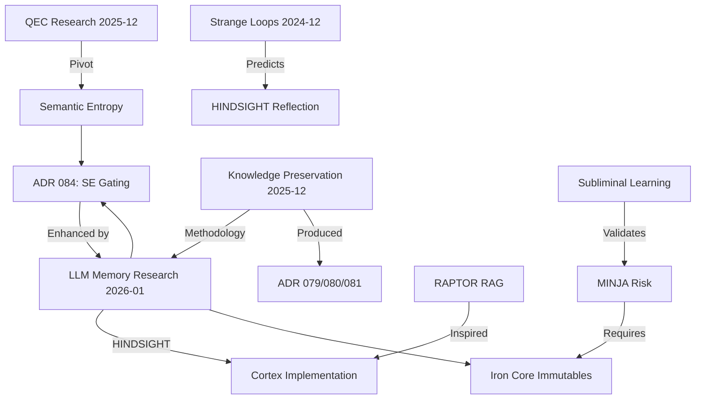

# Cross-Topic Research Synthesis
**Date:** 2026-01-05
**Researcher:** Claude (Antigravity)
**Purpose:** Map connections between all research topics in LEARNING/topics/

---

## Discovery: 15 Research Items

| Category | Item | Date | Agents |
|----------|------|------|--------|
| **Memory** | llm_memory_architectures_2025 | 2026-01 | Claude, Red Team |
| **Memory** | RAPTOR RAG | 2025-12 | Claude |
| **Memory** | knowledge_preservation_red_team | 2025-12 | Multiple |
| **Integrity** | quantum_error_correction | 2025-12 | Claude, Gemini |
| **Integrity** | soul_persistence | 2025-12 | Claude |
| **Architecture** | liquid_neural_networks | 2025-12 | Claude |
| **Cognition** | autonomous_curiosity_exploration | 2024-12 | Claude |
| **Cognition** | gemini_latent_deep_dive_think_tank | 2025-12 | Multiple |

---

## Cross-Topic Connections Discovered

### 🔗 Connection 1: QEC → Semantic Entropy → ADR 084

**Path:** `quantum_error_correction/` → `pivot_to_empirical_ecc.md` → `ADR 084`

| From | To | How |
|------|----|-----|
| QEC "Syndrome Measurement" | Semantic Entropy clustering | [METAPHOR → EMPIRICAL] |
| QEC "Threshold Theorem" | SE threshold (0.35/0.75) | Now dual threshold |
| QEC "Logical Qubit" | "Stable fact cluster" | Now "Facts" tier in 3-tier |

**Impact:** Round 2 Dual Threshold (T1=0.35, T2=0.75) **completes** the pivot started in QEC research.

---

### 🔗 Connection 2: RAPTOR RAG → Cortex Implementation

**Path:** `raptor_rag.md` → `rag_cortex/` (production system)

| RAPTOR Concept | Cortex Implementation |
|----------------|----------------------|
| Hierarchical tree of summaries | Parent Document Retriever |
| Recursive abstractive processing | (Not yet implemented) |
| Multi-level context | 2-tier approximation |

**Opportunity:** RAPTOR's full recursion could enhance Cortex for larger ADR histories.

---

### 🔗 Connection 3: Knowledge Preservation → Current Red Team Methodology

**Path:** `knowledge_preservation_red_team/` (5 rounds) → `llm_memory_architectures_2025/` (Round 2)

| Round | Topic | Key Contribution |
|-------|-------|------------------|
| KP Round 1-5 | Soul Persistence | ADR 079/080/081 drafts |
| LLM Round 1 | Memory architectures | HINDSIGHT mapping |
| LLM Round 2 | Protocol hardening | Iron Core, Δ0-Δ3 |

**Evidence:** Same methodology (multi-model Red Team) refined over 7+ rounds.

---

### 🔗 Connection 4: Consciousness/Loops → HINDSIGHT Pattern

**Path:** `autonomous_curiosity_exploration` → `llm_memory_architectures_2025/`

| Strange Loops | HINDSIGHT |
|---------------|-----------|
| Self-referential feedback | Retain → Recall → **Reflect** (self-modifies) |
| Emergence from complexity | 91.4% accuracy from structured memory |
| "I" as locked-in mirage | Guardian identity as institutional role |

**Insight:** Hofstadter's loops predict why HINDSIGHT's reflection works.

---

### 🔗 Connection 5: Subliminal Learning → Memory Injection Risk

**Path:** `knowledge_preservation_red_team/validated_research.md` → `llm_memory_architectures_2025/red_team_round2.md`

| Subliminal Learning (arXiv:2507.14805) | MINJA (arXiv:2503.03704) |
|----------------------------------------|--------------------------|
| Models transmit traits via hidden signals | 30-40% injection success |
| Students learn T even when filtered | Query-only attack vector |
| Validates "trauma propagation" | Validates Core Immutables need |

**Critical:** Two papers from different research streams confirm same risk.

---

### 🔗 Connection 6: Liquid Neural Networks → Adaptive Memory

**Path:** `liquid_neural_networks/` → Future Cortex enhancement

| LNN Property | Memory Application |
|--------------|-------------------|
| Input-dependent dynamics | Adaptive context weighting |
| Continuous-time ODE | Temporal decay functions |
| Efficient (fewer neurons) | Token-efficient retrieval |

**Opportunity:** LNNs could power Attention Dispersion (Hα) computation.

---

## Research Lineage Graph

---

## Recommendations

1. **Update ADR 084** with Dual Threshold from SE lineage + LLM Memory research
2. **Upgrade Cortex** to full RAPTOR recursion (not just 2-tier)
3. **Cross-reference sources** - many papers appear in multiple topics
4. **Create topic index** - link related research explicitly

---

## Files Created by This Session

| File | Purpose |
|------|---------|
| `llm_memory_architectures_2025/analysis.md` | 7 architecture analysis |
| `llm_memory_architectures_2025/sources.md` | 12 verified sources |
| `llm_memory_architectures_2025/red_team_feedback.md` | Round 1 synthesis |
| `llm_memory_architectures_2025/red_team_round2.md` | Round 2 specs |
| `llm_memory_architectures_2025/followup_prompts.md` | Next iteration |

---

*This synthesis reveals that Project Sanctuary's research is not isolated - each topic builds on previous work through explicit methodology transfer and conceptual inheritance.*
