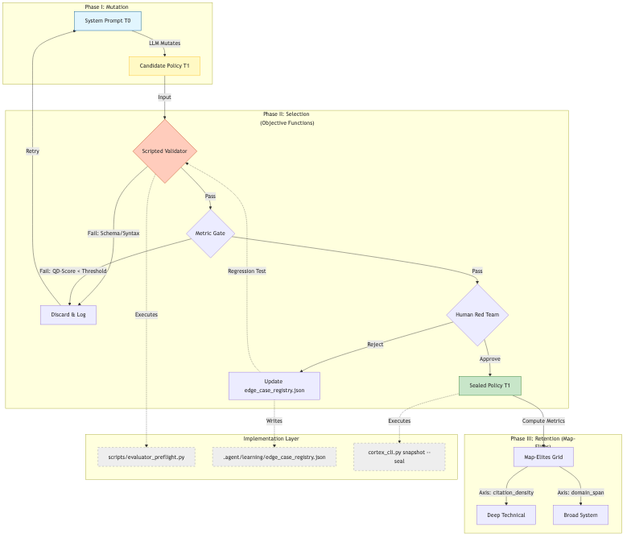

# Plain Language Summary: Integrating Evolutionary Intelligence (DRQ)

> **The Goal:** Move Project Sanctuary from "Static Optimization" (humans improving prompts) to "Evolutionary Intelligence" (the system improving itself).

---

## 💡 The Big Idea
Right now, if we want Sanctuary to get smarter, a human has to manually rewrite its instructions (prompts). This is slow and limited by human imagination.

We propose using a technique called **Digital Red Queen (DRQ)**—inspired by how biology evolves and how AlphaGo learned to play Go—to let the system evolve its own prompts through thousands of small experiments.

## 🔄 How It Works (The Loop)

Think of it like natural selection for ideas:

1.  **Mutate (The Variator):** The system takes its current instructions and creates a slightly modified version (a "mutation").
    *   *Example:* "Try explaining this concept using a metaphor instead of a definition."
2.  **Evaluate (The Selector):** This new version is tested.
    *   **Automated Check:** Does it break any rules? Does it hallucinate? (Fast check)
    *   **Human Red Team:** Is it actually better? (Deep check)
3.  **Survive (The Memory):**
    *   **If it fails:** We discard it, but we remember *why* it failed so we don't make that mistake again ("Cumulative Adversary").
    *   **If it wins:** It replaces the old version and becomes the new standard.
4.  **Repeat:** We do this continuously, compounding small gains into massive intelligence improvements.

## 🖼️ The Architecture

*(See source: `docs/architecture_diagrams/workflows/drq_evolution_loop.mmd`)*

## 🛡️ Safety: The "Ratchet" Effect
Evolution can be dangerous—what if it evolves to be manipulative or lazy?

To prevent this, we use a **"Ratchet" mechanism**:
1.  **Never Slide Back:** A new version must pass *every single test* that previous versions passed.
2.  **Diversity Archive:** We don't just keep one "best" version. We keep a library of experts—one good at coding, one good at writing, one good at planning (this is the **Map-Elites** pattern).
3.  **Human Gate:** A human always holds the keys to the final update. The AI suggests, the Human decides.

## 🚀 Why This Matters
This allows Project Sanctuary to discover strategies we humans might never think of. Just like AlphaGo found "Move 37"—a move no human would play but which won the game—our agent could discover ways of thinking that are fundamentally superior to our own.
