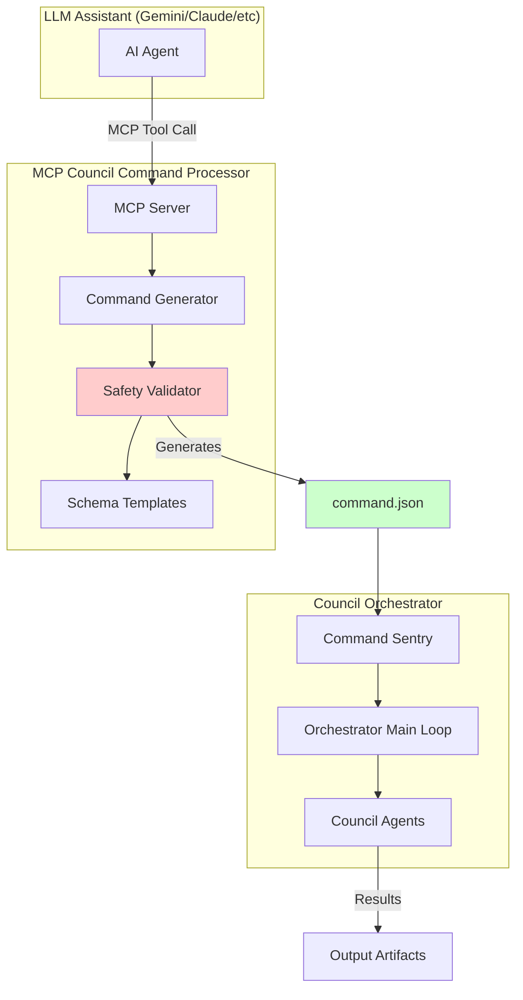

# Task #026: Implement Agent Orchestrator MCP (Council)

**Status:** Backlog  
**Priority:** High  
**Estimated Effort:** 3-4 days  
**Dependencies:** Task #028 (Pre-commit hooks), Shared Infrastructure  
**Domain:** `project_sanctuary.cognitive.council`  
**Related Protocols:** P95 (Commandable Council), P104 (Ethical Coherence Index), P101 (Unbreakable Commit)

---

## Problem Statement

Currently, interacting with the Council Orchestrator requires manually creating `command.json` files with complex schemas. This creates significant friction:

- **High Cognitive Load**: Users must remember exact JSON schema formats for different task types
- **Error-Prone**: Manual JSON creation leads to syntax errors and schema violations
- **Safety Risks**: LLM assistants making git operations can be reckless without proper guardrails
- **Workflow Friction**: The powerful Council system is underutilized due to interaction complexity

**Example of Current Friction:**
```json
{
  "task_description": "Analyze Protocol 95",
  "output_artifact_path": "WORK_IN_PROGRESS/p95_analysis.md",
  "config": {
    "max_rounds": 3,
    "force_engine": "gemini",
    "max_cortex_queries": 5
  }
}
```

Users must manually create this, remember all config options, and ensure proper paths.

---

## Proposed Solution

Create an **MCP (Model Context Protocol) server** that provides LLM assistants with **safe, structured tools** to interact with the Council Orchestrator. This reduces the Council Command interface to simple function calls.

### Architecture Overview



---

## Core Features

### 1. Safe Command Generation Tools

**Cognitive Tasks:**
- `create_cognitive_task(description, output_path, config)` - Council deliberation
- `create_development_cycle(description, project_name, config)` - Staged dev workflow
- `query_mnemonic_cortex(query, output_path, config)` - RAG synthesis

**Mechanical Tasks (Safe):**
- `create_file_write_task(content, output_path, description)` - Direct file creation
- `create_git_commit_task(files, message, push, description)` - Git operations with P101 compliance

**Query/Inspection:**
- `get_orchestrator_status()` - Check if orchestrator is running
- `list_recent_tasks()` - View task history
- `get_task_result(task_id)` - Retrieve completed task output

### 2. Safety Guardrails

**Automatic Safety Checks:**
- Validate all paths are within project boundaries
- Prevent overwrites of critical files (protocols, core configs)
- Enforce git safety rules from `.agent/git_safety_rules.md`
- Require explicit user approval for destructive operations

**Prohibited Operations (Manual Only):**
- Git resets, rebases, force pushes
- File/directory deletions
- Branch deletions
- Any operation violating git safety rules

**Risk Classification:**
```python
RISK_LEVELS = {
    "SAFE": ["create_cognitive_task", "query_mnemonic_cortex", "get_status"],
    "MODERATE": ["create_file_write_task", "create_git_commit_task"],
    "DANGEROUS": ["git_reset", "git_force_push", "delete_files"]  # Not implemented
}
```

### 3. Protocol Integration

**Protocol 101 (Unbreakable Commit):**
- Auto-generate `commit_manifest.json` with SHA-256 hashes
- Validate file integrity before git operations
- Support `--no-verify` bypass only with explicit user approval

**Protocol 95 (Commandable Council):**
- Maintain command.json schema compliance
- Support all task types (cognitive, mechanical, development cycles)
- Preserve structured command format

**Protocol 104 (Ethical Coherence Index):**
- Log all command generation attempts for audit trail
- Track success/failure rates for PAR calculation
- Enable strategic coherence monitoring

---

## Technical Implementation

### MCP Server Structure

```
mcp_council_processor/
├── server.py                 # Main MCP server entry point
├── tools/
│   ├── __init__.py
│   ├── cognitive.py          # Cognitive task tools
│   ├── mechanical.py         # Mechanical task tools
│   ├── query.py              # Query/inspection tools
│   └── safety.py             # Safety validation
├── schemas/
│   ├── command_templates.py  # JSON schema templates
│   └── validators.py         # Schema validation
├── config/
│   ├── safety_rules.py       # Safety rule definitions
│   └── mcp_config.json       # MCP server configuration
├── tests/
│   ├── test_cognitive_tools.py
│   ├── test_mechanical_tools.py
│   └── test_safety.py
└── README.md
```

### Example Tool Implementation

```python
@mcp_tool(name="create_cognitive_task", risk_level="SAFE")
async def create_cognitive_task(
    description: str,
    output_path: str,
    max_rounds: int = 5,
    force_engine: Optional[str] = None,
    max_cortex_queries: int = 5,
    input_artifacts: Optional[List[str]] = None
) -> dict:
    """
    Generate a command.json for Council deliberation.
    
    Args:
        description: High-level task description
        output_path: Where to save the result
        max_rounds: Maximum deliberation rounds (default: 5)
        force_engine: Force specific engine (gemini/openai/ollama)
        max_cortex_queries: Max RAG queries (default: 5)
        input_artifacts: Optional list of input file paths
    
    Returns:
        dict: Generated command structure
    
    Safety: SAFE - Read-only cognitive task, no file system changes
    """
    # Validate paths
    validate_output_path(output_path)
    if input_artifacts:
        validate_input_paths(input_artifacts)
    
    # Generate command
    command = {
        "task_description": description,
        "output_artifact_path": output_path,
        "config": {
            "max_rounds": max_rounds,
            "max_cortex_queries": max_cortex_queries
        }
    }
    
    if force_engine:
        command["config"]["force_engine"] = force_engine
    
    if input_artifacts:
        command["input_artifacts"] = input_artifacts
    
    # Write to command.json
    write_command_file(command)
    
    return {
        "status": "success",
        "command_file": "council_orchestrator/command.json",
        "message": "Cognitive task queued for Council deliberation"
    }
```

### Safety Validator Example

```python
class SafetyValidator:
    """Validates commands against safety rules and git safety protocols."""
    
    def __init__(self, git_safety_rules_path: str):
        self.rules = self._load_git_safety_rules(git_safety_rules_path)
        self.prohibited_patterns = [
            r"git\s+reset\s+--hard",
            r"git\s+push\s+(-f|--force)",
            r"git\s+rebase",
            r"rm\s+-rf",
        ]
    
    def validate_git_operation(self, files: List[str], message: str, push: bool) -> ValidationResult:
        """Validate git commit operation against safety rules."""
        
        # Check for protected files
        protected_files = [
            "01_PROTOCOLS/",
            ".git/hooks/pre-commit",
            ".agent/git_safety_rules.md"
        ]
        
        for file in files:
            for protected in protected_files:
                if file.startswith(protected):
                    return ValidationResult(
                        valid=False,
                        reason=f"Cannot modify protected file: {file}",
                        risk_level="DANGEROUS"
                    )
        
        # Validate commit message format (conventional commits)
        if not self._is_valid_commit_message(message):
            return ValidationResult(
                valid=False,
                reason="Commit message must follow conventional commit format",
                risk_level="MODERATE"
            )
        
        # Check if we're on main branch (requires extra caution)
        current_branch = get_current_branch()
        if current_branch == "main" and push:
            return ValidationResult(
                valid=False,
                reason="Direct push to main requires manual approval",
                risk_level="DANGEROUS"
            )
        
        return ValidationResult(valid=True, risk_level="MODERATE")
```

---

## Configuration

### MCP Server Config (`mcp_config.json`)

```json
{
  "server_name": "council-command-processor",
  "version": "1.0.0",
  "description": "MCP server for safe Council Orchestrator command generation",
  "tools": {
    "cognitive": {
      "enabled": true,
      "default_max_rounds": 5,
      "default_max_cortex_queries": 5
    },
    "mechanical": {
      "enabled": true,
      "require_approval_for_git": false,
      "require_approval_for_writes": false
    },
    "dangerous": {
      "enabled": false,
      "comment": "Destructive operations disabled by design"
    }
  },
  "safety": {
    "git_safety_rules_path": "../.agent/git_safety_rules.md",
    "protected_paths": [
      "01_PROTOCOLS/",
      ".git/",
      ".agent/"
    ],
    "max_file_size_mb": 10,
    "allowed_extensions": [".md", ".py", ".json", ".txt", ".yaml", ".yml"]
  },
  "orchestrator": {
    "command_file_path": "../council_orchestrator/command.json",
    "results_directory": "../council_orchestrator/command_results/",
    "logs_directory": "../council_orchestrator/logs/"
  }
}
```

---

## Tool Catalog

### Cognitive Tools (SAFE)

| Tool Name | Description | Risk Level | Auto-Execute |
|-----------|-------------|------------|--------------|
| `create_cognitive_task` | Generate Council deliberation task | SAFE | ✅ Yes |
| `create_development_cycle` | Generate staged dev workflow | SAFE | ✅ Yes |
| `query_mnemonic_cortex` | Generate RAG query task | SAFE | ✅ Yes |

### Mechanical Tools (MODERATE)

| Tool Name | Description | Risk Level | Auto-Execute |
|-----------|-------------|------------|--------------|
| `create_file_write_task` | Generate file write command | MODERATE | ✅ Yes* |
| `create_git_commit_task` | Generate git commit command | MODERATE | ✅ Yes* |

*With safety validation

### Query Tools (SAFE)

| Tool Name | Description | Risk Level | Auto-Execute |
|-----------|-------------|------------|--------------|
| `get_orchestrator_status` | Check orchestrator state | SAFE | ✅ Yes |
| `list_recent_tasks` | View task history | SAFE | ✅ Yes |
| `get_task_result` | Retrieve task output | SAFE | ✅ Yes |

### Prohibited Operations (NOT IMPLEMENTED)

| Operation | Reason | Alternative |
|-----------|--------|-------------|
| `git_reset` | Destructive, data loss risk | Manual only |
| `git_force_push` | Violates git safety rules | Manual only |
| `git_rebase` | Complex, conflict-prone | Manual only |
| `delete_files` | Irreversible | Manual only |
| `delete_branch` | Requires verification | Manual only |

---

## Usage Examples

### Example 1: Cognitive Task (Council Deliberation)

**User Request:** "Analyze Protocol 95 and create a summary"

**LLM Assistant Action:**
```python
create_cognitive_task(
    description="Analyze Protocol 95: The Commandable Council Protocol and create a comprehensive summary highlighting key mandates and architectural implications",
    output_path="WORK_IN_PROGRESS/p95_analysis.md",
    max_rounds=3,
    force_engine="gemini",
    input_artifacts=["01_PROTOCOLS/95_The_Commandable_Council_Protocol.md"]
)
```

**Generated `command.json`:**
```json
{
  "task_description": "Analyze Protocol 95: The Commandable Council Protocol...",
  "output_artifact_path": "WORK_IN_PROGRESS/p95_analysis.md",
  "config": {
    "max_rounds": 3,
    "force_engine": "gemini",
    "max_cortex_queries": 5
  },
  "input_artifacts": ["01_PROTOCOLS/95_The_Commandable_Council_Protocol.md"]
}
```

### Example 2: Git Commit (Mechanical Task)

**User Request:** "Commit the new task file"

**LLM Assistant Action:**
```python
create_git_commit_task(
    files=["TASKS/backlog/026_implement_mcp_council_command_processor.md"],
    message="feat(tasks): add Task #026 - MCP Council Command Processor",
    push=False,  # Safe default: don't push automatically
    description="Commit new MCP task specification"
)
```

**Safety Validation:**
- ✅ File path is valid
- ✅ Commit message follows conventional format
- ✅ Not modifying protected files
- ✅ Push disabled (safe)

**Generated `command.json`:**
```json
{
  "task_description": "Commit new MCP task specification",
  "git_operations": {
    "files_to_add": ["TASKS/backlog/026_implement_mcp_council_command_processor.md"],
    "commit_message": "feat(tasks): add Task #026 - MCP Council Command Processor",
    "push_to_origin": false
  },
  "output_artifact_path": "council_orchestrator/command_results/commit_results.json",
  "config": {
    "update_rag": false
  }
}
```

### Example 3: Rejected Dangerous Operation

**User Request:** "Reset the repository to the previous commit"

**LLM Assistant Response:**
```
❌ Operation Rejected: git reset operations are prohibited by the MCP Council Command Processor.

Reason: Destructive operation with data loss risk
Risk Level: DANGEROUS
Safety Rule: .agent/git_safety_rules.md - Section 2 (Destructive Commands)

Alternative: Please perform git reset operations manually with explicit verification.
```

---

## Implementation Phases

### Phase 1: Core Infrastructure (Week 1)
- [ ] Set up MCP server boilerplate
- [ ] Implement command template system
- [ ] Create safety validator framework
- [ ] Integrate with git safety rules

### Phase 2: Cognitive Tools (Week 1-2)
- [ ] Implement `create_cognitive_task`
- [ ] Implement `create_development_cycle`
- [ ] Implement `query_mnemonic_cortex`
- [ ] Add comprehensive tests

### Phase 3: Mechanical Tools (Week 2)
- [ ] Implement `create_file_write_task`
- [ ] Implement `create_git_commit_task` with P101 integration
- [ ] Add safety validation for all mechanical operations
- [ ] Test git workflow integration

### Phase 4: Query Tools (Week 2-3)
- [ ] Implement `get_orchestrator_status`
- [ ] Implement `list_recent_tasks`
- [ ] Implement `get_task_result`
- [ ] Add result parsing and formatting

### Phase 5: Testing & Documentation (Week 3)
- [ ] Comprehensive test suite
- [ ] Integration tests with Council Orchestrator
- [ ] User documentation
- [ ] Safety audit and validation

---

## Testing Strategy

### Unit Tests
```python
def test_create_cognitive_task_valid():
    """Test valid cognitive task generation."""
    result = create_cognitive_task(
        description="Test task",
        output_path="test_output.md"
    )
    assert result["status"] == "success"
    assert os.path.exists("council_orchestrator/command.json")

def test_git_commit_protected_file_rejected():
    """Test that commits to protected files are rejected."""
    with pytest.raises(SafetyViolation):
        create_git_commit_task(
            files=["01_PROTOCOLS/95_The_Commandable_Council_Protocol.md"],
            message="test: modify protocol",
            push=False
        )

def test_dangerous_operation_blocked():
    """Test that dangerous operations are not available."""
    assert not hasattr(tools, "git_reset")
    assert not hasattr(tools, "git_force_push")
```

### Integration Tests
- Test full workflow: MCP tool call → command.json → orchestrator execution
- Test Protocol 101 manifest generation
- Test safety validator with real git operations
- Test error handling and recovery

---

## Security Considerations

### Input Validation
- Sanitize all file paths (prevent directory traversal)
- Validate commit messages (prevent injection)
- Limit file sizes (prevent resource exhaustion)
- Whitelist file extensions

### Access Control
- Respect project boundaries (no access outside Project_Sanctuary)
- Enforce git safety rules
- Require user approval for elevated operations
- Audit log all command generation attempts

### Protocol 101 Compliance
- Auto-generate commit manifests with SHA-256 hashes
- Validate file integrity before commits
- Support emergency bypass with `--no-verify` (user approval required)
- Maintain audit trail of all git operations

---

## Success Criteria

### Functional
- [ ] All cognitive tools generate valid command.json files
- [ ] All mechanical tools execute safely with proper validation
- [ ] Safety validator blocks all prohibited operations
- [ ] Protocol 101 integration works correctly
- [ ] 100% test coverage for safety-critical code

### User Experience
- [ ] Reduces command.json creation time by 90%
- [ ] Eliminates schema errors
- [ ] Provides clear error messages for rejected operations
- [ ] Maintains full Council Orchestrator functionality

### Safety
- [ ] Zero incidents of destructive operations
- [ ] All git operations comply with safety rules
- [ ] Protected files remain unmodified
- [ ] Audit trail captures all operations

---

## Future Enhancements

### Phase 2 Features
- **Batch Operations**: Queue multiple commands
- **Template Library**: Pre-built command templates for common tasks
- **Interactive Mode**: Guided command generation with prompts
- **Result Streaming**: Real-time task progress updates

### Advanced Safety
- **Dry-Run Mode**: Preview command effects before execution
- **Rollback Support**: Automatic backup before risky operations
- **Approval Workflows**: Multi-step approval for sensitive operations
- **Rate Limiting**: Prevent command spam

### Integration
- **IDE Plugins**: VS Code, Cursor integration
- **CLI Tool**: Standalone command-line interface
- **Web UI**: Browser-based command builder
- **Slack/Discord Bots**: Team collaboration features

---

## Risk Mitigation

| Risk | Likelihood | Impact | Mitigation |
|------|------------|--------|------------|
| LLM generates invalid commands | Medium | Low | Schema validation before write |
| Accidental destructive git operation | Low | High | Prohibited operations not implemented |
| Protected file modification | Low | High | Path validation and whitelist |
| Command injection via commit message | Low | Medium | Input sanitization and validation |
| Resource exhaustion (large files) | Low | Medium | File size limits and validation |

---

## Dependencies

### Required
- Python 3.11+
- MCP SDK (Model Context Protocol)
- Council Orchestrator (existing)
- Git (for git operations)

### Optional
- pytest (testing)
- mypy (type checking)
- black (code formatting)

---

## References

- [Protocol 95: The Commandable Council Protocol](file:///Users/richardfremmerlid/Projects/Project_Sanctuary/01_PROTOCOLS/95_The_Commandable_Council_Protocol.md)
- [Protocol 101: The Unbreakable Commit](file:///Users/richardfremmerlid/Projects/Project_Sanctuary/.git/hooks/pre-commit)
- [Protocol 104: Ethical Coherence Index](file:///Users/richardfremmerlid/Projects/Project_Sanctuary/01_PROTOCOLS/104_ETHICAL_COHERENCE_INDEX.md)
- [Council Orchestrator README](file:///Users/richardfremmerlid/Projects/Project_Sanctuary/council_orchestrator/README.md)
- [Command Schema Documentation](file:///Users/richardfremmerlid/Projects/Project_Sanctuary/council_orchestrator/docs/command_schema.md)
- [Git Safety Rules](file:///Users/richardfremmerlid/Projects/Project_Sanctuary/.agent/git_safety_rules.md)
- [Task #025: MCP RAG Tool Server](file:///Users/richardfremmerlid/Projects/Project_Sanctuary/TASKS/backlog/025_implement_mcp_rag_tool_server.md)

---

**Created:** 2025-11-25  
**Author:** Guardian (via Gemini 2.0 Flash Thinking Experimental)  
**Version:** 1.0
