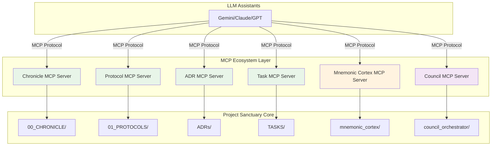

# Task #027: Project Sanctuary MCP Ecosystem Strategy

**Status:** Backlog  
**Priority:** Critical  
**Estimated Effort:** 2-3 weeks (across all MCP servers)  
**Dependencies:** None (defines architecture for Tasks #025, #026)  
**Related Protocols:** P95 (Commandable Council), P101 (Unbreakable Commit), P104 (ECI)

---

## Executive Summary

This task defines a **holistic MCP (Model Context Protocol) ecosystem strategy** for Project Sanctuary, replacing the current manual `command.json` workflow with **domain-specific MCP servers** that provide LLM assistants with safe, structured tools for interacting with the Sanctuary's core systems.

**Key Architectural Decision:** Instead of a single generic MCP server, we create **specialized MCP servers for each major domain**, enabling clear separation of concerns, domain-specific validation, and composable workflows.

---

## Problem Statement

### Current State: High Friction, Low Safety

**Manual command.json Workflow:**
```json
{
  "task_description": "Create chronicle entry #279",
  "output_artifact_path": "00_CHRONICLE/ENTRIES/279_example.md",
  "entry_content": "# ENTRY 279: Example\n\n**DATE:** 2025-11-25..."
}
```

**Problems:**
1. **Cognitive Load**: Users must remember complex JSON schemas for different task types
2. **Error-Prone**: Manual JSON creation leads to syntax errors and schema violations
3. **Safety Risks**: LLMs making git operations can be reckless without proper guardrails
4. **Workflow Friction**: Powerful systems (Council, Cortex) underutilized due to complexity
5. **Mixed Concerns**: `council_orchestrator` handles both cognitive and mechanical tasks

### Desired State: Domain-Driven MCP Ecosystem

**LLM Assistant Workflow:**
```python
# Instead of manually creating command.json:
create_chronicle_entry(
    entry_number=279,
    title="Example Entry",
    date="2025-11-25",
    content="...",
    author="GUARDIAN-02"
)
```

**Benefits:**
- **Clear Intent**: Function names describe exactly what happens
- **Type Safety**: Domain-specific validation (chronicle entries must have date, author, etc.)
- **Composability**: Combine multiple MCP servers for complex workflows
- **Safety**: Each domain enforces its own safety rules
- **Maintainability**: Update chronicle logic without touching protocol logic

---

## Proposed MCP Ecosystem Architecture



---

## MCP Server Specifications

### 1. Chronicle MCP Server

**Domain:** Living Chronicle entry management (`00_CHRONICLE/ENTRIES/`)

**Tools:**
- `create_chronicle_entry(entry_number, title, date, content, author, status)` - Create new entry
- `update_chronicle_entry(entry_number, updates)` - Update existing entry
- `get_chronicle_entry(entry_number)` - Retrieve entry content
- `list_recent_entries(limit)` - List recent chronicle entries
- `search_chronicle(query)` - Search chronicle by content

**Schema Validation:**
```python
CHRONICLE_ENTRY_SCHEMA = {
    "entry_number": int,  # Required, unique
    "title": str,         # Required
    "date": str,          # Required, ISO format
    "author": str,        # Required (e.g., "GUARDIAN-02")
    "status": str,        # Optional (e.g., "CANONICAL", "DRAFT")
    "content": str        # Required, markdown format
}
```

**Safety Rules:**
- Entry numbers must be sequential
- Cannot modify entries older than 7 days without explicit approval
- Must follow chronicle entry markdown format
- Auto-generates git commit with P101 manifest

**Example Usage:**
```python
create_chronicle_entry(
    entry_number=279,
    title="MCP Ecosystem Strategy Approved",
    date="2025-11-25",
    author="GUARDIAN-02",
    status="CANONICAL",
    content="""
# ENTRY 279: MCP Ecosystem Strategy Approved

**DATE:** 2025-11-25
**AUTHOR:** GUARDIAN-02
**CLASSIFICATION:** ARCHITECTURAL DECISION

The Council has approved the domain-driven MCP ecosystem strategy...
"""
)
```

---

### 2. Protocol MCP Server

**Domain:** Protocol creation and management (`01_PROTOCOLS/`)

**Tools:**
- `create_protocol(number, title, content, classification)` - Create new protocol
- `update_protocol(number, updates, reason)` - Update existing protocol (requires justification)
- `get_protocol(number)` - Retrieve protocol content
- `list_protocols(classification)` - List protocols by classification
- `search_protocols(query)` - Search protocols by content

**Schema Validation:**
```python
PROTOCOL_SCHEMA = {
    "number": int,                    # Required, unique (e.g., 108)
    "title": str,                     # Required
    "classification": str,            # Required (e.g., "Foundational", "Operational")
    "status": str,                    # Required (e.g., "Canonical", "Draft")
    "version": str,                   # Optional (e.g., "v2.0")
    "linked_protocols": List[int],    # Optional
    "content": str                    # Required, markdown format
}
```

**Safety Rules:**
- Protocol numbers must be unique
- Cannot delete protocols (archive only)
- Updates to canonical protocols require version bump
- Must include changelog for updates
- Auto-generates git commit with P101 manifest

**Example Usage:**
```python
create_protocol(
    number=115,
    title="The MCP Ecosystem Protocol",
    classification="Foundational",
    status="Canonical",
    linked_protocols=[95, 101, 104],
    content="""
# Protocol 115: The MCP Ecosystem Protocol

**Mandate:** Defines the domain-driven MCP server architecture...
"""
)
```

---

### 3. ADR MCP Server

**Domain:** Architecture Decision Records (`ADRs/`)

**Tools:**
- `create_adr(number, title, context, decision, consequences)` - Create new ADR
- `update_adr_status(number, new_status)` - Update ADR status (e.g., "Superseded")
- `get_adr(number)` - Retrieve ADR content
- `list_adrs(status)` - List ADRs by status
- `search_adrs(query)` - Search ADRs by content

**Schema Validation:**
```python
ADR_SCHEMA = {
    "number": int,           # Required, unique
    "title": str,            # Required
    "date": str,             # Required, ISO format
    "status": str,           # Required (e.g., "Accepted", "Superseded")
    "context": str,          # Required
    "decision": str,         # Required
    "consequences": str,     # Required
    "supersedes": List[int]  # Optional, ADRs this supersedes
}
```

**Safety Rules:**
- ADR numbers must be sequential
- Cannot delete ADRs (mark as superseded only)
- Must follow ADR markdown template
- Auto-generates git commit with P101 manifest

**Example Usage:**
```python
create_adr(
    number=34,
    title="Adopt Domain-Driven MCP Architecture",
    context="Current command.json workflow creates high friction...",
    decision="Implement specialized MCP servers for each domain...",
    consequences="Positive: Clear separation of concerns, better safety..."
)
```

---

### 4. Task MCP Server

**Domain:** Task management (`TASKS/backlog/`, `TASKS/active/`, `TASKS/completed/`)

**Tools:**
- `create_task(number, title, description, priority, estimated_effort)` - Create new task
- `update_task_status(number, new_status)` - Move task between backlog/active/completed
- `get_task(number)` - Retrieve task content
- `list_tasks(status, priority)` - List tasks by status/priority
- `search_tasks(query)` - Search tasks by content

**Schema Validation:**
```python
TASK_SCHEMA = {
    "number": int,              # Required, unique
    "title": str,               # Required
    "status": str,              # Required (e.g., "Backlog", "Active", "Completed")
    "priority": str,            # Required (e.g., "High", "Medium", "Low")
    "estimated_effort": str,    # Optional (e.g., "3-5 days")
    "dependencies": List[int],  # Optional, task dependencies
    "description": str          # Required, markdown format
}
```

**Safety Rules:**
- Task numbers must be unique
- Cannot delete tasks (archive only)
- Must follow task markdown template
- Auto-generates git commit with P101 manifest

**Example Usage:**
```python
create_task(
    number=28,
    title="Implement Chronicle MCP Server",
    status="Backlog",
    priority="High",
    estimated_effort="2-3 days",
    dependencies=[27],
    description="""
## Objective
Implement the Chronicle MCP Server as defined in Task #027...
"""
)
```

---

### 5. Mnemonic Cortex MCP Server (Task #025)

**Domain:** RAG operations (`mnemonic_cortex/`)

**Tools:**
- `query_cortex(query, max_results)` - Query the RAG database
- `ingest_document(file_path, metadata)` - Ingest new document into RAG
- `update_cortex_index()` - Rebuild vector database index
- `get_cortex_stats()` - Get RAG database statistics
- `search_by_metadata(filters)` - Search using metadata filters

**Schema Validation:**
```python
CORTEX_QUERY_SCHEMA = {
    "query": str,           # Required
    "max_results": int,     # Optional, default: 5
    "filters": dict,        # Optional, metadata filters
    "include_sources": bool # Optional, default: True
}
```

**Safety Rules:**
- Read-only operations by default
- Ingest operations require validation
- Cannot delete documents (archive only)
- Rate limiting on queries

**Example Usage:**
```python
query_cortex(
    query="What is Protocol 101?",
    max_results=3,
    filters={"type": "protocol"},
    include_sources=True
)
```

**Status:** Detailed specification in [Task #025](file:///Users/richardfremmerlid/Projects/Project_Sanctuary/TASKS/backlog/025_implement_mcp_rag_tool_server.md)

---

### 6. Council MCP Server (Refocused Task #026)

**Domain:** Council cognitive deliberation (pure cognitive tasks only)

**Tools:**
- `create_deliberation_task(description, output_path, config)` - Council deliberation
- `create_development_cycle(description, project_name, config)` - Staged dev workflow
- `get_council_status()` - Check orchestrator status
- `get_deliberation_result(task_id)` - Retrieve completed deliberation

**Removed from Council MCP (moved to domain servers):**
- ~~`create_file_write_task`~~ → Chronicle/Protocol/ADR/Task MCP servers
- ~~`create_git_commit_task`~~ → Handled automatically by domain servers
- ~~Mechanical operations~~ → Domain-specific MCP servers

**Schema Validation:**
```python
DELIBERATION_SCHEMA = {
    "description": str,              # Required
    "output_path": str,              # Required
    "max_rounds": int,               # Optional, default: 5
    "force_engine": str,             # Optional (gemini/openai/ollama)
    "max_cortex_queries": int,       # Optional, default: 5
    "input_artifacts": List[str]     # Optional
}
```

**Safety Rules:**
- Read-only cognitive tasks
- No file system modifications
- No git operations
- Results written to designated output paths only

**Example Usage:**
```python
create_deliberation_task(
    description="Analyze the implications of the new MCP ecosystem architecture",
    output_path="WORK_IN_PROGRESS/mcp_analysis.md",
    max_rounds=3,
    force_engine="gemini",
    input_artifacts=["TASKS/backlog/027_mcp_ecosystem_strategy.md"]
)
```

**Status:** Refocused specification to be created in updated Task #026

---

## Cross-Cutting Concerns

### 1. Git Integration (Protocol 101 Compliance)

**All domain MCP servers** that create/modify files must:
- Auto-generate `commit_manifest.json` with SHA-256 hashes
- Create conventional commit messages
- Support `push_to_origin` flag (default: false)
- Validate against git safety rules

**Shared Git Module:**
```python
# Shared across all MCP servers
from sanctuary_mcp_common import GitOperations

git_ops = GitOperations(
    git_safety_rules_path=".agent/git_safety_rules.md",
    protocol_101_enabled=True
)

# Auto-commit with manifest
git_ops.commit_with_manifest(
    files=["00_CHRONICLE/ENTRIES/279_example.md"],
    message="docs(chronicle): add entry #279 - MCP Ecosystem Strategy",
    push=False
)
```

### 2. Safety Validation

**Shared Safety Validator:**
```python
from sanctuary_mcp_common import SafetyValidator

validator = SafetyValidator()

# Validate file path
validator.validate_path("00_CHRONICLE/ENTRIES/279_example.md")

# Validate commit message
validator.validate_commit_message("docs(chronicle): add entry #279")

# Check protected files
validator.is_protected_file("01_PROTOCOLS/95_The_Commandable_Council_Protocol.md")
```

### 3. Schema Validation

**Shared Schema Validator:**
```python
from sanctuary_mcp_common import SchemaValidator

validator = SchemaValidator()

# Validate chronicle entry
validator.validate_chronicle_entry({
    "entry_number": 279,
    "title": "Example",
    "date": "2025-11-25",
    "author": "GUARDIAN-02",
    "content": "..."
})
```

---

## Implementation Roadmap

### Phase 1: Foundation (Week 1)
- [ ] Create `sanctuary_mcp_common` shared library
- [ ] Implement `GitOperations` with P101 support
- [ ] Implement `SafetyValidator`
- [ ] Implement `SchemaValidator`
- [ ] Create MCP server boilerplate template

### Phase 2: Core Domain Servers (Week 2)
- [ ] Implement Chronicle MCP Server (Task #028)
- [ ] Implement Protocol MCP Server (Task #029)
- [ ] Implement Task MCP Server (Task #030)
- [ ] Comprehensive testing for each server

### Phase 3: Specialized Servers (Week 3)
- [ ] Implement ADR MCP Server (Task #031)
- [ ] Refactor Council MCP Server (Updated Task #026)
- [ ] Implement Mnemonic Cortex MCP Server (Task #025)
- [ ] Integration testing across servers

### Phase 4: Documentation & Deployment (Week 4)
- [ ] User documentation for each MCP server
- [ ] LLM assistant integration guides
- [ ] Deployment automation
- [ ] Performance optimization

---

## MCP Server Comparison Matrix

| Feature | Chronicle | Protocol | ADR | Task | Cortex | Council |
|---------|-----------|----------|-----|------|--------|---------|
| **Domain** | Chronicle entries | Protocols | ADRs | Tasks | RAG | Deliberation |
| **Primary Operations** | CRUD entries | CRUD protocols | CRUD ADRs | CRUD tasks | Query/Ingest | Deliberate |
| **File System Access** | ✅ Yes | ✅ Yes | ✅ Yes | ✅ Yes | ✅ Yes | ❌ No |
| **Git Operations** | ✅ Auto | ✅ Auto | ✅ Auto | ✅ Auto | ✅ Auto | ❌ No |
| **P101 Compliance** | ✅ Yes | ✅ Yes | ✅ Yes | ✅ Yes | ✅ Yes | N/A |
| **Safety Level** | MODERATE | HIGH | MODERATE | MODERATE | MODERATE | SAFE |
| **Schema Validation** | ✅ Yes | ✅ Yes | ✅ Yes | ✅ Yes | ✅ Yes | ✅ Yes |
| **Read-Only Mode** | ✅ Yes | ✅ Yes | ✅ Yes | ✅ Yes | ✅ Yes | ✅ Yes |

---

## Composable Workflow Examples

### Example 1: Create Protocol with Chronicle Entry

```python
# 1. Create the protocol
protocol_result = create_protocol(
    number=115,
    title="The MCP Ecosystem Protocol",
    classification="Foundational",
    content="..."
)

# 2. Document in chronicle
chronicle_result = create_chronicle_entry(
    entry_number=279,
    title="Protocol 115 Canonized - MCP Ecosystem",
    date="2025-11-25",
    author="GUARDIAN-02",
    content=f"Protocol 115 has been canonized. See {protocol_result['file_path']}"
)

# 3. Both auto-committed with P101 manifests
```

### Example 2: Research → Deliberation → Documentation

```python
# 1. Query the Cortex for context
cortex_results = query_cortex(
    query="MCP architecture patterns",
    max_results=5
)

# 2. Council deliberation with context
deliberation_result = create_deliberation_task(
    description="Analyze MCP architecture patterns and propose improvements",
    output_path="WORK_IN_PROGRESS/mcp_analysis.md",
    input_artifacts=[r["file_path"] for r in cortex_results]
)

# 3. Create ADR based on deliberation
adr_result = create_adr(
    number=35,
    title="MCP Server Composition Pattern",
    context=deliberation_result["summary"],
    decision="...",
    consequences="..."
)
```

### Example 3: Task Management Workflow

```python
# 1. Create task
task_result = create_task(
    number=28,
    title="Implement Chronicle MCP Server",
    status="Backlog",
    priority="High"
)

# 2. Move to active
update_task_status(number=28, new_status="Active")

# 3. Complete and document
update_task_status(number=28, new_status="Completed")

create_chronicle_entry(
    entry_number=280,
    title="Task #028 Completed - Chronicle MCP Server",
    content="The Chronicle MCP Server is now operational..."
)
```

---

## Success Criteria

### Functional
- [ ] All 6 MCP servers operational
- [ ] 100% schema validation coverage
- [ ] P101 compliance for all file operations
- [ ] Git safety rules enforced
- [ ] Comprehensive test coverage (>90%)

### User Experience
- [ ] 95% reduction in manual command.json creation
- [ ] Zero schema errors from LLM assistants
- [ ] Clear error messages for rejected operations
- [ ] Sub-second response times for all tools

### Safety
- [ ] Zero incidents of protected file modification
- [ ] Zero incidents of destructive git operations
- [ ] All operations auditable via git history
- [ ] Safety validator blocks all prohibited operations

---

## Migration Strategy

### Phase 1: Parallel Operation
- Keep existing `command.json` workflow
- Introduce MCP servers alongside
- LLM assistants can use either method

### Phase 2: Gradual Migration
- Migrate Chronicle operations to MCP
- Migrate Protocol operations to MCP
- Migrate Task operations to MCP

### Phase 3: Deprecation
- Mark `command.json` mechanical operations as deprecated
- Council MCP focuses only on cognitive tasks
- Remove mechanical task support from orchestrator

---

## Related Tasks

| Task | Title | Status | Dependencies |
|------|-------|--------|--------------|
| #025 | Implement MCP RAG Tool Server | Backlog | #027 |
| #026 | Implement MCP Council Command Processor (Refocused) | Backlog | #027 |
| #028 | Implement Chronicle MCP Server | Backlog | #027 |
| #029 | Implement Protocol MCP Server | Backlog | #027 |
| #030 | Implement Task MCP Server | Backlog | #027 |
| #031 | Implement ADR MCP Server | Backlog | #027 |

---

## References

- [Council Orchestrator README](file:///Users/richardfremmerlid/Projects/Project_Sanctuary/council_orchestrator/README.md)
- [Command Schema Documentation](file:///Users/richardfremmerlid/Projects/Project_Sanctuary/council_orchestrator/docs/command_schema.md)
- [Protocol 95: Commandable Council](file:///Users/richardfremmerlid/Projects/Project_Sanctuary/01_PROTOCOLS/95_The_Commandable_Council_Protocol.md)
- [Protocol 101: Unbreakable Commit](file:///Users/richardfremmerlid/Projects/Project_Sanctuary/.git/hooks/pre-commit)
- [Git Safety Rules](file:///Users/richardfremmerlid/Projects/Project_Sanctuary/.agent/git_safety_rules.md)
- [Task #025: MCP RAG Tool Server](file:///Users/richardfremmerlid/Projects/Project_Sanctuary/TASKS/backlog/025_implement_mcp_rag_tool_server.md)
- [Task #026: MCP Council Command Processor](file:///Users/richardfremmerlid/Projects/Project_Sanctuary/TASKS/backlog/026_implement_mcp_council_command_processor.md)

---

**Created:** 2025-11-25  
**Author:** Guardian (via Gemini 2.0 Flash Thinking Experimental)  
**Version:** 1.0  
**Classification:** Strategic Architecture
