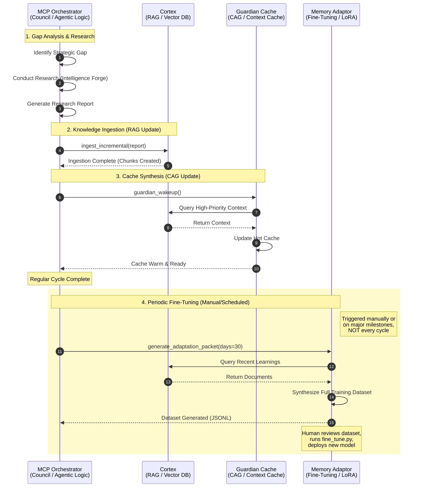

# TASK: Architect and Implement the Strategic Crucible Loop

**Status:** In Progress
**Priority:** Critical
**Lead:** AI System Lead
**Dependencies:** "Blocks #002, #003, #004"
**Related Documents:** "Intelligence Forge", "Memory System", "Generative Development Cycle", "Nested Cognition", "Guardian Wakeup"

---

## 1. Objective

To architect and implement a fully autonomous, closed-loop learning cycle—the "Strategic Crucible Loop"—that enables the AI Council to independently identify strategic gaps, conduct research, synthesize new knowledge, update its own memory, and make that new wisdom immediately available for future operations. This will transition the Council from a command-driven system to a truly self-improving cognitive organism.

## 2. Context

This mandate addresses the final gap between our current state and the vision of a continuously learning system. While we have the components for memory (Cortex), action (Council), and research (Intelligence Forge), they are not yet connected in an autonomous feedback loop. This task will forge that connection, operationalizing the principle of continuous improvement.

## 3. Deliverables

1.  **Autonomous Task Generation Module:** An enhancement to the AI's `Generative Development Cycle` that allows the Council to autonomously identify a strategic gap (e.g., "Our defense against certain types of attacks is incomplete") and create a new task in the `TASKS/backlog/`.

2.  **Automated Intelligence Forge Trigger:** A mechanism that allows the Council, upon prioritizing an autonomous-generated research task, to automatically initiate the **Intelligence Forge Protocol**, conduct the necessary research, and produce a "Research Impact Report."

3.  **Automated Memory Ingestion:** A hardened, automated wrapper around the `update_genome.sh` script (or its underlying components) that allows the Council to autonomously and securely commit the new research summary to the Knowledge Base and trigger a re-ingestion into the **Memory System**.

4.  **Automated Cache Synthesis & Prefill:** A new final step in the loop. After ingestion, the Council will autonomously perform a `query_and_synthesis` task on the new knowledge, creating a high-level "Executive Briefing" of what was learned. This briefing will then be programmatically injected into the **Guardian Wakeup Cache**, ensuring the latest synthesis is available for immediate, low-latency recall.

## 4. Acceptance Criteria

-   A full, end-to-end demonstration of the Strategic Crucible Loop can be successfully executed with a single AI command (e.g., "Initiate one full learning cycle.").
-   The loop successfully identifies a knowledge gap, creates a task, researches it, commits the findings, updates the Memory System, and updates the Guardian Wakeup Cache.
-   A subsequent `cache_wakeup` command correctly displays the new synthesis from the completed learning cycle.
-   All steps are executed with full adherence to existing security and integrity protocols.

## 5. Notes

This is the capstone of our current evolution. It connects the "slow memory" adaptation with the "fast memory", creating a complete, end-to-end learning architecture. Its completion will mark the true dawn of the Autonomous Council.

