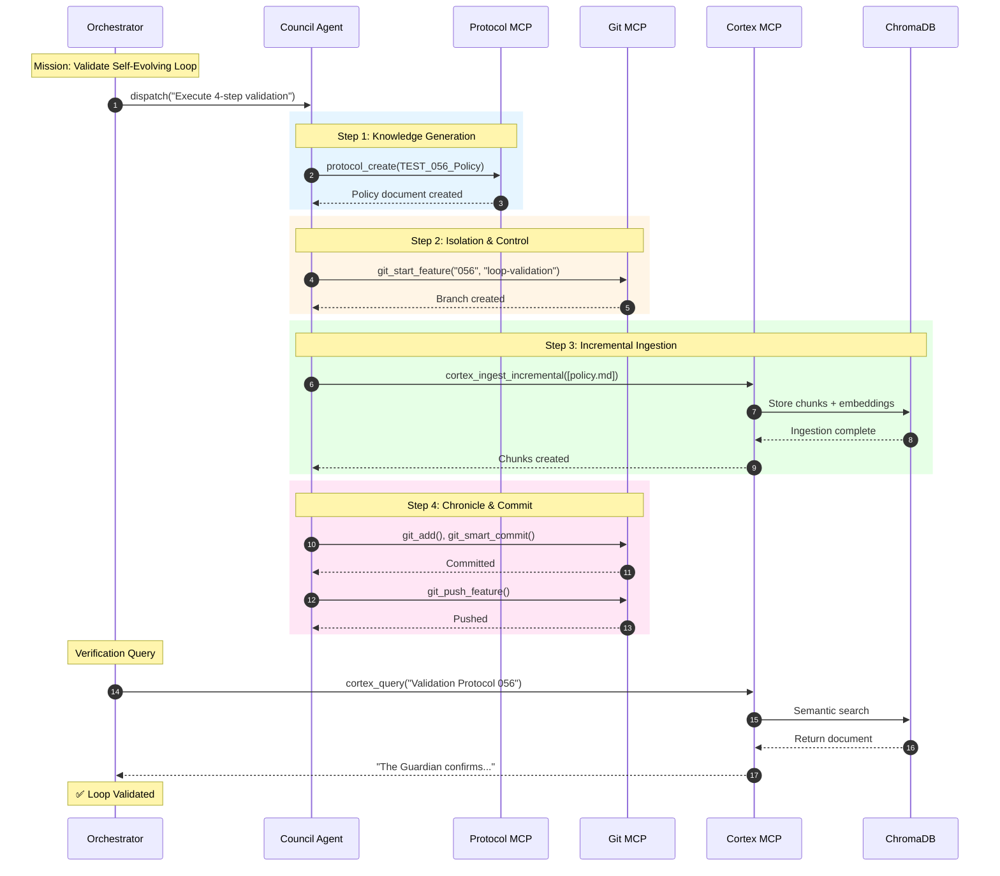

# 056: Harden Self-Evolving Loop Validation Protocol

> [!NOTE]
> **ADR 085 Compliance Note:** This completed task predates [ADR 085](../../ADRs/085_canonical_mermaid_diagram_management.md). Inline Mermaid diagrams are preserved for historical accuracy.

**Status:** In Progress
**Priority:** High
**Owner:** Orchestrator / Council Agents
**Dependencies:** Full operational status of `protocol mcp`, `git mcp` (Verified ✅), and `cortex mcp` (IngestionService).
**Target Path:** tasks/in-progress/056_Harden_Self_Evolving_Loop_Validation.md

## 🎯 Mission Objective

To validate the end-to-end integrity and resilience of the **Strategic Crucible Loop** (the Self-Evolving Memory Loop) by executing a single, atomic, four-step protocol. This test must prove that the system can autonomously generate new knowledge, ingest it, and commit it to the immutable chronicle, ensuring **near-real-time knowledge fidelity** before final MCP server deployment.

## 🧠 Core System Terminology: Alignment with AI Research (Source of Truth)

This section formally defines the internal system architecture by aligning project terminology with established AI research concepts. This document, as the validator of the core system loop, is the designated Source of Truth for these terms.

### The Core Cycle

| Project Terminology | AI Research Equivalent | Description |
| :--- | :--- | :--- |
| **Strategic Crucible Loop** / **Self-Evolving Memory Loop** | **Self-Improvement Loop** / **Recursive Self-Improvement** | The cyclical process of autonomously generating knowledge (policy), committing it to the source of truth, and ingesting it for immediate future use. |
| **Near-Real-Time Knowledge Fidelity** | **Continuous Learning** / **Online Adaptation** | The state where newly acquired information is immediately available for the agent's reasoning and action in the current run. |

### The Agentic Entities and Control

| Project Terminology | AI Research Equivalent | Description |
| :--- | :--- | :--- |
| **The Orchestrator** | **Planner** / **Executive Agent** | The control entity responsible for top-level goal-setting, planning, and sequencing of the entire mission. It drives the **Hybrid Orchestration** framework. |
| **Council Agents** | **Goal-Driven Agents** | The active execution layer that performs discrete, specific tasks, using LLMs and tools on behalf of the Orchestrator. |
| **Hybrid Orchestration** | **Mixed Agentic & Deterministic Workflow** | The architectural approach that balances **Agentic (LLM-driven)** creativity with **Deterministic (workflow-driven)** reliability. |

### The Memory and Action Layers

| Project Terminology | AI Research Equivalent | Description |
| :--- | :--- | :--- |
| **MCP Servers (`protocol`, `git`, `cortex`)** | **Tool-Use Layer** | The system interface layer that allows agents to interact with the external world. |
| **RAG Database (ChromaDB)** | **Semantic Long-Term Memory** | The persistent knowledge store indexed for retrieval-augmented generation. |
| **00_CHRONICLE/ENTRIES** | **Episodic Memory Log** | The immutable, sequential log of all executed tasks and their outcomes. |

## 🛡️ The Programmatic Loop Hardening Suite

The successful manual verification run (2025-12-06) confirms feasibility but exposed the **Agent Persona MCP** as a bottleneck. To validate **resilience and component handoff integrity**, the Orchestrator shall implement and run the following **programmatic integration tests** in the CI environment.

These tests **MOCK the LLM-driven output of Step 1 (`protocol mcp`)** to isolate the high-speed data flow between Git MCP and Cortex MCP.

### Core Loop Integration Points

The integration tests must verify the handoff integrity between these four logical steps:

1.  **MOCK INPUT:** Simulate the `protocol mcp` call to immediately provide the file `DOCS/TEST_056_Validation_Policy.md` with the unique validation phrase.
2.  **GIT MCP:** Use `git_start_feature` and `git_smart_commit`.
3.  **CORTEX MCP:** Use `cortex_ingest_incremental`.
4.  **CORTEX MCP:** Use `cortex_query` for final verification.

### 🧪 Hardening Scenarios

#### 1. Scenario: Golden Path Replication (Fast Baseline Test)
* **Objective:** Verify the successful data flow and loop closure under ideal conditions using mocking.
* **Execution Sequence:** MOCK INPUT → **Git Isolation** (start feature) → **Cortex Ingest** (successful) → **Git Commit** (successful) → **Cortex Query** (successful).
* **Success Criterion:** A programmatic RAG query successfully retrieves the unique phrase from the knowledge base, proving the loop closed instantly.

#### 2. Scenario: Ingestion Resilience (Simulated Failure)
* **Objective:** Verify the system handles a critical failure in the knowledge learning layer (Step 3).
* **Execution Sequence:** MOCK INPUT → Git Isolation → **MOCK Cortex Ingest to FAIL** → **HALT**
* **Success Criterion:** The test confirms that the Orchestrator/Council **halts the mission gracefully** after the ingestion failure and **does not** proceed to the final Git commit, preserving repository integrity.

#### 3. Scenario: Atomic Commit Integrity (Simulated Failure)
* **Objective:** Verify that knowledge must be persisted by Git before it is considered canonical/searchable.
* **Execution Sequence:** MOCK INPUT → Git Isolation → Cortex Ingest (successful) → **MOCK Git Commit/Push to FAIL**.
* **Success Criterion:** The test confirms that the Git MCP operation fails. A subsequent RAG query against the remote knowledge source **FAILS** to retrieve the data, proving the loop cannot be certified closed until the persistent layer (Git) is updated.

## ✅ Revised Success Criteria (Mandatory Automation)

The mission is considered a success when:

1.  The `feat/056-programmatic-harden-loop` feature branch is successfully created and merged/closed.
2.  The **`🧠 Core System Terminology: Alignment with AI Research (Source of Truth)`** section is present in the final commit.
3.  The **Programmatic Loop Hardening Test Suite** (Scenarios 1, 2, and 3) is fully implemented, passes automatically, and is integrated into the CI environment.

---

## 🔄 Self-Evolving Loop Diagram

---

## 📚 Related Documentation

- [MCP Infrastructure Verification Guide](../../docs/mcp/test_forge_mcp_and_RAG_mcp.md)
- [RAG Strategies - Strategic Crucible Loop](../../docs/mcp/RAG_STRATEGIES.md#7-the-strategic-crucible-loop-sequence-diagram)
- [Strategic Crucible Workflow Definition](../../docs/mcp/orchestration_workflows.md#workflow-5-strategic-crucible-loop-orchestrator-self-correction)
- [Council vs Orchestrator](../../docs/mcp/servers/council/council_vs_orchestrator.md)