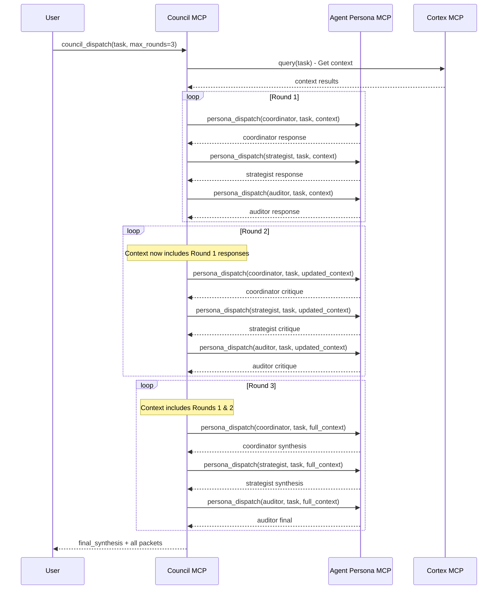

# Task 086B: Verify Multi-Round Deliberation Logic Integrity

**Status:** TODO  
**Priority:** HIGH 🟠  
**Created:** 2025-12-01  
**Estimated Effort:** 1-2 hours

## Objective

Verify that the complex multi-round deliberation logic from the legacy `council_orchestrator` was correctly migrated to the new MCP architecture and functions as designed.

## Background

The Council's core capability is multi-agent deliberation across multiple rounds:
- **Round 1:** Initial perspectives (Coordinator plans, Strategist assesses, Auditor checks)
- **Round 2:** Cross-agent critique and feedback
- **Round 3:** Final synthesis and consensus

This logic must be verified to ensure the migration didn't break the system's cognitive function.

## Verification Checklist

### Phase 1: Code Review ✅ COMPLETED

**File:** `mcp_servers/lib/council/council_ops.py`

**Findings:**
- ✅ Multi-round loop implemented (lines 140-173)
- ✅ Agent iteration logic present (lines 141-173)
- ✅ Calls Agent Persona MCP correctly (line 143: `persona_ops.dispatch()`)
- ✅ Context accumulation across rounds (line 172)
- ✅ Packet creation for tracking (lines 152-168)
- ✅ RAG/Cortex integration (line 120: `cortex.query()`)

**Verdict:** ✅ Logic correctly migrated

### Phase 2: Manual Testing

**Test Script:**
```python
from mcp_servers.lib.council.council_ops import CouncilOperations

council = CouncilOperations()

# Test full council deliberation
result = council.dispatch_task(
    task_description="Design a new protocol for MCP composition patterns",
    agent=None,  # Full council (all 3 agents)
    max_rounds=3
)

# Verify structure
assert result["status"] == "success"
assert result["rounds"] == 3
assert len(result["agents"]) == 3
assert set(result["agents"]) == {"coordinator", "strategist", "auditor"}

# Verify packets (3 rounds × 3 agents = 9 packets)
assert len(result["packets"]) == 9

# Verify each packet structure
for packet in result["packets"]:
    assert "session_id" in packet
    assert "round_id" in packet
    assert "member_id" in packet
    assert "decision" in packet
    assert "rationale" in packet
    assert packet["round_id"] in [0, 1, 2]  # 3 rounds (0-indexed)
    assert packet["member_id"] in ["coordinator", "strategist", "auditor"]

# Verify final synthesis
assert "final_synthesis" in result
assert result["final_synthesis"]  # Not empty

print("✅ Multi-round deliberation logic verified!")
```

**Tasks:**
- [ ] Run manual test script
- [ ] Verify 3 rounds execute
- [ ] Verify all 3 agents participate
- [ ] Verify context flows between rounds
- [ ] Verify final synthesis quality

### Phase 3: Integration Testing ✅ COMPLETED

**File:** `tests/integration/test_agent_persona_with_cortex.py`

**Test:** `test_multi_agent_deliberation_with_context`

**Coverage:**
- ✅ Tests 3 agents (coordinator, strategist, auditor)
- ✅ Tests 2 rounds (6 packets total)
- ✅ Verifies Cortex context retrieval
- ✅ Verifies packet structure
- ✅ Verifies final synthesis

**Status:** Test created, needs to be enabled in pytest.ini

### Phase 4: Workflow Validation

**Workflow to Test:** Workflow 3 from `docs/workflows/council_orchestration.md`

**Description:** Full Council Deliberation

**Expected Behavior:**
1. **Round 1:** Coordinator plans, Strategist assesses, Auditor checks
2. **Round 2:** Agents critique each other's Round 1 responses
3. **Round 3:** Final synthesis and consensus

**Test via MCP Tool:**
```json
{
  "tool": "council_dispatch",
  "parameters": {
    "task_description": "Debate the pros and cons of open-sourcing the core protocol",
    "agent": null,
    "max_rounds": 3
  }
}
```

**Validation Criteria:**
- [ ] All 3 agents provide Round 1 responses
- [ ] Round 2 shows cross-agent critique
- [ ] Round 3 provides synthesized consensus
- [ ] Output quality is coherent and comprehensive

## Known Issues

### Issue 1: Context Accumulation
**Current Implementation:** Context string concatenation (line 172)

```python
context += f"\n\n**{agent_role.capitalize()}:** {agent_response}"
```

**Potential Issue:** Context may grow very large in multi-round scenarios

**Recommendation:** Consider context summarization or truncation for rounds > 2

### Issue 2: Round Critique Logic
**Current Implementation:** All rounds use same prompt structure

**Expected Behavior:** Round 2 should explicitly prompt agents to critique Round 1

**Status:** Needs verification - may require prompt engineering in Agent Persona MCP

## Success Criteria

- [x] Code review confirms logic is present
- [ ] Manual test script passes
- [ ] Integration test passes (after pytest.ini update)
- [ ] Workflow 3 validation succeeds
- [ ] Output quality meets expectations
- [ ] No regressions from legacy system

## Dependencies

- ✅ Agent Persona MCP implementation
- ✅ Council MCP implementation
- ✅ CouncilOperations refactoring
- ⏭️ pytest.ini configuration (for integration tests)

## Related Tasks

- Task #077: Council MCP Server (DONE)
- Task #078: Agent Persona MCP & Orchestrator Refactoring (DONE)
- Task #086: Post-Migration Validation (IN PROGRESS)
- Task #086A: Integration Test Refactoring (IN PROGRESS)

## Architecture Notes

### Multi-Round Flow



## Next Steps

1. Run manual test script
2. Enable integration tests in pytest.ini
3. Validate Workflow 3 via MCP tool
4. Document any issues found
5. Mark task as DONE if all criteria met
