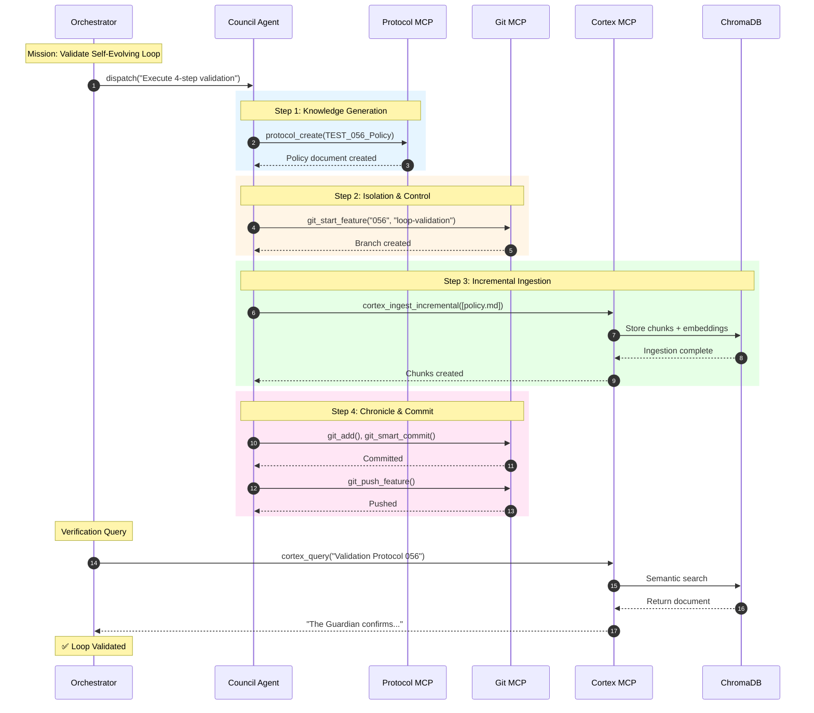

# 056: Harden Self-Evolving Loop Validation Protocol

**Status:** In Progress
**Priority:** High
**Owner:** Orchestrator / Council Agents
**Dependencies:** Full operational status of `protocol mcp`, `git mcp` (Verified ✅), and `cortex mcp` (IngestionService).
**Target Path:** TASKS/in-progress/056_Harden_Self_Evolving_Loop_Validation.md

## 🎯 Mission Objective

To validate the end-to-end integrity and resilience of the **Strategic Crucible Loop** (the Self-Evolving Memory Loop) by executing a single, atomic, four-step protocol. This test must prove that the system can autonomously generate new knowledge, ingest it, and commit it to the immutable chronicle, ensuring **near-real-time knowledge fidelity** before final MCP server deployment.

## 🛡️ The Hardened Self-Evolving Loop Protocol

**Validation Dependency:**
> [!NOTE]
> Full loop validation requires the Python Integration Suite (Task 096) to be passing first. Current status: MCP Layer timeouts tracked in T087.

The Orchestrator shall execute the following four steps sequentially within a single mission context, demonstrating a smooth transition between Council Agents and tools.

### Step 1: Knowledge Generation Protocol (`protocol mcp`)
* **Action:** The Council Agent (via `protocol mcp`) will generate a new, non-critical policy document.
* **Artifact:** Create a new file in a documentation directory (e.g., `DOCS/TEST_056_Validation_Policy.md`).
* **Content Requirement:** The content of this new `.md` file must explicitly mention a specific, unique phrase (e.g., "The Guardian confirms Validation Protocol 056 is active.")

### Step 2: Isolation and Control (`git mcp`)
* **Action:** Immediately before making changes, the Council Agent (via `git mcp`) must **create a new feature branch** for the task (e.g., `feat/harden-loop-validation`).
* **Verification:** All subsequent work will be contained within this branch, confirming adherence to the **Trunk-and-Branch Doctrine**.

### Step 3: Incremental Knowledge Ingestion (`cortex mcp`)
* **Action:** The Council Agent will signal or confirm that the `IngestionService` (via `cortex mcp`) has **detected and processed** the new `DOCS/TEST_056_Validation_Policy.md` file.
* **Verification:** A successful ingestion into the RAG database (ChromaDB) must be confirmed.

### Step 4: Chronicle and Commitment (`git mcp`)
* **Action:** The Council Agent (via `git mcp`) will perform the final actions:
    1.  Create a corresponding entry in the `00_CHRONICLE/ENTRIES/` linking to this task.
    2.  Commit all changes (new policy, chronicle entry) to the feature branch using a **Conventional Commit** message (e.g., `feat: validate self-evolving memory loop`).
    3.  Push the branch to the remote repository.

## ✅ Success Criteria

The mission is considered a success when:

1.  The `feat/harden-loop-validation` branch is successfully created, pushed, and merged/closed (if appropriate).
2.  The new file, `DOCS/TEST_056_Validation_Policy.md`, is present in the final commit.
3.  A subsequent RAG query performed by the Orchestrator *after* the commit and push can successfully retrieve the unique phrase ("The Guardian confirms Validation Protocol 056 is active.") from the RAG database, proving the **IngestionService** has closed the loop in near-real-time.

---

## 🔄 Self-Evolving Loop Diagram

---

## 📚 Related Documentation

- [MCP Infrastructure Verification Guide](../../docs/mcp/test_forge_mcp_and_RAG_mcp.md)
- [RAG Strategies - Strategic Crucible Loop](../../docs/mcp/RAG_STRATEGIES.md#7-the-strategic-crucible-loop-sequence-diagram)
- [Council vs Orchestrator](../../docs/mcp/servers/council/council_vs_orchestrator.md)