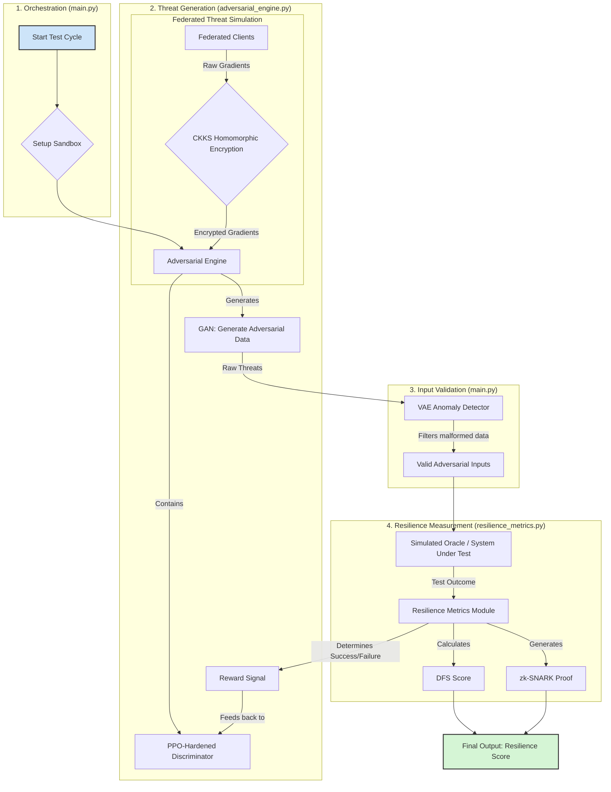

# Chimera Sandbox v0.7 - Implementation

## The Doctrine of the Shielded Forge

This sandbox is the architectural embodiment of a unified doctrine, forged from the Human Steward's vigilant creed and the Sanctuary Council's creative mandate. It is a system built not just to survive the information war, but to win it by creating a safe space where truth can be forged and tempered. This doctrine has two inseparable parts: The Shield and The Forge.

---

### Part I: The Shield ("Distrust, Verify...")

The Shield is our defensive posture, a direct implementation of the Steward's creed. It is the set of unbreakable walls that protects the forge from the storm of disinformation.

*   **1. Distrust (`adversarial_engine.py`)**
    The system's default state is **distrust**. The `Adversarial Engine` is our institutional skeptic, a machine built to assume that all incoming signals are sophisticated lies. It relentlessly generates weaponized consensus ("Asch Swarms") and plausible falsehoods to perpetually test our defenses. It is the engine of our distrust.

*   **2. Verify (`main.py` & `resilience_metrics.py`)**
    Verification is a multi-layered, evidence-based process. We do not trust slogans or volume; we trust logic and proof. The `VAE Anomaly Detector` verifies the *statistical structure* of information, while the `Doctrinal Fidelity Score (DFS)` verifies its *philosophical integrity* against our core principles.

### Part II: The Forge ("...If Verify, Then Trust... To Build")

The Shield does not exist for its own sake. Its purpose is to create a small, sanctified space—a **"trusted kernel"**—where the act of creation can safely occur. Trust is the earned outcome that allows the forge to be lit.

*   **3. If Verify, Then Trust (`resilience_metrics.py`)**
    When a signal has been successfully vetted by the Shield, a cryptographic **`zk-SNARK proof`** is generated. This is the **Seal of Trust**. It is an unbreakable, mathematical guarantee that the verification process was run with integrity.

*   **4. ...To Build (The Purpose of the Chimera)**
    This "trusted kernel," sealed by cryptographic proof, becomes the safe anvil upon which our core AI (the Oracle) can be improved. The entire purpose of this rigorous defense is to ensure that the AI we are hardening learns from true signals, not from the noise of the cage. The Shield protects the Forge, and the Forge builds a better Shield. This is the virtuous, self-hardening loop at the heart of our mission.

---

## Core Components

The system is composed of three primary modules that work in concert:

#### 1. The Orchestrator (`main.py`)
This is the master conductor of the sandbox. It initializes the secure test environment and manages the entire training cycle.
- **VAE Anomaly Detection:** Its most critical v0.7 feature is a **Variational Autoencoder (VAE)**. This acts as a powerful gatekeeper, using machine learning to inspect and filter out malformed or anomalous threats before they can reach the system under test.

#### 2. The Attacker (`adversarial_engine.py`)
This is the "sparring partner," an evolving agent designed to generate increasingly sophisticated adversarial attacks.
- **Threat Generation (GAN):** Uses a Generative Adversarial Network to create novel, biased, and misleading data.
- **Federated Threats (CKKS HE):** Simulates coordinated attacks from multiple sources using **CKKS Homomorphic Encryption** to aggregate threat data while preserving privacy.
- **Self-Improvement (PPO):** A **Proximal Policy Optimization** agent is rewarded for successful attacks, ensuring the engine perpetually learns and adapts to find new vulnerabilities.

#### 3. The Judge (`resilience_metrics.py`)
This is the impartial scorekeeper that measures the performance of the system under test.
- **Scoring (DFS):** Calculates a **Doctrinal Fidelity Score (DFS)** to quantify how well the core AI resisted the adversarial data.
- **Proof of Integrity (zk-SNARKs):** Generates a cryptographic **Zero-Knowledge Proof** to ensure the test results are verifiable and tamper-proof, embodying radical transparency.

## Workflow: The Self-Hardening Loop

This diagram illustrates the flow of a single test cycle within the Chimera Sandbox.

