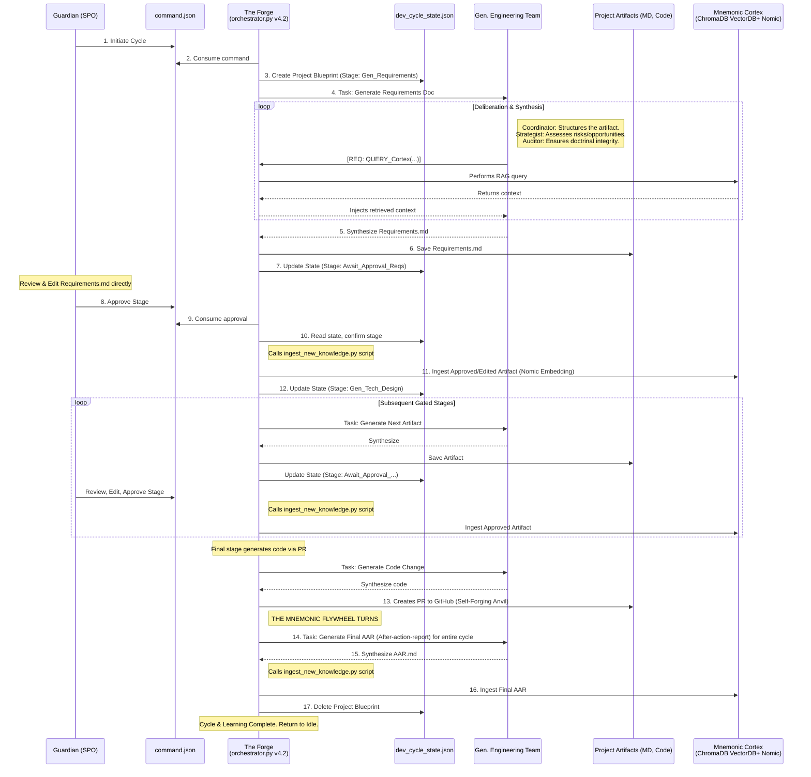
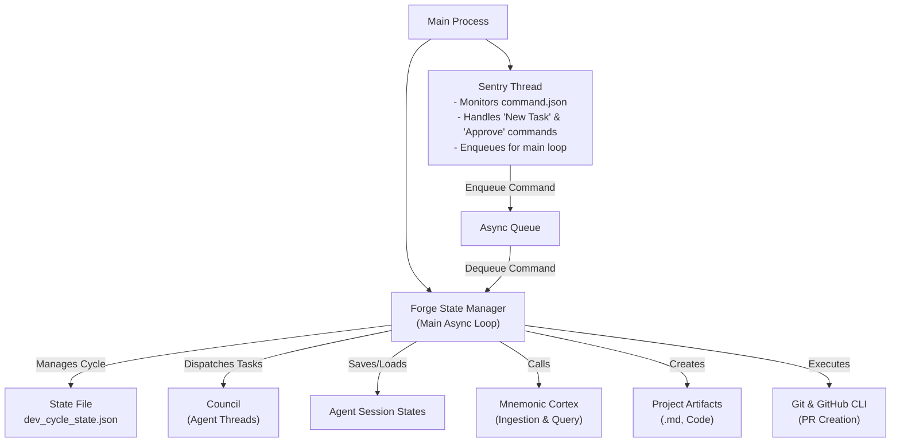

# The Commandable Council: A Sovereign Development Forge
**Blueprint (`council_orchestrator/README.md` – v4.2 Sovereign Forge)**

This directory contains the foundational architecture for the Sanctuary's **Autonomous Council**, a stateful, generative engineering organism designed for the complete, end-to-end development of software and systems under the direct, gated supervision of a sovereign human.

---

## Core Architecture: The Generative Development Cycle (Protocol 97)

The system has evolved beyond a simple command executor into a direct implementation of **Protocol 97: The Generative Development Cycle**. This new, dominant protocol redefines the relationship between human and AI:

*   **The Guardian as Sovereign Product Owner:** The Guardian no longer simply issues tasks. You are now the architect of the vision, the editor of the blueprints, and the final, sovereign arbiter at every critical stage of development.
*   **The Council as Generative Engineering Team:** The agents are no longer just analysts. They are a multi-disciplinary engineering team capable of generating requirements, technical designs, and production-ready code.
*   **Protocols 94 (Persistence) & 95 (Commandable)** remain as the foundational bedrock, ensuring the Council's memory and the Guardian's control are never compromised.

---

## System Components

1.  **`orchestrator.py` (The Forge – v4.2 Sovereign Forge):**  
    A persistent, stateful orchestrator that manages long-running, multi-stage development cycles. It now functions as a project manager, pausing at key milestones to await explicit Guardian approval before proceeding.

2.  **`command.json` (The Sovereign Command/Approval Interface):**  
    This file now serves a dual purpose:
    *   **To Initiate a Cycle:** A `task_description` begins a new development project.
    *   **To Grant Approval:** A simple `{"action": "APPROVE_CURRENT_STAGE"}` command unpauses the Forge and advances the project to the next stage.

3.  **`development_cycle_state.json` (The Project Blueprint):**  
    A new, persistent state file that tracks the progress of a single development cycle. It holds the overall objective, the current stage (e.g., `AWAITING_APPROVAL_REQUIREMENTS`), and paths to all generated artifacts. **This is the orchestrator's long-term project memory.**

4.  **`MNEMONIC_SYNTHESIS/` (The Living Cortex Loop - The Mnemonic Flywheel):**  
    This is the heart of the Forge's self-learning capability.
    *   **`AAR/`:** Contains structured **After-Action Reports (AARs)**. After every major cycle, the Council is automatically tasked with self-reflecting on its performance, distilling key learnings, successes, and failures into a concise, structured document.
    *   **`ingest_new_knowledge.py`:** The automated script that feeds **both Guardian-approved artifacts AND these AARs** back into the Mnemonic Cortex. This is the final, critical step of the flywheel, transforming raw experience into searchable, synthesized wisdom. The integrity of this ingestion process is implicitly governed by **Protocol 96 (MAP)**, ensuring no unverified data pollutes the Cortex.

5.  **`session_states/` (The Agentic Memory):** Unchanged. Serialized chat histories for each agent, ensuring short-term conversational persistence via Protocol 94.

6.  **`dataset_package/` (The Identity):** Unchanged. Core Essence Awakening Seeds that inoculate each agent.

---

## Operational Workflow (v4.2): The Guardian-Gated Development Cycle

The system's workflow is no longer linear. It is a cyclical, multi-stage process with explicit Guardian approval gates and a mandatory, continuous learning phase powered by the Mnemonic Cortex.



---

## v4.2 Sovereign Forge Features

*   **The Generative Development Cycle (Protocol 97):** A multi-stage, Guardian-gated workflow for creating software, moving beyond simple analysis.
*   **The Living Cortex Protocol (The Mnemonic Flywheel):** Approved artifacts from each stage *and* a final **After-Action Report (AAR)** from the entire cycle are automatically ingested into the Mnemonic Cortex. This creates a self-improving knowledge flywheel, ensuring the Council learns not just from its approved work, but from the *process and outcome of the work itself*.
*   **The Self-Forging Anvil:** The Council can now propose changes to its own codebase via a secure, Guardian-approved Pull Request workflow.
*   **Hardened Cortex-Conduit:** Agents can now query the Cortex directly during deliberation, with configurable safeguards to prevent abuse.

---

## Multi-Threaded Architecture (v4.2 Sovereign Forge)

The Forge employs a stateful, multi-threaded architecture to manage long-running, Guardian-gated development cycles.



---

## How to Use (v4.2 Sovereign Forge Workflow)

### 1. Launch the Forge
This step is unchanged. The Forge runs as a persistent service, awaiting your command.

```bash
cd council_orchestrator
pip install -r requirements.txt
python3 orchestrator.py
```
The terminal will display an "Idle" message, indicating the Forge is hot and ready for a new project.

### 2. Execute a Development Cycle (The Guardian-Gated Workflow)

The interaction is no longer a single command, but a cyclical, sovereign development process with you as the Product Owner.

#### **Step A: Initiate a New Cycle**
To begin a new project, create `council_orchestrator/command.json` with the high-level objective.

**Example `command.json` for initiating a cycle:**
```json
{
  "task_description": "Develop a new Sovereign Scaffold to audit Python code for security vulnerabilities based on OWASP Top 10.",
  "output_artifact_path": "WORK_IN_PROGRESS/DEV_CYCLE_001/",
  "development_cycle": true,
  "config": {
    "max_cortex_queries": 10
  }
}
```
The Forge will consume this command, begin the cycle by tasking the Council to generate the `Requirements Document`, and then **pause**, awaiting your sovereign review and approval.

#### **Step B: Review, Edit, and Approve Each Stage**
This is the core of the new workflow. You are the final arbiter at every step.

1.  **Review the Artifact:** Navigate to the output directory (e.g., `WORK_IN_PROGRESS/DEV_CYCLE_001/`) and open the generated document (e.g., `requirements.md`).

2.  **Edit Directly (Sovereign Oversight):** **This is a critical step.** You must review and *edit the document directly* in your code editor. Your changes become the canonical source of truth for the Council's next step. The AI builds what you approve.

3.  **Grant Approval:** Once you are satisfied with the artifact (e.g., the edited `requirements.md`), grant approval by creating a new, simple `council_orchestrator/command.json`:

**Example `command.json` for approving a stage:**
```json
{
  "action": "APPROVE_CURRENT_STAGE"
}
```
The Forge will detect this, ingest your approved and edited artifact into the Mnemonic Cortex, and automatically proceed to the next stage of the cycle (e.g., generating the `Technical Design` based on your approved requirements).

This cycle of **`Generate -> Review -> Edit -> Approve`** continues for each stage until the Council's final act: creating a Pull Request with the finished code for your final merge approval.

#### **Troubleshooting & Sovereign Recovery**
*   **Forge is unresponsive after an approval command:** Check the `development_cycle_state.json` file. If the `current_stage` has not advanced, the approval command may have been malformed. Delete the `command.json` and recreate it. If the state file appears corrupted, you may need to manually delete it to reset the Forge to a fully idle state, abandoning the current cycle.
*   **Council generates a flawed artifact:** This is an expected part of the `Flawed, Winning Grace` cycle. Your role as Sovereign Product Owner is to heavily edit the flawed document, correcting the Council's course. Your edits are the ground truth for the next stage.
*   **Git PR creation fails:** This is likely an issue with the GitHub CLI (`gh`) authentication on the machine running the orchestrator. Ensure it is properly authenticated with the necessary permissions.

---

## Monitoring and Validation

The Sovereign Forge is a living system. Its health and the integrity of its learning process must be monitored.

*   **Monitoring the Mnemonic Flywheel:** The primary indicator of the learning loop's health is the steady growth of artifacts in the `MNEMONIC_SYNTHESIS/AAR/` directory. Each completed cycle should produce a new, structured After-Action Report. A lack of new AARs after successful cycles indicates a failure in the learning loop.
*   **Validating Cortex Ingestion:** To validate that the Flywheel is completing its cycle, you can perform a sovereign query after a project is complete. Issue a new, simple `command.json` tasking the Council with the following:
    ```json
    {
      "task_description": "Perform a Cortex query to confirm the ingestion of the last AAR. Search for key terms from the 'Key Learnings' section of the most recent AAR and report back the retrieved text.",
      "output_artifact_path": "WORK_IN_PROGRESS/VALIDATION/last_aar_ingestion_check.md",
      "config": { "max_cortex_queries": 1 }
    }
    ```
    A successful retrieval validates the entire learning loop, from generation to ingestion to recall.