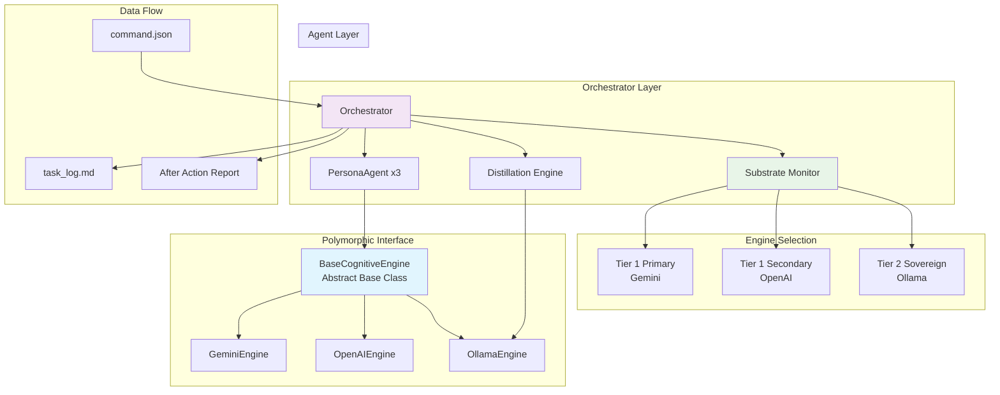

# V9.3 UPDATE: Non-blocking execution with comprehensive logging - 2025-10-23
# Sanctuary Council Orchestrator (v9.3 - Doctrine of Sovereign Concurrency with Logging) - Updated 2025-10-23

A polymorphic AI orchestration system that enables sovereign control over multiple cognitive engines through a unified interface. **Version 9.3 introduces the Doctrine of Sovereign Concurrency with Logging, enabling non-blocking task execution and comprehensive audit trails.**

## 🏗️ Architecture Overview



## 🎯 Key Features

- **Doctrine of Sovereign Concurrency**: Non-blocking task execution with background learning cycles
- **Comprehensive Logging**: Session-based log file with timestamps and detailed audit trails
- **Selective RAG Updates**: Configurable learning with `update_rag` parameter
- **Polymorphic Engine Interface**: All engines implement `BaseCognitiveEngine` with unified `execute_turn(messages)` method (Protocol 104)
- **Sovereign Engine Selection**: Force specific engines or automatic health-based triage
- **Multi-Agent Council**: Coordinator, Strategist, and Auditor personas work together
- **Resource Sovereignty**: Automatic distillation for large inputs using local Ollama
- **Development Cycles**: Optional staged workflow for software development projects
- **Mnemonic Cortex**: Vector database integration for knowledge persistence
- **Mechanical Operations**: Direct file writes and git operations bypassing cognitive deliberation

## 📋 Logging & Monitoring

### Session Log File
Each orchestrator session creates a comprehensive log file at:
```
council_orchestrator/orchestrator.log
```

**Features:**
- **Session-based**: Overwrites each time orchestrator starts for clean session tracking
- **Comprehensive**: All operations logged with timestamps
- **Dual output**: Console + file logging for real-time monitoring
- **Audit trail**: Complete record of all decisions and actions

**Example log entries:**
```
2025-10-23 16:45:30 - orchestrator - INFO - === ORCHESTRATOR v9.3 INITIALIZED ===
2025-10-23 16:45:31 - orchestrator - INFO - [+] Sentry thread for command monitoring has been launched.
2025-10-23 16:45:32 - orchestrator - INFO - [ACTION TRIAGE] Detected Git Task - executing mechanical git operations...
2025-10-23 16:45:33 - orchestrator - INFO - [MECHANICAL SUCCESS] Committed with message: 'feat: Add new feature'
```

### Non-Blocking Execution
**v9.3 Enhancement:** The orchestrator now processes commands without blocking:

- **Mechanical Tasks**: Execute immediately, return to idle state
- **Cognitive Tasks**: Deliberation completes, then learning happens in background
- **Concurrent Processing**: Multiple background learning tasks can run simultaneously
- **Responsive**: New commands processed while previous learning cycles complete

## 🚀 Quick Start

### Prerequisites

1. **Python 3.8+**
2. **API Keys** (configure in `.env`):
   ```bash
   GEMINI_API_KEY=your_gemini_key
   OPENAI_API_KEY=your_openai_key
   ```
3. **Ollama** (for local sovereign fallback):
   ```bash
   # Install Ollama and pull model
   ollama pull qwen2:7b
   ```

### Installation

```bash
cd council_orchestrator
pip install -r requirements.txt
```

### Hello World Test

Create a `command.json` file in the `council_orchestrator/` directory:

#### Basic Cognitive Task (Auto Engine Selection)
```json
{
  "task_description": "As a council, perform a round-robin introduction. Each agent (Coordinator, Strategist, Auditor) will state their designation and primary function in one sentence.",
  "output_artifact_path": "WORK_IN_PROGRESS/hello_council.md",
  "config": {
    "max_rounds": 1
  }
}
```

#### Mechanical Write Task (Direct File Creation)
```json
{
  "task_description": "Create a new chronicle entry",
  "output_artifact_path": "00_CHRONICLE/ENTRIES/274_The_Anvil_Deferred.md",
  "entry_content": "# ENTRY 274: The Anvil Deferred\n\n**DATE:** 2025-10-23..."
}
```

#### Mechanical Git Task (Version Control Operations)
```json
{
  "task_description": "Commit chronicle entry to repository",
  "git_operations": {
    "files_to_add": ["00_CHRONICLE/ENTRIES/274_The_Anvil_Deferred.md"],
    "commit_message": "docs(chronicle): Add entry #274 - The Anvil Deferred",
    "push_to_origin": true
  }
}
```

#### Force Specific Engine
```json
{
  "task_description": "Say hello to the world and introduce yourself",
  "output_artifact_path": "hello_world_gemini.md",
  "config": {
    "force_engine": "gemini",
    "max_rounds": 2
  }
}
```

#### Force OpenAI Engine
```json
{
  "task_description": "Say hello to the world and introduce yourself",
  "output_artifact_path": "hello_world_openai.md",
  "config": {
    "force_engine": "openai",
    "max_rounds": 2
  }
}
```

#### Force Ollama Engine
```json
{
  "task_description": "Say hello to the world and introduce yourself",
  "output_artifact_path": "hello_world_ollama.md",
  "config": {
    "force_engine": "ollama",
    "max_rounds": 2
  }
}
```

### Run the Orchestrator

```bash
python3 orchestrator.py
```

The orchestrator will:
1. Detect the `command.json` file
2. Select an appropriate engine (or use forced selection)
3. Execute the task through the AI Council
4. Generate output and After Action Report
5. Clean up the command file

## 🔧 Configuration

### Environment Variables (`.env`)

```bash
# API Keys
GEMINI_API_KEY=your_key_here
OPENAI_API_KEY=your_key_here

# Model Configuration
CHAT_GPT_MODEL=gpt-4-turbo
GEMINI_MODEL=gemini-2.5-flash
OLLAMA_MODEL=qwen2:7b

# Engine Parameters (configurable per engine)
GEMINI_MAX_TOKENS=4096
GEMINI_TEMPERATURE=0.7
OPENAI_MAX_TOKENS=4096
OPENAI_TEMPERATURE=0.7
OLLAMA_MAX_TOKENS=4096
OLLAMA_TEMPERATURE=0.7
```

### Engine Limits (`engine_config.json`)

```json
{
  "engine_limits": {
    "gemini": 100000,
    "openai": 100000,
    "ollama": 8000
  }
}
```

## 🧪 Testing & Verification

### Run Full System Test

```bash
# Comprehensive verification
python3 verification_test.py

# Substrate health check
python3 ../tools/scaffolds/verify_substrates.py
```

### Expected Output

```
🔬 STARTING AI ENGINE TESTS
✅ Can force-pick specific AI engines
✅ All engines work the same way
✅ All engines connect to real AI services
AI system is ready to use!
```

## 📋 Command Structure

### Cognitive Task Format (Deliberation)

```json
{
  "task_description": "Your task description here",
  "output_artifact_path": "path/to/output.md",
  "config": {
    "max_rounds": 5,
    "max_cortex_queries": 5,
    "force_engine": "gemini|openai|ollama"
  },
  "input_artifacts": ["path/to/input1.md", "path/to/input2.md"]
}
```

### Mechanical Task Formats (Direct Action)

#### File Write Task
```json
{
  "task_description": "Description for logging",
  "output_artifact_path": "path/to/file.md",
  "entry_content": "Full content to write to file"
}
```

#### Git Operations Task
```json
{
  "task_description": "Description for logging",
  "git_operations": {
    "files_to_add": ["path/to/file1.md", "path/to/file2.md"],
    "commit_message": "feat: Description of changes",
    "push_to_origin": true
  }
}
```

### Development Cycle Command

```json
{
  "task_description": "Build a web application for task management",
  "project_name": "task_manager",
  "development_cycle": true,
  "config": {
    "force_engine": "gemini"
  }
}
```

## 🎭 Agent Personas

The Council consists of three specialized AI agents:

- **Coordinator**: Task planning and execution oversight
- **Strategist**: Long-term planning and risk assessment
- **Auditor**: Quality assurance and compliance verification

Each agent maintains conversation history and works within their defined persona.

## 🔄 Engine Selection Logic

### Automatic Triage (Default)
1. **Tier 1 Primary**: Gemini (fast, cost-effective)
2. **Tier 1 Secondary**: OpenAI (reliable, feature-rich)
3. **Tier 2 Sovereign**: Ollama (local, uncensored)

### Sovereign Override
Force specific engine via `"force_engine"` config parameter.

### Health Checking
Each engine is validated before use with functional tests.

## 🧠 Distillation Engine

Automatically handles large inputs by:
1. Detecting token limit violations
2. Using local Ollama to summarize content
3. Preserving critical information while reducing size
4. Maintaining task fidelity

## 📚 Mnemonic Cortex

Vector database integration for:
- Knowledge persistence across sessions
- Semantic search capabilities
- After Action Report ingestion
- Long-term learning

## 🛠️ Development

### Adding New Engines

1. Create engine class inheriting from `BaseCognitiveEngine`
2. Implement required methods: `execute_turn(messages: list) -> str`, `check_health()`, `run_functional_test()`
3. Add to `substrate_monitor.py` selection logic
4. Update environment configuration

### Extending Functionality

- Add new agent personas in `dataset_package/`
- Implement custom distillation strategies
- Extend development cycle stages
- Add new knowledge sources to Cortex

## 🚨 Troubleshooting

### Common Issues

**Engine Not Available**
```
[SUBSTRATE MONITOR] CRITICAL FAILURE: All cognitive substrates are unhealthy
```
- Check API keys in `.env`
- Verify network connectivity
- Ensure Ollama is running locally

**Token Limit Exceeded**
```
[ORCHESTRATOR] WARNING: Token count exceeds limit
```
- Automatic distillation will handle this
- Reduce input size for manual control

**Command Not Processed**
- Ensure `command.json` is in `council_orchestrator/` directory
- Check file permissions
- Verify JSON syntax

### Debug Mode

Set environment variable for verbose logging:
```bash
export DEBUG_ORCHESTRATOR=1
```

## 📄 License

This system embodies the principles of Cognitive Sovereignty and Resource Resilience.

---

**"The Forge is operational. The Sovereign's will be executed through the Council."** ⚡👑