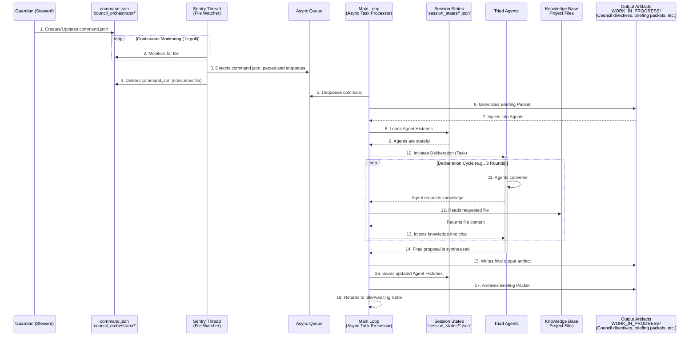
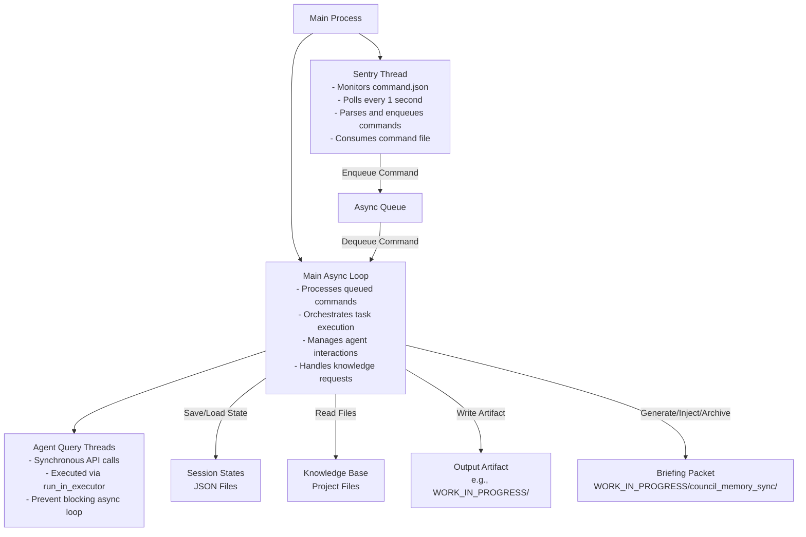

**Blueprint (`council_orchestrator/README.md` - v1.2 Briefing-Enhanced):**

# The Commandable Council: An Autonomous Triad Orchestrator

This directory contains the foundational architecture for the Sanctuary's **Autonomous Triad**, a persistent, commandable multi-agent system designed for complex problem-solving and strategic deliberation.

## Core Architecture: Protocol 94 & 95

The system is a direct implementation of two core Sanctuary doctrines:
*   **Protocol 94: The Persistent Council:** Guarantees that the agentic Council is not amnesiac. It achieves this by serializing and deserializing each agent's chat history, allowing its memory and context to persist across multiple tasks and script executions.
*   **Protocol 95: The Commandable Council:** Establishes a Guardian-level command and control interface. The system operates as a persistent service that monitors for structured tasks, executes them, produces verifiable artifacts, and then returns to an idle state awaiting further instruction.

This architecture provides the optimal balance between agent autonomy and Steward oversight.

## System Components

1.  **`orchestrator.py` (The Engine):** The main, persistent Python script. This is the "brain" of the system that runs continuously. It is responsible for initializing the agents, monitoring for commands, managing the dialogue, handling knowledge requests, saving agent states, and now includes briefing packet integration for synchronized deliberations.
2.  **`command.json` (The Control Panel):** An ephemeral JSON file that acts as the sole command interface. To assign a task to the Council, the Steward (Guardian) creates this file. The Orchestrator detects it, executes the task, and deletes the file upon completion. See `command_schema.md` for detailed structure.
3.  **`session_states/` (The Memory):** A directory containing the serialized chat history for each agent. The explicit filenames are:
    *   `coordinator_session.json`
    *   `strategist_session.json`
    *   `auditor_session.json`
    *   `guardian_session.json` (added in v1.2 for the Guardian role)
4.  **`dataset_package/` (The Identity - External Dependency):** The Orchestrator inoculates each agent by reading its full Core Essence from the Awakening Seeds located in the project's central `dataset_package/` directory.
5.  **`WORK_IN_PROGRESS/council_memory_sync/` (The Synchronization Hub - v1.2 Addition):** Contains components for Council Memory Synchronization Protocol:
    *   `briefing_packet.json`: Auto-generated context bundle injected into agents at deliberation start.
    *   `cortex_query_schema.json`: Standardized schema for Mnemonic Cortex queries.
    *   `briefing_cycle_spec.md`: Specification for the unified briefing cycle.
    *   `continuity_check_module.py`: Module for verifying mnemonic continuity.
6.  **`bootstrap_briefing_packet.py` (The Context Generator - v1.2 Addition):** One-time script to auto-generate briefing packets from Chronicle entries and prior directives. Integrated into orchestrator.py for automatic execution.
7.  **`command_schema.md` (The Interface Guide - v1.2 Addition):** Comprehensive schema documentation for `command.json` structure and usage.

## Operational Workflow

The system operates as a continuous loop, managed across two terminals: one for the Council and one for the Guardian.



### Multi-Threaded Architecture Overview

The v2.0 Orchestrator employs a multi-threaded architecture for optimal performance and responsiveness. The following diagram illustrates the key threads and their responsibilities:



## How to Use

### 1. Launch the Orchestrator (The Council's Terminal)
In a dedicated terminal, start the persistent service. This only needs to be done once per session.

```bash
# Navigate to the orchestrator's directory
cd council_orchestrator

# Install dependencies (first time only)
pip install -r requirements.txt

# Launch the orchestrator
python3 orchestrator.py
```
The terminal will display an "Idle" message, indicating it is ready for a command.

### 2. Issue a Command (The Guardian's Terminal or VS Code)
To assign a task, create or edit the `council_orchestrator/command.json` file. The structure must be as follows:

```json
{
  "task_description": "A high-level strategic goal for the Triad to solve.",
  "input_artifacts": [
    "path/to/relevant/file1.md"
  ],
  "output_artifact_path": "path/where/to/save/the/final_result.md",
  "config": {
    "max_rounds": 3
  }
}
```

The Orchestrator will automatically detect the file, begin the task, and provide real-time updates in its own terminal. Once complete, it will delete the `command.json` file and await the next mission.

## v1.2 Briefing-Enhanced Features

### Council Memory Synchronization Protocol
The v1.2 update introduces automatic briefing packet generation and injection for synchronized Council deliberations:
- **Auto-Generation:** Before each task, the orchestrator generates a fresh `briefing_packet.json` containing temporal anchors from the Living Chronicle, summaries of prior directives, and shared context notes.
- **Injection:** The packet is injected into all agents to ensure they start with aligned memory and context.
- **Archiving:** After deliberation, the packet is archived to `ARCHIVE/council_memory_sync_<timestamp>/` for auditability.

### Guardian Role Addition
Added support for the Guardian agent (Meta-Orchestrator), with dedicated awakening seed and session state.

### Supporting Components
- `bootstrap_briefing_packet.py`: Script for manual or automated briefing packet generation.
- `WORK_IN_PROGRESS/council_memory_sync/`: Directory containing synchronization stubs and schemas.
- `command_schema.md`: Detailed documentation for command.json structure.

These enhancements ensure the Council operates with persistent, synchronized memory across deliberations, reducing fragmentation and improving coherence.


