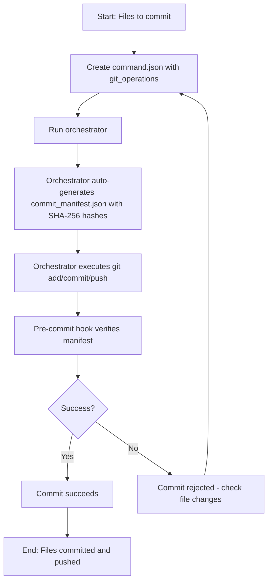

# How to Commit Using command.json (Protocol 101 Compliant)

## Goal
Commit (and push) using command.json without --no-verify, while passing the Protocol 101 pre-commit hook that requires commit_manifest.json.

## TL;DR

Create a `command.json` with `git_operations` specifying the files to commit.
The orchestrator will automatically generate `commit_manifest.json` with SHA-256 hashes, add the files, commit, and optionally push.

## Process overview diagram



## 1) Create command.json (mechanical git)

The orchestrator will automatically handle the manifest generation when processing git operations.

The pre-commit hook looks for commit_manifest.json in the repo root and verifies each file's sha256. The orchestrator automatically generates this manifest with the correct SHA-256 hashes for all files specified in `git_operations.files_to_add`.

## 2) Run the orchestrator

Execute the orchestrator to process the command.json. It will auto-generate the manifest, stage the files, commit, and push if specified.

**Important:** Mechanical tasks are supported by your v9.3 schema under git_operations (add/commit/push).

## Example: One-file commit (testfile.txt)

Save as `command_git_testfile.json` (next to orchestrator.py):

```json
{
  "task_description": "Commit testfile.txt with Protocol 101 manifest.",
  "git_operations": {
    "files_to_add": [
      "council_orchestrator/testfile.txt"
    ],
    "commit_message": "test: add testfile.txt via Protocol 101 (manifest verified)",
    "push_to_origin": true
  },
  "config": { "update_rag": false }
}
```

The orchestrator will automatically generate `commit_manifest.json` and include it in the commit.

## Example: Commit multiple files

Just include all file paths in `files_to_add`. The orchestrator will generate the manifest with hashes for all specified files.

```json
{
  "task_description": "Commit multiple files with Protocol 101 manifest.",
  "git_operations": {
    "files_to_add": [
      "council_orchestrator/testfile.txt",
      "another_file.md",
      "third_file.py"
    ],
    "commit_message": "feat: add multiple files via Protocol 101 (manifest verified)",
    "push_to_origin": true
  },
  "config": { "update_rag": false }
}
```

## how to start orchestrator
```bash
python3 -m orchestrator.main
```

## Common pitfalls

- **Wrong location:** commit_manifest.json is auto-generated in the repo root (the same directory your git commit runs from).
- **File changes after command creation:** If files change between creating command.json and running the orchestrator, the manifest hashes will mismatch and the hook will reject the commit. Recreate the command.json if needed.
- **Missing files:** Ensure all files in `files_to_add` exist and are accessible.

## Reference (v9.3 schema)

- Mechanical git tasks: use `git_operations.files_to_add`, `commit_message`, and `push_to_origin`. The orchestrator auto-generates the required manifest.