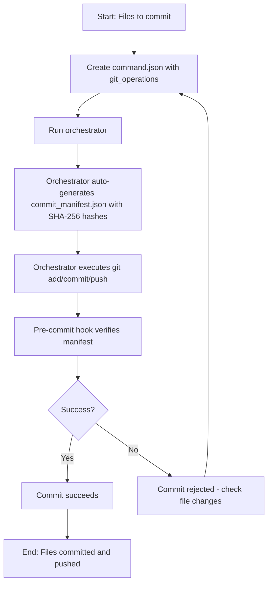

# How to Commit Using command.json (Protocol 101 Compliant)

## Goal
Commit (and push) using command.json without --no-verify, while passing the Protocol 101 pre-commit hook that requires commit_manifest.json.

## TL;DR

Create a `command.json` with `git_operations` specifying the files to commit.
The orchestrator will automatically generate `commit_manifest.json` with SHA-256 hashes, add the files, commit, and optionally push.

## Process overview diagram



## 1) Create command.json (mechanical git)

The orchestrator will automatically handle the manifest generation when processing git operations.

The pre-commit hook looks for commit_manifest.json in the repo root and verifies each file's sha256. The orchestrator automatically generates this manifest with the correct SHA-256 hashes for all files specified in `git_operations.files_to_add`.

## 2) Run the orchestrator

Execute the orchestrator to process the command.json. It will auto-generate the manifest, stage the files, commit, and push if specified.

**Important:** Mechanical tasks are supported by your v9.3 schema under git_operations (add/commit/push).

## Example: One-file commit (testfile.txt)

Save as `command_git_testfile.json` (next to orchestrator.py):

```json
{
  "task_description": "Commit testfile.txt with Protocol 101 manifest.",
  "git_operations": {
    "files_to_add": [
      "council_orchestrator/testfile.txt"
    ],
    "commit_message": "test: add testfile.txt via Protocol 101 (manifest verified)",
    "push_to_origin": true
  },
  # How to Commit Using command.json (Protocol 101 Compliant)

  ## Goal
  Commit (and push) using `command.json` processed by the orchestrator while satisfying Protocol 101 integrity checks.

  ## TL;DR

  Create a `command.json` with:
  - A top-level `task` or `task_description` (human-readable),
  - An `output_artifact_path` where the orchestrator will write the execution result, and
  - A `git_operations` object containing `files_to_add`, `commit_message`, and `push_to_origin`.

  When the orchestrator processes the command it computes SHA-256 hashes for each file listed, writes a timestamped manifest (e.g. `commit_manifest_YYYYMMDD_HHMMSS.json`) into the repo root, includes that manifest in the commit, and then runs `git add`/`git commit` (and `git push` if requested).

  ## Process overview diagram

  ```mermaid
  flowchart TD
      A[Start: Files to commit] --> B[Create command.json with git_operations]
      B --> C[Run orchestrator]
      C --> D[Orchestrator auto-generates timestamped manifest with SHA-256 hashes]
      D --> E[Orchestrator executes git add/commit/push (includes manifest)]
      E --> F[Pre-commit hook verifies manifest hashes]
      F --> G{Success?}
      G -->|Yes| H[Commit succeeds]
      G -->|No| I[Commit rejected - check file changes]
      I --> B
      H --> J[End: Files committed and pushed]
  ```

  ## 1) Create command.json (mechanical git)

  The orchestrator will automatically handle manifest generation when processing git operations. It generates a timestamped manifest file in the repo root and includes that manifest in the commit so Protocol 101's pre-commit hook can validate the uploaded hashes.

  **Key points:**
  - The manifest is generated from the files listed in `git_operations.files_to_add` at the time the orchestrator runs.
  - The manifest filename is timestamped (e.g. `commit_manifest_20251111_182812.json`) to avoid overwriting any canonical manifest and to provide an auditable artifact for each run.

  ## 2) Run the orchestrator

  Execute the orchestrator to process the `command.json`. It will:
  - compute SHA-256 hashes for each existing file in `git_operations.files_to_add`,
  - write a timestamped manifest file to the git repo root and add it to the commit list,
  - run `git add` on all files (including the manifest),
  - run `git commit` with your provided message, and
  - optionally `git push` if `push_to_origin` is true.

  **Important:** Mechanical tasks are supported by the orchestrator schema under `git_operations` (add/commit/push). The orchestrator will include the generated manifest in the same commit so the pre-commit hook can validate it.

  ## Minimal safe command JSON (dry-run)

  Include `output_artifact_path` to avoid runtime KeyError in the orchestrator and use `push_to_origin: false` for a dry run.

  ```json
  {
    "task_description": "Commit orchestrator artifacts (dry-run)",
    "git_operations": {
      "files_to_add": [
        "council_orchestrator/command_git_ops.json",
        "../capture_code_snapshot.js"
      ],
      "commit_message": "orchestrator: add snapshot and command artifacts (dry-run)",
      "push_to_origin": false
    },
    "output_artifact_path": "council_orchestrator/command_results/commit_results.json",
    "config": {}
  }
  ```

  Run the orchestrator and then inspect the generated manifest file in the repo root to verify the listed SHA-256 values match the expected files. If they do not match, do NOT push; either revert the modified file or recreate the command JSON after updating files.

  ## Common pitfalls and troubleshooting

  - Wrong location or expectation: the orchestrator writes a timestamped manifest into the git repo root (e.g. `commit_manifest_YYYYMMDD_HHMMSS.json`) and includes it in the commit. Don't expect a single static file named `commit_manifest.json`.

  - File changes after command creation: If files change between creating `command.json` and running the orchestrator, the generated manifest's hashes will mismatch and the pre-commit hook (Protocol 101) will reject the commit. Recreate the command JSON immediately before running the orchestrator and avoid editing files listed in `files_to_add` until the commit completes.

  - Missing files: Ensure all files in `files_to_add` exist and are accessible by the orchestrator process.

  - Manifest mismatch (Protocol 101 rejection): Inspect the generated manifest in the repo root and compare the SHA values for the offending path(s). If the change was intended, accept the new content by re-running an orchestrator command that includes the changed file (the newly generated manifest will reflect the new hash). If the change was accidental, revert the file to the version that matches the expected hash.

  ## Best practices

  - Use `push_to_origin: false` for the first run to validate add+commit locally and to inspect the generated manifest before pushing.
  - Include `output_artifact_path` in your command so the orchestrator can write a result artifact and avoid unhandled exceptions.
  - Minimize time between command creation and execution to reduce race windows.
  - Consider adding a `force_accept_manifest` flag to commands when you intentionally want the orchestrator to accept and publish a changed file; use this sparingly and document its usage.

  ## Reference (schema)

  - Mechanical git tasks: use `git_operations.files_to_add`, `commit_message`, and `push_to_origin`. The orchestrator auto-generates the required manifest and includes it in the commit.
