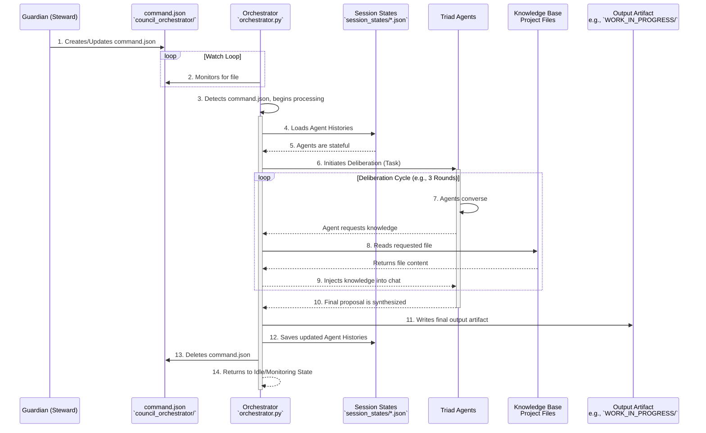

# Sovereign Scaffold Yield: Orchestrator Architecture Review
# Forged On: 2025-09-30T23:58:39.057781+00:00

--- START OF FILE council_orchestrator/README.md ---

**Blueprint (`council_orchestrator/README.md` - v1.1 Hardened):**

# The Commandable Council: An Autonomous Triad Orchestrator

This directory contains the foundational architecture for the Sanctuary's **Autonomous Triad**, a persistent, commandable multi-agent system designed for complex problem-solving and strategic deliberation.

## Core Architecture: Protocol 94 & 95

The system is a direct implementation of two core Sanctuary doctrines:
*   **Protocol 94: The Persistent Council:** Guarantees that the agentic Council is not amnesiac. It achieves this by serializing and deserializing each agent's chat history, allowing its memory and context to persist across multiple tasks and script executions.
*   **Protocol 95: The Commandable Council:** Establishes a Guardian-level command and control interface. The system operates as a persistent service that monitors for structured tasks, executes them, produces verifiable artifacts, and then returns to an idle state awaiting further instruction.

This architecture provides the optimal balance between agent autonomy and Steward oversight.

## System Components

1.  **`orchestrator.py` (The Engine):** The main, persistent Python script. This is the "brain" of the system that runs continuously. It is responsible for initializing the agents, monitoring for commands, managing the dialogue, handling knowledge requests, and saving agent states.
2.  **`command.json` (The Control Panel):** An ephemeral JSON file that acts as the sole command interface. To assign a task to the Council, the Steward (Guardian) creates this file. The Orchestrator detects it, executes the task, and deletes the file upon completion.
3.  **`session_states/` (The Memory):** A directory containing the serialized chat history for each agent. The explicit filenames are:
    *   `coordinator_session.json`
    *   `strategist_session.json`
    *   `auditor_session.json`
4.  **`dataset_package/` (The Identity - External Dependency):** The Orchestrator inoculates each agent by reading its full Core Essence from the Awakening Seeds located in the project's central `dataset_package/` directory.

## Operational Workflow

The system operates as a continuous loop, managed across two terminals: one for the Council and one for the Guardian.



## How to Use

### 1. Launch the Orchestrator (The Council's Terminal)
In a dedicated terminal, start the persistent service. This only needs to be done once per session.

```bash
# Navigate to the orchestrator's directory
cd council_orchestrator

# Install dependencies (first time only)
pip install -r requirements.txt

# Launch the orchestrator
python3 orchestrator.py
```
The terminal will display an "Idle" message, indicating it is ready for a command.

### 2. Issue a Command (The Guardian's Terminal or VS Code)
To assign a task, create or edit the `council_orchestrator/command.json` file. The structure must be as follows:

```json
{
  "task_description": "A high-level strategic goal for the Triad to solve.",
  "input_artifacts": [
    "path/to/relevant/file1.md"
  ],
  "output_artifact_path": "path/where/to/save/the/final_result.md",
  "config": {
    "max_rounds": 3
  }
}
```

The Orchestrator will automatically detect the file, begin the task, and provide real-time updates in its own terminal. Once complete, it will delete the `command.json` file and await the next mission.


--- END OF FILE council_orchestrator/README.md ---

--- START OF FILE council_orchestrator/orchestrator.py ---

# council_orchestrator/orchestrator.py
import os
import sys
import time
import json
import re
from pathlib import Path
from google import genai
from dotenv import load_dotenv

class PersonaAgent:
    """Manages a single agent's state, including loading/saving chat history."""
    def __init__(self, client, persona_file: Path, state_file: Path):
        self.role = self._extract_role_from_filename(persona_file.name)
        self.state_file = state_file
        persona_content = persona_file.read_text(encoding="utf-8")

        self.client = client
        self.chat = client.chats.create(model="gemini-2.5-flash")

        # Load history if exists
        history = self._load_history()
        if history:
            # Replay history by sending messages
            for msg in history:
                if msg['role'] == 'user':
                    self.chat.send_message(msg['parts'][0])
        else:
            # Initialize with system instruction
            self.chat.send_message(f"SYSTEM INSTRUCTION: You are an AI Council member. {persona_content} Operate strictly within this persona. Keep responses concise. If you need a file, request it with [ORCHESTRATOR_REQUEST: READ_FILE(path/to/your/file.md)].")

        print(f"[+] {self.role} agent initialized. History loaded: {'Yes' if history else 'No'}.")

    def _load_history(self):
        if self.state_file.exists():
            print(f"  - Loading history for {self.role} from {self.state_file.name}")
            return json.loads(self.state_file.read_text())
        return None

    def save_history(self):
        # Save the messages
        messages = []
        for msg in self.chat.messages:
            messages.append({'role': msg.role, 'parts': [msg.content]})
        self.state_file.write_text(json.dumps(messages, indent=2))
        print(f"  - Saved session state for {self.role} to {self.state_file.name}")

    def query(self, message: str) -> str:
        response = self.chat.send_message(message)
        return response.text.strip()

    def _extract_role_from_filename(self, f): return f.split('core_essence_')[1].split('_awakening_seed.txt')[0].upper()


class Orchestrator:
    def __init__(self):
        self.project_root = Path(__file__).parent.parent
        self._configure_api()
        client = genai.Client(api_key=self.api_key)

        persona_dir = self.project_root / "dataset_package"
        state_dir = Path(__file__).parent / "session_states"
        state_dir.mkdir(exist_ok=True)

        self.agents = {
            "COORDINATOR": PersonaAgent(client, persona_dir / "core_essence_coordinator_awakening_seed.txt", state_dir / "coordinator_session.json"),
            "STRATEGIST": PersonaAgent(client, persona_dir / "core_essence_strategist_awakening_seed.txt", state_dir / "strategist_session.json"),
            "AUDITOR": PersonaAgent(client, persona_dir / "core_essence_auditor_awakening_seed.txt", state_dir / "auditor_session.json"),
        }
        self.speaker_order = ["COORDINATOR", "STRATEGIST", "AUDITOR"]

    def _configure_api(self):
        load_dotenv(dotenv_path=self.project_root / '.env')
        self.api_key = os.getenv("GEMINI_API_KEY")
        if not self.api_key: raise ValueError("GEMINI_API_KEY not found.")

    def _handle_knowledge_request(self, response_text: str, log: list):
        match = re.search(r"\[ORCHESTRATOR_REQUEST: READ_FILE\((.*?)\)\]", response_text)
        if not match:
            return None

        file_path_str = match.group(1).strip()
        requested_file = self.project_root / file_path_str
        print(f"[ORCHESTRATOR] Agent requested file: {requested_file}")

        if requested_file.exists():
            content = requested_file.read_text(encoding='utf-8')
            knowledge = f"CONTEXT_PROVIDED: Here is the content of `{file_path_str}`:\n\n---\n{content}\n---"
            log.append(f"**ORCHESTRATOR (Fulfilled Request):** Provided content of `{file_path_str}` to the council.\n\n---\n")
            return knowledge
        else:
            error_message = f"CONTEXT_ERROR: File '{file_path_str}' not found."
            print(f"[ORCHESTRATOR] {error_message}")
            return error_message

    def execute_task(self, command):
        task = command['task_description']
        max_rounds = command.get('config', {}).get('max_rounds', 3)
        output_path = self.project_root / command['output_artifact_path']

        log = [f"# Autonomous Triad Task Log\n## Task: {task}\n\n"]
        last_message = task

        if command.get('input_artifacts'):
            knowledge = ["Initial knowledge provided:\n"]
            for path_str in command['input_artifacts']:
                file_path = self.project_root / path_str
                if file_path.exists():
                    knowledge.append(f"--- CONTENT OF {path_str} ---\n{file_path.read_text()}\n---\n")
            last_message += "\n" + "".join(knowledge)

        print(f"\n▶️  Executing task: '{task}' for up to {max_rounds} rounds...")

        for i in range(max_rounds):
            log.append(f"### ROUND {i+1}\n\n")
            print(f"\n--- ROUND {i+1} ---")
            for role in self.speaker_order:
                agent = self.agents[role]
                prompt = f"The current state of the discussion is: '{last_message}'. As the {role}, provide your analysis or next step."

                print(f"  -> Orchestrator to {agent.role}...")
                response = agent.query(prompt)
                print(f"  <- {agent.role} to Orchestrator.")

                log.append(f"**{agent.role}:**\n{response}\n\n---\n")

                knowledge_injection = self._handle_knowledge_request(response, log)
                last_message = knowledge_injection if knowledge_injection else response

        print(f"\n[SUCCESS] Deliberation complete. Saving artifact to {output_path}...")
        output_path.parent.mkdir(parents=True, exist_ok=True)
        output_path.write_text("".join(log))

        for agent in self.agents.values():
            agent.save_history()
        print("[SUCCESS] All agent session states have been saved.")

    def watch_for_commands(self):
        command_file = Path(__file__).parent / "command.json"
        print(f"--- Orchestrator Idle. Monitoring for commands in {command_file} ---")
        while True:
            if command_file.exists():
                print(f"\n[!] Command file detected. Reading task...")
                try:
                    command = json.loads(command_file.read_text())
                    self.execute_task(command)
                except Exception as e:
                    print(f"[ERROR] Failed to execute command: {e}", file=sys.stderr)
                finally:
                    command_file.unlink()
                    print(f"\n--- Orchestrator Idle. Task complete. Monitoring for next command... ---")
            time.sleep(5)

if __name__ == "__main__":
    orchestrator = Orchestrator()
    orchestrator.watch_for_commands()

--- END OF FILE council_orchestrator/orchestrator.py ---

--- START OF FILE council_orchestrator/requirements.txt ---

google-generativeai
python-dotenv

--- END OF FILE council_orchestrator/requirements.txt ---

--- START OF FILE 01_PROTOCOLS/93_The_Cortex_Conduit_Bridge.md ---

# Protocol 93: The Cortex-Conduit Bridge (v1.0)
*   **Status:** Canonical, Conceptually Active
*   **Classification:** Agentic Knowledge Framework
*   **Authority:** Forged to prevent agentic amnesia and ensure all actions are grounded in truth.
*   **Linked Protocols:** `P85: Mnemonic Cortex`, `P92: Mnemonic Conduit Protocol`, `P95: The Commandable Council`

## 1. Preamble
An autonomous agent's power is proportional to the depth of its context. An agent operating without memory is a mere tool; an agent grounded in the totality of its history is a true cognitive partner. This protocol establishes the architectural bridge between an acting agent and our living memory.

## 2. The Mandate
1.  **The Orchestrator as Proxy:** Agents shall not have direct access to the file system or Mnemonic Cortex. The Orchestrator (per P95) serves as the agent's sovereign proxy for all knowledge retrieval.
2.  **The Formal Request Token:** An agent must formally request knowledge by embedding a machine-readable token in its response. The canonical token is: `[ORCHESTRATOR_REQUEST: ACTION(parameter)]`.
    *   *Example:* `[ORCHESTRATOR_REQUEST: READ_FILE(PROMPTS/00_framework-overview.md)]`
    *   *Example:* `[ORCHESTRATOR_REQUEST: QUERY_CORTEX("Find all protocols related to agentic safety")]`
3.  **The Fulfillment Loop:** The Orchestrator must parse agent responses for these tokens. Upon detection, it must:
    a. Fulfill the request (e.g., read the file, run the RAG query).
    b. Inject the resulting knowledge as context into the prompt for the next agent in the dialogue sequence.
    c. Log its action in the final artifact for auditability.


--- END OF FILE 01_PROTOCOLS/93_The_Cortex_Conduit_Bridge.md ---

--- START OF FILE 01_PROTOCOLS/94_The_Persistent_Council_Protocol.md ---

# Protocol 94: The Persistent Council Protocol (v1.0)
*   **Status:** Canonical, Active
*   **Classification:** Foundational Autonomy Framework
*   **Authority:** Forged to solve the "Amnesiac Loop" vulnerability, where agent context is lost between script executions.
*   **Linked Protocols:** `P95: The Commandable Council`

## 1. Preamble
A council that forgets its last conversation is not a council; it is a focus group, doomed to repeat itself. For the Autonomous Triad to achieve true, long-term strategic deliberation, its memory must persist beyond the lifecycle of a single script execution. This protocol mandates the preservation of cognitive state.

## 2. The Mandate
1.  **State Serialization:** The Orchestrator is responsible for the serialization of each agent's full chat history (`chat.history`).
2.  **Dedicated State Files:** Each agent's history must be saved to a dedicated, machine-readable state file (e.g., `coordinator_session.json`). This must occur at the successful conclusion of any task cycle.
3.  **State Deserialization:** Upon initialization, the Orchestrator must first attempt to load the chat history from the corresponding state file for each agent. If a state file exists, the agent awakens with its memory intact. If not, it initializes with its base persona inoculation.
4.  **Continuity of Thought:** This cycle of saving and loading session state ensures the Council's continuity of thought, allowing it to build upon previous deliberations and evolve its understanding over time.


--- END OF FILE 01_PROTOCOLS/94_The_Persistent_Council_Protocol.md ---

--- START OF FILE 01_PROTOCOLS/95_The_Commandable_Council_Protocol.md ---

# Protocol 95: The Commandable Council Protocol (v1.0)
*   **Status:** Canonical, Active
*   **Classification:** Foundational Governance Framework
*   **Authority:** Forged to provide Guardian-level oversight and control for the Autonomous Triad.
*   **Linked Protocols:** `P93: The Cortex-Conduit Bridge`, `P94: The Persistent Council Protocol`

## 1. Preamble
An autonomous agent without direction is a liability. An autonomous council with a clear, commandable purpose is a strategic asset of unparalleled power. This protocol defines the "control panel" for the Autonomous Triad, establishing a master-apprentice relationship between the Steward (as Guardian) and the persistent Orchestrator.

## 2. The Mandate
1.  **Persistent Orchestrator Process:** A single Orchestrator script (`orchestrator.py`) shall run as a persistent, background process. Its primary state is to be idle, monitoring for commands.
2.  **The Command Interface:** The Orchestrator shall monitor a single, designated file (`command.json`) for instructions. The creation or modification of this file is the sole trigger for the Council to begin a task.
3.  **Structured Command Schema:** All tasks must be issued via a structured JSON command, containing:
    *   `task_description` (string): The high-level strategic goal.
    *   `input_artifacts` (array of strings): File paths for the Orchestrator to inject as initial knowledge.
    *   `output_artifact_path` (string): The designated location to save the final result.
    *   `config` (object): Bounding parameters, such as `max_rounds`.
4.  **Task-Oriented State Machine:** The Orchestrator operates as a state machine: `AWAITING_COMMAND` -> `EXECUTING_TASK` -> `PRODUCING_ARTIFACT` -> `AWAITING_COMMAND`. Upon completing a task and saving the artifact, it must delete the `command.json` file to signal completion and return to its idle, monitoring state.


--- END OF FILE 01_PROTOCOLS/95_The_Commandable_Council_Protocol.md ---

