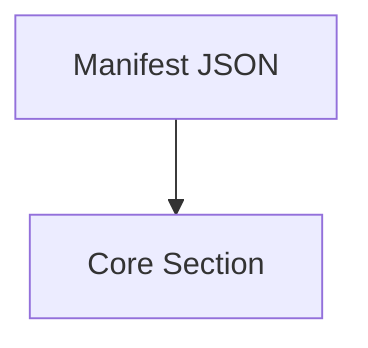
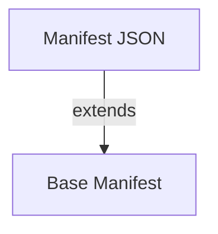

# Design Proposal: Bundling Architecture & Protocol 130 Alignment

## 1. Context & Problem Statement
The project currently has two parallel bundling capabilities:
1.  **Agent Plugin Integration Layer (`rag_cortex/operations.py`)**: Implements Protocol 130 (Manifest Deduplication) and handles "Special Bundles" (Learning Audits, Red Team).
2.  **CLI Layer (`plugins/context-bundler/scripts/bundle.py`)**: A newly imported "dumb" tool that simply zips files into Markdown based on a manifest.

**The Problem**:
- Logic duplication: Protocol 130 checks exist in Agent Plugin Integration but not in the CLI tool.
- Workflow Disconnect: Higher-order workflows (Protocol 128 Learning Loop) need the sophistication of the Agent Plugin Integration logic but often run via CLI/Bash shims.
- Special Manifests: Many "smart" manifests (`learning_audit`, `guardian`) rely on dynamic logic not present in `bundle.py`.

## 2. Options Analysis

### Option A: The "Shared Core" (Refactor)
Extract the bundling and deduplication logic into a shared Python library accessible by both the Agent Plugin Integration and the CLI tools.

*   **Structure**:
    *   `tools/shared/bundler_core.py`: Contains `dedupe_manifest()` (Protocol 130) and `build_bundle()`.
    *   `mcp_servers/rag_cortex/operations.py`: Imports `bundler_core`.
    *   `plugins/context-bundler/scripts/bundle.py`: Imports `bundler_core`.
*   **Pros**: DRY (Don't Repeat Yourself), single source of truth for Protocol 130.
*   **Cons**: Requires refactoring the stable Agent Plugin Integration code.

### Option B: The "Pipeline" Approach (Atomic Tools)
Keep `bundle.py` "dumb" (Atomic) and strictly focused on execution (`JSON -> Markdown`). Move the "intelligence" (Deduplication, Registry Lookup) to a separate preparation tool.

*   **Workflow**:
    1.  `manifest_compiler.py`: Reads `learning_audit_manifest.json`, applies Protocol 130 (Project Registry lookup), resolves paths, outputs `temp/compiled_manifest.json`.
    2.  `bundle.py`: Takes `temp/compiled_manifest.json` -> `output.md`.
*   **Pros**: Follows "Unix Philosophy" (do one thing well). Easier to test.
*   **Cons**: Multiple steps for the user/agent.

### Option C: The CLI is the Gateway
Deprecate the internal bundling logic in Agent Plugin Integration and make the Agent Plugin Integration shell out to the `bundle.py` CLI tool.
*   **Pros**: Extreme centralization.
*   **Cons**: The Agent Plugin Integration often needs in-memory access to data, shelling out is slow and fragile.

### Option D: Base Manifest Inheritance (Composition)
Leverage the existing `base-manifests` pattern to handle "Core" content. Instead of repeating `core` file lists in every manifest, manifests define an `extends` property pointing to a registered base manifest.
*   **Structure**:
    ```json
    {
      "extends": "learning-core",
      "files": ["topics/specific_topic.md"]
    }
    ```
*   **Resolution**: The bundler looks up "learning-core" in `base-manifests-index.json`, loads that manifest, and merges its files with the specific manifest's files.
*   **Pros**: strict DRY compliance. Updates to "Core" (e.g. new protocols) strictly propagate to all dependent bundles. Align with user's existing `context-bundler` architecture.
*   **Cons**: Requires resolving logic in `bundle.py`.

## 3. Recommendation: Hybrid "Shared Core" with Inheritance (Option A + D)
We should extract the logic from `rag_cortex/operations.py` into a shared module AND implement the Inheritance model.

### Proposed Architecture vs Current Model

**1. Current Model (Explicit Composite)**
*The "Core" list is hardcoded in every manifest, leading to duplication.*
![[bundling-architecture-current.png|Current Architecture]]



**2. Proposed Model (Base Inheritance)**
*Manifests extend a shared Base Manifest. "Core" becomes a reusable Base.*
![[bundling-architecture-proposed.png|Proposed Architecture]]



## 4. Schema Harmonization (Polymorphic Manifests)
To support both simple use cases and complex recursive loops, the bundler supports a **Polymorphic Schema**:

### Type A: Atomic Manifest (Legacy/Simple)
Best for one-off tasks or simple tool exports.
```json
{
  "title": "Simple Bundle",
  "files": [
    { "path": "README.md", "note": "Main" },
    "src/utils.py"
  ]
}
```

### Type B: Composite Manifest (Protocol 128)
Best for Learning Loops where context is layered.
```json
{
  "title": "Learning Loop 1.0",
  "core": ["plugins/guardian-onboarding/resources/protocols/128_Hardened_Learning_Loop.md"],
  "topic": ["ADRs/New_Idea.md"],
  "context": ["src/related_code.py"]
}
```

### Type C: Inherited Manifest (Recommended)
Best for maintainability. "Core" is managed centrally in `base-manifests/`.
```json
{
  "title": "Learning Loop 1.0",
  "extends": "protocol-128-core", 
  "topic": ["ADRs/New_Idea.md"]
}
```
*Note: `extends` looks up `protocol-128-core` in `base-manifests-index.json`.*

### Logical Flow Strategy
1.  **Generic Bundles**: 
    *   Use `base-generic-file-manifest.json` (atomic list).
    *   No specialized core required.
    *   User explicitly adds files via CLI.
2.  **Specialized Bundles (Protocol 128)**:
    *   Use Registered Base Manifests (e.g., `learning-audit`, `red-team`).
    *   These Map to specific `base-manifests/*.json` via existing registry.
    *   Support dynamic recursive updates to `topic` section.

**Implementation**:
- `bundle.py` resolves `extends` recursively.
- `manifest_manager.py` manages the index.
- Flattening logic: Base Files + Local Core + Local Topic + Local Files.

## 4. Handling Recursive Context (Protocol 128)
Protocol 128 defines a "Red Team Audit Loop" where context evolves iteratively (Research -> Feedback -> More Research).

### The Mechanism
1.  **Stable Foundation (`extends`)**: The "Scout" phase establishes the Truth Anchor (Primer, Identity). This is invariant and defined in the Base Manifest (`learning-core`).
2.  **Evolving Delta (`topic`)**: As the agent iterates through the Red Team loop, it creates new artifacts (`analysis.md`, `findings.md`).
3.  **Recursion Agent**: The `manifest_manager.py` tool updates the `topic` list in the local manifest to include these new files.
4.  **Snapshot**: The `bundle.py` tool renders the *current state*, merging the Stable Base with the Evolving Delta.

### Workflow Example
**Iteration 1 (Initial Audit):**
*   `extends`: "learning-core" (Primer, Protocols)
*   `topic`: [] (Empty)
*   **Bundle**: Core + 0 Topic Files

**Iteration 2 (Feedback Received):**
*   *Agent runs:* `manifest_manager.py add --path "analysis.md" --section topic`
*   `extends`: "learning-core"
*   `topic`: ["analysis.md"]
*   **Bundle**: Core + 1 Topic File

This separation ensures the Agent focuses *only* on the delta (topic), while the system guarantees the baseline integrity.

## 5. Workflow Composition Strategy
High-level workflows (like Protocol 128) should compose atomic workflows.


### Example: Recursive Learning Loop
1.  **Scout Phase**: Calls `workflow-scout` (Atomic).
2.  **Audit Phase**:
    *   Calls `compile_manifest` (Smart Tool) to generate deduplicated JSON.
    *   Calls `workflow-bundle` (Atomic) to generate the Snapshot.
3.  **Persist Phase**: Calls `workflow-persist`.

### Policy Update
- **Atomic Workflows**: Single task, low logic (e.g., `workflow-bundle`).
- **Composite Workflows**: Orchestrate multiple atomic workflows (e.g., `workflow-learning-loop`).
- **Data Flow**: Pass state via Files (Manifests/Artifact), not Environment Variables.

## 5. Implementation Plan (Next Steps)
1.  Create `tools/shared/bundler/` package.
2.  Migrate `_dedupe_manifest` and `_load_manifest_registry` from `operations.py` to `tools/shared/bundler/dedupe.py`.
3.  Update `rag_cortex/operations.py` to import from the new location.
4.  Update `bundle.py` to use the new location and support a `--dedupe` flag.
