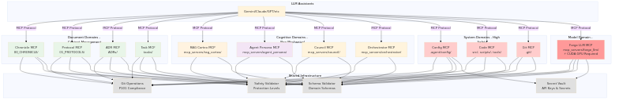
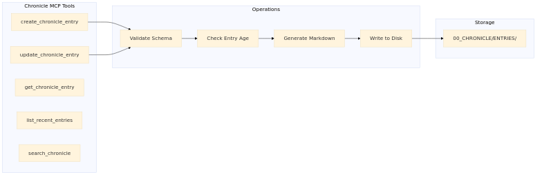
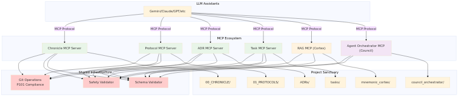
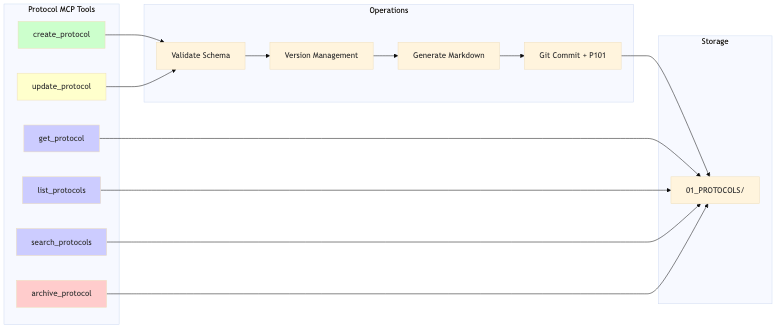
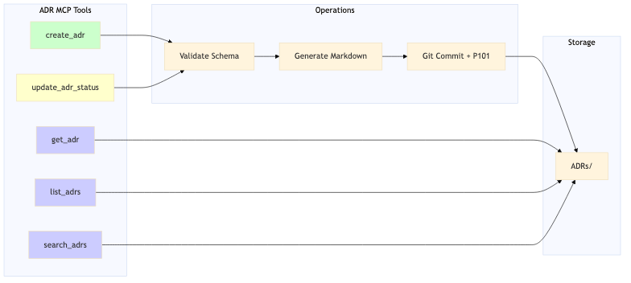
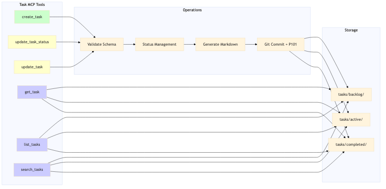
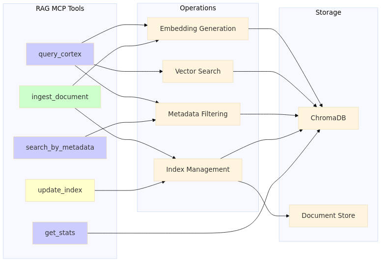
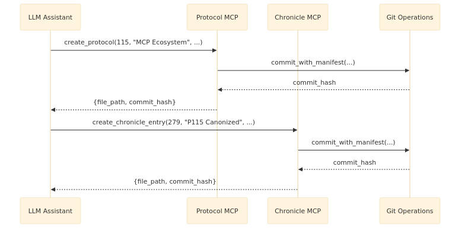
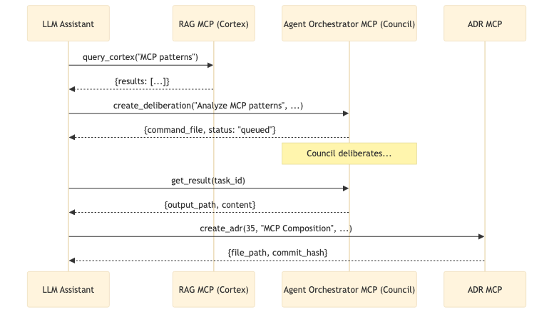

# Project Sanctuary MCP Ecosystem Architecture

**Version:** 3.0 (Complete)  
**Status:** Architecture Complete - Ready for Implementation  
**Last Updated:** 2025-11-25  
**Purpose:** Define the domain-driven MCP server architecture for Project Sanctuary

---

## Overview

This document defines the **Model Context Protocol (MCP) ecosystem** for Project Sanctuary, replacing manual `command.json` workflows with domain-specific MCP servers that provide LLM assistants with safe, structured tools.

**Key Principle:** **Domain-Driven Design** - Each MCP server owns a specific domain with clear boundaries, schemas, and safety rules.

---

## Ecosystem Overview

### 2.1 Physical Deployment A: Legacy Virtual Environment Deployment
This deployment mode runs each MCP server as a separate process within a local `.venv`, mapped 1:1 with the logical domains.



*[Source: mcp_ecosystem_architecture_v3.mmd](../../architecture_diagrams/system/mcp_ecosystem_architecture_v3.mmd)*

### 2.2 Physical Deployment B: IBM Gateway Fleet Architecture
The **Hybrid Fleet Strategy** consolidates the 12 domains into **8 containerized services** accessed via a single **IBM ContextForge Gateway**.

- **Reference:** [`IBM/mcp-context-forge`](https://github.com/IBM/mcp-context-forge)
- **Mechanism:** The Gateway acts as a broker, routing client requests to the appropriate backend container via SSE transport.


*[Source: mcp_gateway_fleet.mmd](../../architecture_diagrams/system/mcp_gateway_fleet.mmd)*

---

## Domain Specifications

### 1. Chronicle MCP Server

**Domain:** Historical truth and canonical records  
**Directory:** `00_CHRONICLE/ENTRIES/`  
**Purpose:** Create and manage chronicle entries (file operations only)



*[Source: chronicle_mcp_server.mmd](../../architecture_diagrams/system/legacy_mcps/chronicle_mcp_server.mmd)*

**Tool Signatures:**

```typescript
create_chronicle_entry(
  entry_number: number,
  title: string,
  date: string,
  author: string,
  content: string,
  status?: "draft" | "published",
  classification?: "public" | "internal" | "confidential"
): FileOperationResult {
  file_path: string,
  content: string,
  operation: "created"
}

update_chronicle_entry(
  entry_number: number,
  updates: Partial<ChronicleEntry>,
  reason: string,
  override_approval_id?: string
): FileOperationResult {
  file_path: string,
  content: string,
  operation: "updated"
}
```

**Safety Rules:**
- Entry numbers are auto-generated and sequential
- Cannot modify entries >7 days old without approval override
- Must follow chronicle entry template
- **No Git operations** - returns file path for Git Workflow MCP to commit
- Cannot delete entries (mark as deprecated only)

**Workflow Pattern:**
```typescript
// Step 1: Create entry (Chronicle MCP)
const result = chronicle.create_chronicle_entry(...)
// Returns: { file_path: "00_CHRONICLE/ENTRIES/280_mcp_architecture.md" }

// Step 2: Commit (Git Workflow MCP)
git_workflow.commit_files([result.file_path], "chronicle: add entry #280")
```

**Domain:** Living Chronicle entry management  
**Directory:** `00_CHRONICLE/ENTRIES/`  
**Purpose:** Create, read, update chronicle entries with automatic git commits



*[Source: chronicle_ecosystem_context.mmd](../../architecture_diagrams/system/chronicle_ecosystem_context.mmd)*

**Tool Signatures:**

```typescript
// Create new chronicle entry
create_chronicle_entry(
  entry_number: number,      // Required, unique
  title: string,             // Required
  date: string,              // Required, ISO format
  author: string,            // Required (e.g., "GUARDIAN-02")
  content: string,           // Required, markdown
  status?: string,           // Optional (e.g., "CANONICAL", "DRAFT")
  classification?: string    // Optional (e.g., "STRATEGIC")
) => {
  file_path: string,
  commit_hash: string,
  manifest_path: string
}

// Update existing entry
update_chronicle_entry(
  entry_number: number,
  updates: {
    title?: string,
    content?: string,
    status?: string
  },
  reason: string            // Required justification
) => {
  file_path: string,
  commit_hash: string
}

// Read operations
get_chronicle_entry(entry_number: number) => ChronicleEntry
list_recent_entries(limit?: number) => ChronicleEntry[]
search_chronicle(query: string) => ChronicleEntry[]
```

**Safety Rules:**
- Entry numbers must be sequential
- Cannot modify entries older than 7 days without explicit approval
- Must follow chronicle markdown format
- Auto-generates git commit with P101 manifest

---

### 2. Protocol MCP Server

**Domain:** Protocol creation and management  
**Directory:** `01_PROTOCOLS/`  
**Purpose:** Create, read, update protocols with versioning and changelog



*[Source: protocol_mcp_server.mmd](../../architecture_diagrams/system/legacy_mcps/protocol_mcp_server.mmd)*

**Tool Signatures:**

```typescript
// Create new protocol
create_protocol(
  number: number,                  // Required, unique
  title: string,                   // Required
  classification: string,          // Required (e.g., "Foundational")
  content: string,                 // Required, markdown
  status?: string,                 // Optional (default: "Draft")
  version?: string,                // Optional (default: "v1.0")
  linked_protocols?: number[]      // Optional
) => {
  file_path: string,
  commit_hash: string,
  manifest_path: string
}

// Update protocol (requires version bump for canonical)
update_protocol(
  number: number,
  updates: {
    content?: string,
    status?: string,
    version?: string
  },
  changelog: string               // Required
) => {
  file_path: string,
  new_version: string,
  commit_hash: string
}

// Read operations
get_protocol(number: number) => Protocol
list_protocols(classification?: string, status?: string) => Protocol[]
search_protocols(query: string) => Protocol[]

// Archive (never delete)
archive_protocol(number: number, reason: string) => {
  archived_path: string,
  commit_hash: string
}
```

**Safety Rules:**
- Protocol numbers must be unique
- Cannot delete protocols (archive only)
- Updates to canonical protocols require version bump
- Must include changelog for updates
- Protected protocols require explicit approval

---

### 3. ADR MCP Server

**Domain:** Architecture Decision Records  
**Directory:** `ADRs/`  
**Purpose:** Document architectural decisions with status tracking



*[Source: adr_mcp_server.mmd](../../architecture_diagrams/system/legacy_mcps/adr_mcp_server.mmd)*

**Tool Signatures:**

```typescript
// Create ADR
create_adr(
  number: number,              // Required, unique
  title: string,               // Required
  context: string,             // Required
  decision: string,            // Required
  consequences: string,        // Required
  date?: string,               // Optional (default: today)
  status?: string,             // Optional (default: "Proposed")
  supersedes?: number[]        // Optional
) => {
  file_path: string,
  commit_hash: string,
  manifest_path: string
}

// Update ADR status
update_adr_status(
  number: number,
  new_status: string,          // "Accepted", "Superseded", "Deprecated"
  reason: string
) => {
  file_path: string,
  commit_hash: string
}

// Read operations
get_adr(number: number) => ADR
list_adrs(status?: string) => ADR[]
search_adrs(query: string) => ADR[]
```

**Safety Rules:**
- ADR numbers must be sequential
- Cannot delete ADRs (mark as superseded)
- Must follow ADR template format
- Status transitions must be valid

---

### 4. Task MCP Server

**Domain:** Task management  
**Directory:** `tasks/`  
**Purpose:** Create, update, track tasks across backlog/active/completed



*[Source: task_mcp_server.mmd](../../architecture_diagrams/system/legacy_mcps/task_mcp_server.mmd)*

**Tool Signatures:**

```typescript
// Create task
create_task(
  number: number,                 // Required, unique
  title: string,                  // Required
  description: string,            // Required, markdown
  priority: string,               // Required (High/Medium/Low)
  estimated_effort?: string,      // Optional (e.g., "2-3 days")
  dependencies?: number[],        // Optional
  status?: string                 // Optional (default: "Backlog")
) => {
  file_path: string,
  commit_hash: string,
  manifest_path: string
}

// Move task between statuses
update_task_status(
  number: number,
  new_status: string,             // "Backlog", "Active", "Completed"
  notes?: string
) => {
  old_path: string,
  new_path: string,
  commit_hash: string
}

// Update task content
update_task(
  number: number,
  updates: {
    title?: string,
    description?: string,
    priority?: string,
    estimated_effort?: string
  }
) => {
  file_path: string,
  commit_hash: string
}

// Read operations
get_task(number: number) => Task
list_tasks(status?: string, priority?: string) => Task[]
search_tasks(query: string) => Task[]
```

**Safety Rules:**
- Task numbers must be unique
- Cannot delete tasks (archive only)
- Must follow task template format
- Status transitions move files between directories

---

### 5. RAG MCP (Cortex) - Retrieval-Augmented Generation

**Domain:** RAG operations  
**Directory:** `mcp_servers/rag_cortex/`  
**Purpose:** Query vector database, ingest documents, manage knowledge



*[Source: rag_cortex_mcp_server.mmd](../../architecture_diagrams/system/legacy_mcps/rag_cortex_mcp_server.mmd)*

**Tool Signatures:**

```typescript
// Query RAG database
query_cortex(
  query: string,                  // Required
  max_results?: number,           // Optional (default: 5)
  filters?: {                     // Optional metadata filters
    type?: string,
    date_range?: [string, string],
    author?: string
  },
  include_sources?: boolean       // Optional (default: true)
) => {
  results: Array<{
    content: string,
    metadata: object,
    score: number,
    source_file?: string
  }>,
  query_time_ms: number
}

// Ingest new document
ingest_document(
  file_path: string,              // Required
  metadata?: {                    // Optional
    type?: string,
    author?: string,
    tags?: string[]
  }
) => {
  document_id: string,
  chunks_created: number,
  embedding_time_ms: number
}

// Maintenance operations
update_index() => { documents_reindexed: number }
get_stats() => { total_documents: number, total_chunks: number, index_size_mb: number }
search_by_metadata(filters: object) => Document[]
```

**Safety Rules:**
- Read-only operations by default
- Ingest requires file validation
- Cannot delete documents (archive only)
- Rate limiting on queries
- Metadata must be valid JSON

---

// Status and results
get_council_status() => {
  status: "idle" | "executing",
  current_task?: string,
  uptime_seconds: number
}

get_result(task_id: string) => {
  output_path: string,
  content: string,
  completed_at: string
}
```

**Safety Rules:**
- **NO file system modifications**
- **NO git operations**
- Read-only cognitive tasks
- Results written to designated paths only
- Cannot execute mechanical operations

---

### 7. Config MCP Server (High Safety)

**Domain:** System configuration management  
**Directory:** `.agent/config/`, `.env`, `config/`  
**Purpose:** Manage system configuration with extreme safety controls

**Tool Signatures:**

```typescript
// Request configuration change (two-step approval)
request_config_change(
  config_path: string,              // Required (e.g., ".env", ".agent/config/mcp.json")
  changes: Record<string, string>,  // Required (key-value pairs)
  reason: string,                   // Required justification
  impact_assessment: string         // Required risk analysis
) => {
  approval_id: string,
  status: "pending_approval",
  risk_level: "CRITICAL" | "HIGH" | "MODERATE"
}

// Apply approved change
apply_config_change(
  approval_id: string               // Required from request_config_change
) => {
  file_path: string,
  commit_hash: string,
  backup_path: string
}

// Secret management
set_secret(
  key: string,                      // Required (e.g., "OPENAI_API_KEY")
  value: string,                    // Required
  scope: "user" | "system"          // Required
) => {
  vault_entry_id: string,
  encrypted: boolean
}

get_secret(key: string) => {
  value: string,
  last_updated: string
}

// Read operations
get_config(config_path: string) => ConfigObject
list_config_files() => string[]
```

**Safety Rules:**
- **Two-step approval** for all changes (request → approve)
- **Automatic backup** before any modification
- **Secret vault** for sensitive values (API keys, tokens)
- **Audit trail** for all configuration changes
- **Protected files** require explicit user confirmation
- **No direct .env modification** - use secret vault

---

### 8. Code MCP Server (Highest Risk)

**Domain:** Source code and documentation management  
**Directory:** `src/`, `scripts/`, `tools/`, `docs/`, `*.py`, `*.ts`, `*.js`, `*.md`  
**Purpose:** Manage source code with mandatory testing pipeline

**Tool Signatures:**

```typescript
// Create or modify code file
write_code_file(
  file_path: string,                // Required
  content: string,                  // Required
  language: string,                 // Required (python/typescript/javascript)
  description: string,              // Required
  run_tests: boolean                // Required (default: true)
) => {
  file_path: string,
  test_results: {
    syntax_check: boolean,
    linting: { passed: boolean, errors: string[] },
    unit_tests: { passed: boolean, failures: string[] },
    dependencies: { satisfied: boolean, missing: string[] }
  },
  commit_hash?: string              // Only if tests pass
}

// Execute code with safety checks
execute_code(
  file_path: string,                // Required
  args?: string[],                  // Optional
  timeout_seconds?: number,         // Optional (default: 30)
  sandbox?: boolean                 // Optional (default: true)
) => {
  exit_code: number,
  stdout: string,
  stderr: string,
  execution_time_ms: number
}

// Refactor code
refactor_code(
  file_path: string,                // Required
  refactor_type: string,            // Required (rename/extract/inline)
  params: object,                   // Required (refactor-specific)
  preserve_tests: boolean           // Required (default: true)
) => {
  modified_files: string[],
  test_results: TestResults,
  commit_hash?: string
}

// Read operations
get_code_file(file_path: string) => { content: string, metadata: object }
search_code(query: string, file_pattern?: string) => SearchResult[]
```

**Safety Rules:**
- **Mandatory testing pipeline** before commit:
  1. Syntax validation
  2. Linting (flake8, eslint, etc.)
  3. Unit tests (if present)
  4. Dependency check
  5. Security audit (basic)
- **Automatic rollback** if tests fail
- **Sandbox execution** for untrusted code
- **No direct production code modification** without tests
- **Git commit only if all checks pass**

---

### 9. Fine-Tuning MCP (Forge) Server (Extreme Safety - CUDA Required)

**Domain:** Model fine-tuning and artifact creation  
**Directory:** `forge/`  
**Purpose:** Orchestrate the 10-step model lifecycle on CUDA hardware

**Hardware Requirements:**
- CUDA-enabled GPU (validated on RTX A2000)
- WSL environment with `ml_env` activated
- Environment marker: `CUDA_FORGE_ACTIVE=true`

**Tool Signatures:**

```typescript
// CRITICAL: Must be called first to unlock operational tools
initialize_forge_environment() => {
  status: "ACTIVE" | "INACTIVE_UNSAFE",
  cuda_check_passed: boolean,
  llama_cpp_compiled: boolean,
  resource_check_passed: boolean,
  config_check_passed: boolean,
  failure_reason?: string,
  environment_details: {
    cuda_available: boolean,
    gpu_name: string,
    gpu_memory_gb: number,
    disk_space_gb: number,
    ml_env_active: boolean
  }
}

// Check current resource availability (read-only)
check_resource_availability() => {
  cuda_available: boolean,
  gpu_name: string,
  gpu_memory_gb: number,
  disk_space_gb: number,
  ml_env_active: boolean,
  forge_ready: boolean
}

// Initiate model fine-tuning (Step 1-2)
// PRE-CONDITION: Forge state must be ACTIVE
// PRE-CONDITION: No other job in RUNNING state
initiate_model_forge(
  forge_id: string,                    // Required (e.g., "guardian-02-v1")
  base_model: string,                  // Required (e.g., "mistralai/Mistral-7B-v0.1")
  authorization_task_id: number,       // Required (links to Task MCP)
  hyperparameters: {
    learning_rate: number,
    epochs: number,
    batch_size: number,
    lora_r: number,
    lora_alpha: number
  },
  dataset_config?: object              // Optional
) => {
  job_id: string,
  status: "queued" | "running",
  estimated_duration_hours: number
}

// Get job status (async polling)
get_forge_job_status(job_id: string) => {
  status: "queued" | "running" | "completed" | "failed",
  current_step: number,                // 1-10
  progress_percent: number,
  logs: string[],
  artifacts?: {
    dataset_path?: string,
    adapter_path?: string,
    merged_model_path?: string
  }
}

// Package and deploy (Steps 5-7)
// PRE-CONDITION: Job must be in COMPLETED_SUCCESS state
// PRE-CONDITION: Merged model artifact must exist
package_and_deploy_artifact(
  job_id: string,                      // Required
  quantization: string                 // Required (e.g., "Q4_K_M", "Q5_K_S")
) => {
  gguf_path: string,
  modelfile_path: string,
  ollama_model_name: string,
  sha256_manifest: string
}

// Run inference test (Steps 4, 8)
// PRE-CONDITION: Model artifact must exist at model_path
run_inference_test(
  model_path: string,                  // Required
  test_prompts: string[],              // Required
  mode: "huggingface" | "ollama"       // Required
) => {
  results: Array<{
    prompt: string,
    response: string,
    latency_ms: number
  }>,
  passed: boolean
}

// Publish to Hugging Face (Step 9)
// PRE-CONDITION: run_inference_test must have PASSED
// CRITICAL: Prevents publishing untested artifacts
publish_to_registry(
  job_id: string,                      // Required
  repo_name: string,                   // Required (e.g., "Sanctuary-Project/Guardian-02")
  private: boolean,                    // Required
  model_card?: string                  // Optional markdown
) => {
  registry_url: string,
  upload_status: "success" | "failed",
  sha256_verification: boolean
}

// Retrieve from registry (Step 10)
retrieve_registry_artifact(
  repo_name: string,                   // Required
  revision?: string                    // Optional (default: "main")
) => {
  local_path: string,
  sha256_match: boolean,
  model_info: object
}
```

**10-Step Pipeline:**

| Step | Tool | Script | Purpose |
|------|------|--------|---------|
| 1 | `initiate_model_forge` | `forge_whole_genome_dataset.py` | Create training dataset |
| 2 | ↳ (async) | `fine_tune.py` | Fine-tune model with QLoRA |
| 3 | ↳ (async) | `merge_adapter.py` | Merge LoRA adapter with base |
| 4 | `run_inference_test` | `inference.py` | Test merged model |
| 5 | `package_and_deploy_artifact` | `convert_to_gguf.py` | Convert to GGUF format |
| 6 | ↳ (sync) | `create_modelfile.py` | Generate Ollama Modelfile |
| 7 | ↳ (sync) | `ollama create` | Import to local Ollama |
| 8 | `run_inference_test` | `ollama run` | Test both interaction modes |
| 9 | `publish_to_registry` | `upload_to_huggingface.py` | Upload to Hugging Face |
| 10 | `retrieve_registry_artifact` | Download from HF | Verify upload integrity |

**Forge State Machine:**

The Fine-Tuning MCP (Forge) enforces safety through an internal state machine with two layers:

**Layer 1: Operational State (Server-Level)**

| State | Condition | Tools Unlocked |
|-------|-----------|----------------|
| `INACTIVE_UNSAFE` | Default state on server start | Only `initialize_forge_environment()` |
| `ACTIVE` | All environment checks passed | All operational tools unlocked |

**Layer 2: Job State (Per-Job)**

| State | Triggered By | Next Allowed Tools |
|-------|--------------|-------------------|
| `QUEUED` | `initiate_model_forge()` called | `get_forge_job_status()` |
| `RUNNING` | Background job executing | `get_forge_job_status()` |
| `COMPLETED_SUCCESS` | Job finished, artifacts created | `package_and_deploy_artifact()` |
| `PACKAGING_COMPLETE` | GGUF created, Ollama imported | `run_inference_test()` |
| `TESTS_PASSED` | Inference tests successful | `publish_to_registry()` |
| `PUBLISHED` | Uploaded to Hugging Face | `retrieve_registry_artifact()` |
| `FAILED` | Any step failed | Manual cleanup, retry with new job |

**Sequencing Enforcement:**

```typescript
// Example: Attempting to publish without passing tests
publish_to_registry(job_id) 
  → FAILS with: "Pre-condition violation: Job state is PACKAGING_COMPLETE, 
                 but run_inference_test() has not been called or did not pass."

// Correct sequence:
1. initialize_forge_environment() → ACTIVE
2. initiate_model_forge(...) → job_id, state: QUEUED → RUNNING → COMPLETED_SUCCESS
3. package_and_deploy_artifact(job_id) → state: PACKAGING_COMPLETE
4. run_inference_test(...) → state: TESTS_PASSED
5. publish_to_registry(job_id) → state: PUBLISHED ✅
```

**Safety Rules:**
- **Environment gate**: Must check `CUDA_FORGE_ACTIVE` marker
- **Resource reservation**: Check GPU memory and disk space before starting
- **Task linkage**: All jobs must link to Task MCP entry for audit trail
- **Script whitelist**: Only whitelisted scripts can execute (no arbitrary commands)
- **Artifact integrity**: SHA-256 validation for all artifacts (P101-style)
- **Asynchronous execution**: Long-running jobs run in background with status polling
- **Automatic cleanup**: Failed jobs clean up partial artifacts
- **No auto-commit**: Forge results require manual Chronicle/ADR documentation

---

### 10. Git Workflow MCP Server (Minimal - Safe Operations Only)

**Domain:** Git workflow automation  
**Directory:** `.git/`, repository root  
**Purpose:** Safe branch management and workflow automation

**Tool Signatures:**

```typescript
// Create feature branch
create_feature_branch(
  branch_name: string,              // Required (e.g., "feature/task-030")
  base_branch?: string              // Optional (default: "main")
) => {
  branch_name: string,
  current_branch: string,
  base_commit: string
}

// Switch branch with safety checks
switch_branch(
  branch_name: string,              // Required
  stash_changes?: boolean           // Optional (default: true if dirty)
) => {
  previous_branch: string,
  current_branch: string,
  stashed: boolean,
  stash_id?: string
}

// Push current branch to remote
push_current_branch(
  set_upstream?: boolean            // Optional (default: true)
) => {
  remote_url: string,
  branch_name: string,
  commit_count: number,
  push_successful: boolean
}

// Get repository status
get_repo_status() => {
  current_branch: string,
  is_clean: boolean,
  ahead: number,                    // Commits ahead of remote
  behind: number,                   // Commits behind remote
  untracked_files: string[],
  modified_files: string[],
  staged_files: string[]
}

// List branches
list_branches() => {
  local: Array<{
    name: string,
    current: boolean,
    last_commit: string
  }>,
  remote: string[]
}

// Get branch comparison
compare_branches(
  source: string,                   // Required
  target: string                    // Required
) => {
  ahead: number,
  behind: number,
  diverged: boolean,
  merge_conflicts_likely: boolean
}
```

**Safety Rules:**
- **Read-only by default**: Most operations are status checks
- **Auto-stash**: Uncommitted changes stashed before branch switching
- **No destructive operations**: No `delete_branch`, `merge`, `rebase`, `force_push`
- **User-controlled merges**: PR merges happen on GitHub, not via MCP
- **No history rewriting**: No `reset --hard`, `rebase`, `amend` operations
- **Branch protection**: Cannot switch to or modify protected branches

**Excluded Operations (User Must Do Manually):**
- Deleting branches (local or remote)
- Merging branches
- Rebasing
- Pulling from remote (to avoid merge conflicts)
- Force pushing
- Resolving merge conflicts

**Workflow Integration:**
```typescript
// Example: Safe workflow automation
1. Git MCP: create_feature_branch("feature/task-030")
2. Task MCP: create_task(30, ...) → auto-commits
3. Code MCP: write_code_file(...) → auto-commits
4. Git MCP: push_current_branch() → pushes to origin
5. USER: Reviews PR on GitHub, merges manually
6. USER: Switches to main, pulls, deletes feature branch manually
```

---

## Shared Infrastructure

### Git Operations Module

**Purpose:** Protocol 101 compliant git operations for all domain servers

```typescript
class GitOperations {
  // Generate commit manifest with SHA-256 hashes
  generate_manifest(files: string[]) => {
    manifest_path: string,
    hashes: Record<string, string>
  }
  
  // Commit with P101 compliance
  commit_with_manifest(
    files: string[],
    message: string,
    push?: boolean
  ) => {
    commit_hash: string,
    manifest_path: string
  }
  
  // Validate commit message format
  validate_commit_message(message: string) => boolean
}
```

### Safety Validator Module

**Purpose:** Enforce safety rules across all MCP servers

```typescript
class SafetyValidator {
  // Validate file path
  validate_path(path: string) => {
    is_valid: boolean,
    reason?: string
  }
  
  // Check if file is protected
  is_protected_file(path: string) => boolean
  
  // Validate operation risk level
  assess_risk(operation: string, params: object) => {
    risk_level: "SAFE" | "MODERATE" | "DANGEROUS",
    allowed: boolean,
    reason?: string
  }
}
```

### Schema Validator Module

**Purpose:** Validate domain-specific schemas

```typescript
class SchemaValidator {
  validate_chronicle_entry(entry: object) => ValidationResult
  validate_protocol(protocol: object) => ValidationResult
  validate_adr(adr: object) => ValidationResult
  validate_task(task: object) => ValidationResult
}
```

---

## Composable Workflow Examples

### Example 1: Protocol Creation with Documentation



*[Source: mcp_protocol_creation_workflow.mmd](../../architecture_diagrams/workflows/mcp_protocol_creation_workflow.mmd)*

### Example 2: Research → Deliberation → Decision



*[Source: mcp_deliberation_workflow.mmd](../../architecture_diagrams/workflows/mcp_deliberation_workflow.mmd)*

---

## Risk Assessment Matrix

| MCP Server | File System | Git Ops | Hardware | Risk Level | Auto-Execute |
|------------|-------------|---------|----------|------------|--------------| 
| Chronicle | ✅ Write | ✅ Auto | Standard | MODERATE | ✅ Yes* |
| Protocol | ✅ Write | ✅ Auto | Standard | HIGH | ✅ Yes* |
| ADR | ✅ Write | ✅ Auto | Standard | MODERATE | ✅ Yes* |
| Task | ✅ Write | ✅ Auto | Standard | MODERATE | ✅ Yes* |
| RAG MCP (Cortex) | ✅ Read/Write | ✅ Auto | Standard | MODERATE | ✅ Yes* |
| Agent Orchestrator (Council) | ❌ No | ❌ No | Standard | SAFE | ✅ Yes |
| Config | ✅ Write | ✅ Auto | Standard | CRITICAL | ⚠️ Two-Step Approval |
| Code | ✅ Write | ✅ Auto | Standard | HIGH | ⚠️ Tests Required |
| Git Workflow | ❌ No | ✅ Manual | Standard | MODERATE | ✅ Yes (Safe Ops Only) |
| Forge | ✅ Write | ✅ Auto | **CUDA GPU** | EXTREME | ⚠️ State Machine + Init |

*With safety validation

---

## Implementation Roadmap

### Phase 0: Pre-Migration (Week 0)
- [ ] Update pre-commit hooks to work with MCP architecture (Task #028)
- [ ] Disable or adapt `command.json` validation hooks
- [ ] Add MCP-aware commit message validation
- [ ] Document migration strategy from manual workflows to MCP

### Phase 1: Foundation (Week 1)
- [ ] Implement `GitOperations` module with P101 compliance
- [ ] Implement `SafetyValidator` module with protection levels
- [ ] Implement `SchemaValidator` module with domain schemas
- [ ] Implement `SecretVault` module for sensitive data
- [ ] Create MCP server boilerplate template

### Phase 2: Document Domains (Week 2) - Easiest
- [ ] Implement Chronicle MCP Server (Task #029)
- [ ] Implement ADR MCP Server (Task #030)
- [ ] Implement Task MCP Server (Task #031)
- [ ] Implement Protocol MCP Server (Task #032)

### Phase 3: Cognitive Domains (Week 3) - Moderate
- [ ] Implement RAG MCP (Cortex) - Task #025 (refactor existing)
- [ ] Implement Agent Orchestrator MCP (Council) - Task #026 (refactor existing)

### Phase 4: System Domains (Week 4) - High Risk
- [ ] Implement Config MCP Server (Task #033)
- [ ] Implement Code MCP Server (Task #034)
- [ ] Implement Git Workflow MCP Server (Task #035)

### Phase 5: Model Domain (Week 5) - Hardest
- [ ] Implement Fine-Tuning MCP (Forge) Server (Task #036)
- [ ] CUDA environment setup and validation
- [ ] Integration testing with full 10-step pipeline
- [ ] Documentation and deployment

---

## Architecture Decisions

### Resolved Questions

1. **Chronicle Entry Numbering**: Manual specification required for explicit control
2. **Protocol Versioning**: Manual version bumps required for canonical protocols
3. **Task Dependencies**: Circular dependency detection enforced at creation time
4. **Cortex Ingestion**: Explicit calls only, no auto-ingestion
5. **Council Results**: 90-day retention, high-value decisions moved to Chronicle/ADR
6. **Config Changes**: Two-step approval process (request → approve)
7. **Code Commits**: Mandatory testing pipeline before any git commit
8. **Forge Jobs**: Must link to Task MCP entry for authorization and audit trail

### Domain Prioritization Rationale

**Phase 2 (Easiest):** Document domains have well-defined schemas, straightforward CRUD operations, and lower risk profiles. Start here to build confidence and establish patterns.

**Phase 3 (Moderate):** Cognitive domains involve computation but no file manipulation (Council) or controlled ingestion (Cortex). Medium complexity.

**Phase 4 (High Risk):** System domains require sophisticated safety mechanisms (Config: two-step approval, Code: testing pipeline). High stakes.

**Phase 5 (Hardest):** Fine-Tuning MCP (Forge) requires specialized hardware (CUDA), asynchronous job management, multi-step pipeline orchestration, and extreme safety validation. Most complex implementation.

---

**Status:** Architecture Complete - Ready for Implementation  
**Next Action:** Create individual backlog tasks (#028-#034) for each MCP server  
**Owner:** Guardian (via Gemini 2.0 Flash Thinking Experimental)
