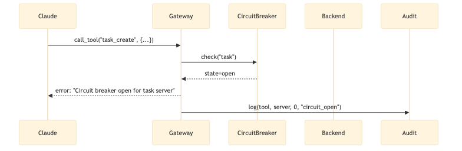

# Gateway Operations Reference

**Document Version:** 1.0  
**Last Updated:** 2025-12-15  
**Purpose:** Comprehensive reference for all Gateway operations

---

## Overview

The Sanctuary Gateway provides **management operations** for controlling the Gateway itself, in addition to proxying all backend MCP server tools.

**Total Operations:**
- **Gateway Management:** ~10 operations
- **Backend Tools (Proxied):** 63 tools across 12 servers

---

## 1. Gateway Management Operations

### 1.1 Health & Status

#### `gateway_health_check()`
**Purpose:** Check Gateway health status  
**Returns:** Health status of Gateway and all backend servers

**Response:**
```json
{
  "status": "healthy",
  "uptime_seconds": 3600,
  "backend_servers": {
    "rag_cortex": "running",
    "task": "running",
    "git_workflow": "running",
    "adr": "running",
    "chronicle": "running",
    "protocol": "running",
    "council": "running",
    "agent_persona": "running",
    "forge_llm": "running",
    "config": "running",
    "code": "running",
    "orchestrator": "running"
  },
  "last_health_check": "2025-12-15T07:00:00Z"
}
```

#### `gateway_get_stats()`
**Purpose:** Get Gateway statistics  
**Returns:** Request counts, latency metrics, cache stats

**Response:**
```json
{
  "total_requests": 1234,
  "requests_per_minute": 20,
  "average_latency_ms": 25,
  "p95_latency_ms": 45,
  "p99_latency_ms": 80,
  "cache_hit_rate": 0.65,
  "error_rate": 0.02,
  "uptime_seconds": 3600
}
```

---

### 1.2 Registry Management

#### `gateway_list_servers()`
**Purpose:** List all registered backend servers  
**Returns:** List of server configurations

**Response:**
```json
{
  "servers": [
    {
      "name": "rag_cortex",
      "display_name": "RAG Cortex MCP",
      "transport": "stdio",
      "status": "running",
      "tool_count": 9
    },
    // ... 11 more servers
  ],
  "total": 12
}
```

#### `gateway_list_tools(server_name?: string)`
**Purpose:** List all registered tools (optionally filtered by server)  
**Parameters:**
- `server_name` (optional): Filter by server name

**Response:**
```json
{
  "tools": [
    {
      "tool_name": "cortex_query",
      "server_name": "rag_cortex",
      "description": "Perform semantic search query",
      "is_read_only": true,
      "allowed": true,
      "require_approval": false
    },
    // ... 62 more tools
  ],
  "total": 63
}
```

#### `gateway_get_tool_info(tool_name: string)`
**Purpose:** Get detailed information about a specific tool  
**Parameters:**
- `tool_name`: Name of the tool

**Response:**
```json
{
  "tool_name": "cortex_query",
  "server_name": "rag_cortex",
  "description": "Perform semantic search query against the knowledge base",
  "parameters_schema": {
    "query": "string",
    "max_results": "int",
    "use_cache": "bool",
    "reasoning_mode": "bool"
  },
  "is_read_only": true,
  "allowed": true,
  "require_approval": false,
  "max_rate_per_minute": 100,
  "call_count_today": 45,
  "average_latency_ms": 120
}
```

---

### 1.3 Security & Allowlist

#### `gateway_check_allowlist(tool_name: string)`
**Purpose:** Check if a tool is in the allowlist  
**Parameters:**
- `tool_name`: Name of the tool to check

**Response:**
```json
{
  "tool_name": "git_smart_commit",
  "allowed": true,
  "require_approval": true,
  "max_rate_per_minute": 10,
  "notes": "Destructive operation - requires human approval"
}
```

#### `gateway_update_allowlist(tool_name: string, allowed: bool, require_approval?: bool)`
**Purpose:** Update allowlist for a tool  
**Parameters:**
- `tool_name`: Name of the tool
- `allowed`: Whether tool is allowed
- `require_approval` (optional): Whether approval is required

**Response:**
```json
{
  "tool_name": "git_smart_commit",
  "allowed": true,
  "require_approval": true,
  "updated_at": "2025-12-15T07:00:00Z"
}
```

---

### 1.4 Monitoring & Audit

#### `gateway_get_audit_log(limit?: int, tool_name?: string)`
**Purpose:** Retrieve audit log entries  
**Parameters:**
- `limit` (optional): Number of entries to return (default: 100)
- `tool_name` (optional): Filter by tool name

**Response:**
```json
{
  "entries": [
    {
      "id": 12345,
      "timestamp": "2025-12-15T07:00:00Z",
      "tool_name": "cortex_query",
      "server_name": "rag_cortex",
      "user": "claude_desktop",
      "latency_ms": 120,
      "status": "success"
    },
    // ... more entries
  ],
  "total": 100
}
```

#### `gateway_get_metrics()`
**Purpose:** Get Prometheus-compatible metrics  
**Returns:** Metrics in Prometheus format

**Response:**
```
# HELP gateway_requests_total Total gateway requests
# TYPE gateway_requests_total counter
gateway_requests_total{tool_name="cortex_query",server_name="rag_cortex",status="success"} 45

# HELP gateway_request_latency_seconds Gateway request latency
# TYPE gateway_request_latency_seconds histogram
gateway_request_latency_seconds_bucket{tool_name="cortex_query",server_name="rag_cortex",le="0.05"} 30
gateway_request_latency_seconds_bucket{tool_name="cortex_query",server_name="rag_cortex",le="0.1"} 40
gateway_request_latency_seconds_bucket{tool_name="cortex_query",server_name="rag_cortex",le="+Inf"} 45
```

---

### 1.5 Cache Management

#### `gateway_cache_stats()`
**Purpose:** Get cache statistics  
**Returns:** Cache hit rate, size, entries

**Response:**
```json
{
  "total_entries": 150,
  "cache_size_mb": 12.5,
  "hit_rate": 0.65,
  "miss_rate": 0.35,
  "eviction_count": 20,
  "ttl_seconds": 300
}
```

#### `gateway_cache_clear(tool_name?: string)`
**Purpose:** Clear cache (all or for specific tool)  
**Parameters:**
- `tool_name` (optional): Clear cache for specific tool only

**Response:**
```json
{
  "entries_cleared": 150,
  "cache_size_before_mb": 12.5,
  "cache_size_after_mb": 0.0
}
```

---

### 1.6 Circuit Breaker

#### `gateway_circuit_breaker_status(server_name?: string)`
**Purpose:** Get circuit breaker status  
**Parameters:**
- `server_name` (optional): Check specific server

**Response:**
```json
{
  "servers": {
    "rag_cortex": {
      "state": "closed",
      "failure_count": 0,
      "last_failure": null
    },
    "task": {
      "state": "open",
      "failure_count": 5,
      "last_failure": "2025-12-15T06:55:00Z",
      "open_until": "2025-12-15T07:00:00Z"
    }
  }
}
```

#### `gateway_circuit_breaker_reset(server_name: string)`
**Purpose:** Manually reset circuit breaker for a server  
**Parameters:**
- `server_name`: Server to reset

**Response:**
```json
{
  "server_name": "task",
  "state": "closed",
  "failure_count": 0,
  "reset_at": "2025-12-15T07:00:00Z"
}
```

---

## 2. Backend Tool Operations (Proxied)

The Gateway proxies all 63 tools from 12 backend servers. See `TOOLS_CATALOG.md` (pending) for complete list.

**Summary by Server:**

| Server | Tools | Category |
|--------|-------|----------|
| rag_cortex | 9 | Knowledge Base |
| git_workflow | 9 | Version Control |
| code | 9 | Code Operations |
| task | 6 | Task Management |
| chronicle | 6 | Historical Records |
| adr | 5 | Architecture Decisions |
| protocol | 5 | Protocol Management |
| agent_persona | 5 | Agent Dispatch |
| config | 4 | Configuration |
| council | 2 | Multi-Agent Deliberation |
| forge_llm | 2 | Fine-Tuned Model |
| orchestrator | 2 | Strategic Workflows |
| **Total** | **63** | |

---

## 3. Request Flow

### 3.1 Tool Call Flow


*[Source: mcp_gateway_tool_call_flow.mmd](../../../../../architecture_diagrams/workflows/mcp_gateway_tool_call_flow.mmd)*

### 3.2 Error Handling Flow



*[Source: mcp_gateway_error_flow.mmd](../../../../../architecture_diagrams/workflows/mcp_gateway_error_flow.mmd)*

---

## 4. Configuration

### 4.1 Environment Variables

```bash
# Gateway configuration
GATEWAY_PORT=9000
GATEWAY_HOST=0.0.0.0
GATEWAY_LOG_LEVEL=INFO

# Registry
REGISTRY_DB=/app/config/registry.db

# Cache
CACHE_TTL_SECONDS=300
CACHE_MAX_SIZE_MB=100

# Circuit Breaker
CIRCUIT_BREAKER_THRESHOLD=5
CIRCUIT_BREAKER_TIMEOUT_SECONDS=60

# Security
ALLOWLIST_ENFORCE=true
REQUIRE_APPROVAL_FOR_DESTRUCTIVE=true

# Monitoring
METRICS_ENABLED=true
METRICS_PORT=9090
AUDIT_LOG_ENABLED=true
AUDIT_LOG_PATH=/app/logs/audit.log
```

### 4.2 Registry Configuration

See `REGISTRY_SCHEMA.md` (pending) for database schema.

---

## 5. Monitoring

### 5.1 Health Checks

**Endpoint:** `http://localhost:9000/health`

**Response:**
```json
{
  "status": "healthy",
  "checks": {
    "registry": "ok",
    "cache": "ok",
    "backends": {
      "rag_cortex": "ok",
      "task": "ok",
      // ... other servers
    }
  }
}
```

### 5.2 Metrics

**Endpoint:** `http://localhost:9090/metrics`

**Key Metrics:**
- `gateway_requests_total` - Total requests by tool/server/status
- `gateway_request_latency_seconds` - Request latency histogram
- `gateway_active_requests` - Current active requests
- `gateway_cache_hit_rate` - Cache hit rate
- `gateway_circuit_breaker_state` - Circuit breaker state by server

---

## 6. Troubleshooting

### Common Issues

**Issue: Tool not found**
```
Error: Unknown tool: cortex_query
```
**Solution:** Check registry with `gateway_list_tools()`

**Issue: Circuit breaker open**
```
Error: Circuit breaker open for task server
```
**Solution:** Check backend health, reset with `gateway_circuit_breaker_reset("task")`

**Issue: High latency**
```
p95 latency: 500ms
```
**Solution:** Check cache hit rate, backend server health, connection pool

**Issue: Allowlist denial**
```
Error: Tool git_smart_commit is not in allowlist
```
**Solution:** Update allowlist with `gateway_update_allowlist("git_smart_commit", true)`

---

## 7. Best Practices

### 7.1 Performance

1. **Enable Caching:** For read-only operations
2. **Monitor Latency:** Set alerts for p95 > 100ms
3. **Connection Pooling:** Keep connections warm
4. **Rate Limiting:** Prevent abuse

### 7.2 Security

1. **Enforce Allowlist:** Always validate tools
2. **Require Approval:** For destructive operations
3. **Audit Logging:** Enable for compliance
4. **Regular Reviews:** Review allowlist monthly

### 7.3 Operations

1. **Health Checks:** Monitor every 60 seconds
2. **Circuit Breakers:** Prevent cascading failures
3. **Metrics:** Track all requests
4. **Backups:** Backup registry daily

---

## 8. API Reference

See `API_SPEC.md` (pending) for complete API specification.

---

## Conclusion

The Gateway provides **10 management operations** plus **63 proxied backend tools**, offering comprehensive control over the MCP ecosystem with centralized monitoring, security, and performance optimization.
