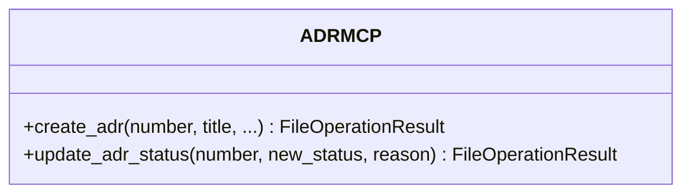
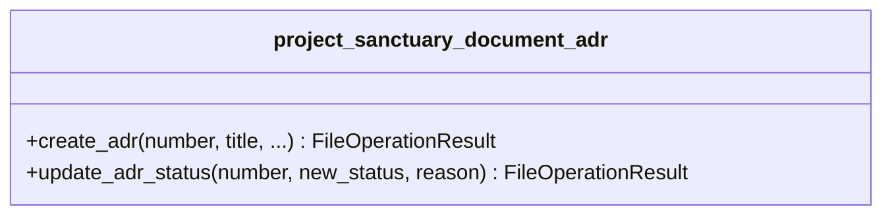

# Class Diagram Naming Update - Action Required

**Date:** 2025-11-25  
**Priority:** High  
**Scope:** All MCP class diagrams

---

## Issue

Current class diagrams use simple class names (e.g., `ADRMCP`, `CortexMCP`) instead of full domain names. This creates:
- Potential tool name collisions
- Unclear namespace ownership
- Non-professional structure

---

## Required Change

**Current Pattern:**
```mermaid
class ADRMCP {
    +create_adr() FileOperationResult
}
```

**New Pattern:**
```mermaid
class project_sanctuary_document_adr {
    +create_adr() FileOperationResult  
}
```

---

## Complete Class Naming Reference

| MCP Server | Current Class Name | New Class Name |
|------------|-------------------|----------------|
| Chronicle MCP | `ChronicleMCP` | `project_sanctuary_document_chronicle` |
| Protocol MCP | `ProtocolMCP` | `project_sanctuary_document_protocol` |
| ADR MCP | `ADRMCP` | `project_sanctuary_document_adr` |
| Task MCP | `TaskMCP` | `project_sanctuary_document_task` |
| RAG MCP (Cortex) | `CortexMCP` or `RAGMCP` | `project_sanctuary_cognitive_cortex` |
| Agent Orchestrator (Council) | `CouncilMCP` | `project_sanctuary_cognitive_council` |
| Config MCP | `ConfigMCP` | `project_sanctuary_system_config` |
| Code MCP | `CodeMCP` | `project_sanctuary_system_code` |
| Git Workflow MCP | `GitWorkflowMCP` | `project_sanctuary_system_git_workflow` |
| Fine-Tuning MCP (Forge) | `ForgeMCP` | `project_sanctuary_model_forge` |

---

## Files Requiring Updates

All class diagram files in `docs/mcp/diagrams/`:
- ✅ `chronicle_mcp_class.mmd`
- ✅ `protocol_mcp_class.mmd`
- ✅ `adr_mcp_class.mmd`
- ✅ `task_mcp_class.mmd`
- ✅ `rag_mcp_cortex_class.mmd`
- ✅ `agent_orchestrator_mcp_council_class.mmd`
- ✅ `config_mcp_class.mmd`
- ✅ `code_mcp_class.mmd`
- ✅ `git_workflow_mcp_class.mmd`
- ✅ `fine_tuning_mcp_forge_class.mmd`
- ✅ `mcp_ecosystem_class.mmd` (high-level diagram)

---

## Example: ADR MCP Before/After

### Before


### After


---

## Benefits

1. **Namespace Isolation** - No tool name collisions across domains
2. **Clear Ownership** - Explicit domain ownership of each class
3. **Professional Structure** - Enterprise-grade naming conventions
4. **Scalability** - Easy to add new domains without conflicts
5. **Consistency** - Matches domain naming model throughout architecture

---

## Implementation Notes

- Update class names in all diagrams
- Update relationship arrows (e.g., `ADRMCP --> ADR` becomes `project_sanctuary_document_adr --> ADR`)
- Update notes referencing class names
- Keep data model classes simple (e.g., `ADR`, `Entry`, `Task`) - only MCP server classes need full domain names

---

**Status:** DOCUMENTED - Ready for Implementation  
**Estimated Effort:** 1-2 hours to update all 11 diagrams  
**Priority:** Should be done before creating implementation tasks
