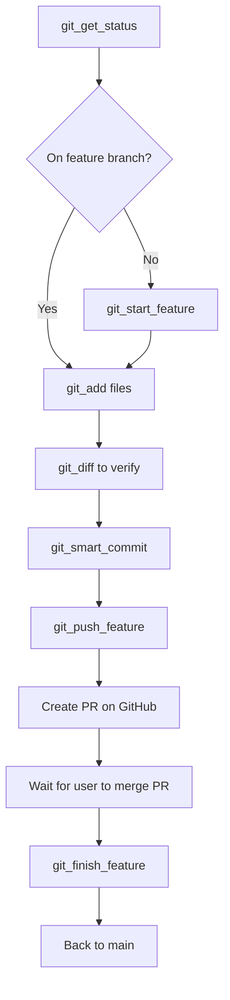

# MCP Operations Inventory

**Version:** 1.0  
**Status:** Living Document  
**Last Updated:** 2025-11-30  
**Purpose:** Comprehensive inventory of all MCP server operations with testing status and documentation links

---

## Overview

This document tracks all MCP server operations across the Project Sanctuary ecosystem, their testing status, associated test suites, and relevant documentation.

**MCP Configuration Locations:**
- **Template:** [docs/mcp/claude_desktop_config_template.json](claude_desktop_config_template.json)
- **Claude Desktop:** `~/Library/Application Support/Claude/claude_desktop_config.json`
- **Antigravity:** `~/.gemini/` (Antigravity MCP configuration)

**Architecture Diagram:** [MCP Ecosystem Overview](diagrams/mcp_ecosystem_class.mmd)

---

## Table of Contents

- [1. Chronicle MCP Server](#1-chronicle-mcp-server)
- [2. Protocol MCP Server](#2-protocol-mcp-server)
- [3. ADR MCP Server](#3-adr-mcp-server)
- [4. Task MCP Server](#4-task-mcp-server)
- [5. Git MCP Server](#5-git-mcp-server)
- [6. RAG Cortex MCP Server](#6-rag-cortex-mcp-server)
- [7. Forge LLM MCP Server](#7-forge-llm-mcp-server-fine-tuning)
- [8. Agent Persona MCP Server](#8-agent-persona-mcp-server)
- [9. Council MCP Server](#9-council-mcp-server-multi-agent-deliberation)
- [10. Orchestrator MCP Server](#10-orchestrator-mcp-server)
- [11. Config MCP Server](#11-config-mcp-server)
- [12. Code MCP Server](#12-code-mcp-server)
- [Testing Strategy](#testing-strategy)
- [Test Execution Commands](#test-execution-commands)
- [Related Documentation](#related-documentation)
- [Maintenance Notes](#maintenance-notes)

---

## Status Legend

**Test Harness (🧪):** Direct testing of underlying operations via pytest  
**Documentation (📝):** Operation is documented in README  
**MCP Tool Test (🤖):** Operation tested via LLM using MCP tool interface

| Symbol | Meaning |
|--------|---------|
| ✅ | Verified/Complete |
| ⚠️ | Partial/Warning |
| ❌ | Not tested/implemented |
| 🔄 | In progress |
| 🔧 | Needs implementation |

---

## 1. Chronicle MCP Server

**Domain:** Historical truth and canonical records  
**Directory:** `00_CHRONICLE/ENTRIES/`  
**Server Code:** [mcp_servers/chronicle/server.py](../../mcp_servers/chronicle/server.py)  
**README:** [Chronicle MCP README](../../mcp_servers/chronicle/README.md)  
**Class Diagram:** [diagrams/chronicle_mcp_class.mmd](diagrams/chronicle_mcp_class.mmd)

### Script Validation (Run First) 🧪
```bash
pytest tests/mcp_servers/chronicle/ -v
```
**Last Verification:** 2025-12-02 ✅ (9/9 passed - Task 087 Phase 1)

### LLM Prompting (MCP Verification) 🤖
> "Please create a new chronicle entry titled 'Test Entry' with content 'Testing Chronicle MCP' to verify the `chronicle_create_entry` tool."

### Configuration
```json
"chronicle": {
  "displayName": "Chronicle MCP",
  "command": "<PROJECT_ROOT>/.venv/bin/python",
  "args": ["-m", "mcp_servers.chronicle.server"],
  "env": {
    "PYTHONPATH": "<PROJECT_ROOT>",
    "PROJECT_ROOT": "<PROJECT_ROOT>"
  }
}
```

### Operations

| Operation | 🧪 Test | 📝 Docs | 🤖 MCP | Test Suite | Description |
|-----------|---------|---------|--------|------------|-------------|
| `chronicle_create_entry` | ✅ | ✅ | ✅ | [test_chronicle_operations.py](../../tests/mcp_servers/chronicle/test_chronicle_operations.py) | Create new chronicle entry with auto-numbering |
| `chronicle_append_entry` | ✅ | ✅ | ✅ | [test_chronicle_operations.py](../../tests/mcp_servers/chronicle/test_chronicle_operations.py) | Alias for create_entry (fixed) |
| `chronicle_update_entry` | ✅ | ✅ | ✅ | [test_chronicle_operations.py](../../tests/mcp_servers/chronicle/test_chronicle_operations.py) | Update existing entry (7-day rule) |
| `chronicle_get_entry` | ✅ | ✅ | ✅ | [test_chronicle_operations.py](../../tests/mcp_servers/chronicle/test_chronicle_operations.py) | Retrieve specific entry by number |
| `chronicle_list_entries` | ✅ | ✅ | ✅ | [test_chronicle_operations.py](../../tests/mcp_servers/chronicle/test_chronicle_operations.py) | List recent entries with filters |
| `chronicle_read_latest_entries` | ✅ | ✅ | ✅ | [test_chronicle_operations.py](../../tests/mcp_servers/chronicle/test_chronicle_operations.py) | Alias for list_entries (fixed) |
| `chronicle_search` | ✅ | ✅ | ✅ | [test_chronicle_operations.py](../../tests/mcp_servers/chronicle/test_chronicle_operations.py) | Full-text search across entries |

**Prerequisite Tests:** [test_chronicle_validator.py](../../tests/mcp_servers/chronicle/test_chronicle_validator.py)

---

## 2. Protocol MCP Server

**Domain:** Protocol creation and management  
**Directory:** `01_PROTOCOLS/`  
**Server Code:** [mcp_servers/protocol/server.py](../../mcp_servers/protocol/server.py)  
**README:** [Protocol MCP README](../../mcp_servers/protocol/README.md)  
**Class Diagram:** [diagrams/protocol_mcp_class.mmd](diagrams/protocol_mcp_class.mmd)

### Script Validation (Run First) 🧪
```bash
pytest tests/mcp_servers/protocol/ -v
```
**Last Verification:** 2025-12-02 ✅ (6/6 passed - Task 087 Phase 1)

### LLM Prompting (MCP Verification) 🤖
> "Please list all protocols with status 'CANONICAL' to verify the `protocol_list` tool."

### Configuration
```json
"protocol": {
  "displayName": "Protocol MCP",
  "command": "<PROJECT_ROOT>/.venv/bin/python",
  "args": ["-m", "mcp_servers.protocol.server"],
  "env": {
    "PYTHONPATH": "<PROJECT_ROOT>",
    "PROJECT_ROOT": "<PROJECT_ROOT>"
  }
}
```

### Operations

| Operation | 🧪 Test | 📝 Docs | 🤖 MCP | Test Suite | Description |
|-----------|---------|---------|--------|------------|-------------|
| `protocol_create` | ✅ | ✅ | ✅ | [test_protocol_operations.py](../../tests/mcp_servers/protocol/test_protocol_operations.py) | Create new protocol with versioning |
| `protocol_update` | ✅ | ✅ | ✅ | [test_protocol_operations.py](../../tests/mcp_servers/protocol/test_protocol_operations.py) | Update protocol (requires version bump for canonical) |
| `protocol_get` | ✅ | ✅ | ✅ | [test_protocol_operations.py](../../tests/mcp_servers/protocol/test_protocol_operations.py) | Retrieve specific protocol by number |
| `protocol_list` | ✅ | ✅ | ✅ | [test_protocol_operations.py](../../tests/mcp_servers/protocol/test_protocol_operations.py) | List protocols with optional filters |
| `protocol_search` | ✅ | ✅ | ✅ | [test_protocol_operations.py](../../tests/mcp_servers/protocol/test_protocol_operations.py) | Full-text search across protocols |

**Prerequisite Tests:** [test_protocol_validator.py](../../tests/mcp_servers/protocol/test_protocol_validator.py)

---

## 3. ADR MCP Server

**Domain:** Architecture Decision Records  
**Directory:** `mcp_servers/adr/`  
**Server Code:** [mcp_servers/adr/server.py](../../mcp_servers/adr/server.py)  
**README:** [ADR MCP README](../../mcp_servers/adr/README.md)  
**Class Diagram:** [diagrams/adr_mcp_class.mmd](diagrams/adr_mcp_class.mmd)

### Script Validation (Run First) 🧪
```bash
pytest tests/mcp_servers/adr/ -v
```
**Last Verification:** 2025-12-02 ✅ (13/13 passed - Task 087 Phase 1)

### LLM Prompting (MCP Verification) 🤖
> "Please search for ADRs related to 'database' to verify the `adr_search` tool."

### Configuration
```json
"adr": {
  "displayName": "ADR MCP",
  "command": "<PROJECT_ROOT>/.venv/bin/python",
  "args": ["-m", "mcp_servers.adr.server"],
  "env": {
    "PYTHONPATH": "<PROJECT_ROOT>",
    "PROJECT_ROOT": "<PROJECT_ROOT>"
  }
}
```

### Operations

| Operation | 🧪 Test | 📝 Docs | 🤖 MCP | Test Suite | Description |
|-----------|---------|---------|--------|------------|-------------|
| `adr_create` | ✅ | ✅ | ✅ | [test_adr_operations.py](../../tests/mcp_servers/adr/test_adr_operations.py) | Create new ADR with auto-numbering |
| `adr_update_status` | ✅ | ✅ | ✅ | [test_adr_operations.py](../../tests/mcp_servers/adr/test_adr_operations.py) | Update ADR status with transition validation |
| `adr_get` | ✅ | ✅ | ✅ | [test_adr_operations.py](../../tests/mcp_servers/adr/test_adr_operations.py) | Retrieve specific ADR by number |
| `adr_list` | ✅ | ✅ | ✅ | [test_adr_operations.py](../../tests/mcp_servers/adr/test_adr_operations.py) | List ADRs with optional status filter |
| `adr_search` | ✅ | ✅ | ✅ | [test_adr_operations.py](../../tests/mcp_servers/adr/test_adr_operations.py) | Full-text search across ADRs |

**Prerequisite Tests:** [test_adr_validator.py](../../tests/mcp_servers/adr/test_adr_validator.py)

---

## 4. Task MCP Server

**Domain:** Task management  
**Directory:** `TASKS/`  
**Server Code:** [mcp_servers/task/server.py](../../mcp_servers/task/server.py)  
**README:** [Task MCP README](../../mcp_servers/task/README.md)  
**Class Diagram:** [diagrams/task_mcp_class.mmd](diagrams/task_mcp_class.mmd)

### Script Validation (Run First) 🧪
```bash
pytest tests/mcp_servers/task/ -v
```
**Last Verification:** 2025-12-02 ✅ (18/18 passed - Task 087 Phase 1)

### LLM Prompting (MCP Verification) 🤖
> "Please list all tasks with 'High' priority to verify the `list_tasks` tool."

### Configuration
```json
"tasks": {
  "displayName": "Task MCP",
  "command": "<PROJECT_ROOT>/.venv/bin/python",
  "args": ["-m", "mcp_servers.task.server"],
  "env": {
    "PYTHONPATH": "<PROJECT_ROOT>",
    "PROJECT_ROOT": "<PROJECT_ROOT>"
  }
}
```

### Operations

| Operation | 🧪 Test | 📝 Docs | 🤖 MCP | Test Suite | Description |
|-----------|---------|---------|--------|------------|-------------|
| `create_task` | ✅ | ✅ | ✅ | [test_operations.py](../../tests/mcp_servers/task/test_operations.py) | Create new task with auto-numbering |
| `update_task` | ✅ | ✅ | ✅ | [test_operations.py](../../tests/mcp_servers/task/test_operations.py) | Update task metadata or content |
| `update_task_status` | ✅ | ✅ | ✅ | [test_operations.py](../../tests/mcp_servers/task/test_operations.py) | Change task status (moves between directories) |
| `get_task` | ✅ | ✅ | ✅ | [test_operations.py](../../tests/mcp_servers/task/test_operations.py) | Retrieve specific task by number |
| `list_tasks` | ✅ | ✅ | ✅ | [test_operations.py](../../tests/mcp_servers/task/test_operations.py) | List tasks with optional filters |
| `search_tasks` | ✅ | ✅ | ✅ | [test_operations.py](../../tests/mcp_servers/task/test_operations.py) | Full-text search across tasks |

**Prerequisite Tests:** [tests/mcp_servers/task/test_operations.py](../../tests/mcp_servers/task/test_operations.py)

---

## 5. Git MCP Server

**Domain:** Protocol 101 v3.0-compliant git operations  
**Directory:** `.git/`  
**Server Code:** [mcp_servers/git/server.py](../../mcp_servers/git/server.py)  
**README:** [Git MCP README](../../mcp_servers/git/README.md)  
**Class Diagram:** [diagrams/git_workflow_mcp_class.mmd](diagrams/git_workflow_mcp_class.mmd)

### Script Validation (Run First) 🧪
```bash
pytest tests/mcp_servers/git/ -v
```
**Last Verification:** 2025-12-02 ✅ (10/10 passed - Task 087 Phase 1)

### LLM Prompting (MCP Verification) 🤖
> "Please check the current git status using `git_get_status`."

### Configuration
```json
"git": {
  "displayName": "Git MCP",
  "command": "<PROJECT_ROOT>/.venv/bin/python",
  "args": ["-m", "mcp_servers.git.server"],
  "env": {
    "PYTHONPATH": "<PROJECT_ROOT>",
    "PROJECT_ROOT": "<PROJECT_ROOT>",
    "GIT_BASE_DIR": "<PROJECT_ROOT>"
  }
}
```

### Operations

| Operation | 🧪 Test | 📝 Docs | 🤖 MCP | Test Suite | Description |
|-----------|---------|---------|--------|------------|-------------|
| `git_get_status` | ✅ | ✅ | ✅ | [test_git_operations.py](../../tests/mcp_servers/git/test_git_operations.py) | Get current repository status |
| `git_diff` | ✅ | ✅ | ✅ | [test_git_operations.py](../../tests/mcp_servers/git/test_git_operations.py) | Show changes in working directory |
| `git_log` | ✅ | ✅ | ✅ | [test_git_operations.py](../../tests/mcp_servers/git/test_git_operations.py) | Show commit history |
| `git_start_feature` | ✅ | ✅ | ✅ | [test_git_operations.py](../../tests/mcp_servers/git/test_git_operations.py) | Start new feature branch (idempotent) |
| `git_add` | ✅ | ✅ | ✅ | [test_git_operations.py](../../tests/mcp_servers/git/test_git_operations.py) | Stage files for commit |
| `git_smart_commit` | ✅ | ✅ | ✅ | [test_git_operations.py](../../tests/mcp_servers/git/test_git_operations.py) | Commit with Protocol 101 v3.0 enforcement |
| `git_push_feature` | ✅ | ✅ | ✅ | [test_git_operations.py](../../tests/mcp_servers/git/test_git_operations.py) | Push feature branch to origin |
| `git_finish_feature` | ✅ | ✅ | ⏳ | [test_git_operations.py](../../tests/mcp_servers/git/test_git_operations.py) | Finish feature branch (cleanup) |(Verifies PR Merge) |

**Prerequisite Tests:**
- Unit Tests: [test_git_ops.py](../../tests/mcp_servers/git/test_git_ops.py) (10/10 passing)
- Safety Tests: [test_tool_safety.py](../../tests/mcp_servers/git_workflow/test_tool_safety.py) (13/13 passing)
- **Total:** 23/23 Passing ✅

**Enhanced `git_get_status` Output:**
- Current branch name
- Staged, modified, and untracked files
- All local branches (with current branch marked)
- List of feature branches (for safety checks)
- Remote tracking info: upstream branch, ahead/behind counts
- `is_clean` flag (true if no changes)

> [!NOTE]
> **Safe Operations (Read-Only):**
> - `git_get_status` - Always safe, check before any operation
> - `git_diff` - Always safe, shows changes without modifying anything
> - `git_log` - Always safe, shows commit history

> [!CAUTION]
> **Moderate Risk Operations (Require Verification):**
> - `git_add` - Safe, but verify files before staging
> - `git_start_feature` - **Idempotent:** Won't recreate if exists, enforces "one at a time" rule
> - `git_push_feature` - Verify you're on correct feature branch

**`git_start_feature` Behavior:**
- If branch exists and you're on it → Success (no-op)
- If branch exists but you're elsewhere → Checkout to it
- If branch doesn't exist → Create and checkout
- **Blocks** if a different feature branch exists (one at a time)
- **Requires** clean working directory for new branch creation

> [!WARNING]
> **High Risk Operations (Require User Confirmation):**
> - `git_smart_commit` - Runs test suite automatically, commits to current branch
> - `git_finish_feature` - **DANGER:** Only after user confirms PR is merged

**Git Workflow Dependencies (Proper Sequence):**



**Operation Prerequisites:**
- `git_start_feature` → Must be on clean working directory
- `git_add` → Must be on feature branch (not main)
- `git_smart_commit` → Must have staged files (`git_add` first)
- `git_push_feature` → Must have commits to push
- `git_finish_feature` → Must have user confirmation that PR is merged

**Workflow Rules:**
1. Always run `git_get_status` first
2. One feature branch at a time
3. Never commit to `main` directly
4. `git_finish_feature` requires explicit user confirmation of PR merge

**Related Protocols:**
- [Protocol 101 v3.0: Doctrine of Absolute Stability](../../01_PROTOCOLS/101_The_Doctrine_of_the_Unbreakable_Commit.md)
- [ADR 037: MCP Git Migration Strategy](../../ADRs/037_mcp_git_migration_strategy.md)

---

## 6. RAG Cortex MCP Server

**Domain:** Retrieval-Augmented Generation  
**Directory:** `mcp_servers/rag_cortex/`  
**Server Code:** [mcp_servers/rag_cortex/server.py](../../mcp_servers/rag_cortex/server.py)  
**README:** [RAG Cortex MCP README](../../mcp_servers/rag_cortex/README.md)  
**Class Diagram:** [diagrams/rag_mcp_cortex_class.mmd](diagrams/rag_mcp_cortex_class.mmd)

### Script Validation (Run First) 🧪
```bash
pytest tests/mcp_servers/rag_cortex/test_operations.py tests/mcp_servers/rag_cortex/test_cache_operations.py -v
```
**Last Verification:** 2025-12-02 ⚠️ (Test fixes in progress)
**Status:** Test fixes in progress (cache_operations: 6/6 passing)

### LLM Prompting (MCP Verification) 🤖
> "Please query the knowledge base for 'Protocol 101' using `cortex_query`."

### Configuration
```json
"rag_cortex": {
  "displayName": "RAG Cortex MCP",
  "command": "<PROJECT_ROOT>/.venv/bin/python",
  "args": ["-m", "mcp_servers.rag_cortex.server"],
  "env": {
    "PYTHONPATH": "<PROJECT_ROOT>",
    "PROJECT_ROOT": "<PROJECT_ROOT>"
  }
}
```

### Operations

| Operation | 🧪 Test | 📝 Docs | 🤖 MCP | Test Suite | Description |
|-----------|---------|---------|--------|------------|-------------|
| `cortex_query` | ✅ | ✅ | ❌ | [test_operations.py](../../tests/mcp_servers/cortex/test_operations.py) | Semantic search against knowledge base |
| `cortex_ingest_full` | ⚠️ | ✅ | ✅ | [test_operations.py](../../tests/mcp_servers/cortex/test_operations.py) | Full re-ingestion (purge + rebuild) - *Skipped in auto-tests* |
| `cortex_ingest_incremental` | ✅ | ✅ | ❌ | [test_operations.py](../../tests/mcp_servers/cortex/test_operations.py) | Add new documents without purge |
| `cortex_get_stats` | ✅ | ✅ | ❌ | [test_operations.py](../../tests/mcp_servers/cortex/test_operations.py) | Database health and statistics |
| `cortex_cache_get` | ✅ | ✅ | ❌ | [test_cache_operations.py](../../tests/mcp_servers/cortex/test_cache_operations.py) | Retrieve cached answer (Phase 2) |
| `cortex_cache_set` | ✅ | ✅ | ❌ | [test_cache_operations.py](../../tests/mcp_servers/cortex/test_cache_operations.py) | Store answer in cache (Phase 2) |
| `cortex_cache_stats` | ✅ | ✅ | ❌ | [test_cache_operations.py](../../tests/mcp_servers/cortex/test_cache_operations.py) | Cache performance metrics |
| `cortex_cache_warmup` | ✅ | ✅ | ❌ | [test_cache_operations.py](../../tests/mcp_servers/cortex/test_cache_operations.py) | Pre-populate cache with genesis queries |
| `cortex_guardian_wakeup` | ✅ | ✅ | ❌ | [test_cache_operations.py](../../tests/mcp_servers/cortex/test_cache_operations.py) | Generate Guardian boot digest (P114) |
| `cortex_generate_adaptation_packet` | ✅ | ✅ | ❌ | [test_operations.py](../../tests/mcp_servers/cortex/test_operations.py) | Synthesize knowledge for fine-tuning |

**Prerequisite Tests:** [tests/mcp_servers/cortex/](../../tests/mcp_servers/cortex/)

**Related Protocols:**
- [Protocol 102: Doctrine of Mnemonic Synchronization](../../01_PROTOCOLS/102_The_Doctrine_of_Mnemonic_Synchronization.md)
- [Protocol 114: Guardian Boot Sequence](../../01_PROTOCOLS/114_Guardian_Boot_Sequence.md)

---

## 7. Forge LLM MCP Server (Fine-Tuning)

**Domain:** Model fine-tuning and Sanctuary model queries  
**Directory:** `mcp_servers.forge_llm_llm/`  
**Server Code:** [mcp_servers.forge_llm_llm/server.py](../../mcp_servers.forge_llm_llm/server.py)  
**README:** [Forge LLM MCP README](../../mcp_servers.forge_llm_llm/README.md)  
**Class Diagram:** [diagrams/fine_tuning_mcp_forge_class.mmd](diagrams/fine_tuning_mcp_forge_class.mmd)

### Prerequisites

**Verify Sanctuary Model in Ollama:**
```bash
ollama list
```

Expected output should include:
```
NAME                                                        ID              SIZE      MODIFIED     
hf.co/richfrem/Sanctuary-Qwen2-7B-v1.0-GGUF-Final:Q4_K_M    6b669721dcb9    4.7 GB    ...
```

**To install the model:**
```bash
ollama run hf.co/richfrem/Sanctuary-Qwen2-7B-v1.0-GGUF-Final:Q4_K_M
```

### Script Validation (Run First) 🧪
```bash
pytest tests/integration/test_forge_integration.py -v
```
**Last Verification:** 2025-12-02 ✅ (1/1 passed - Task 087 Phase 1)
**Note:** Test updated to use correct API methods (check_model_availability, query_sanctuary_model)

### LLM Prompting (MCP Verification) 🤖
> "Please check the status of the Sanctuary model using `check_sanctuary_model_status`."

### Configuration
```json
"forge_llm": {
  "displayName": "Forge LLM MCP",
  "command": "<PROJECT_ROOT>/.venv/bin/python",
  "args": ["-m", "mcp_servers.forge_llm_llm.server"],
  "env": {
    "PYTHONPATH": "<PROJECT_ROOT>",
    "PROJECT_ROOT": "<PROJECT_ROOT>"
  }
}
```

### Operations

| Operation | 🧪 Test | 📝 Docs | 🤖 MCP | Test Suite | Description |
|-----------|---------|---------|--------|------------|-------------|
| `query_sanctuary_model` | ✅ | ✅ | ❌ | [test_forge_integration.py](../../tests/integration/test_forge_integration.py) | Query fine-tuned Sanctuary-Qwen2 model |
| `check_sanctuary_model_status` | ✅ | ✅ | ❌ | [test_forge_integration.py](../../tests/integration/test_forge_integration.py) | Verify model availability in Ollama |

**Prerequisite Tests:** [tests/integration/test_forge_integration.py](../../tests/integration/test_forge_integration.py)

**Hardware Requirements:** CUDA GPU for fine-tuning operations

> [!NOTE]
> **Scope Limitation:** Currently only `query_sanctuary_model` and `check_sanctuary_model_status` are authorized for MCP usage. Automated fine-tuning operations are explicitly **out of scope** until further trust verification.

---

---

## 8. Agent Persona MCP Server

**Domain:** Agent persona management and execution  
**Directory:** `mcp_servers/agent_persona/`  
**Server Code:** [mcp_servers/agent_persona/server.py](../../mcp_servers/agent_persona/server.py)  
**README:** [Agent Persona MCP README](../../mcp_servers/agent_persona/README.md)  

### Script Validation (Run First) 🧪
```bash
pytest tests/mcp_servers/agent_persona/ -v
```
**Last Verification:** 2025-12-02 ✅ (34/34 passed - Task 087 Phase 1)  
**Test Coverage:** 80%+ (comprehensive suite with expected failures, edge cases, state management)  
**Test Suites:**
- `test_agent_persona_ops.py` - Basic operations (7 tests)
- `test_agent_persona_comprehensive.py` - Comprehensive coverage (27 tests)

### LLM Prompting (MCP Verification) 🤖
> "Please list all available agent roles using `persona_list_roles`."

### Configuration
```json
"agent_persona": {
  "displayName": "Agent Persona MCP",
  "command": "<PROJECT_ROOT>/.venv/bin/python",
  "args": ["-m", "mcp_servers.agent_persona.server"],
  "env": {
    "PYTHONPATH": "<PROJECT_ROOT>",
    "PROJECT_ROOT": "<PROJECT_ROOT>"
  }
}
```

### Operations

| Operation | 🧪 Test | 📝 Docs | 🤖 MCP | Test Suite | Description |
|-----------|---------|---------|--------|------------|-------------|
| `persona_dispatch` | ✅ | ✅ | ❌ | [test_agent_persona_comprehensive.py](../../tests/mcp_servers/agent_persona/test_agent_persona_comprehensive.py) | Dispatch task to specific persona agent |
| `persona_list_roles` | ✅ | ✅ | ❌ | [test_agent_persona_ops.py](../../tests/mcp_servers/agent_persona/test_agent_persona_ops.py) | List available persona roles (built-in + custom) |
| `persona_get_state` | ✅ | ✅ | ❌ | [test_agent_persona_ops.py](../../tests/mcp_servers/agent_persona/test_agent_persona_ops.py) | Get conversation state for specific role |
| `persona_reset_state` | ✅ | ✅ | ❌ | [test_agent_persona_ops.py](../../tests/mcp_servers/agent_persona/test_agent_persona_ops.py) | Reset conversation state for specific role |
| `persona_create_custom` | ✅ | ✅ | ❌ | [test_agent_persona_ops.py](../../tests/mcp_servers/agent_persona/test_agent_persona_ops.py) | Create new custom persona |

**Prerequisite Tests:** [test_agent_persona_ops.py](../../tests/mcp_servers/agent_persona/test_agent_persona_ops.py)

**Model Verification:** Successfully tested with `Sanctuary-Qwen2-7B:latest` via Ollama (53s avg response time for strategic analysis)

**Terminology:**
- **LLM Client:** Interface to model provider (formerly Substrate)
- **System Prompt:** Persona definition (formerly Awakening Seed)

**Status:** ✅ Fully functional and tested (Tasks 079, 080 complete)

---

## 9. Council MCP Server (Specialized Orchestrator for Multi-Agent Deliberation)

**Domain:** Multi-agent deliberation orchestration  
**Directory:** `mcp_servers/council/`  
**Server Code:** [mcp_servers/council/server.py](../../mcp_servers/council/server.py)  
**README:** [Council MCP README](../../mcp_servers/council/README.md)  
**Class Diagram:** [diagrams/council_mcp_class.mmd](diagrams/council_mcp_class.mmd)

**Purpose:** Council MCP is a **specialized orchestrator** focused on one specific capability: **multi-agent deliberation workflows**. It orchestrates multiple agent calls across deliberation rounds, manages conversation state, and synthesizes consensus.

**Architecture:** Dual-role (MCP Server + MCP Client)
- **Role 1 (Server)**: Exposes deliberation capabilities to external LLMs and Orchestrator MCP
- **Role 2 (Client)**: Orchestrates calls to Agent Persona MCP, Cortex MCP, and other MCPs

**Orchestration Scope:** Tactical - Multi-round agent discussions
- Round 1: Coordinator → Strategist → Auditor
- Round 2: Coordinator → Strategist → Auditor  
- Round 3: Synthesis and consensus

**Relationship to Orchestrator MCP:** Council MCP is a **specialized service** that Orchestrator MCP delegates to when it needs multi-agent deliberation as part of a larger strategic mission.

### Script Validation (Run First) 🧪
```bash
pytest tests/mcp_servers/council/ -v
```
**Last Verification:** 2025-12-02 ✅ (3/3 passed - Task 087 Phase 1)  
**Test Coverage:** Basic (structure tests only)  
**Note:** Comprehensive test suite needed (similar to Agent Persona MCP)

> [!WARNING]
>- **Council MCP**: `mcp_servers/council/` (Status: ✅ Operational)
  - *Multi-agent deliberation and orchestration*
  - **Refactored**: Now uses Agent Persona MCP for agent execution and Cortex MCP for memory.
  - **Dependencies**: Agent Persona MCP, Cortex MCP

### LLM Prompting (MCP Verification) 🤖
> "Please initiate a multi-agent deliberation process using `council_dispatch`."

### Configuration
```json
"council": {
  "displayName": "Council MCP (Multi-Agent Deliberation)",
  "command": "<PROJECT_ROOT>/.venv/bin/python",
  "args": ["-m", "mcp_servers.council.server"],
  "env": {
    "PYTHONPATH": "<PROJECT_ROOT>",
    "PROJECT_ROOT": "<PROJECT_ROOT>"
  }
}
```

### Operations

| Operation | 🧪 Test | 📝 Docs | 🤖 MCP | Test Suite | Description |
|-----------|---------|---------|--------|------------|-------------|
| `council_dispatch` | ✅ | ✅ | ❌ | [test_council_ops.py](../../tests/mcp_servers/council/test_council_ops.py) | Execute task through multi-agent deliberation |
| `council_list_agents` | ✅ | ✅ | ❌ | [test_council_ops.py](../../tests/mcp_servers/council/test_council_ops.py) | List available council agents |

**Design Principle:** Separation of Concerns
- Council MCP provides ONLY multi-agent deliberation
- Individual Agents → Agent Persona MCP (`persona_dispatch`)
- Memory → Cortex MCP (`cortex_query`)
- File I/O → Code MCP (`code_write`, `code_read`)
- Git → Git MCP (`git_add`, `git_smart_commit`)
- Protocols → Protocol MCP (`protocol_create`)

**Related ADRs:**
- [ADR 039: MCP Server Separation of Concerns](../../ADRs/039_mcp_server_separation_of_concerns.md)
- [ADR 040: Agent Persona MCP Architecture](../../ADRs/040_agent_persona_mcp_architecture__modular_council_members.md)
- [ADR 042: Separation of Council MCP and Agent Persona MCP](../../ADRs/042_separation_of_council_mcp_and_agent_persona_mcp.md)

**Refactoring Plan (Task 60268594):**
1. Refactor `mcp_servers/lib/council/council_ops.py` to use Agent Persona MCP
2. Port deliberation logic from `ARCHIVE/council_orchestrator_legacy/orchestrator/app.py`
3. Use `mcp_servers/lib/council/packets/` for round tracking
4. Remove dependency on archived orchestrator

**Prerequisite Tests:** [test_council_ops.py](../../tests/mcp_servers/council/test_council_ops.py)

---

## 10. Orchestrator MCP Server (General-Purpose Mission Coordinator)

**Domain:** Strategic mission orchestration and multi-phase workflow coordination  
**Directory:** `mcp_servers/orchestrator/`  
**Server Code:** [mcp_servers/orchestrator/server.py](../../mcp_servers/orchestrator/server.py)  
**README:** [Orchestrator MCP README](../../mcp_servers/orchestrator/README.md)

**Purpose:** Orchestrator MCP is a **general-purpose orchestrator** that coordinates strategic missions across ALL MCPs. It manages multi-phase workflows, task lifecycle, and cross-domain coordination.

**Architecture:** High-Level Mission Coordinator (MCP Client to Many Servers)
- **Acts as Client to:** Council MCP, Task MCP, Chronicle MCP, Protocol MCP, Code MCP, Git MCP, Cortex MCP
- **Manages:** Strategic planning, mission state, cross-domain workflows

**Orchestration Scope:** Strategic - Multi-phase missions
- Phase 1: Research (calls Cortex MCP, Council MCP)
- Phase 2: Design (calls Council MCP, Protocol MCP)
- Phase 3: Implement (calls Code MCP, Git MCP)
- Phase 4: Verify (calls Council MCP, Task MCP)
- Phase 5: Document (calls Chronicle MCP, ADR MCP)

**Relationship to Council MCP:** Orchestrator MCP **delegates deliberation tasks** to Council MCP when multi-agent discussion is needed as part of a larger strategic workflow.

**Example Workflow:**
```
Orchestrator MCP: "Implement Protocol 120"
  ↓
  Phase 1: Research → Calls Council MCP for strategic analysis
    ↓
    Council MCP → Calls Agent Persona MCP (Coordinator, Strategist, Auditor)
  ↓
  Phase 2: Design → Calls Protocol MCP to create protocol
  ↓
  Phase 3: Implement → Calls Code MCP, Git MCP
  ↓
  Phase 4: Verify → Calls Council MCP for review
  ↓
  Phase 5: Document → Calls Chronicle MCP
```
**Directory:** `mcp_servers/orchestrator/`
**Server Code:** [mcp_servers/orchestrator/server.py](../../mcp_servers/orchestrator/server.py)
**README:** [Orchestrator MCP README](../../mcp_servers/orchestrator/README.md)

### Script Validation (Run First) 🧪
```bash
pytest tests/mcp_servers/orchestrator/ -v
```
**Last Verification:** 2025-12-02 🔄 (In Progress)

### LLM Prompting (MCP Verification) 🤖
> "Please check the orchestrator status using `get_orchestrator_status`."

### Configuration
```json
"orchestrator": {
  "displayName": "Orchestrator MCP",
  "command": "<PROJECT_ROOT>/.venv/bin/python",
  "args": ["-m", "mcp_servers.orchestrator.server"],
  "env": {
    "PYTHONPATH": "<PROJECT_ROOT>",
    "PROJECT_ROOT": "<PROJECT_ROOT>"
  }
}
```

### Operations

| Operation | 🧪 Test | 📝 Docs | 🤖 MCP | Test Suite | Description |
|-----------|---------|---------|--------|------------|-------------|
| `orchestrator_dispatch_mission` | ✅ | ⚠️ | ❌ | [test_mcp_operations.py](../../tests/mcp_servers/orchestrator/test_mcp_operations.py) | Dispatch a high-level mission to an agent |
| `orchestrator_run_strategic_cycle` | ✅ | ⚠️ | ❌ | [test_mcp_operations.py](../../tests/mcp_servers/orchestrator/test_mcp_operations.py) | Execute a full Strategic Crucible Loop |

**Note:** Only 2 operations are currently implemented in server.py. Other operations listed in documentation may be planned but not yet implemented.

---

## 11. Config MCP Server

**Domain:** Configuration management  
**Directory:** `.agent/config/`  
**Server Code:** [mcp_servers/config/server.py](../../mcp_servers/config/server.py)  
**README:** [Config MCP README](../../mcp_servers/config/README.md)  
**Class Diagram:** [diagrams/config_mcp_class.mmd](diagrams/config_mcp_class.mmd)

### Script Validation (Run First) 🧪
```bash
PYTHONPATH=. python3 tests/mcp_servers/config/test_operations.py
```
**Last Verification:** 2025-12-02 ✅ (6/6 passed - Task 087 Phase 1)

### LLM Prompting (MCP Verification) 🤖
> "Please list the current configuration settings."

### Configuration
```json
"config": {
  "displayName": "Config MCP",
  "command": "<PROJECT_ROOT>/.venv/bin/python",
  "args": ["-m", "mcp_servers.config.server"],
  "env": {
    "PYTHONPATH": "<PROJECT_ROOT>",
    "PROJECT_ROOT": "<PROJECT_ROOT>"
  }
}
```

### Operations

| Operation | 🧪 Test | 📝 Docs | 🤖 MCP | Test Suite | Description |
|-----------|---------|---------|--------|------------|-------------|
| `config_list` | ✅ | ✅ | ❌ | `test_operations.py` | List configuration files |
| `config_read` | ✅ | ✅ | ❌ | `test_operations.py` | Read config file content |
| `config_write` | ✅ | ✅ | ❌ | `test_operations.py` | Write config file with backup |
| `config_delete` | ✅ | ✅ | ❌ | `test_operations.py` | Delete config file |

---

## 12. Code MCP Server

**Domain:** Code operations  
**Directory:** `src/, scripts/, tools/`  
**Server Code:** [mcp_servers/code/server.py](../../mcp_servers/code/server.py)  
**README:** [Code MCP README](../../mcp_servers/code/README.md)  
**Class Diagram:** [diagrams/code_mcp_class.mmd](diagrams/code_mcp_class.mmd)

### Script Validation (Run First) 🧪
```bash
PYTHONPATH=. python3 tests/mcp_servers/code/test_operations.py
```
**Last Verification:** 2025-12-02 ✅ (13/13 passed - Task 087 Phase 1)

### LLM Prompting (MCP Verification) 🤖
> "Please analyze the code structure of the `src` directory."

### Configuration
```json
"code": {
  "displayName": "Code MCP",
  "command": "<PROJECT_ROOT>/.venv/bin/python",
  "args": ["-m", "mcp_servers.code.server"],
  "env": {
    "PYTHONPATH": "<PROJECT_ROOT>",
    "PROJECT_ROOT": "<PROJECT_ROOT>"
  }
}
```

### Operations

| Operation | 🧪 Test | 📝 Docs | 🤖 MCP | Test Suite | Description |
|-----------|---------|---------|--------|------------|-------------|
| `code_lint` | ✅ | ✅ | ❌ | `test_operations.py` | Run linting on files/directories |
| `code_format` | ✅ | ✅ | ❌ | `test_operations.py` | Format code with optional check-only mode |
| `code_analyze` | ✅ | ✅ | ❌ | `test_operations.py` | Perform static analysis |
| `code_check_tools` | ✅ | ✅ | ❌ | `test_operations.py` | Check available code quality tools |
| `code_find_file` | ✅ | ✅ | ❌ | `test_operations.py` | Find files by name or glob pattern |
| `code_list_files` | ✅ | ✅ | ❌ | `test_operations.py` | List files in directory with pattern |
| `code_search_content` | ✅ | ✅ | ❌ | `test_operations.py` | Search for text/patterns in code |
| `code_read` | ✅ | ✅ | ❌ | `test_operations.py` | Read file contents |
| `code_write` | ✅ | ✅ | ❌ | `test_operations.py` | Write/update file with backup |
| `code_get_info` | ✅ | ✅ | ❌ | `test_operations.py` | Get file metadata |

---

## Testing Strategy

### Phase 1: Script Validation Suite (Foundation) ✅
> **Rule:** All MCP server operations must have corresponding tests in the test suite to verify underlying logic *before* MCP layer verification.

- [x] Git operations unit tests (6/6 passing)
- [x] Chronicle validator tests (4/4 passing)
- [x] Protocol validator tests
- [x] ADR validator tests
- [x] Task operations tests

### Phase 2: MCP Layer (In Progress 🔄)
- [x] Git MCP tools (core workflow tested)
- [x] Chronicle MCP tools (verified in Claude Desktop)
- [ ] Protocol MCP tools (needs comprehensive testing)
- [ ] ADR MCP tools (needs comprehensive testing)
- [ ] Task MCP tools (needs comprehensive testing)

### Phase 3: RAG Operations (Planned)
- [ ] Cortex query operations
- [ ] Cortex ingestion operations
- [ ] Cache operations (Phase 2 feature)

### Phase 4: Knowledge Loop (Planned)
- [ ] End-to-end validation (Task 056)
- [ ] Create → Commit → Ingest → Retrieve flow

---

## Test Execution Commands

### Run All Tests
```bash
# From project root
pytest tests/ -v
```

### Run Specific MCP Tests
```bash
# Git operations
pytest tests/mcp_servers/git/ -v

# Chronicle
pytest tests/mcp_servers/chronicle/ -v

# Protocol
pytest tests/mcp_servers/protocol/ -v

# ADR
pytest tests/mcp_servers/adr/ -v

# Task
pytest tests/mcp_servers/task/ -v

# Integration tests
pytest tests/integration/ -v
```

---

## Related Documentation

- [MCP Architecture](architecture.md)
- [MCP Setup Guide](setup_guide.md)
- [Naming Conventions](naming_conventions.md)
- [Prerequisites](prerequisites.md)
- [Domain Architecture Diagrams](diagrams/)

---

## Maintenance Notes

### Adding New Operations

When adding a new MCP operation:

1. **Implement the operation** in the appropriate `server.py`
2. **Create unit tests** in `tests/test_<mcp>_operations.py`
3. **Update this inventory** with operation details and testing status
4. **Update MCP README** with operation documentation
5. **Add operation to MCP README table** (server-specific)
6. **Run test suite** and update status symbols

### Testing Checklist

Before marking an operation as ✅:

- [ ] Unit tests pass
- [ ] Integration tests pass (if applicable)
- [ ] Tested in Claude Desktop or Antigravity
- [ ] Documentation updated
- [ ] Edge cases covered
- [ ] Error handling validated

---

**Last Updated:** 2025-11-30  
**Maintainer:** Project Sanctuary Team
