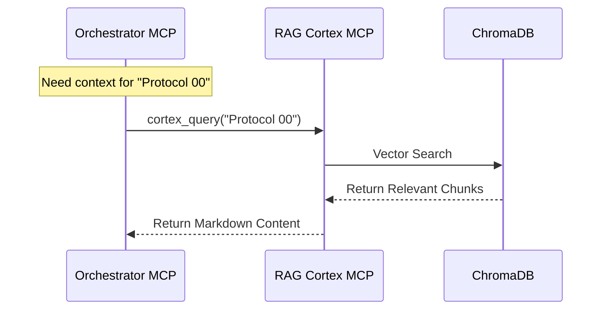
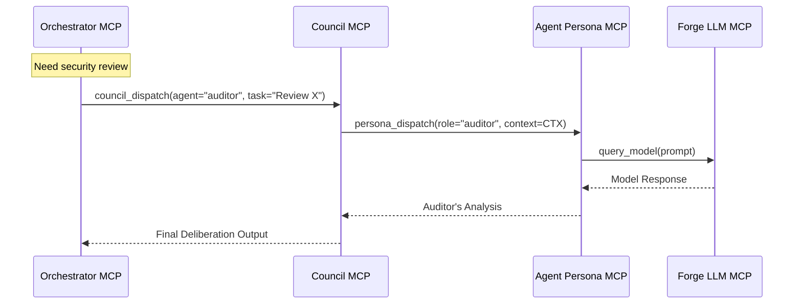
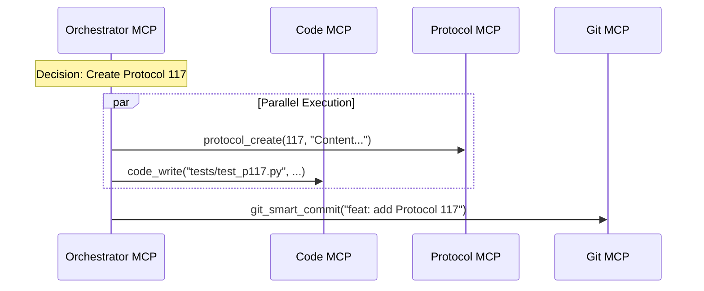
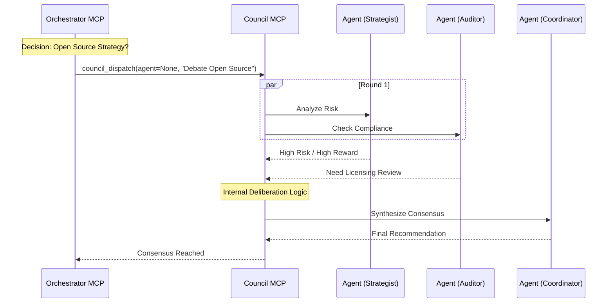
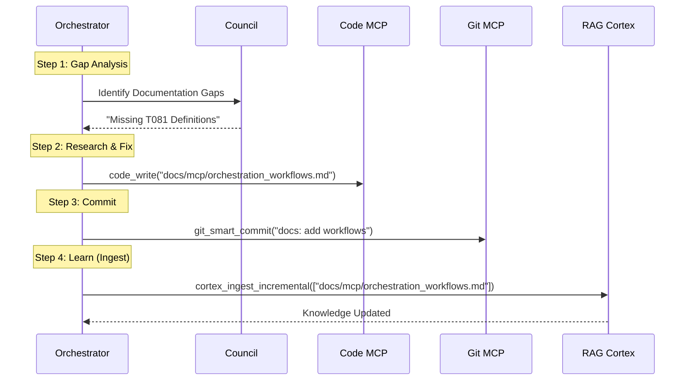

# Standard Council Orchestration Workflows

This document defines the standardized workflows for the Council Orchestrator to coordinate MCPs. These workflows are the building blocks for complex operations like the Strategic Crucible Loop.

**Related Documentation:**
- [MCP Architecture](../mcp/test_forge_mcp_and_RAG_mcp.md) (Full System Diagram)
- [Council Orchestration Levels](../../docs/workflows/council_orchestration.md) (Complexity Hierarchy)

---

## Workflow 1: Context Retrieval (Orchestrator -> Cortex)

**Purpose:** Retrieve relevant knowledge from the RAG Cortex before making decisions.
**Trigger:** Before any complex agent deliberation.

### Sequence Diagram

---

## Workflow 2: Agent Deliberation (Orchestrator -> Council -> Agent)

**Purpose:** Delegate cognitive tasks to specialized personas.
**Trigger:** When a specific perspective (Audit, Strategy) is needed.

### Sequence Diagram

---

## Workflow 3: Action Execution (Orchestrator -> Code/Protocol/Git)

**Purpose:** Execute side effects based on Council recommendations.
**Trigger:** After a decision has been made.

### Sequence Diagram

---

## Workflow 4: Multi-Agent Consensus (Council)

**Purpose:** Reach a consensus decision on complex topics.
**Trigger:** Strategic decisions or high-risk changes.

### Sequence Diagram

---

## Workflow 5: Strategic Crucible Loop (Orchestrator self-correction)

**Purpose:** Identify gaps, research solutions, and update the knowledge base.
**Trigger:** `orchestrator_run_strategic_cycle` or automated schedule.

### Sequence Diagram

