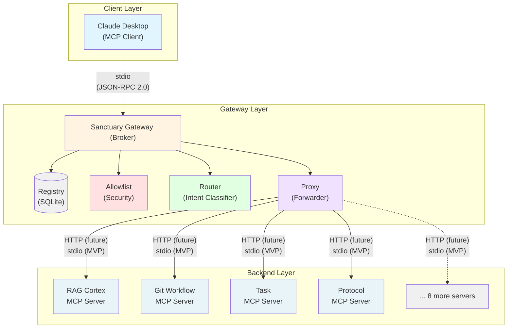

# MCP Gateway Architecture Specification

**Version:** 1.0 (Draft)  
**Status:** In Development  
**Last Updated:** 2025-12-15

---

## 1. Overview

This document defines the technical architecture for the Sanctuary MCP Gateway, a centralized broker that implements dynamic server binding and late-binding tool discovery for Model Context Protocol (MCP) servers.

**Purpose:** Reduce context window overhead by 88% while enabling scalability to 100+ MCP servers.

---

## 2. System Architecture

### 2.1 High-Level Architecture



### 2.2 Component Responsibilities

**Gateway (Broker):**
- Single MCP server registered in Claude Desktop
- Routes tool requests to appropriate backend servers
- Enforces security allowlist
- Manages server registry and health checks

**Registry:**
- SQLite database mapping tools to servers
- Stores server endpoints, capabilities, status
- Provides service discovery

**Router:**
- Intent classification and request routing
- Tool name → server name mapping
- Load balancing (future)

**Allowlist:**
- Security enforcement layer
- Validates tool invocations against policy
- Implements Protocol 101 compliance

**Proxy:**
- Forwards validated requests to backends
- Handles JSON-RPC 2.0 translation
- Manages connection pooling

---

## 3. Data Models

### 3.1 Registry Schema

```sql
CREATE TABLE mcp_servers (
    name TEXT PRIMARY KEY,
    container_name TEXT NOT NULL,
    endpoint TEXT NOT NULL,
    transport TEXT NOT NULL, -- 'stdio' or 'http'
    capabilities JSON NOT NULL, -- List of tool names
    status TEXT NOT NULL, -- 'running', 'stopped', 'error'
    last_health_check TIMESTAMP,
    metadata JSON -- Additional server info
);

CREATE TABLE tool_registry (
    tool_name TEXT PRIMARY KEY,
    server_name TEXT NOT NULL,
    description TEXT,
    parameters_schema JSON,
    FOREIGN KEY (server_name) REFERENCES mcp_servers(name)
);
```

### 3.2 Allowlist Schema

```json
{
  "version": "1.0",
  "allowlist": {
    "servers": ["rag_cortex", "git_workflow", "task", ...],
    "tools": {
      "git_workflow": ["git_get_status", "git_add", "git_smart_commit"],
      "rag_cortex": ["cortex_query", "cortex_ingest_incremental"]
    },
    "operations": {
      "git_workflow": {
        "git_smart_commit": {"approval_required": true}
      }
    }
  }
}
```

---

## 4. API Specifications

### 4.1 Gateway MCP Interface

**Tool Discovery:**
```json
{
  "method": "tools/list",
  "result": {
    "tools": [
      {
        "name": "cortex_query",
        "description": "Semantic search against knowledge base",
        "inputSchema": {...}
      }
    ]
  }
}
```

**Tool Invocation:**
```json
{
  "method": "tools/call",
  "params": {
    "name": "cortex_query",
    "arguments": {"query": "What is Protocol 101?"}
  }
}
```

### 4.2 Registry API (Internal)

```python
class RegistryAPI:
    def get_server_for_tool(self, tool_name: str) -> ServerInfo
    def get_all_servers(self) -> List[ServerInfo]
    def update_server_status(self, server_name: str, status: str)
    def register_server(self, server: ServerInfo)
```

---

## 5. Deployment Architecture

### 5.1 Container Deployment (Podman)

```yaml
# podman-compose.yml
version: '3'
services:
  sanctuary-broker:
    image: sanctuary-broker-mcp:latest
    ports:
      - "9000:9000"
    volumes:
      - ./config:/app/config
      - ./logs:/app/logs
    networks:
      - sanctuary-internal

  rag-cortex:
    image: rag-cortex-mcp:latest
    networks:
      - sanctuary-internal

  # ... other servers
```

### 5.2 Kubernetes Deployment

```yaml
apiVersion: apps/v1
kind: Deployment
metadata:
  name: sanctuary-broker
spec:
  replicas: 3
  selector:
    matchLabels:
      app: sanctuary-broker
  template:
    spec:
      containers:
      - name: gateway
        image: sanctuary-broker-mcp:latest
        ports:
        - containerPort: 9000
```

---

## 6. Security Architecture

### 6.1 Security Layers

1. **Allowlist Enforcement** - Tool invocation validation
2. **Authentication** - OAuth 2.0 token validation (future)
3. **Authorization** - Role-based access control (future)
4. **Input Validation** - Parameter sanitization
5. **Audit Logging** - All tool invocations logged

### 6.2 Threat Mitigations

| Threat | Mitigation |
|--------|------------|
| Prompt Injection | Input validation, output filtering |
| Privilege Escalation | Strict allowlist, POLP |
| Data Exfiltration | Network isolation, monitoring |
| MCP Protocol Exploits | Token validation, session management |

---

## 7. Performance Specifications

### 7.1 Latency Targets

- Gateway routing overhead: <30ms (p95)
- End-to-end tool invocation: <100ms (p95)
- Registry lookup: <5ms (p99)

### 7.2 Scalability Targets

- Concurrent requests: 100+ (single instance)
- Registered servers: 100+
- Tools per server: 20+

---

## 8. Implementation Phases

**Phase 1 (MVP - Week 1):**
- Basic Gateway with 3 servers
- Static routing
- stdio transport

**Phase 2 (Registry - Week 2):**
- SQLite registry
- Dynamic routing
- Health checks

**Phase 3 (Migration - Week 3):**
- All 12 servers migrated
- Allowlist enforcement
- Monitoring

**Phase 4 (Hardening - Week 4):**
- Circuit breakers
- Performance optimization
- Production deployment

---

## 9. Testing Strategy

### 9.1 Unit Tests
- Registry operations
- Router logic
- Allowlist validation

### 9.2 Integration Tests
- Gateway ↔ Backend communication
- End-to-end tool invocation
- Health check monitoring

### 9.3 Performance Tests
- Latency benchmarks
- Load testing
- Stress testing

---

## 10. Monitoring & Observability

### 10.1 Metrics

- Request rate (requests/sec)
- Latency (p50, p95, p99)
- Error rate (%)
- Server health status

### 10.2 Logging

- All tool invocations (audit trail)
- Routing decisions
- Health check results
- Error traces

---

## 11. References

- [Implementation Plan](../research/07_implementation_plan.md)
- [Decision Document](../research/12_decision_document_gateway_adoption.md)
- [Build vs Buy Analysis](../research/11_build_vs_buy_vs_reuse_analysis.md)
- [ADR 056: Adoption of Dynamic MCP Gateway Pattern](../../ADRs/056_adoption_of_dynamic_mcp_gateway_pattern.md)
- [ADR 057: Adoption of IBM ContextForge](../../ADRs/057_adoption_of_ibm_contextforge_for_dynamic_mcp_gateway.md)
- [IBM ContextForge GitHub](https://github.com/IBM/mcp-context-forge)
- [MCP Specification](https://modelcontextprotocol.io)

---

**Status:** Draft - To be finalized after Protocol 122 creation  
**Next Review:** After MVP deployment (Week 1)
