# MCP Gateway Fleet Architecture

**Version:** 1.0  
**Status:** Production  
**Last Updated:** 2025-12-24  
**Reference:** ADR-060, ADR-066, ADR-076

---

## Overview

The Sanctuary MCP Gateway provides a **federated access layer** to 86 tools across 6 containerized clusters. This architecture enables any MCP-compatible client to access the complete tool ecosystem through a single Gateway endpoint.

```mermaid
---
config:
  theme: base
  layout: elk
---
flowchart LR
    subgraph Clients["🖥️ MCP Clients"]
        Claude["Claude Desktop"]
        Cursor["Cursor IDE"]
        Antigravity["Antigravity"]
    end
    
    subgraph Transport["🔄 Transport Layer"]
        Bridge["bridge.py<br/>(STDIO→HTTP)"]
        Gateway["IBM Gateway<br/>:4444"]
    end
    
    subgraph Fleet["🐳 Container Fleet"]
        Container["MCP Server<br/>(SSE mode)"]
    end
    
    Claude ---|"STDIO"| Bridge
    Cursor ---|"STDIO"| Bridge
    Antigravity ---|"STDIO"| Bridge
    Bridge ---|"HTTP/RPC"| Gateway
    Gateway ---|"SSE<br/>(streaming)"| Container
```



---

## Fleet Composition

| # | Container | Port | Tools | Category |
|---|-----------|------|-------|----------|
| 1 | `sanctuary_utils` | 8100 | 17 | Time, Calc, UUID, String |
| 2 | `sanctuary_filesystem` | 8101 | 10 | File I/O, Code Analysis |
| 3 | `sanctuary_network` | 8102 | 2 | HTTP Fetch, Site Status |
| 4 | `sanctuary_git` | 8103 | 9 | Protocol 101 Git Ops |
| 5 | `sanctuary_cortex` | 8104 | 13 | RAG, Forge LLM, Cache |
| 6 | `sanctuary_domain` | 8105 | 35 | Chronicle, ADR, Task, Protocol |

**Backend Services:**
- `sanctuary_vector_db` (8110) - ChromaDB Vector Store
- `sanctuary_ollama` (11434) - LLM Inference (Ollama)

**Total:** 8 containers, 86 tools

---

## Dual-Transport Architecture (ADR-066)

Each Gateway cluster implements **two transport modes**:

| Transport | Implementation | Entry Point | Use Case |
|-----------|----------------|-------------|----------|
| **STDIO** | FastMCP | `run_stdio_server()` | Claude Desktop, Local Dev |
| **SSE** | SSEServer + @sse_tool | `run_sse_server()` | Gateway Fleet (Podman) |

**Selector:** `MCP_TRANSPORT` environment variable (default: `stdio`)

> **Important:** FastMCP's SSE is NOT compatible with the IBM ContextForge Gateway. Fleet containers MUST use SSEServer (`mcp_servers/lib/sse_adaptor.py`).


---

## Cluster File Structure

Each Gateway cluster follows a standardized layout:

```
mcp_servers/gateway/clusters/<cluster_name>/
├── server.py        # Entry point with run_sse_server() + run_stdio_server()
├── operations.py    # Business logic (transport-agnostic)
├── models.py        # Pydantic schemas for FastMCP STDIO
└── __init__.py
```

### Key Components

| File | Purpose | Transport |
|------|---------|-----------|
| `server.py` | Entry point, transport selector, tool registration | Both |
| `operations.py` | Pure business logic, no transport dependencies | None |
| `models.py` | Pydantic schemas for FastMCP parameter validation | STDIO only |

---

## @sse_tool Decorator Pattern (ADR-076)

All Gateway clusters use the `@sse_tool` decorator pattern for SSE transport:

```python
from mcp_servers.lib.sse_adaptor import SSEServer, sse_tool

server = SSEServer("sanctuary_utils")

@sse_tool(server, "time-get-current-time", "Get the current time")
async def time_get_current_time(timezone_name: str = "UTC") -> dict:
    return operations.get_current_time(timezone_name)

def run_sse_server():
    server.run(port=int(os.environ.get("PORT", 8100)))

def run_stdio_server():
    # FastMCP for local STDIO transport
    mcp = FastMCP("sanctuary_utils")
    # ... register tools with @mcp.tool() ...
    mcp.run()

if __name__ == "__main__":
    transport = os.environ.get("MCP_TRANSPORT", "stdio")
    if transport == "sse":
        run_sse_server()
    else:
        run_stdio_server()
```

---

## Testing Architecture

```mermaid
---
config:
  theme: base
  layout: dagre
---
flowchart LR
    subgraph Testing["🧪 Testing & Development"]
        Terminal["Terminal<br/>(python -m server)"]
        Unit["Unit Tests<br/>(pytest)"]
        Integration["Integration Tests"]
        E2E["E2E Tests<br/>(headless)"]
    end
    
    subgraph Direct["⚡ Direct Invocation"]
        STDIO_Server["MCP Server<br/>(STDIO mode)"]
        SSE_Server["MCP Server<br/>(SSE mode)"]
    end
    
    subgraph Curl["🔧 Manual Testing"]
        Health["curl /health"]
        SSE_Test["curl /sse"]
    end
    
    Terminal ---|"STDIO<br/>(MCP_TRANSPORT=stdio)"| STDIO_Server
    Unit ---|"Import & Mock"| STDIO_Server
    Integration ---|"HTTP"| SSE_Server
    E2E ---|"STDIO via bridge"| STDIO_Server
    Health ---|"HTTP GET"| SSE_Server
    SSE_Test ---|"HTTP Stream"| SSE_Server
```



### Test Tiers

| Tier | Type | What It Tests |
|------|------|---------------|
| 1 | Unit | Isolated logic in `operations.py` |
| 2 | Integration | SSE handshake, health endpoints |
| 3 | Gateway RPC | Full stack via Gateway client |
| 4 | E2E | Actual LLM tool invocation |

---

## Quick Reference

### Health Checks
```bash
curl http://localhost:8100/health  # Utils
curl http://localhost:8104/health  # Cortex
curl -k https://localhost:4444/health  # Gateway
```

### SSE Handshake Verification
```bash
timeout 2 curl -N http://localhost:8100/sse  # Should return: event: endpoint
```

### Fleet Management
```bash
podman compose up -d      # Start fleet
podman compose down       # Stop fleet
podman ps                 # Check status
```

---

## Related Documents

| Document | Purpose |
|----------|---------|
| [GATEWAY_VERIFICATION_MATRIX.md](../gateway/operations/GATEWAY_VERIFICATION_MATRIX.md) | Complete 86-tool verification status |
| [README.md](../gateway/operations/README.md) | Operations inventory |
| [ADR-060](../../ADRs/060_gateway_integration_patterns__hybrid_fleet.md) | Hybrid Fleet strategy |
| [ADR-066](../../ADRs/066_standardize_on_fastmcp_for_all_mcp_server_implementations.md) | Dual-transport standards |
| [ADR-076](../../ADRs/076_sse_tool_decorator_pattern.md) | @sse_tool pattern |

---

## Diagrams

All architecture diagrams are stored in `docs/mcp_servers/architecture/diagrams/`:

| Folder | Contents |
|--------|----------|
| `architecture/` | Fleet of 8, domain architecture, system overview |
| `transport/` | STDIO/SSE paths, dual-transport architecture |
| `workflows/` | P128, RAG, Phoenix Forge pipelines |
| `class/` | MCP server class diagrams |

---

*For complete tool listings, see [GATEWAY_VERIFICATION_MATRIX.md](../gateway/operations/GATEWAY_VERIFICATION_MATRIX.md)*
