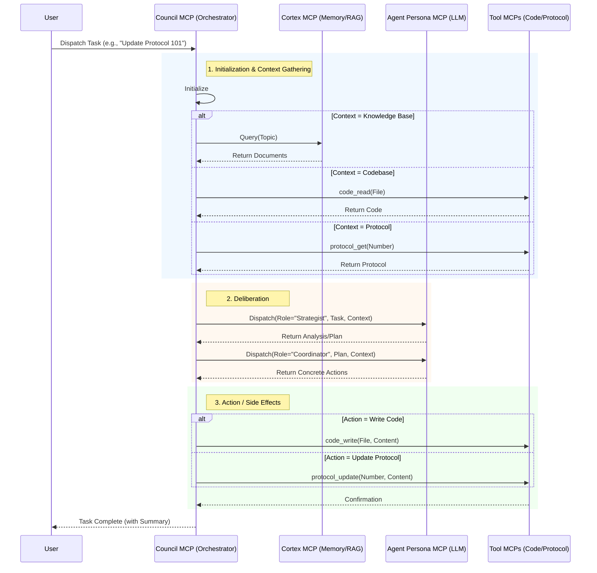

# Common Orchestration Workflows

This document defines standard orchestration workflows for the **Council MCP**, illustrating how it coordinates with other MCPs (Cortex, Agent Persona, Code, Protocol) to execute complex cognitive tasks.

## Core Architecture

The Council MCP acts as the central **Orchestrator**. It manages the lifecycle of a task:
1.  **Contextualization:** Getting information (Cortex)
2.  **Deliberation:** Thinking about the problem (Agent Persona)
3.  **Action:** Effecting change (Code/Protocol/Git MCPs)

## Workflow: Full Cycle Task Execution

This workflow represents the standard "Loop" for handling a complex user request that requires context, reasoning, and a concrete output (e.g., writing code or updating a protocol).

### Sequence Diagram

### Detailed Steps

1.  **Load Orchestrator:**
    *   The Council MCP initializes.
    *   It checks `CortexOperations` to ensure the cache is warm (`cache_stats`, `cache_warmup`).

2.  **Generate Context (RAG):**
    *   **Action:** Council calls `cortex.query(task_description)`.
    *   **Purpose:** Retrieve relevant protocols, code snippets, or past decisions.
    *   **Output:** A list of documents (Context).

3.  **Create Work Assignment:**
    *   The Council formats the `task_description` and the retrieved `Context` into a prompt.

4.  **Agent Execution (Thinking):**
    *   **Action:** Council calls `persona_ops.dispatch(role, task, context)`.
    *   **Roles:**
        *   *Strategist:* Analyzes risks and high-level approach.
        *   *Coordinator:* Breaks down the plan into steps.
        *   *Auditor:* Verifies compliance.
    *   **Output:** A structured response (text, plan, or specific tool call instructions).

5.  **Execution / Side Effects:**
    *   Based on the Agent's output, the Council (or the User, in a human-in-the-loop flow) triggers the necessary tools.
    *   **Code MCP:** `code_write`, `code_search`
    *   **Protocol MCP:** `protocol_update`, `protocol_create`
    *   **Git MCP:** `git_commit`, `git_push`

## Example Scenario: Updating a Protocol

**User Request:** "Update Protocol 101 to include a new section on 'Cache Hygiene'."

1.  **Council** initializes.
2.  **Council** queries **Cortex**: "Protocol 101 Cache Hygiene".
    *   *Cortex* returns the current text of Protocol 101 and any related notes.
3.  **Council** dispatches to **Strategist**: "Propose text for 'Cache Hygiene' section in Protocol 101 based on this context."
    *   *Strategist* returns the new markdown content.
4.  **Council** dispatches to **Auditor**: "Review this proposed text for conflicts with Protocol 00."
    *   *Auditor* approves.
5.  **Council** calls **Protocol MCP**: `protocol_update(number=101, updates={"content": "..."})`.
6.  **Council** returns success to User.

## Standardized Orchestration Workflows

The following standard workflows are defined for validation and testing purposes.

### 1. Strategic Crucible Loop (Task 056)
**Purpose:** Autonomous self-evolution and knowledge hardening.
**Trigger:** `mcp_orchestrator_run_strategic_cycle`
**Steps:**
1.  **Ingest:** Read new/changed files (Git MCP).
2.  **Synthesize:** Agent Persona (Strategist) analyzes changes against existing Protocols (Cortex RAG).
3.  **Adapt:** Agent Persona (Coordinator) proposes updates to Protocols or Docs.
4.  **Cache:** Commit changes (Git MCP) and re-ingest into Mnemonic Cortex (Cortex MCP).

### 2. Protocol Compliance Audit
**Purpose:** Verify code against governance standards.
**Trigger:** `council_dispatch(task="Audit <file> against Protocol <N>")`
**Steps:**
1.  **Context:** Retrieve Protocol <N> (Protocol MCP) and File Content (Code MCP).
2.  **Analysis:** Auditor Persona checks for violations.
3.  **Report:** Generate compliance report (Markdown).

### 3. Mnemonic Synthesis (Knowledge Creation)
**Purpose:** Distill raw information into canonical knowledge.
**Trigger:** `council_dispatch(task="Synthesize insights from X")`
**Steps:**
1.  **Search:** Query Cortex for "X" (Cortex MCP).
2.  **Distill:** Strategist Persona summarizes key patterns.
3.  **Store:** Create new Chronicle Entry or Protocol (Chronicle/Protocol MCP).

