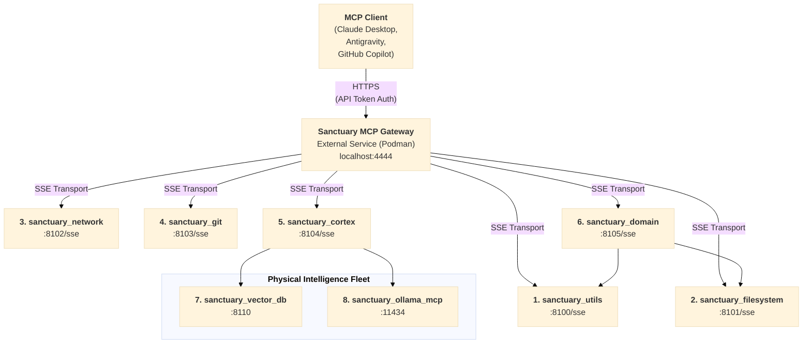

# MCP Gateway Documentation

**Status:** Research Complete, Implementation Pending  
**Decision:** Reuse IBM ContextForge (Approved)  
**Timeline:** 4-week implementation

---

## Overview

The **Dynamic MCP Gateway Architecture** is Project Sanctuary's solution for scaling beyond 12 MCP servers while reducing context window overhead by 88%. This documentation covers the complete research, architecture, implementation, and operations of the Gateway.

---

## Documentation Structure

### 📚 [Research](./research/)
Complete research phase documentation (12 documents, 58,387 tokens):
- Executive summary and key findings
- Protocol analysis, gateway patterns, performance benchmarks
- Security architecture and threat modeling
- Current vs future state analysis
- Benefits analysis (270% ROI)
- Implementation plan (5 phases)
- Build vs buy vs reuse analysis
- **Decision document** (formal approval)

### 🏗️ [Architecture](./architecture/)
Technical architecture and design:
- System architecture diagrams
- Component specifications
- Deployment architecture (Podman/Docker/K8s/OpenShift)
- API specifications

### ⚙️ [Operations](./operations/)
Gateway operations and management:
- **[Gateway Client Library](../../mcp_servers/lib/gateway_client.py)**: Canonical Python tool for registration and RPC calls.
- Health checks and monitoring
- Registry management
- Tools catalog (72+ tools across 6 clusters)

### 📖 [Guides](./guides/)
How-to guides and tutorials:
- Getting started with the Gateway
- Adding new MCP servers
- Security configuration
- Troubleshooting

### 📋 [Reference](./reference/)
Technical reference documentation:
- API reference
- Configuration reference
- Tool definitions
- Protocol specifications

---

## Quick Links

**Key Documents:**
- [Executive Summary](./research/00_executive_summary.md) - Start here
- [Decision Document](./research/12_decision_document_gateway_adoption.md) - Formal approval
- [Implementation Plan](./research/07_implementation_plan.md) - 5-phase roadmap
- [Build vs Buy Analysis](./research/11_build_vs_buy_vs_reuse_analysis.md) - Options analysis

**Related Sanctuary Documents:**
- **ADR 056:** Adoption of Dynamic MCP Gateway Pattern
- **ADR 057:** Adoption of IBM ContextForge (SUPERSEDED by 058)
- **ADR 058:** Decouple IBM Gateway to External Podman Service
- **ADR 060:** Gateway Integration Patterns - Hybrid Fleet (Fleet of 8) ⭐
- **Task 115:** Design and Specify Dynamic MCP Gateway Architecture
- **Task 119:** Deploy Pilot: sanctuary_utils Container
- **Protocol 122:** Dynamic Server Binding (pending)

---

## Key Findings

### Context Efficiency
- **Current:** 8,400 tokens (21% of context window)
- **Future:** 1,000 tokens (2.5% of context window)
- **Improvement:** 88% reduction

### Scalability
- **Current:** ~20 servers maximum
- **Future:** 100+ servers
- **Improvement:** 5x increase

### Implementation
- **Approach:** Reuse IBM ContextForge (open-source)
- **Timeline:** 4 weeks (2-3 weeks faster than building from scratch)
- **Cost Savings:** $8,000-16,000 vs custom build

### Container Runtime
- **Architecture:** Container-runtime agnostic
- **Supported:** Podman, Docker, Kubernetes, OpenShift
- **Recommended:** Podman (local/single-host), Kubernetes (multi-host/cloud)

---

## Fleet of 8 Architecture (ADR 060)

The **Hybrid Fleet Strategy** consolidates 10 script-based MCP servers into **8 physical containers** brokered by the **IBM ContextForge Gateway** ([`IBM/mcp-context-forge`](https://github.com/IBM/mcp-context-forge)).

This architecture acts as a bridge, where the Gateway service (running in Podman) routes requests to the 6 front-end clusters via SSE.



**Container Inventory:**
| # | Container | Type | Role | Port | Front-end? |
|---|-----------|------|------|------|------------|
| 1 | `sanctuary_utils` | NEW | Low-risk tools | 8100 | ✅ |
| 2 | `sanctuary_filesystem` | NEW | File ops | 8101 | ✅ |
| 3 | `sanctuary_network` | NEW | HTTP clients | 8102 | ✅ |
| 4 | `sanctuary_git` | NEW | Git workflow | 8103 | ✅ |
| 5 | `sanctuary_cortex` | NEW | RAG MCP Server | 8104 | ✅ |
| 6 | `sanctuary_domain` | NEW | Business Logic | 8105 | ✅ |
| 7 | `sanctuary_vector_db` | EXISTING | ChromaDB backend | 8110 | ❌ |
| 8 | `sanctuary_ollama_mcp` | EXISTING | Ollama backend | 11434 | ❌ |

**See:** [ADR 060: Gateway Integration Patterns - Hybrid Fleet](../../ADRs/060_gateway_integration_patterns__hybrid_fleet.md)

---

## Implementation Status

### ✅ Phase A: Research & Synthesis (COMPLETE)
- 12 comprehensive research documents
- Validated decision to use IBM ContextForge

### ✅ Phase B: Formalize Decision (COMPLETE)
- ADR 058 (Decoupling) supersedes ADR 057/060
- Security Model: Red Team "Triple-Layer Defense" defined

### ✅ Phase C: Integration (COMPLETE)
- Helper scripts created (`scripts/generate_gateway_config.py`)
- Plugin staged for manual copy (`staging/gateway/`)
- Black Box Test Suite implemented (`tests/mcp_servers/gateway/integration/test_gateway_blackbox.py`)
- API token authentication configured
- All connectivity tests passing (3/3)

### ⏳ Phase D: External Deployment (MANUAL)
- User manages external repo at `/Users/richardfremmerlid/Projects/sanctuary-gateway`
- Podman manages the container lifecycle

---

## Next Steps

### 1. Deploy Gateway
Start the external `sanctuary-gateway` service via Podman (managed in separate repo).

### 2. Create API Token
1. Navigate to `https://localhost:4444/admin/tokens`
2. Click "Create Token"
3. Name: `Sanctuary Test Client`
4. Set expiry (e.g., 30 days)
5. Copy the generated token immediately

### 3. Configure Environment
Add to your `.env` file:
```bash
MCP_GATEWAY_ENABLED=true
MCP_GATEWAY_URL=https://localhost:4444
MCP_GATEWAY_VERIFY_SSL=false
MCPGATEWAY_BEARER_TOKEN=<paste-your-token-here>
```

### 4. Verify & Register Fleet
Run the canonical registration script to register all clusters and verify tool visibility:

```bash
python3 -m mcp_servers.gateway.gateway_client
```

Expected output:
```
🚀 Registering Fleet Clusters (6 Front-ends)...
  ├─ sanctuary_utils...
      └─ Register: registered
      └─ Initialize: initialized
  ...
🏁 Fleet registration complete!

📋 Verifying tool visibility...
  Total tools: 72
```

### 5. Install Plugin (Optional)
Copy `staging/gateway/sanctuary_allowlist.py` to external gateway's `plugins/` directory for Protocol 101 enforcement.

### 6. Switchover to Gateway (Future)
Use `scripts/generate_gateway_config.py` to update Claude Desktop configuration.

---

## Contact & Governance

**Decision Authority:** Project Sanctuary Core Team  
**Review Cadence:** Weekly progress reviews  
**Escalation:** If Week 1 evaluation fails, escalate for pivot decision

---

**Last Updated:** 2025-12-17  
**Document Version:** 1.1 (Fleet of 8 Architecture Added)
