# MCP Gateway Architecture Specification

**Version:** 2.2 (Fleet Management)  
**Status:** Canonical  
**Last Updated:** 2025-12-20  
**References:** ADR 058, ADR 060, ADR 064, ADR 071

---

## 1. Overview

This document defines the technical architecture for the **Sanctuary MCP Gateway**, a centralized external broker that unifies 14+ MCP servers into a single endpoint for Claude Desktop.

**Core Philosophy:**
1.  **Externalization (ADR 058):** The Gateway runs as a "Black Box" service via Podman, decoupled from the main repo.
2.  **Hybrid Fleet (ADR 060):** 10 script-based servers are consolidated into a **Fleet of 8 Physical Containers** (6 logical clusters).

---

## 2. System Architecture

### 2.1 Fleet of 8 Architecture

The architecture consolidates individual tools into risk-based clusters to prevent orchestration fatigue while maintaining security boundaries.


### 2.2 Fleet Management (Registration & Discovery)

The management of the Fleet follows a **3-Layer Declarative Pattern**, decoupling design intent from transport and runtime observation. This ensures the system remains resilient even if specific clusters are temporarily unreachable.

```mermaid
---
config:
  theme: base
  layout: dagre
---
flowchart LR
    subgraph INTENT["<b>Spec Layer</b> (fleet_spec.py)"]
        FLEET_SPEC["<b>FLEET_SPEC</b><br><i>Design Intent</i><br>• Slugs<br>• Default URLs"]
    end
    subgraph POLICY["<b>Resolver Layer</b> (fleet_resolver.py)"]
        RESOLVER["<b>Fleet Resolver</b><br><i>Policy Logic</i><br>• Env Overrides<br>• Docker Context"]
    end
    subgraph EXECUTION["<b>Execution Layer</b> (Transport)"]
        CLI["<b>CLI Orchestrator</b><br>(fleet_orchestrator.py)"]
        GATEWAY_CLIENT["<b>gateway_client.py</b><br><i>Pure Transport</i>"]
    end
    subgraph TESTING["<b>Testing Layer</b> (tests/...)"]
        TEST_CLIENT["<b>gateway_test_client.py</b>"]
        INTEG_TESTS["<b>Integration Tests</b><br>(clusters/...)"]
    end
    subgraph RUNTIME["<b>Runtime System</b>"]
        GATEWAY["<b>Sanctuary Gateway</b>"]
        MCP["<b>Fleet of MCP Servers</b>"]
    end
    subgraph OBSERVATION["<b>Observation Layer</b> (Non-Authoritative)"]
        REGISTRY_JSON["<b>fleet_registry.json</b><br><i>Discovery Manifest</i>"]
    end
    FLEET_SPEC -->|intent| RESOLVER
    RESOLVER -->|resolved endpoints| CLI
    RESOLVER -->|resolved endpoints| TEST_CLIENT
    
    CLI -->|invoke| GATEWAY_CLIENT
    TEST_CLIENT -->|wrap| GATEWAY_CLIENT
    TEST_CLIENT --> INTEG_TESTS
    
    GATEWAY_CLIENT -->|HTTP / SSE| GATEWAY
    GATEWAY --> MCP

    MCP -->|handshake| GATEWAY
    GATEWAY -->|observed tools| GATEWAY_CLIENT
    GATEWAY_CLIENT -->|write only| REGISTRY_JSON
    MCP -. unreachable .-> GATEWAY
    GATEWAY -. degraded state .-> REGISTRY_JSON
```



### 2.3 Component Responsibilities

#### The External Gateway (Broker)
- **Role:** Central entry point and router.
- **Location:** External repo (`sanctuary-gateway`), run via `podman`.
- **Function:** Authenticates clients, enforces allowlists, and routes tool calls to the appropriate Fleet container.
- **Security:** "Triple-Layer Defense" (Localhost-only, Bearer Token, Non-persistent).

#### The Fleet Clusters
1.  **sanctuary_utils**: Low-risk, stateless tools (Time, Calc, UUID, String).
2.  **sanctuary_filesystem**: High-risk file operations. Isolated from network.
3.  **sanctuary_network**: External web access (Brave, Fetch). Isolated from filesystem.
4.  **sanctuary_git**: Dual-permission (Filesystem + Network). Completely isolated container.
5.  **sanctuary-intelligence**:
    *   **Cortex (MCP):** The "Brain" that processes queries, manages **Cognitive Continuity (P128)**, and safeguards the **Guardian Role**.
    *   **VectorDB (Backend):** ChromaDB storage.
    *   **Ollama (Backend):** LLM inference.
6.  **sanctuary_domain**:
    *   **Role:** Hosts core Python business logic (Chronicle, Protocol, Task, ADR).
    *   **Port:** Exposes tools via SSE on port 8105.

---

## 3. Communication Protocols

### 3.1 Client to Gateway
- **Transport:** HTTPS (JSON-RPC 2.0)
- **Auth:** Standard `Authorization: Bearer <token>`
- **Endpoint:** `https://localhost:4444/sse`

### 3.2 Gateway to Fleet
- **Transport:** HTTP / SSE (Server-Sent Events)
- **Network:** Internal Docker/Podman network (`sanctuary-net`)
- **Discovery:** Dynamic Self-Registration (Containers POST their manifest to Gateway on startup).

---

## 4. Deployment Architecture

### 4.1 Podman Management
The entire system is orchestrated via `docker-compose.yml` (using Podman).

```yaml
services:
  # The Logical Clusters
  sanctuary_utils:
    image: sanctuary_utils:latest
    networks: [sanctuary-net]
  
  sanctuary_filesystem:
    image: sanctuary_filesystem:latest
    volumes: [./workspace:/app/workspace]
    networks: [sanctuary-net]

  # External Gateway (Managed separately, connects via network)
  # ...
```

### 4.2 Security Boundaries
- **Network Isolation:** Fleet containers do NOT expose ports to host (except for specific debugging). Only the Gateway exposes port 4444.
- **Volume Isolation:** Only `sanctuary_filesystem` and `sanctuary_git` have write access to the workspace.

---

## 5. Gateway-Routed Protocols

### 5.1 Recursive Learning Loop (P125)

The following diagram shows how the Learning Loop (Protocol 125) operates through the Gateway:


### 5.2 Cognitive Continuity (P128)

Protocol 128 enforces a "Red Team Gate" and persistent identity via the **Guardian Role**.


---

## 6. References

- **ADR 058:** Decoupling Strategy (External Gateway)
- **ADR 060:** Hybrid Fleet Architecture (The 5 Clusters)
- **ADR 059:** JWT Authentication
- **ADR 062:** Rejection of n8n Automation (Manual Loop Reinforced)
- **ADR 071:** Protocol 128 (Cognitive Continuity)
