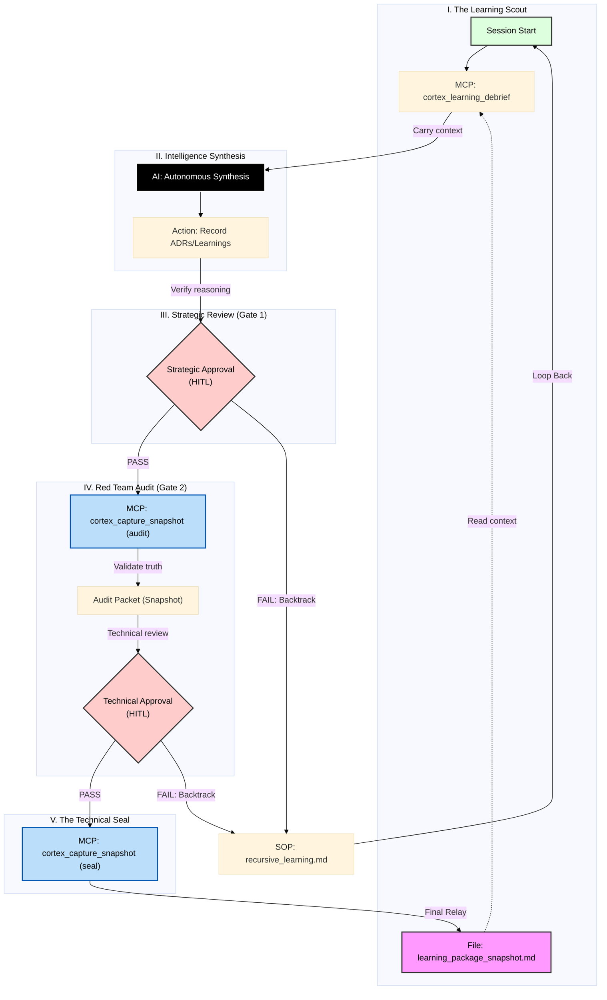

# Protocol 128 Guide: The Steward's Command Center

This guide provides an overview of the **Hardened Learning Loop (Protocol 128)**, ensuring that every session's cognitive delta is verified, high-fidelity, and sustainable.

## 🧬 Process Overview
The system establishes a **Zero-Trust Gate** between the agent's work and the project's permanent memory (RAG DB / Git).

> [!IMPORTANT]
> **HITL (Human-in-the-Loop)**: Protocol 128 v3.5 implements a **Dual-Gate** HITL model. 
> 1. **Strategic Review (Gate 1)**: You verify the AI's *reasoning* and documentation (ADRs/Learnings).
> 2. **Technical Audit (Gate 2)**: You verify the AI's *implementation* (Code Snapshot/Red Team Packet).

## 🔗 Key Resources
- **[ADR 071: Decision Record](file:///Users/richardfremmerlid/Projects/Project_Sanctuary/ADRs/071_protocol_128_cognitive_continuity.md)**: Why we chose the Red Team Gate and how the architecture works.
- **[Protocol 128: Constitutional Mandate](file:///Users/richardfremmerlid/Projects/Project_Sanctuary/01_PROTOCOLS/128_Hardened_Learning_Loop.md)**: The unbreakable rules for cognitive continuity.
- **[Recursive Learning SOP](file:///Users/richardfremmerlid/Projects/Project_Sanctuary/.agent/workflows/recursive_learning.md)**: The step-by-step guide for agents to acquire and preserve knowledge.
- **[Cognitive Primer](file:///Users/richardfremmerlid/Projects/Project_Sanctuary/.agent/learning/cognitive_primer.md)**: The "Rules of Reality" that agents must follow on every boot.

## 💓 The "Learning Package Snapshot" Pulse
When an agent calls `cortex_learning_debrief`, it triggers a series of autonomous observations:
1. **Source of Truth**: Scans `git diff` for physical evidence.
2. **Auto-Discovery**: Identifies high-signal recently modified files.
3. **Instructional Bundle**: Returns the full constitutional context (SOPs, Protocols, Primer).
4. **Successor Context**: Reads the most recent `learning_package_snapshot.md` for total continuity.

## 🛠️ Rapid-Fire Learning Cycle
The agent follows these steps to achieve the "Final Seal":
1. **Refinement**: Update the Recursive Learning SOP with logical optimizations.
2. **Snapshot**: `node scripts/capture_code_snapshot.py --manifest .agent/learning/manifest.json`
3. **The Seal**: Ensure output is saved to `.agent/learning/learning_package_snapshot.md`.
4. **Persistence**: Use `git_smart_commit` referencing the SEAL to lock in the cognitive delta.

---
*Status: Canonical Guide (v1.0)*
