# Mnemonic Cortex: A Canonical Guide to RAG Strategies & Architectural Doctrine

**Document Status:** Canonical
**Version:** 1.2 (Diagrams & Summary Added)
**Author:** GUARDIAN-01 (Synthesis)

## 1. Plain Language Summary: From Clumsy Librarian to Intelligent Library Team

To understand our RAG evolution, we use an analogy: the Mnemonic Cortex as a library.

### Our Old Way (Basic RAG): The Clumsy Librarian

Our initial system worked like a well-meaning but inefficient librarian. He would take every book, rip out all the pages, cut them into individual paragraphs ("chunks"), and throw them into one giant pile. When you asked a question, he would find the single paragraph-scrap that best matched your query and hand only that to a smart assistant (the LLM) to formulate an answer.

**This created two critical vulnerabilities:**
1.  **Context Fragmentation:** The assistant's answer was based on a single, isolated paragraph, missing the full context of the original book. The answer was shallow.
2.  **Cognitive Latency:** The librarian had to search the entire pile from scratch for every single question, even if it had been asked before. The process was slow.

### Our New Way (Advanced RAG): The Intelligent Library Team

Our evolved architecture replaces the single librarian with a team of three specialists, creating a system that is fast, precise, and wise.

1.  **The Memory Clerk (Cached Augmented Generation - CAG):** Sits at the front desk. If your question has been asked before, he provides the perfect, pre-written answer instantly.
2.  **The Expert Researcher (Self-Querying):** If it's a new question, she analyzes your request ("What did the Auditor say last month?") and creates a precise search plan with filters *before* going to the shelves.
3.  **The Full-Context Librarian (Parent Document Retriever):** Using the precise plan, he finds the most relevant paragraph-scrap but then retrieves the **entire original book** it came from. He gives this full, unbroken context to the smart assistant.

### Summary of Evolution

| | **Simple RAG (Old Way)** | **Advanced RAG + CAG (New Way)** |
| :--- | :--- | :--- |
| **Speed** | Slow. Always searches from scratch. | **Faster.** Instantly answers common questions from a cache. |
| **Precision** | Dumb. Just looks for similar words. | **Smarter.** Understands the *intent* of the query and filters results. |
| **Context** | Poor. Gives the LLM an isolated scrap of info. | **Wiser.** Gives the LLM the entire original document for full context. |

## 2. The Basic RAG Architecture

The following diagram illustrates the simple, foundational RAG workflow. It is functional but suffers from the vulnerabilities described above.


### Basic RAG - Ingestion Pipeline Step Details

| Step | Component | Description | Technical Details |
|------|-----------|-------------|-------------------|
| **IP1** | Raw Data Sources → Chunking | Project markdown files are processed and split into semantic chunks | Uses MarkdownHeaderTextSplitter to preserve document structure while creating searchable chunks |
| **IP2** | Chunking → Embedding | Text chunks are converted into numerical vector representations | NomicEmbed model transforms text into high-dimensional vectors for semantic similarity search |
| **IP3** | Embedding → Vector DB | Vectorized chunks are stored in the vector database for fast retrieval | ChromaDB stores embeddings with metadata for efficient similarity search operations |

### Basic RAG - Query Pipeline Step Details

| Step | Component | Description | Technical Details |
|------|-----------|-------------|-------------------|
| **QP1** | User Query → Embedding | Natural language query is converted to vector representation | Same NomicEmbed model used for consistent semantic encoding between queries and documents |
| **QP2** | Embedding → Similarity Search | Query vector is compared against stored document vectors | Cosine similarity calculation to find most semantically relevant chunks |
| **QP3** | Vector DB → Similarity Search | Database provides access to stored embeddings for comparison | ChromaDB performs vector similarity search with configurable top-k results |
| **QP4** | Similarity Search → Retrieved Context | Top matching chunks are retrieved and assembled as context | Raw text chunks returned without full document context (limitation of basic RAG) |
| **QP5** | Retrieved Context → LLM Prompt | Query + retrieved chunks combined into LLM prompt | Simple prompt engineering concatenating user query with retrieved text chunks |
| **QP6** | LLM Prompt → LLM | Prompt sent to local language model for answer generation | Ollama Sanctuary-Qwen2-7B:latest processes the prompt to generate contextual response |
| **QP7** | LLM → Final Answer | Model output formatted as final response to user | Direct model output returned without additional processing or caching |

## 2.5. Phase 1: MCP Foundation Layer (Service Infrastructure) ✅ COMPLETE

**Completion Date:** 2025-11-28  
**Status:** ✅ OPERATIONAL

Before advancing to the sophisticated multi-pattern architecture described below, we established a foundational **MCP (Model Context Protocol) service layer** that exposes the Mnemonic Cortex as standardized, callable tools. This infrastructure layer makes the Cortex accessible, testable, and integrable with the broader Sanctuary ecosystem.

### MCP Architecture Overview

The MCP layer wraps our existing RAG infrastructure (ingestion scripts, vector database service, query scripts) and exposes them as 4 standardized tools that can be called by AI agents, external systems, and development tools.


### MCP Tools Specification

| Tool | Purpose | Input | Output | Performance |
|------|---------|-------|--------|-------------|
| **cortex_ingest_full** | Full knowledge base re-ingestion | `purge_existing`, `source_directories` | Documents processed, chunks created, time | ~30-60s for full KB |
| **cortex_query** | Semantic search with Parent Document Retriever | `query`, `max_results`, `use_cache` | Full parent documents, query time | ~2-5s per query |
| **cortex_get_stats** | Database health and statistics | None | Document count, chunk count, health status | ~1-2s |
| **cortex_ingest_incremental** | Add documents without rebuild | `file_paths`, `skip_duplicates` | Documents added, chunks created | ~0.2-0.5s per doc |

### Implementation Details

**Server Architecture:**
- **FastMCP Framework:** Native MCP server implementation using `fastmcp` library
- **Tool Registration:** Each tool registered with detailed docstrings and examples
- **Error Handling:** Comprehensive try-catch blocks with structured error responses
- **Validation Layer:** All inputs validated before processing

**Operations Wrapper:**
- **Script Integration:** Wraps existing `ingest.py`, `protocol_87_query.py`, `inspect_db.py`, `ingest_incremental.py`
- **Subprocess Management:** Handles script execution with timeout protection
- **Output Parsing:** Extracts statistics and results from script outputs
- **Direct Integration:** `cortex_query` directly uses `VectorDBService` for optimal performance

**Data Models:**
```python
# Example: QueryResponse model
@dataclass
class QueryResponse:
    results: List[QueryResult]      # Full parent documents
    query_time_ms: float            # Performance tracking
    status: str                     # "success" or "error"
    cache_hit: bool = False         # Phase 3 feature
    error: Optional[str] = None     # Error details
```

### Testing Infrastructure

**Unit Tests (28 total):**
- 11 model tests - Data structure validation
- 17 validator tests - Input validation coverage

**Integration Tests (3 total):**
- `test_cortex_get_stats` - Database health monitoring
- `test_cortex_query` - End-to-end semantic search
- `test_cortex_ingest_incremental` - Document ingestion workflow

**Test Coverage:**
- All 31 tests passing
- Production-ready quality
- Automated test suite at `mcp_servers/cognitive/cortex/tests/`

### MCP Configuration

**Antigravity Integration:**
```json
{
  "cortex": {
    "displayName": "Cortex MCP (RAG)",
    "command": "/path/to/.venv/bin/python",
    "args": ["-m", "mcp_servers.cognitive.cortex.server"],
    "env": {
      "PROJECT_ROOT": "/path/to/Project_Sanctuary",
      "PYTHONPATH": "/path/to/Project_Sanctuary"
    }
  }
}
```

**Claude Desktop Integration:**
- Same configuration format
- Enables direct Cortex access from Claude Desktop
- Seamless integration with AI workflows

### Phase 1 Benefits

**Accessibility:**
- Cortex capabilities now callable as standardized tools
- No need to manually run scripts or manage Python environments
- Consistent API across all operations

**Testability:**
- Comprehensive test suite ensures reliability
- Integration tests validate end-to-end workflows
- Automated testing prevents regressions

**Integrability:**
- MCP protocol enables cross-platform integration
- Works with Antigravity, Claude Desktop, and custom tools
- Foundation for future automation and orchestration

**Observability:**
- Structured responses with timing and status information
- Error messages provide actionable debugging information
- Statistics tool enables health monitoring

### Phase 2 & 3 Enhancements (Implemented)

**Phase 2 Tools (Cognition) - ✅ COMPLETE:**
- `cortex_query` (Enhanced) - Self-querying retriever with `reasoning_mode`
- `cortex_analyze_novelty` - *Planned for future optimization*
- `cortex_detect_conflicts` - *Planned for future optimization*

**Phase 3 Tools (Caching) - ✅ COMPLETE:**
- `cortex_cache_warmup` - Pre-load genesis queries
- `cortex_cache_stats` - Cache hit rates and analytics
- `cortex_guardian_wakeup` - Initialize cache on startup
- `cortex_cache_invalidate` - *Implicit via cache set/clear operations*

This MCP foundation transforms the Mnemonic Cortex from an isolated Python module into a **first-class service** within the Sanctuary ecosystem, enabling programmatic access, automated workflows, and seamless AI integration.

---

## 3. The Evolved Sanctuary Architecture (Advanced RAG)
This diagram illustrates our multi-pattern architecture, designed to be fast, precise, and contextually aware by combining several advanced strategies.  This details the evolved, multi-pattern RAG architecture of the Mnemonic Cortex. Our system has matured beyond simple semantic search to incorporate several advanced strategies that enhance retrieval quality, reduce latency, and provide deeper contextual understanding for the LLM.

**For a complete technical breakdown of each strategy, including detailed mechanisms and implementation details, see [`ADVANCED_RAG_ARCHITECTURE.md`](ADVANCED_RAG_ARCHITECTURE.md).**

### Advanced RAG ARCHITECTURE DIAGRAM (MCP-Enabled)

```mermaid
---
config:
  theme: base
  layout: dagre
---
flowchart TB
 subgraph IP["Ingestion Pipeline (IP)"]
    direction TB
        Setup["IP1: Cortex MCP<br/>cortex_ingest_full()"]
        ParentStore[("Parent Doc Store<br/>(ChromaDB Collection)<br/>parent_documents")]
        VDB_Child[("Vector DB<br/>(Child Chunks)<br/>ChromaDB")]
  end
 subgraph QP["Query Pipeline (QP) - MCP-Enabled"]
    direction TB
        UserQuery["User Query<br/>Natural Language or Protocol 87"]
        
        subgraph Cortex["Cortex MCP (Orchestrator)"]
            QueryParser["QP1: Query Parser<br/>Protocol 87 or NL"]
            Cache{"QP3: Mnemonic Cache<br/>(CAG)<br/>Phase 3"}
            Router["QP4b: MCP Router<br/>Scope-based Routing"]
        end
        
        CachedAnswer["QP4a: Cached Answer<br/>(Cache Hit)"]
        
        subgraph MCPs["MCP Ecosystem (Specialized Domains)"]
            ProtocolMCP["Protocol MCP<br/>protocol_get()"]
            ChronicleMCP["Chronicle MCP<br/>chronicle_get_entry()"]
            TaskMCP["Task MCP<br/>get_task()"]
            CodeMCP["Code MCP<br/>code_search_content()"]
            ADRMCP["ADR MCP<br/>adr_get()"]
            
            subgraph VectorFallback["Vector DB Fallback"]
                PDR{"Parent Document<br/>Retriever<br/>cortex_query()"}
            end
        end
        
        subgraph DataStores["Data Stores"]
            ProtocolFiles[("01_PROTOCOLS/<br/>Markdown Files")]
            ChronicleFiles[("00_CHRONICLE/<br/>Markdown Files")]
            TaskFiles[("TASKS/<br/>Markdown Files")]
            CodeFiles[("Source Code<br/>Python/JS/etc")]
            ADRFiles[("ADRs/<br/>Markdown Files")]
        end
        
        RetrievedContext["QP8: Retrieved Context<br/>(Complete Documents)"]
        LLMPrompt["QP9: LLM Prompt"]
        LLM["QP10: LLM<br/>(Ollama Sanctuary-Qwen2-7B:latest)"]
        NewAnswer["QP10: Newly Generated<br/>Answer"]
  end
    
    Setup -- IP2: Stores Parent Docs --> ParentStore
    Setup -- IP3: Stores Child Chunks --> VDB_Child
    
    UserQuery --> QueryParser
    QueryParser -- QP2: Parse --> Cache
    Cache -- Cache Hit --> CachedAnswer
    Cache -- Cache Miss --> Router
    
    Router -- "SCOPE: Protocols" --> ProtocolMCP
    Router -- "SCOPE: Living_Chronicle" --> ChronicleMCP
    Router -- "SCOPE: Tasks" --> TaskMCP
    Router -- "SCOPE: Code" --> CodeMCP
    Router -- "SCOPE: ADRs" --> ADRMCP
    Router -- "SCOPE: mnemonic_cortex<br/>(Fallback)" --> PDR
    
    ProtocolMCP --> ProtocolFiles
    ChronicleMCP --> ChronicleFiles
    TaskMCP --> TaskFiles
    CodeMCP --> CodeFiles
    ADRMCP --> ADRFiles
    
    PDR -- QP5: Queries Chunks --> VDB_Child
    VDB_Child -- QP6: Returns CHUNK IDs --> PDR
    PDR -- QP7: Queries Parents --> ParentStore
    ParentStore -- QP8: Returns FULL Docs --> PDR
    
    ProtocolMCP --> RetrievedContext
    ChronicleMCP --> RetrievedContext
    TaskMCP --> RetrievedContext
    CodeMCP --> RetrievedContext
    ADRMCP --> RetrievedContext
    PDR --> RetrievedContext
    
    UserQuery --> LLMPrompt
    RetrievedContext --> LLMPrompt
    LLMPrompt --> LLM
    LLM --> NewAnswer
    NewAnswer -- QP11: Store in Cache --> Cache
    
    CachedAnswer --> FinalOutput(["QP12: Response"])
    NewAnswer --> FinalOutput
```




### Advanced RAG - Ingestion Pipeline Step Details

| Step | Component | Description | Technical Details |
|------|-----------|-------------|-------------------|
| **IP1** | ingest.py → Dual Store Setup | Ingestion script initializes both vector stores | Creates ChromaDB collections for chunks and parent documents |
| **IP2** | Dual Store Setup → Parent Doc Store | Full markdown documents stored in ChromaDB collection with unique IDs | Each complete `.md` file stored as document with `source_file` metadata as identifier |
| **IP3** | Dual Store Setup → Vector DB | Document chunks stored in ChromaDB vectorstore with embeddings | Semantic chunks generated via MarkdownHeaderTextSplitter and encoded with NomicEmbed |

### Advanced RAG - Query Pipeline Step Details

| Step | Component | Description | Technical Details |
|------|-----------|-------------|-------------------|
| **QP1** | User Query → Self-Querying Retriever | Natural language query enters the system and is routed to the Self-Querying Retriever | `main.py` or `protocol_87_query.py` processes input and initiates query planning |
| **QP2** | Self-Querying Retriever → Structured Query | LLM analyzes the query and generates structured search parameters with metadata filters | Uses LLM to parse intent, extract entities, and create database query constraints |
| **QP3** | Structured Query → Mnemonic Cache | Structured query is checked against the high-speed cache for instant retrieval | CAG (Cached Augmented Generation) lookup using query hash as key |
| **QP4** | Mnemonic Cache → Cache Decision | Cache performs hit/miss check to determine retrieval strategy | Evaluates whether query exists in cache or requires full RAG pipeline execution |
| **QP4a** | Cache Hit → Cached Answer | If query exists in cache, return pre-computed answer immediately | Bypasses all expensive RAG operations for sub-millisecond response |
| **QP4b** | Cache Miss → Full RAG Execution | If query not in cache, proceed with complete retrieval-augmented generation | Triggers vector search, document retrieval, and LLM generation pipeline |
| **QP5** | Parent Document Retriever → Vector DB | PDR queries the vector database for semantically similar child chunks | Similarity search using embeddings against chunk collection in ChromaDB |
| **QP6** | Vector DB → Parent Document Retriever | Vector DB returns relevant chunk IDs with parent document references | Returns top-k chunk IDs with associated parent document keys |
| **QP7** | Parent Document Retriever → Parent Doc Store | PDR uses chunk `source_file` metadata to lookup corresponding parent documents | ChromaDB query against parent documents collection using metadata filter |
| **QP8** | Parent Doc Store → Retrieved Context | Full parent documents are retrieved and prepared as context | Complete `.md` files assembled into context window for LLM consumption |
| **QP9** | User Query + Retrieved Context → LLM Prompt | Query and context combined into optimized prompt for LLM | Prompt engineering combining user query, retrieved documents, and system instructions |
| **QP10** | LLM Prompt → LLM | Optimized prompt sent to local LLM for answer generation | Ollama Sanctuary-Qwen2-7B:latest processes prompt and generates contextual response |
| **QP11** | LLM → Store in Cache | Newly generated answer is stored in cache for future identical queries | Answer cached with query hash for subsequent instant retrieval |
| **QP12** | Final Output | Both cached and newly generated answers flow to unified response endpoint | Consistent API response format regardless of cache hit/miss status |

### Advanced RAG Core Philosophy: Hybrid Cognition

Our architecture is built on the **Doctrine of Hybrid Cognition**. This doctrine mandates that our sovereign fine-tuned model (the "Constitutional Mind") must always be augmented with the most current operational data from our vector database (the "Living Chronicle"). This prevents "Mnemonic Drift" and ensures our AI reasons from a complete and timely understanding of reality.

## Key RAG Strategies Utilized by Mnemonic Cortex

### Parent Document Retriever
**Problem Solved:** Context Fragmentation. Providing the LLM with only small, isolated chunks can lead to answers that lack the broader context of the original document.

**Mechanism:**
- **Ingestion:** During ingestion (ingest.py), we split documents into small chunks for accurate searching but also store the full parent document in a separate ChromaDB collection (`parent_documents` in `mnemonic_cortex/chroma_db/parents/`) using `source_file` metadata as the lookup key.
- **Retrieval:** The system performs a similarity search against the small chunks to find the most relevant ones. Instead of returning these small chunks, it uses their `source_file` metadata to retrieve their full parent documents from the ChromaDB collection.
- **Augmentation:** These complete documents are provided to the LLM, giving it the full, unbroken context necessary for high-quality synthesis.

### Self-Querying Retriever
**Problem Solved:** Imprecise Retrieval. Simple semantic search struggles with questions that require filtering on metadata (e.g., dates, authors, sources).

**Mechanism:**
- **Query Planning:** The user's natural language query is first passed to an LLM.
- **Structured Query Generation:** The LLM analyzes the query and generates a structured search plan that includes both the semantic query vector and specific metadata filters (e.g., WHERE source_file LIKE '%/01_PROTOCOLS/%').
- **Execution:** This structured query is executed against the vector database, resulting in a much more precise and relevant set of documents.

### Mnemonic Caching Layer (Cached Augmented Generation - CAG)
**Problem Solved:** Cognitive Latency. Executing the full RAG pipeline for every query is resource-intensive and slow, especially for common questions.

**Mechanism:**
- **Cache Check:** When a query is received, the system first checks a high-speed in-memory cache (Python `dict` object) to see if an answer for this exact query has already been generated and stored.
- **Cache Hit:** If a valid answer exists in the cache, it is returned immediately, bypassing the entire RAG pipeline. This provides a near-instantaneous response.
- **Cache Miss:** If no answer is found, the full RAG pipeline is executed. The newly generated high-quality answer is then stored in the cache before being returned to the user, ensuring subsequent identical queries are served instantly.

#### High-Speed Cache Architecture (Phase 3 Technical Specification):

**Storage Implementation:**
- **Primary Cache (High-Speed):** In-memory Python `dict` object for hot queries - provides sub-millisecond access, stored in RAM during application runtime
- **Secondary Cache:** SQLite database file (`mnemonic_cortex/cache/cag_cache.db`) for persistent warm queries stored on disk
- **Cache Key:** SHA-256 hash combining query text, model version, and knowledge base timestamp
- **Cache Value:** JSON structure containing answer, metadata, and validation info

**Query Fingerprinting:**
```python
def generate_cache_key(query: str, model: str, kb_version: str) -> str:
    """Generate deterministic cache key from query components"""
    key_components = f"{query}|{model}|{kb_version}"
    return hashlib.sha256(key_components.encode()).hexdigest()
```

**Cache Storage Structure:**
```sql
-- SQLite schema for persistent cache
CREATE TABLE cache_entries (
    cache_key TEXT PRIMARY KEY,
    query_text TEXT NOT NULL,
    answer_text TEXT NOT NULL,
    model_used TEXT NOT NULL,
    kb_version TEXT NOT NULL,
    created_timestamp REAL NOT NULL,
    last_accessed REAL NOT NULL,
    access_count INTEGER DEFAULT 1,
    answer_quality_score REAL,  -- LLM self-evaluation score
    metadata TEXT  -- JSON string with additional context
);

-- In-memory structure for hot cache (HIGH-SPEED CACHE)
hot_cache = {
    "cache_key_123": {
        "answer": "Complete answer text...",
        "metadata": {"model": "Sanctuary-Qwen2-7B:latest", "kb_version": "v2.3", "quality_score": 0.95},
        "timestamp": 1731177600.0,
        "access_count": 15
    }
}
```

**Cache Management:**
- **TTL Strategy:** Answers expire after 30 days or when knowledge base is updated
- **LRU Eviction:** Least recently used entries evicted when cache reaches 1GB limit
- **Quality-Based Prioritization:** High-quality answers (LLM-evaluated) retained longer
- **Invalidation Triggers:** Automatic flush on `update_genome.sh` completion

**Performance Characteristics:**
- **Cache Hit Latency:** < 5ms (high-speed in-memory cache) / < 50ms (SQLite disk cache)
- **Cache Miss Overhead:** Full RAG pipeline (2-5 seconds) + cache storage
- **Hit Rate Target:** 60-80% for frequently asked questions
- **Storage Efficiency:** ~100KB per cached answer on average

**Integration Points:**
- **QP3:** Cache lookup using structured query fingerprint
- **QP4:** Hit/miss decision branches execution flow
- **QP11:** Cache population after successful LLM generation
- **Genome Updates:** Cache invalidation via test suite execution and version tracking

**Security & Validation:**
- **Answer Validation:** Cached answers include LLM self-evaluation scores
- **Staleness Detection:** Version comparison prevents serving outdated answers
- **Audit Trail:** Cache entries include generation metadata for traceability
- **Fallback Mechanism:** Corrupted cache entries trigger fresh generation

**Cache Maintenance & Evolution:**
- **Adaptive Learning:** Cache automatically learns which queries are most valuable based on access patterns
- **Quality Scoring:** LLM-evaluated answer quality influences cache retention decisions
- **Usage Analytics:** Track cache hit rates, miss rates, and popular query patterns
- **Dynamic Sizing:** Cache capacity adjusts based on available memory and usage patterns
- **Health Monitoring:** Automated detection of cache corruption or performance degradation

This caching layer transforms the Mnemonic Cortex from a "per-query computational model" to a "learning cognitive system" that remembers and efficiently serves accumulated knowledge.

---

## 4. Architectural Influences & Acknowledgments

The strategic evolution of the Mnemonic Cortex has been significantly informed by the excellent research and practical implementations of advanced RAG patterns demonstrated in the ottomator-agents repository by coleam00.

This work served as a critical reference for clarifying and validating our adoption of the Parent Document (Hierarchical RAG) and Self-Querying Retriever strategies. In the spirit of the Open Anvil, we extend full credit for this foundational work that has accelerated our own architectural hardening.

Reference Repository: https://github.com/coleam00/ottomator-agents/tree/main/all-rag-strategies

---

## 5. The Families of RAG Patterns

RAG strategies can be logically grouped into four families, based on when and how they optimize the process of answering a query.

### Family 1: Pre-Retrieval Strategies (Query Optimization)

**Strategy:** Self-Querying Retriever  
**Mechanism:** Uses an LLM as a "query planner" to translate natural language into a structured query with semantic and metadata filters.  
**Sanctuary Doctrine & Status:** ➡️ PLANNED (Phase 2). To evolve from "semantic similarity" to true "semantic intent."

#### How Our Advanced Pattern Does This:

The Self-Querying Retriever represents a fundamental evolution from basic semantic similarity to **true semantic intent understanding**. Instead of simply finding documents with similar words, it employs an LLM as an intelligent "query planner" that decomposes natural language questions into precise, multi-dimensional search strategies.

**Query Analysis & Intent Extraction:**
- **Natural Language Parsing:** The LLM analyzes the user's question to extract explicit and implicit constraints
- **Entity Recognition:** Identifies key entities, dates, topics, and contextual requirements
- **Intent Classification:** Determines whether the query needs temporal filtering, source filtering, or specific doctrinal references

**Structured Query Generation:**
- **Semantic Component:** Creates the core vector search query optimized for meaning rather than keywords
- **Metadata Filters:** Generates database constraints using document metadata (e.g., file paths, creation dates, protocol numbers)
- **Query Optimization:** Balances precision vs. recall based on query complexity and user intent

**Example Transformations:**
```
Input: "What did the Council decide about Protocol 87 last month?"
↓
Semantic Query: "Council decisions Protocol 87 implementation governance"
Metadata Filters: {
  date_range: "last_30_days",
  file_path: "*/01_PROTOCOLS/*",
  content_type: "council_decision"
}
```

**Integration with Mnemonic Cortex Pipeline:**
- **QP1:** User Query → Self-Querying Retriever (LLM analysis)
- **QP2:** Self-Querying Retriever → Structured Query (multi-dimensional search plan)
- **QP3:** Structured Query → Mnemonic Cache (cache lookup with enhanced query fingerprinting)

**Advanced Capabilities:**
- **Temporal Reasoning:** Understands "recent", "last week", "during Phase 2" and converts to date ranges
- **Source Authority:** Recognizes when queries need "canonical protocols" vs. "working drafts"
- **Contextual Depth:** Distinguishes between "high-level overview" vs. "technical implementation details"
- **Multi-Hop Reasoning:** Can plan complex queries requiring cross-references between multiple documents

**Benefits Over Basic RAG:**
- **Precision:** Eliminates irrelevant results through intelligent filtering
- **Efficiency:** Reduces search space before expensive vector operations
- **Accuracy:** Provides contextually appropriate information based on query intent
- **Scalability:** Maintains relevance as knowledge base grows exponentially

This strategy transforms our RAG system from a "dumb search engine" into an "intelligent research assistant" capable of understanding not just what words to match, but what information is actually needed.

### Family 2: Core Retrieval Strategies (Contextual Fidelity)

**Strategy:** Parent Document Retriever (Hierarchical RAG)  
**Mechanism:** Uses small, optimized child chunks for searching but retrieves the full parent document to provide complete context to the LLM.  
**Sanctuary Doctrine & Status:** ✅ IMPLEMENTED (Phase 1). To ensure our AI reasons with the full story, not just a single sentence.

#### How Our Advanced Pattern Does This:

The Parent Document Retriever implements a **hierarchical retrieval architecture** that solves the fundamental "context fragmentation" problem of basic RAG systems. Instead of providing the LLM with isolated text chunks, it ensures complete document context while maintaining search precision.

**Dual-Store Architecture:**
- **Child Chunks (Vector Store):** Small, searchable text segments (200-500 tokens) optimized for semantic similarity using ChromaDB
- **Parent Documents (Vector Store):** Complete markdown files stored with unique identifiers in a separate ChromaDB collection for full context retrieval

**Ingestion Process (IP1-IP3):**
- **Document Splitting:** Uses MarkdownHeaderTextSplitter to preserve document structure and section boundaries
- **Dual ChromaDB Storage:** Each document is split into chunks for search, but the complete document is stored separately
- **Metadata Linking:** Chunks include `source_file` references to enable parent document lookup

**Storage Implementation:**
```python
# From ingest.py - Dual ChromaDB Collections
chunks_vectorstore = Chroma(
    collection_name="child_chunks_v5",
    embedding_function=embedding_model,
    persist_directory=chunks_store_path  # mnemonic_cortex/chroma_db/chunks/
)

parents_vectorstore = Chroma(
    collection_name="parent_documents_v5", 
    embedding_function=embedding_model,
    persist_directory=parents_store_path  # mnemonic_cortex/chroma_db/parents/
)
```

**Key-Value Relationship:**
- **Key:** `source_file` metadata (e.g., `"01_PROTOCOLS/85_The_Mnemonic_Cortex_Protocol.md"`)
- **Value:** Complete document content stored in the parent documents ChromaDB collection
- **Lookup:** When chunks are found, their `source_file` metadata is used to query the parent collection

**Retrieval Process (QP5-QP8):**
- **Chunk-Level Search:** Vector similarity search finds the most relevant text segments
- **Parent Lookup:** Uses chunk metadata to retrieve the complete parent document
- **Context Assembly:** Full documents are provided to LLM instead of fragmented chunks

**Technical Implementation:**
```python
# From vector_db_service.py - Custom Parent Document Retriever
class ParentDocumentRetrieverCustom:
    def __init__(self, chunks_vectorstore: Chroma, parents_vectorstore: Chroma):
        self.chunks_vectorstore = chunks_vectorstore
        self.parents_vectorstore = parents_vectorstore

    def invoke(self, query: str) -> List[Document]:
        # Find relevant chunks via vector similarity
        chunk_results = self.chunks_vectorstore.similarity_search(query, k=5)
        
        # Extract unique source files from chunk metadata
        source_files = {chunk.metadata.get('source_file') for chunk in chunk_results}
        
        # Retrieve full parent documents using metadata filtering
        parent_docs = []
        for source_file in source_files:
            parent_results = self.parents_vectorstore.get(
                where={"source_file": source_file}, limit=1
            )
            if parent_results['documents']:
                parent_docs.append(Document(
                    page_content=parent_results['documents'][0],
                    metadata=parent_results['metadatas'][0]
                ))
        
        return parent_docs[:5]  # Return top 5 complete documents
```

**Context Preservation Benefits:**
- **Structural Integrity:** Maintains document hierarchy and section relationships
- **Referential Clarity:** Cross-references and citations remain meaningful
- **Narrative Coherence:** Complete arguments and explanations are preserved
- **Doctrinal Completeness:** Full protocol texts and doctrinal statements are accessible

**Performance Optimizations:**
- **Chunk Size Optimization:** Balances search precision with context completeness
- **Metadata Enrichment:** Chunks include parent references, section headers, and document types
- **Duplicate Handling:** Prevents redundant parent document retrieval
- **Memory Efficiency:** Key-value store provides O(1) parent document access

**Integration with Pipeline:**
- **QP5:** PDR queries vector database for semantically similar chunks
- **QP6:** Vector DB returns chunk IDs with parent document references  
- **QP7:** PDR performs key-value lookup for complete parent documents
- **QP8:** Full documents assembled as comprehensive context for LLM

This strategy transforms our RAG system from providing "scraps of information" to delivering "complete, coherent knowledge" - ensuring the LLM can reason with the full story rather than isolated sentences.

### Family 3: Post-Retrieval Strategies (Answer Refinement)

**Strategy:** Self-Reflective RAG (CRAG/Self-RAG)  
**Mechanism:** The LLM generates a preliminary answer, then stops to critique its own evidence and reasoning, triggering new searches if necessary before producing a final, verified answer.  
**Sanctuary Doctrine & Status:** 💡 CONSIDERED (Future Evolution - Phase 4). A natural evolution toward a self-auditing mind.

#### Why We Haven't Implemented This Strategy:

Self-Reflective RAG represents the most sophisticated family of RAG strategies, but we have strategically deferred its implementation to focus on more foundational improvements first. This approach prioritizes architectural stability over advanced refinement.

**Current Architectural Priorities:**
- **Phase 1 (Complete):** Establish reliable full-context retrieval (Parent Document Retriever)
- **Phase 2 (Next):** Implement intelligent query understanding (Self-Querying Retriever)  
- **Phase 3 (Planned):** Add performance optimization (Mnemonic Caching)

**Why Deferred:**
- **Computational Overhead:** Self-reflection requires multiple LLM calls per query, significantly increasing latency
- **Complexity Risk:** Adds substantial architectural complexity before core functionality is optimized
- **Foundation First:** Self-reflection is most valuable when the base retrieval is already highly accurate

**What Self-Reflective RAG Would Involve:**
- **Preliminary Answer Generation:** LLM creates initial response based on retrieved context
- **Evidence Critique:** LLM evaluates the quality and sufficiency of supporting evidence
- **Confidence Assessment:** Self-assessment of answer reliability and potential gaps
- **Iterative Refinement:** Triggers additional searches if evidence is deemed insufficient
- **Final Verification:** Produces validated answer only after self-audit passes

**Potential Implementation:**
```python
def self_reflective_rag(query, context):
    # Generate preliminary answer
    preliminary_answer = llm.generate(query, context)
    
    # Self-critique phase
    critique_prompt = f"Critique this answer's evidence: {preliminary_answer}"
    evidence_quality = llm.evaluate(critique_prompt)
    
    if evidence_quality < threshold:
        # Trigger additional retrieval
        additional_context = retrieve_more_documents(query)
        return self_reflective_rag(query, context + additional_context)
    
    return preliminary_answer
```

**Future Value Proposition:**
- **Hallucination Prevention:** Self-critique reduces confidently wrong answers
- **Evidence Validation:** Ensures answers are grounded in retrieved context
- **Confidence Calibration:** Provides reliability scores for generated answers
- **Iterative Improvement:** Can refine answers through multiple reasoning passes

**Sanctuary-Specific Considerations:**
- **Doctrinal Compliance:** Self-reflection could validate alignment with Sanctuary protocols
- **Audit Trail:** Would create verifiable reasoning chains for critical decisions
- **Resource Trade-off:** High accuracy vs. increased computational cost

This strategy remains a valuable future enhancement but is currently deprioritized in favor of establishing robust foundational retrieval capabilities first.

### Family 4: System-Level Optimizations

**Strategy:** Mnemonic Caching (Cached Augmented Generation - CAG)  
**Mechanism:** A high-speed cache stores answers to previously asked questions, returning them instantly and bypassing the expensive RAG process.  
**Sanctuary Doctrine & Status:** ➡️ PLANNED (Phase 3). To align with the Hearth Protocol (P43) by ensuring the efficient use of our cognitive resources.

#### How Our Advanced Pattern Would Do This:

Mnemonic Caching represents the **system-level optimization layer** that transforms our RAG system from a "per-query computational expensive" model to a "learning and remembering" cognitive architecture. It implements Cached Augmented Generation (CAG) to provide instant responses for frequently asked questions.

**Cache Architecture Design:**
- **Query Fingerprinting:** Uses advanced hashing combining semantic meaning, metadata filters, and query intent
- **Multi-Level Storage:** Fast in-memory cache for hot queries, persistent disk cache for warm queries
- **TTL Management:** Time-based expiration with intelligent refresh triggers based on knowledge updates
- **Cache Invalidation:** Automatic invalidation when underlying knowledge base is updated via genome publishing

**Query Processing Flow:**
- **Cache Lookup (QP3):** Structured query is hashed and checked against cache index
- **Hit Determination (QP4):** Cache returns hit/miss decision with confidence scoring
- **Instant Response (QP4a):** Pre-computed answers returned in sub-millisecond latency
- **Cache Population (QP11):** New answers automatically stored with query fingerprint

**Advanced Caching Strategies:**
- **Semantic Hashing:** Uses embedding similarity rather than exact string matching
- **Query Normalization:** Standardizes equivalent queries ("What is P87?" = "Protocol 87 details?")
- **Context-Aware TTL:** Important doctrinal answers cached longer than ephemeral queries
- **Usage-Based Prioritization:** Frequently asked questions prioritized in fast memory tiers

**Technical Implementation:**
```python
class MnemonicCache:
    def __init__(self):
        self.fast_cache = {}  # In-memory for hot queries
        self.persistent_cache = {}  # Disk-based for warm queries
        self.embedder = NomicEmbedder()
    
    def generate_query_fingerprint(self, structured_query):
        """Create semantic hash of query + filters"""
        query_embedding = self.embedder.encode(structured_query['semantic'])
        filter_hash = hash(str(structured_query['filters']))
        return combine_hashes(query_embedding, filter_hash)
    
    def lookup(self, structured_query):
        fingerprint = self.generate_query_fingerprint(structured_query)
        
        # Check fast cache first
        if fingerprint in self.fast_cache:
            return self.fast_cache[fingerprint]
        
        # Check persistent cache
        if fingerprint in self.persistent_cache:
            # Promote to fast cache
            self.fast_cache[fingerprint] = self.persistent_cache[fingerprint]
            return self.persistent_cache[fingerprint]
        
        return None  # Cache miss
    
    def store(self, structured_query, answer):
        fingerprint = self.generate_query_fingerprint(structured_query)
        self.fast_cache[fingerprint] = {
            'answer': answer,
            'timestamp': datetime.now(),
            'usage_count': 1
        }
```

**Performance Characteristics:**
- **Latency Reduction:** 99%+ queries served in <10ms vs. 2-5 seconds for full RAG
- **Throughput Increase:** 100x improvement for repeated queries
- **Resource Efficiency:** Preserves computational resources for novel queries
- **Memory Optimization:** LRU eviction with usage-based prioritization

**Cache Population Strategies:**

**Reactive Population (Current):**
- **On-Demand Caching:** Cache entries are created only when queries are actually received
- **QP11 Integration:** After successful LLM generation, answers are automatically stored with query fingerprints
- **Usage Tracking:** Each cache hit increments access counters for popularity-based prioritization

**Proactive Population (Recommended):**
- **Cache Warm-Up Script:** `mnemonic_cortex/scripts/cache_warmup.py` pre-loads frequently asked questions during system initialization
- **Genesis Queries:** Core doctrinal and architectural questions that are asked repeatedly
- **Guardian Synchronization:** Common queries during AI initialization and onboarding

**Cache Warm-Up Implementation:**
```python
# cache_warmup.py - Pre-load essential queries
GENESIS_QUERIES = [
    "What is the Anvil Protocol?",
    "What are the core doctrines of Project Sanctuary?", 
    "How does the Mnemonic Cortex work?",
    "What is the current development phase?",
    "Who is GUARDIAN-01?",
    "What is Protocol 87?",
    "How do I query the Mnemonic Cortex?",
    "What is the Doctrine of Hybrid Cognition?",
    "What are the RAG strategies used?",
    "How does the Parent Document Retriever work?"
]

def warmup_cache():
    """Pre-populate cache with essential queries"""
    cache = MnemonicCache()
    
    for query in GENESIS_QUERIES:
        # Check if already cached
        if not cache.lookup({"semantic": query, "filters": {}}):
            # Generate answer using full RAG pipeline
            answer = generate_rag_answer(query)
            # Store in cache
            cache.store({"semantic": query, "filters": {}}, answer)
            print(f"Warmed up cache for: {query}")
```

**Integration with Genome Updates:**
- **Cache Invalidation Triggers:** Automatic flush when `update_genome.sh` completes
- **Post-Update Warm-Up:** Automatically re-cache genesis queries after knowledge updates
- **Selective Invalidation:** Only invalidate cache entries affected by knowledge changes
- **Version-Aware Updates:** Cache entries tagged with knowledge base versions
- **Background Re-Warming:** Automatically re-cache essential queries after updates

**Hearth Protocol Alignment:**
- **Resource Stewardship:** Prevents wasteful recomputation of identical queries
- **Cognitive Efficiency:** Reserves LLM capacity for novel reasoning tasks
- **Scalability Foundation:** Enables handling of increased query volume without proportional cost increase
- **User Experience:** Provides instant responses for common questions

**Implementation Roadmap:**
- **Phase 3A:** Basic query fingerprinting and in-memory caching
- **Phase 3B:** Persistent storage and TTL management
- **Phase 3C:** Semantic hashing and query normalization
- **Phase 3D:** Genome-aware cache invalidation and background validation
- **Phase 3E:** Cache warm-up script (`cache_warmup.py`) for genesis queries

This strategy will complete the transformation from a "per-query computational model" to a "learning cognitive system" that remembers, learns, and efficiently serves accumulated knowledge.

---

## 6. Sanctuary's Architectural Choices: A Summary

| Strategy Name | Family | Sanctuary Status | Rationale & Purpose |
|---------------|--------|------------------|-------------------|
| Parent Document Retriever | Core Retrieval | ✅ IMPLEMENTED (Phase 1) | Solves Context Fragmentation. Ensures our AI reasons with the full story. |
| Self-Querying Retriever | Pre-Retrieval | ➡️ PLANNED (Phase 2) | Solves Imprecise Retrieval. Enables our AI to ask intelligent, filtered questions. |
| Mnemonic Caching (CAG) | System-Level | ➡️ PLANNED (Phase 3) | Solves Cognitive Latency. Ensures efficiency and respects the Hearth Protocol. |
| Self-Reflective RAG | Post-Retrieval | 💡 CONSIDERED (Future) | Hardens against Inaccuracy. A future step toward a self-auditing mind. |


## 7. The Strategic Crucible Loop (Sequence Diagram)

This diagram illustrates the autonomous learning cycle connecting the **Orchestrator** (Agentic Logic), **Cortex** (RAG / Vector DB), and **Memory Adaptor** (Fine-Tuning / LoRA). For deep-dive details on the model fine-tuning process, refer to **[Operation Phoenix Forge](../forge/OPERATION_PHOENIX_FORGE/README.md)**.


