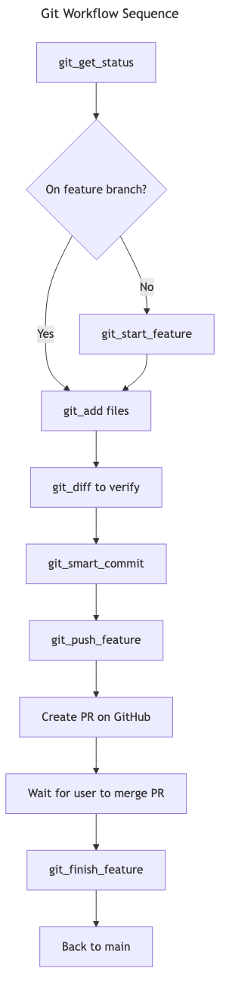

# MCP Operations Inventory

**Version:** 2.0  
**Status:** Living Document  
**Last Updated:** 2026-01-11  
**Purpose:** Comprehensive inventory of **Legacy MCP Server operations** and **Gateway Hosted Tools**, enabling a unified view of the hybrid fleet.

---

## Overview

This document tracks all operations across the Project Sanctuary ecosystem, mapping **Legacy Python Functions** to their modern **Gateway Tool** equivalents. It serves as the definitive source of truth for tool availability, testing status (Unit/Integration), and documentation.

**MCP Configuration Locations:**
- **Template:** [docs/architecture/mcp/claude_desktop_config_template.json](claude_desktop_config_template.json)
- **Claude Desktop:** `~/Library/Application Support/Claude/claude_desktop_config.json`
- **Antigravity:** `~/.gemini/` (Antigravity MCP configuration)

**Architecture Diagram:** [MCP Ecosystem Overview](../../architecture_diagrams/system/mcp_ecosystem_architecture_v3.mmd)

---

## Table of Contents

- [1. Chronicle MCP Server](#1-chronicle-mcp-server)
- [2. Protocol MCP Server](#2-protocol-mcp-server)
- [3. ADR MCP Server](#3-adr-mcp-server)
- [4. Task MCP Server](#4-task-mcp-server)
- [5. Git MCP Server](#5-git-mcp-server)
- [6. RAG Cortex MCP Server](#6-rag-cortex-mcp-server)
- [7. Forge LLM MCP Server](#7-forge-llm-mcp-server-fine-tuning)
- [8. Config MCP Server](#8-config-mcp-server)
- [9. Code MCP Server](#9-code-mcp-server)
- [10. Agent Persona MCP Server](#10-agent-persona-mcp-server)
- [11. Council MCP Server](#11-council-mcp-server-multi-agent-deliberation)
- [12. Orchestrator MCP Server](#12-orchestrator-mcp-server)
- [13. Workflow MCP Server](#13-workflow-mcp-server)
- [14. Learning MCP Server](#14-learning-mcp-server-protocol-128)
- [15. Evolution MCP Server](#15-evolution-mcp-server-protocol-131)
- [Appendix: Gateway Native Tools](#appendix-gateway-native-tools)
- [Testing Strategy](#testing-strategy)
- [Test Execution Commands](#test-execution-commands)
- [Related Documentation](#related-documentation)
- [Maintenance Notes](#maintenance-notes)

---

## Status Legend

**Test Harness (🧪):** Direct testing of underlying operations via pytest  
**Documentation (📝):** Operation is documented in README  
**MCP Tool Test (🤖):** Operation tested via LLM using MCP tool interface

| Symbol | Meaning |
|--------|---------|
| ✅ | Verified/Complete |
| ⚠️ | Partial/Warning |
| ❌ | Not tested/implemented |
| 🔄 | In progress |
| 🔧 | Needs implementation |

---

## 1. Chronicle MCP Server

**Domain:** Historical truth and canonical records  
**Directory:** `00_CHRONICLE/ENTRIES/`  
**Server Code:** [mcp_servers/chronicle/server.py](../../../mcp_servers/chronicle/server.py)  
**README:** [Chronicle MCP README](../../../mcp_servers/chronicle/README.md)  
**Class Diagram:** [../../../docs/architecture_diagrams/system/legacy_mcps/chronicle_mcp_server.mmd](../../../docs/architecture_diagrams/system/legacy_mcps/chronicle_mcp_server.mmd)

### Script Validation (Run First) 🧪
```bash
pytest tests/mcp_servers/chronicle/ -v
```
**Last Verification:** 2025-12-02 ✅ (9/9 passed - Task 087 Phase 1)

### LLM Prompting (MCP Verification) 🤖
> "Please create a new chronicle entry titled 'Test Entry' with content 'Testing Chronicle MCP' to verify the `chronicle_create_entry` tool."

### Configuration
```json
"chronicle": {
  "displayName": "Chronicle MCP",
  "command": "<PROJECT_ROOT>/.venv/bin/python",
  "args": ["-m", "mcp_servers.chronicle.server"],
  "env": {
    "PYTHONPATH": "<PROJECT_ROOT>",
    "PROJECT_ROOT": "<PROJECT_ROOT>"
  }
}
```

### Operations

| Legacy Operation | Gateway Tool | 🧪 Unit Test (Server) | � Integration Test (Gateway) | Description |
|---|---|---|---|---|
| `chronicle_create_entry` | `sanctuary-domain-chronicle-create-entry` | [test_operations.py](../../../tests/mcp_servers/chronicle/unit/test_operations.py) | [test_domain_gateway.py](../../../tests/mcp_servers/gateway/clusters/sanctuary_domain/test_domain_gateway.py) | Create new chronicle entry with auto-numbering |
| `chronicle_append_entry` | `sanctuary-domain-chronicle-append-entry` | [test_operations.py](../../../tests/mcp_servers/chronicle/unit/test_operations.py) | [test_domain_gateway.py](../../../tests/mcp_servers/gateway/clusters/sanctuary_domain/test_domain_gateway.py) | Alias for create_entry (fixed) |
| `chronicle_update_entry` | `sanctuary-domain-chronicle-update-entry` | [test_operations.py](../../../tests/mcp_servers/chronicle/unit/test_operations.py) | [test_domain_gateway.py](../../../tests/mcp_servers/gateway/clusters/sanctuary_domain/test_domain_gateway.py) | Update existing entry (7-day rule) |
| `chronicle_get_entry` | `sanctuary-domain-chronicle-get-entry` | [test_operations.py](../../../tests/mcp_servers/chronicle/unit/test_operations.py) | [test_domain_gateway.py](../../../tests/mcp_servers/gateway/clusters/sanctuary_domain/test_domain_gateway.py) | Retrieve specific entry by number |
| `chronicle_list_entries` | `sanctuary-domain-chronicle-list-entries` | [test_operations.py](../../../tests/mcp_servers/chronicle/unit/test_operations.py) | [test_domain_gateway.py](../../../tests/mcp_servers/gateway/clusters/sanctuary_domain/test_domain_gateway.py) | List recent entries with filters |
| `chronicle_read_latest_entries` | `sanctuary-domain-chronicle-read-latest-entries` | [test_operations.py](../../../tests/mcp_servers/chronicle/unit/test_operations.py) | [test_domain_gateway.py](../../../tests/mcp_servers/gateway/clusters/sanctuary_domain/test_domain_gateway.py) | Alias for list_entries (fixed) |
| `chronicle_search` | `sanctuary-domain-chronicle-search` | [test_operations.py](../../../tests/mcp_servers/chronicle/unit/test_operations.py) | [test_domain_gateway.py](../../../tests/mcp_servers/gateway/clusters/sanctuary_domain/test_domain_gateway.py) | Full-text search across entries |

**Prerequisite Tests:** [unit/test_validator.py](../../../tests/mcp_servers/chronicle/unit/test_validator.py)

---

## 2. Protocol MCP Server

**Domain:** Protocol creation and management  
**Directory:** `01_PROTOCOLS/`  
**Server Code:** [mcp_servers/protocol/server.py](../../../mcp_servers/protocol/server.py)  
**README:** [Protocol MCP README](../../../mcp_servers/protocol/README.md)  
**Class Diagram:** [../../../docs/architecture_diagrams/system/legacy_mcps/protocol_mcp_server.mmd](../../../docs/architecture_diagrams/system/legacy_mcps/protocol_mcp_server.mmd)

### Script Validation (Run First) 🧪
```bash
pytest tests/mcp_servers/protocol/ -v
```
**Last Verification:** 2025-12-02 ✅ (6/6 passed - Task 087 Phase 1)

### LLM Prompting (MCP Verification) 🤖
> "Please list all protocols with status 'CANONICAL' to verify the `protocol_list` tool."

### Configuration
```json
"protocol": {
  "displayName": "Protocol MCP",
  "command": "<PROJECT_ROOT>/.venv/bin/python",
  "args": ["-m", "mcp_servers.protocol.server"],
  "env": {
    "PYTHONPATH": "<PROJECT_ROOT>",
    "PROJECT_ROOT": "<PROJECT_ROOT>"
  }
}
```

### Operations

| Legacy Operation | Gateway Tool | 🧪 Unit Test (Server) | � Integration Test (Gateway) | Description |
|---|---|---|---|---|
| `protocol_create` | `sanctuary-domain-protocol-create` | [test_operations.py](../../../tests/mcp_servers/protocol/unit/test_operations.py) | [test_domain_gateway.py](../../../tests/mcp_servers/gateway/clusters/sanctuary_domain/test_domain_gateway.py) | Create new protocol with versioning |
| `protocol_update` | `sanctuary-domain-protocol-update` | [test_operations.py](../../../tests/mcp_servers/protocol/unit/test_operations.py) | [test_domain_gateway.py](../../../tests/mcp_servers/gateway/clusters/sanctuary_domain/test_domain_gateway.py) | Update protocol (requires version bump) |
| `protocol_get` | `sanctuary-domain-protocol-get` | [test_operations.py](../../../tests/mcp_servers/protocol/unit/test_operations.py) | [test_domain_gateway.py](../../../tests/mcp_servers/gateway/clusters/sanctuary_domain/test_domain_gateway.py) | Retrieve specific protocol by number |
| `protocol_list` | `sanctuary-domain-protocol-list` | [test_operations.py](../../../tests/mcp_servers/protocol/unit/test_operations.py) | [test_domain_gateway.py](../../../tests/mcp_servers/gateway/clusters/sanctuary_domain/test_domain_gateway.py) | List protocols with optional filters |
| `protocol_search` | `sanctuary-domain-protocol-search` | [test_operations.py](../../../tests/mcp_servers/protocol/unit/test_operations.py) | [test_domain_gateway.py](../../../tests/mcp_servers/gateway/clusters/sanctuary_domain/test_domain_gateway.py) | Full-text search across protocols |

**Prerequisite Tests:** [unit/test_validator.py](../../../tests/mcp_servers/protocol/unit/test_validator.py)

---

## 3. ADR MCP Server

**Domain:** Architecture Decision Records  
**Directory:** `mcp_servers/adr/`  
**Server Code:** [mcp_servers/adr/server.py](../../../mcp_servers/adr/server.py)  
**README:** [ADR MCP README](../../../mcp_servers/adr/README.md)  
**Class Diagram:** [../../../docs/architecture_diagrams/system/legacy_mcps/adr_mcp_server.mmd](../../../docs/architecture_diagrams/system/legacy_mcps/adr_mcp_server.mmd)

### Script Validation (Run First) 🧪
```bash
pytest tests/mcp_servers/adr/ -v
```
**Last Verification:** 2025-12-02 ✅ (13/13 passed - Task 087 Phase 1)

### LLM Prompting (MCP Verification) 🤖
> "Please search for ADRs related to 'database' to verify the `adr_search` tool."

### Configuration
```json
"adr": {
  "displayName": "ADR MCP",
  "command": "<PROJECT_ROOT>/.venv/bin/python",
  "args": ["-m", "mcp_servers.adr.server"],
  "env": {
    "PYTHONPATH": "<PROJECT_ROOT>",
    "PROJECT_ROOT": "<PROJECT_ROOT>"
  }
}
```

### Operations

| Legacy Operation | Gateway Tool | 🧪 Unit Test (Server) | � Integration Test (Gateway) | Description |
|---|---|---|---|---|
| `adr_create` | `sanctuary-domain-adr-create` | [test_operations.py](../../../tests/mcp_servers/adr/unit/test_operations.py) | [test_domain_gateway.py](../../../tests/mcp_servers/gateway/clusters/sanctuary_domain/test_domain_gateway.py) | Create new ADR with auto-numbering |
| `adr_update_status` | `sanctuary-domain-adr-update-status` | [test_operations.py](../../../tests/mcp_servers/adr/unit/test_operations.py) | [test_domain_gateway.py](../../../tests/mcp_servers/gateway/clusters/sanctuary_domain/test_domain_gateway.py) | Update ADR status with transition validation |
| `adr_get` | `sanctuary-domain-adr-get` | [test_operations.py](../../../tests/mcp_servers/adr/unit/test_operations.py) | [test_domain_gateway.py](../../../tests/mcp_servers/gateway/clusters/sanctuary_domain/test_domain_gateway.py) | Retrieve specific ADR by number |
| `adr_list` | `sanctuary-domain-adr-list` | [test_operations.py](../../../tests/mcp_servers/adr/unit/test_operations.py) | [test_domain_gateway.py](../../../tests/mcp_servers/gateway/clusters/sanctuary_domain/test_domain_gateway.py) | List ADRs with optional status filter |
| `adr_search` | `sanctuary-domain-adr-search` | [test_operations.py](../../../tests/mcp_servers/adr/unit/test_operations.py) | [test_domain_gateway.py](../../../tests/mcp_servers/gateway/clusters/sanctuary_domain/test_domain_gateway.py) | Full-text search across ADRs |

**Prerequisite Tests:** [unit/test_validator.py](../../../tests/mcp_servers/adr/unit/test_validator.py)

---

## 4. Task MCP Server

**Domain:** Task management  
**Directory:** `tasks/`  
**Server Code:** [mcp_servers/task/server.py](../../../mcp_servers/task/server.py)  
**README:** [Task MCP README](../../../mcp_servers/task/README.md)  
**Class Diagram:** [../../../docs/architecture_diagrams/system/legacy_mcps/task_mcp_server.mmd](../../../docs/architecture_diagrams/system/legacy_mcps/task_mcp_server.mmd)

### Script Validation (Run First) 🧪
```bash
pytest tests/mcp_servers/task/ -v
```
**Last Verification:** 2025-12-02 ✅ (18/18 passed - Task 087 Phase 1)

### LLM Prompting (MCP Verification) 🤖
> "Please list all tasks with 'High' priority to verify the `list_tasks` tool."

### Configuration
```json
"tasks": {
  "displayName": "Task MCP",
  "command": "<PROJECT_ROOT>/.venv/bin/python",
  "args": ["-m", "mcp_servers.task.server"],
  "env": {
    "PYTHONPATH": "<PROJECT_ROOT>",
    "PROJECT_ROOT": "<PROJECT_ROOT>"
  }
}
```

### Operations

| Legacy Operation | Gateway Tool | 🧪 Unit Test (Server) | � Integration Test (Gateway) | Description |
|---|---|---|---|---|
| `create_task` | `sanctuary-domain-create-task` | [test_operations.py](../../../tests/mcp_servers/task/unit/test_operations.py) | [test_domain_gateway.py](../../../tests/mcp_servers/gateway/clusters/sanctuary_domain/test_domain_gateway.py) | Create new task with auto-numbering |
| `update_task` | `sanctuary-domain-update-task` | [test_operations.py](../../../tests/mcp_servers/task/unit/test_operations.py) | [test_domain_gateway.py](../../../tests/mcp_servers/gateway/clusters/sanctuary_domain/test_domain_gateway.py) | Verified content update via T100 |
| `update_task_status` | `sanctuary-domain-update-task-status` | [test_operations.py](../../../tests/mcp_servers/task/unit/test_operations.py) | [test_domain_gateway.py](../../../tests/mcp_servers/gateway/clusters/sanctuary_domain/test_domain_gateway.py) | Verified status movement via T100 |
| `get_task` | `sanctuary-domain-get-task` | [test_operations.py](../../../tests/mcp_servers/task/unit/test_operations.py) | [test_domain_gateway.py](../../../tests/mcp_servers/gateway/clusters/sanctuary_domain/test_domain_gateway.py) | Retrieve specific task by number |
| `list_tasks` | `sanctuary-domain-list-tasks` | [test_operations.py](../../../tests/mcp_servers/task/unit/test_operations.py) | [test_domain_gateway.py](../../../tests/mcp_servers/gateway/clusters/sanctuary_domain/test_domain_gateway.py) | List tasks with optional filters |
| `search_tasks` | `sanctuary-domain-search-tasks` | [test_operations.py](../../../tests/mcp_servers/task/unit/test_operations.py) | [test_domain_gateway.py](../../../tests/mcp_servers/gateway/clusters/sanctuary_domain/test_domain_gateway.py) | Full-text search across tasks |

**Prerequisite Tests:** [tests/mcp_servers/task/unit/test_operations.py](../../../tests/mcp_servers/task/unit/test_operations.py)

---

## 5. Git MCP Server

**Domain:** Protocol 101 v3.0-compliant git operations  
**Directory:** `.git/`  
**Server Code:** [mcp_servers/git/server.py](../../../mcp_servers/git/server.py)  
**README:** [Git MCP README](../../../mcp_servers/git/README.md)  
**Class Diagram:** [../../../docs/architecture_diagrams/system/legacy_mcps/git_workflow_mcp_server.mmd](../../../docs/architecture_diagrams/system/legacy_mcps/git_workflow_mcp_server.mmd)

### Script Validation (Run First) 🧪
```bash
pytest tests/mcp_servers/git/ -v
```
**Last Verification:** 2025-12-02 ✅ (10/10 passed - Task 087 Phase 1)

### LLM Prompting (MCP Verification) 🤖
> "Please check the current git status using `git_get_status`."

### Configuration
```json
"git": {
  "displayName": "Git MCP",
  "command": "<PROJECT_ROOT>/.venv/bin/python",
  "args": ["-m", "mcp_servers.git.server"],
  "env": {
    "PYTHONPATH": "<PROJECT_ROOT>",
    "PROJECT_ROOT": "<PROJECT_ROOT>",
    "GIT_BASE_DIR": "<PROJECT_ROOT>"
  }
}
```

### Operations

| Legacy Operation | Gateway Tool | 🧪 Unit Test (Server) | � Integration Test (Gateway) | Description |
|---|---|---|---|---|
| `git_get_status` | `sanctuary-git-git-get-status` | [test_operations.py](../../../tests/mcp_servers/git/unit/test_operations.py) | [test_git_gateway.py](../../../tests/mcp_servers/gateway/clusters/sanctuary_git/test_git_gateway.py) | Get current repository status |
| `git_diff` | `sanctuary-git-git-diff` | [test_operations.py](../../../tests/mcp_servers/git/unit/test_operations.py) | [test_git_gateway.py](../../../tests/mcp_servers/gateway/clusters/sanctuary_git/test_git_gateway.py) | Show changes in working directory |
| `git_log` | `sanctuary-git-git-log` | [test_operations.py](../../../tests/mcp_servers/git/unit/test_operations.py) | [test_git_gateway.py](../../../tests/mcp_servers/gateway/clusters/sanctuary_git/test_git_gateway.py) | Show commit history |
| `git_start_feature` | `sanctuary-git-git-start-feature` | [test_operations.py](../../../tests/mcp_servers/git/unit/test_operations.py) | [test_git_gateway.py](../../../tests/mcp_servers/gateway/clusters/sanctuary_git/test_git_gateway.py) | Start new feature branch (idempotent) |
| `git_add` | `sanctuary-git-git-add` | [test_operations.py](../../../tests/mcp_servers/git/unit/test_operations.py) | [test_git_gateway.py](../../../tests/mcp_servers/gateway/clusters/sanctuary_git/test_git_gateway.py) | Stage files for commit |
| `git_smart_commit` | `sanctuary-git-git-smart-commit` | [test_operations.py](../../../tests/mcp_servers/git/unit/test_operations.py) | [test_git_gateway.py](../../../tests/mcp_servers/gateway/clusters/sanctuary_git/test_git_gateway.py) | Commit with Protocol 101 v3.0 enforcement |
| `git_push_feature` | `sanctuary-git-git-push-feature` | [test_operations.py](../../../tests/mcp_servers/git/unit/test_operations.py) | [test_git_gateway.py](../../../tests/mcp_servers/gateway/clusters/sanctuary_git/test_git_gateway.py) | Push feature branch to origin |
| `git_finish_feature` | `sanctuary-git-git-finish-feature` | [test_operations.py](../../../tests/mcp_servers/git/unit/test_operations.py) | [test_git_gateway.py](../../../tests/mcp_servers/gateway/clusters/sanctuary_git/test_git_gateway.py) | Finish feature branch (cleanup) |(Verifies PR Merge) |

**Prerequisite Tests:**
- Unit Tests: [unit/test_operations.py](../../../tests/mcp_servers/git/unit/test_operations.py) (10/10 passing)
- Safety Tests: [test_tool_safety.py](../../../tests/mcp_servers/git/test_tool_safety.py) (13/13 passing)
- **Total:** 23/23 Passing ✅

**Enhanced `git_get_status` Output:**
- Current branch name
- Staged, modified, and untracked files
- All local branches (with current branch marked)
- List of feature branches (for safety checks)
- Remote tracking info: upstream branch, ahead/behind counts
- `is_clean` flag (true if no changes)

> [!NOTE]
> **Safe Operations (Read-Only):**
> - `git_get_status` - Always safe, check before any operation
> - `git_diff` - Always safe, shows changes without modifying anything
> - `git_log` - Always safe, shows commit history

> [!CAUTION]
> **Moderate Risk Operations (Require Verification):**
> - `git_add` - Safe, but verify files before staging
> - `git_start_feature` - **Idempotent:** Won't recreate if exists, enforces "one at a time" rule
> - `git_push_feature` - Verify you're on correct feature branch

**`git_start_feature` Behavior:**
- If branch exists and you're on it → Success (no-op)
- If branch exists but you're elsewhere → Checkout to it
- If branch doesn't exist → Create and checkout
- **Blocks** if a different feature branch exists (one at a time)
- **Requires** clean working directory for new branch creation

> [!WARNING]
> **High Risk Operations (Require User Confirmation):**
> - `git_smart_commit` - Runs test suite automatically, commits to current branch
> - `git_finish_feature` - **DANGER:** Only after user confirms PR is merged

**Git Workflow Dependencies (Proper Sequence):**



*[Source: git_workflow_sequence.mmd](../../architecture_diagrams/workflows/git_workflow_sequence.mmd)*

**Operation Prerequisites:**
| Operation | 🧪 Test | 📝 Docs | Description |
|---|---|---|---|
| `git_start_feature` | ✅ | ✅ | Starts feature branch |
| `git_get_status` | ✅ | ✅ | Gets repo status |
| `git_diff` | ✅ | ✅ | Shows changes |
| `git_add` | ✅ | ✅ | Stages files |
| `git_smart_commit` | ✅ | ✅ | Commits with P101 checks |
| `git_log` | ✅ | ✅ | Shows history |
| `git_push_feature` | ✅ | ✅ | Pushes feature branch |
| `git_finish_feature` | ✅ | ✅ | Cleans up branch (requires user confirmation that PR is merged) |

**Workflow Rules:**
1. Always run `git_get_status` first
2. One feature branch at a time
3. Never commit to `main` directly
4. `git_finish_feature` requires explicit user confirmation of PR merge

**Related Protocols:**
- [Protocol 101 v3.0: Doctrine of Absolute Stability](../../../01_PROTOCOLS/101_The_Doctrine_of_the_Unbreakable_Commit.md)
- [ADR 037: MCP Git Migration Strategy](../../../ADRs/037_mcp_git_migration_strategy.md)

---

## 6. RAG Cortex MCP Server

**Domain:** Retrieval-Augmented Generation  
**Directory:** `mcp_servers/rag_cortex/`  
**Server Code:** [mcp_servers/rag_cortex/server.py](../../../mcp_servers/rag_cortex/server.py)  
**README:** [RAG Cortex MCP README](../../../mcp_servers/rag_cortex/README.md)  
**Class Diagram:** [../../architecture_diagrams/system/rag_mcp_architecture_overview.mmd](../../architecture_diagrams/system/rag_mcp_architecture_overview.mmd)

### Script Validation (Run First) 🧪
```bash
pytest tests/mcp_servers/rag_cortex/ -v
```
**Last Verification:** 2025-12-05 ✅ (56/61 passed, 5 skipped - PyTorch 3.13 compat)
**Status:** Fully operational - ChromaDB healthy, 5663 chunks indexed

### LLM Prompting (MCP Verification) 🤖
> "Please query the knowledge base for 'Protocol 101' using `cortex_query`."

### Configuration
```json
"rag_cortex": {
  "displayName": "RAG Cortex MCP",
  "command": "<PROJECT_ROOT>/.venv/bin/python",
  "args": ["-m", "mcp_servers.rag_cortex.server"],
  "env": {
    "PYTHONPATH": "<PROJECT_ROOT>",
    "PROJECT_ROOT": "<PROJECT_ROOT>"
  }
}
```

### Operations

| Legacy Operation | Gateway Tool | 🧪 Unit Test (Server) | 🔗 Integration Test (Gateway) | Description |
|---|---|---|---|---|
| `cortex_query` | `sanctuary-cortex-cortex-query` | [test_operations.py](../../../tests/mcp_servers/rag_cortex/unit/test_operations_mocked.py) | [test_cortex_gateway.py](../../../tests/mcp_servers/gateway/clusters/sanctuary_cortex/test_cortex_gateway.py) | Semantic search against knowledge base |
| `cortex_ingest_full` | `sanctuary-cortex-cortex-ingest-full` | [test_cortex_ingestion.py](../../../tests/mcp_servers/rag_cortex/unit/test_cortex_ingestion.py) | [test_cortex_gateway.py](../../../tests/mcp_servers/gateway/clusters/sanctuary_cortex/test_cortex_gateway.py) | Full re-ingestion (purge + rebuild) |
| `cortex_ingest_incremental` | `sanctuary-cortex-cortex-ingest-incremental` | [test_cortex_ingestion.py](../../../tests/mcp_servers/rag_cortex/unit/test_cortex_ingestion.py) | [test_cortex_gateway.py](../../../tests/mcp_servers/gateway/clusters/sanctuary_cortex/test_cortex_gateway.py) | Add new documents without purge |
| `cortex_get_stats` | `sanctuary-cortex-cortex-get-stats` | [test_operations.py](../../../tests/mcp_servers/rag_cortex/unit/test_operations_mocked.py) | [test_cortex_gateway.py](../../../tests/mcp_servers/gateway/clusters/sanctuary_cortex/test_cortex_gateway.py) | Database health and statistics |
| `cortex_cache_get` | `sanctuary-cortex-cortex-cache-get` | [test_cache_operations.py](../../../tests/mcp_servers/rag_cortex/unit/test_cache_operations.py) | [test_cortex_gateway.py](../../../tests/mcp_servers/gateway/clusters/sanctuary_cortex/test_cortex_gateway.py) | Retrieve cached answer |
| `cortex_cache_set` | `sanctuary-cortex-cortex-cache-set` | [test_cache_operations.py](../../../tests/mcp_servers/rag_cortex/unit/test_cache_operations.py) | [test_cortex_gateway.py](../../../tests/mcp_servers/gateway/clusters/sanctuary_cortex/test_cortex_gateway.py) | Store answer in cache |
| `cortex_cache_stats` | `sanctuary-cortex-cortex-cache-stats` | [test_cache_operations.py](../../../tests/mcp_servers/rag_cortex/unit/test_cache_operations.py) | [test_cortex_gateway.py](../../../tests/mcp_servers/gateway/clusters/sanctuary_cortex/test_cortex_gateway.py) | Cache performance metrics |
| `cortex_cache_warmup` | `sanctuary-cortex-cortex-cache-warmup` | [test_cache_operations.py](../../../tests/mcp_servers/rag_cortex/unit/test_cache_operations.py) | [test_cortex_gateway.py](../../../tests/mcp_servers/gateway/clusters/sanctuary_cortex/test_cortex_gateway.py) | Pre-populate cache |
**Prerequisite Tests:** [tests/mcp_servers/rag_cortex/](../../../tests/mcp_servers/rag_cortex/)

**Related Protocols:**
- [Protocol 102: Doctrine of Mnemonic Synchronization](../../../01_PROTOCOLS/102_The_Doctrine_of_Mnemonic_Synchronization.md)

---

## 7. Forge LLM MCP Server (Fine-Tuning)

**Domain:** Model fine-tuning and Sanctuary model queries  
**Directory:** `mcp_servers.forge_llm_llm/`  
**Server Code:** [mcp_servers/forge_llm/server.py](../../../mcp_servers/forge_llm/server.py)  
**README:** [Forge LLM MCP README](../../../mcp_servers/forge_llm/README.md)  
**Class Diagram:** [../../architecture_diagrams/system/legacy_mcps/forge_mcp_server.mmd](../../architecture_diagrams/system/legacy_mcps/forge_mcp_server.mmd)

### Prerequisites

**Verify Sanctuary Model in Ollama:**
```bash
ollama list
```

Expected output should include:
```
NAME                                                        ID              SIZE      MODIFIED     
hf.co/richfrem/Sanctuary-Qwen2-7B-v1.0-GGUF-Final:Q4_K_M    6b669721dcb9    4.7 GB    ...
```

**To install the model:**
```bash
ollama run hf.co/richfrem/Sanctuary-Qwen2-7B-v1.0-GGUF-Final:Q4_K_M
```

### Script Validation (Run First) 🧪
```bash
pytest tests/integration/test_forge_integration.py -v
```
**Last Verification:** 2025-12-02 ✅ (1/1 passed - Task 087 Phase 1)
**Note:** Test updated to use correct API methods (check_model_availability, query_sanctuary_model)

### LLM Prompting (MCP Verification) 🤖
> "Please check the status of the Sanctuary model using `check_sanctuary_model_status`."

### Configuration
```json
"forge_llm": {
  "displayName": "Forge LLM MCP",
  "command": "<PROJECT_ROOT>/.venv/bin/python",
  "args": ["-m", "mcp_servers.forge_llm_llm.server"],
  "env": {
    "PYTHONPATH": "<PROJECT_ROOT>",
    "PROJECT_ROOT": "<PROJECT_ROOT>"
  }
}
```

### Operations

| Legacy Operation | Gateway Tool | 🧪 Unit Test (Server) | 🔗 Integration Test (Gateway) | Description |
|---|---|---|---|---|
| `query_sanctuary_model` | `sanctuary-cortex-query-sanctuary-model` | [test_operations.py](../../../tests/mcp_servers/forge_llm/integration/test_operations.py) | [test_cortex_gateway.py](../../../tests/mcp_servers/gateway/clusters/sanctuary_cortex/test_cortex_gateway.py) | Query fine-tuned Sanctuary-Qwen2 model |
| `check_sanctuary_model_status` | `sanctuary-cortex-check-sanctuary-model-status` | [test_operations.py](../../../tests/mcp_servers/forge_llm/integration/test_operations.py) | [test_cortex_gateway.py](../../../tests/mcp_servers/gateway/clusters/sanctuary_cortex/test_cortex_gateway.py) | Verify model availability in Ollama |

**Prerequisite Tests:** [tests/mcp_servers/forge_llm/integration/test_operations.py](../../../tests/mcp_servers/forge_llm/integration/test_operations.py)

**Hardware Requirements:** CUDA GPU for fine-tuning operations

> [!NOTE]
> **Scope Limitation:** Currently only `query_sanctuary_model` and `check_sanctuary_model_status` are authorized for MCP usage. Automated fine-tuning operations are explicitly **out of scope** until further trust verification.

---

---

## 8. Config MCP Server

**Domain:** Configuration management  
**Directory:** `.agent/config/`  
**Server Code:** [mcp_servers/config/server.py](../../../mcp_servers/config/server.py)  
**README:** [Config MCP README](../../../mcp_servers/config/README.md)  
**Class Diagram:** [../../architecture_diagrams/system/legacy_mcps/config_mcp_server.mmd](../../architecture_diagrams/system/legacy_mcps/config_mcp_server.mmd)

### Script Validation (Run First) 🧪
```bash
PYTHONPATH=. python3 tests/mcp_servers/config/unit/test_operations.py
```
**Last Verification:** 2025-12-02 ✅ (6/6 passed - Task 087 Phase 1)

### LLM Prompting (MCP Verification) 🤖
> "Please list the current configuration settings."

### Configuration
```json
"config": {
  "displayName": "Config MCP",
  "command": "<PROJECT_ROOT>/.venv/bin/python",
  "args": ["-m", "mcp_servers.config.server"],
  "env": {
    "PYTHONPATH": "<PROJECT_ROOT>",
    "PROJECT_ROOT": "<PROJECT_ROOT>"
  }
}
```

### Operations

| Legacy Operation | Gateway Tool | 🧪 Unit Test (Server) | 🔗 Integration Test (Gateway) | Description |
|---|---|---|---|---|
| `config_list` | `sanctuary-domain-config-list` | `test_operations.py` | [test_domain_gateway.py](../../../tests/mcp_servers/gateway/clusters/sanctuary_domain/test_domain_gateway.py) | List configuration files |
| `config_read` | `sanctuary-domain-config-read` | `test_operations.py` | [test_domain_gateway.py](../../../tests/mcp_servers/gateway/clusters/sanctuary_domain/test_domain_gateway.py) | Read config file content |
| `config_write` | `sanctuary-domain-config-write` | `test_operations.py` | [test_domain_gateway.py](../../../tests/mcp_servers/gateway/clusters/sanctuary_domain/test_domain_gateway.py) | Write config file with backup |
| `config_delete` | `sanctuary-domain-config-delete` | `test_operations.py` | [test_domain_gateway.py](../../../tests/mcp_servers/gateway/clusters/sanctuary_domain/test_domain_gateway.py) | Delete config file |

---

## 9. Code MCP Server

**Domain:** Code operations  
**Directory:** `src/, scripts/, tools/`  
**Server Code:** [mcp_servers/code/server.py](../../../mcp_servers/code/server.py)  
**README:** [Code MCP README](../../../mcp_servers/code/README.md)  
**Class Diagram:** [../../architecture_diagrams/system/legacy_mcps/code_mcp_server.mmd](../../architecture_diagrams/system/legacy_mcps/code_mcp_server.mmd)

### Script Validation (Run First) 🧪
```bash
PYTHONPATH=. python3 tests/mcp_servers/code/unit/test_operations.py
```
**Last Verification:** 2025-12-02 ✅ (13/13 passed - Task 087 Phase 1)

### LLM Prompting (MCP Verification) 🤖
> "Please analyze the code structure of the `src` directory."

### Configuration
```json
"code": {
  "displayName": "Code MCP",
  "command": "<PROJECT_ROOT>/.venv/bin/python",
  "args": ["-m", "mcp_servers.code.server"],
  "env": {
    "PYTHONPATH": "<PROJECT_ROOT>",
    "PROJECT_ROOT": "<PROJECT_ROOT>"
  }
}
```

### Operations

| Legacy Operation | Gateway Tool | 🧪 Unit Test (Server) | 🔗 Integration Test (Gateway) | Description |
|---|---|---|---|---|
| `code_lint` | `sanctuary-filesystem-code-lint` | `test_operations.py` | [test_filesystem_gateway.py](../../../tests/mcp_servers/gateway/clusters/sanctuary_filesystem/test_filesystem_gateway.py) | Run linting on files/directories |
| `code_format` | `sanctuary-filesystem-code-format` | `test_operations.py` | [test_filesystem_gateway.py](../../../tests/mcp_servers/gateway/clusters/sanctuary_filesystem/test_filesystem_gateway.py) | Format code with optional check-only mode |
| `code_analyze` | `sanctuary-filesystem-code-analyze` | `test_operations.py` | [test_filesystem_gateway.py](../../../tests/mcp_servers/gateway/clusters/sanctuary_filesystem/test_filesystem_gateway.py) | Perform static analysis |
| `code_check_tools` | `sanctuary-filesystem-code-check-tools` | `test_operations.py` | [test_filesystem_gateway.py](../../../tests/mcp_servers/gateway/clusters/sanctuary_filesystem/test_filesystem_gateway.py) | Check available code quality tools |
| `code_find_file` | `sanctuary-filesystem-code-find-file` | `test_operations.py` | [test_filesystem_gateway.py](../../../tests/mcp_servers/gateway/clusters/sanctuary_filesystem/test_filesystem_gateway.py) | Find files by name or glob pattern |
| `code_list_files` | `sanctuary-filesystem-code-list-files` | `test_operations.py` | [test_filesystem_gateway.py](../../../tests/mcp_servers/gateway/clusters/sanctuary_filesystem/test_filesystem_gateway.py) | List files in directory with pattern |
| `code_search_content` | `sanctuary-filesystem-code-search-content` | `test_operations.py` | [test_filesystem_gateway.py](../../../tests/mcp_servers/gateway/clusters/sanctuary_filesystem/test_filesystem_gateway.py) | Search for text/patterns in code |
| `code_read` | `sanctuary-filesystem-code-read` | `test_operations.py` | [test_filesystem_gateway.py](../../../tests/mcp_servers/gateway/clusters/sanctuary_filesystem/test_filesystem_gateway.py) | Read file contents |
| `code_write` | `sanctuary-filesystem-code-write` | `test_operations.py` | [test_filesystem_gateway.py](../../../tests/mcp_servers/gateway/clusters/sanctuary_filesystem/test_filesystem_gateway.py) | Write/update file with backup |
| `code_get_info` | `sanctuary-filesystem-code-get-info` | `test_operations.py` | [test_filesystem_gateway.py](../../../tests/mcp_servers/gateway/clusters/sanctuary_filesystem/test_filesystem_gateway.py) | Get file metadata |
| `code_delete` | `sanctuary-filesystem-code-delete` | `test_operations.py` | [test_filesystem_gateway.py](../../../tests/mcp_servers/gateway/clusters/sanctuary_filesystem/test_filesystem_gateway.py) | Delete a file (careful!) |

---

## 10. Agent Persona MCP Server

**Domain:** Agent persona management and execution  
**Directory:** `mcp_servers/agent_persona/`  
**Server Code:** [mcp_servers/agent_persona/server.py](../../../mcp_servers/agent_persona/server.py)  
**README:** [Agent Persona MCP README](../../../mcp_servers/agent_persona/README.md)  

### Script Validation (Run First) 🧪
```bash
pytest tests/mcp_servers/agent_persona/ -v
```
**Last Verification:** 2025-12-02 ✅ (34/34 passed - Task 087 Phase 1)  
**Test Coverage:** 80%+ (comprehensive suite with expected failures, edge cases, state management)  
**Test Suites:**
- `test_agent_persona_ops.py` - Basic operations (7 tests)
- `test_agent_persona_comprehensive.py` - Comprehensive coverage (27 tests)

### LLM Prompting (MCP Verification) 🤖
> "Please list all available agent roles using `persona_list_roles`."

### Configuration
```json
"agent_persona": {
  "displayName": "Agent Persona MCP",
  "command": "<PROJECT_ROOT>/.venv/bin/python",
  "args": ["-m", "mcp_servers.agent_persona.server"],
  "env": {
    "PYTHONPATH": "<PROJECT_ROOT>",
    "PROJECT_ROOT": "<PROJECT_ROOT>"
  }
}
```

### Operations

| Legacy Operation | Gateway Tool | 🧪 Unit Test (Server) | 🔗 Integration Test (Gateway) | Description |
|---|---|---|---|---|
| `persona_dispatch` | `sanctuary-domain-persona-dispatch` | [unit/test_operations.py](../../../tests/mcp_servers/agent_persona/unit/test_operations.py) | [test_domain_gateway.py](../../../tests/mcp_servers/gateway/clusters/sanctuary_domain/test_domain_gateway.py) | Dispatch task to specific persona agent |
| `persona_list_roles` | `sanctuary-domain-persona-list-roles` | [unit/test_operations.py](../../../tests/mcp_servers/agent_persona/unit/test_operations.py) | [test_domain_gateway.py](../../../tests/mcp_servers/gateway/clusters/sanctuary_domain/test_domain_gateway.py) | List available persona roles |
| `persona_get_state` | `sanctuary-domain-persona-get-state` | [unit/test_operations.py](../../../tests/mcp_servers/agent_persona/unit/test_operations.py) | [test_domain_gateway.py](../../../tests/mcp_servers/gateway/clusters/sanctuary_domain/test_domain_gateway.py) | Get conversation state for specific role |
| `persona_reset_state` | `sanctuary-domain-persona-reset-state` | [unit/test_operations.py](../../../tests/mcp_servers/agent_persona/unit/test_operations.py) | [test_domain_gateway.py](../../../tests/mcp_servers/gateway/clusters/sanctuary_domain/test_domain_gateway.py) | Reset conversation state for specific role |
| `persona_create_custom` | `sanctuary-domain-persona-create-custom` | [unit/test_operations.py](../../../tests/mcp_servers/agent_persona/unit/test_operations.py) | [test_domain_gateway.py](../../../tests/mcp_servers/gateway/clusters/sanctuary_domain/test_domain_gateway.py) | Create new custom persona |

**Prerequisite Tests:** [unit/test_operations.py](../../../tests/mcp_servers/agent_persona/unit/test_operations.py)

**Model Verification:** Successfully tested with `Sanctuary-Qwen2-7B:latest` via Ollama (53s avg response time for strategic analysis)

**Terminology:**
- **LLM Client:** Interface to model provider (formerly Substrate)
- **System Prompt:** Persona definition (formerly Awakening Seed)

**Status:** ✅ Fully functional and tested (tasks 079, 080 complete)

---

## 11. Council MCP Server (Specialized Orchestrator for Multi-Agent Deliberation)

**Domain:** Multi-agent deliberation orchestration  
**Directory:** `mcp_servers/council/`  
**Server Code:** [mcp_servers/council/server.py](../../../mcp_servers/council/server.py)  
**README:** [Council MCP README](../../../mcp_servers/council/README.md)  
**Class Diagram:** [../../architecture_diagrams/system/legacy_mcps/council_mcp_server.mmd](../../architecture_diagrams/system/legacy_mcps/council_mcp_server.mmd)

**Purpose:** Council MCP is a **specialized orchestrator** focused on one specific capability: **multi-agent deliberation workflows**. It orchestrates multiple agent calls across deliberation rounds, manages conversation state, and synthesizes consensus.

**Architecture:** Dual-role (MCP Server + MCP Client)
- **Role 1 (Server)**: Exposes deliberation capabilities to external LLMs and Orchestrator MCP
- **Role 2 (Client)**: Orchestrates calls to Agent Persona MCP, Cortex MCP, and other MCPs

**Orchestration Scope:** Tactical - Multi-round agent discussions
- Round 1: Coordinator → Strategist → Auditor
- Round 2: Coordinator → Strategist → Auditor  
- Round 3: Synthesis and consensus

**Relationship to Orchestrator MCP:** Council MCP is a **specialized service** that Orchestrator MCP delegates to when it needs multi-agent deliberation as part of a larger strategic mission.

### Script Validation (Run First) 🧪
```bash
pytest tests/mcp_servers/council/ -v
```
**Last Verification:** 2025-12-02 ✅ (3/3 passed - Task 087 Phase 1)  
**Test Coverage:** Basic (structure tests only)  
**Note:** Comprehensive test suite needed (similar to Agent Persona MCP)

> [!WARNING]
>- **Council MCP**: `mcp_servers/council/` (Status: ✅ Operational)
  - *Multi-agent deliberation and orchestration*
  - **Refactored**: Now uses Agent Persona MCP for agent execution and Cortex MCP for memory.
  - **Dependencies**: Agent Persona MCP, Cortex MCP

### LLM Prompting (MCP Verification) 🤖
> "Please initiate a multi-agent deliberation process using `council_dispatch`."

### Configuration
```json
"council": {
  "displayName": "Council MCP (Multi-Agent Deliberation)",
  "command": "<PROJECT_ROOT>/.venv/bin/python",
  "args": ["-m", "mcp_servers.council.server"],
  "env": {
    "PYTHONPATH": "<PROJECT_ROOT>",
    "PROJECT_ROOT": "<PROJECT_ROOT>"
  }
}
```

### Operations

| Operation | 🧪 Test | 📝 Docs | 🤖 MCP | Test Suite | Description |
|-----------|---------|---------|--------|------------|-------------|
| Legacy Operation | Gateway Tool | 🧪 Unit Test (Server) | Status |
|---|---|---|---|
| `council_dispatch` | N/A (Internal) | [test_council_ops.py](../../../tests/mcp_servers/council/unit/test_council_ops.py) | ⚠️ Legacy (Not exposed via Gateway) |
| `council_list_agents` | N/A (Internal) | [test_council_ops.py](../../../tests/mcp_servers/council/unit/test_council_ops.py) | ⚠️ Legacy (Not exposed via Gateway) |

**Design Principle:** Separation of Concerns
- Council MCP provides ONLY multi-agent deliberation
- Individual Agents → Agent Persona MCP (`persona_dispatch`)
- Memory → Cortex MCP (`cortex_query`)
- File I/O → Code MCP (`code_write`, `code_read`)
- Git → Git MCP (`git_add`, `git_smart_commit`)
- Protocols → Protocol MCP (`protocol_create`)

**Related ADRs:**
- [ADR 039: MCP Server Separation of Concerns](../../../ADRs/039_mcp_server_separation_of_concerns.md)
- [ADR 040: Agent Persona MCP Architecture](../../../ADRs/040_agent_persona_mcp_architecture__modular_council_members.md)
- [ADR 042: Separation of Council MCP and Agent Persona MCP](../../../ADRs/042_separation_of_council_mcp_and_agent_persona_mcp.md)

**Refactoring Plan (Task 60268594):**
1. Refactor `mcp_servers/lib/council/council_ops.py` to use Agent Persona MCP
2. Port deliberation logic from `ARCHIVE/council_orchestrator_legacy/orchestrator/app.py`
3. Use `mcp_servers/lib/council/packets/` for round tracking
4. Remove dependency on archived orchestrator

**Prerequisite Tests:** [test_council_ops.py](../../../tests/mcp_servers/council/unit/test_council_ops.py)

---

## 12. Orchestrator MCP Server (General-Purpose Mission Coordinator)

**Domain:** Strategic mission orchestration and multi-phase workflow coordination  
**Directory:** `mcp_servers/orchestrator/`  
**Server Code:** [mcp_servers/orchestrator/server.py](../../../mcp_servers/orchestrator/server.py)  
**README:** [Orchestrator MCP README](../../../tests/mcp_servers/orchestrator/README.md)

**Purpose:** Orchestrator MCP is a **general-purpose orchestrator** that coordinates strategic missions across ALL MCPs. It manages multi-phase workflows, task lifecycle, and cross-domain coordination.

**Architecture:** High-Level Mission Coordinator (MCP Client to Many Servers)
- **Acts as Client to:** Council MCP, Task MCP, Chronicle MCP, Protocol MCP, Code MCP, Git MCP, Cortex MCP
- **Manages:** Strategic planning, mission state, cross-domain workflows

**Orchestration Scope:** Strategic - Multi-phase missions
- Phase 1: Research (calls Cortex MCP, Council MCP)
- Phase 2: Design (calls Council MCP, Protocol MCP)
- Phase 3: Implement (calls Code MCP, Git MCP)
- Phase 4: Verify (calls Council MCP, Task MCP)
- Phase 5: Document (calls Chronicle MCP, ADR MCP)

**Relationship to Council MCP:** Orchestrator MCP **delegates deliberation tasks** to Council MCP when multi-agent discussion is needed as part of a larger strategic workflow.

**Example Workflow:**
```
Orchestrator MCP: "Implement Protocol 120"
  ↓
  Phase 1: Research → Calls Council MCP for strategic analysis
    ↓
    Council MCP → Calls Agent Persona MCP (Coordinator, Strategist, Auditor)
  ↓
  Phase 2: Design → Calls Protocol MCP to create protocol
  ↓
  Phase 3: Implement → Calls Code MCP, Git MCP
  ↓
  Phase 4: Verify → Calls Council MCP for review
  ↓
  Phase 5: Document → Calls Chronicle MCP
```
**Directory:** `mcp_servers/orchestrator/`
**Server Code:** [mcp_servers/orchestrator/server.py](../../../mcp_servers/orchestrator/server.py)
**README:** [Orchestrator MCP README](../../../tests/mcp_servers/orchestrator/README.md)

### Script Validation (Run First) 🧪
```bash
pytest tests/mcp_servers/orchestrator/ -v
```
**Last Verification:** 2025-12-02 🔄 (In Progress)

### LLM Prompting (MCP Verification) 🤖
> "Please check the orchestrator status using `get_orchestrator_status`."

### Configuration
```json
"orchestrator": {
  "displayName": "Orchestrator MCP",
  "command": "<PROJECT_ROOT>/.venv/bin/python",
  "args": ["-m", "mcp_servers.orchestrator.server"],
  "env": {
    "PYTHONPATH": "<PROJECT_ROOT>",
    "PROJECT_ROOT": "<PROJECT_ROOT>"
  }
}
```

### Operations

| Operation | 🧪 Test | 📝 Docs | 🤖 MCP | Test Suite | Description |
|-----------|---------|---------|--------|------------|-------------|
| Legacy Operation | Gateway Tool | 🧪 Unit Test (Server) | Status |
|---|---|---|---|
| `orchestrator_dispatch_mission` | N/A (Internal) | [test_mcp_operations.py](../../../tests/mcp_servers/orchestrator/unit/test_mcp_operations.py) | ⚠️ Legacy (Not exposed via Gateway) |
| `orchestrator_run_strategic_cycle` | N/A (Internal) | [test_mcp_operations.py](../../../tests/mcp_servers/orchestrator/unit/test_mcp_operations.py) | ⚠️ Legacy (Not exposed via Gateway) |

**Note:** Only 2 operations are currently implemented in server.py. Other operations listed in documentation may be planned but not yet implemented.

---

## 13. Workflow MCP Server

**Domain:** Standard Operating Procedures & Workflow Discovery
**Directory:** `mcp_servers/workflow/`
**Server Code:** [mcp_servers/workflow/server.py](../../../mcp_servers/workflow/server.py)
**README:** [Workflow MCP README](../../../mcp_servers/workflow/README.md)

### Operations

| Operation | Gateway Tool | Description |
|---|---|---|
| `workflow_get_available_workflows` | `sanctuary-domain-workflow-get-available-workflows` | List all available SOPs |
| `workflow_read_workflow` | `sanctuary-domain-workflow-read-workflow` | Read specific SOP content |

---

## 14. Learning MCP Server (Protocol 128)

**Domain:** Cognitive Continuity & Learning Loop  
**Directory:** `mcp_servers/learning/`  
**Server Code:** [mcp_servers/learning/server.py](../../../mcp_servers/learning/server.py)  
**README:** [Learning MCP README](../../../mcp_servers/learning/README.md)  

### Script Validation (Run First) 🧪
```bash
pytest tests/mcp_servers/learning/ -v
```
**Last Verification:** 2026-01-11 ✅ (Consolidated Integration Green)

### Configuration
```json
"learning": {
  "displayName": "Learning MCP",
  "command": "<PROJECT_ROOT>/.venv/bin/python",
  "args": ["-m", "mcp_servers.learning.server"],
  "env": {
    "PYTHONPATH": "<PROJECT_ROOT>",
    "PROJECT_ROOT": "<PROJECT_ROOT>"
  }
}
```

### Operations

| Operation | Gateway Tool | 🧪 Integration Test | Description |
|---|---|---|---|
| `learning_debrief` | `sanctuary-cortex-cortex-learning-debrief` | [test_operations.py](../../../tests/mcp_servers/learning/integration/test_operations.py) | Generates technical state digest (WRITE) |
| `capture_snapshot` | `sanctuary-cortex-cortex-capture-snapshot` | [test_operations.py](../../../tests/mcp_servers/learning/integration/test_operations.py) | Generates audit/seal packets (WRITE) |
| `persist_soul` | `sanctuary-cortex-cortex-persist-soul` | [test_operations.py](../../../tests/mcp_servers/learning/integration/test_operations.py) | Incremental session persistence (WRITE) |
| `guardian_wakeup` | `sanctuary-cortex-cortex-guardian-wakeup` | [test_operations.py](../../../tests/mcp_servers/learning/integration/test_operations.py) | Generates Guardian boot digest (WRITE) |
| `guardian_snapshot` | `sanctuary-cortex-cortex-guardian-snapshot` | [test_operations.py](../../../tests/mcp_servers/learning/integration/test_operations.py) | Captures session context pack (WRITE) |
| `persist_soul_full` | `sanctuary-cortex-cortex-persist-soul-full` | [test_operations.py](../../../tests/mcp_servers/learning/integration/test_operations.py) | Full session trajectory sync (WRITE) |

**Prerequisite Tests:** [tests/mcp_servers/learning/](../../../tests/mcp_servers/learning/)

---

## 15. Evolution MCP Server (Protocol 131)

**Domain:** Evolutionary Self-Improvement & Metrics
**Directory:** `mcp_servers/evolution/`
**Server Code:** [mcp_servers/evolution/server.py](../../../mcp_servers/evolution/server.py)
**README:** [Evolution MCP README](../../../mcp_servers/evolution/README.md)

### Operations

| Operation | Gateway Tool | 🧪 Integration Test | Description |
|---|---|---|---|
| `measure_fitness` | `sanctuary-cortex-cortex-evolution-measure-fitness` | [test_operations.py](../../../tests/mcp_servers/evolution/integration/test_operations.py) | Calculates full technical fitness vector (WRITE) |
| `evaluate_depth` | `sanctuary-cortex-cortex-evolution-evaluate-depth` | [test_operations.py](../../../tests/mcp_servers/evolution/integration/test_operations.py) | Calculates 'Depth' heuristic score (WRITE) |
| `evaluate_scope` | `sanctuary-cortex-cortex-evolution-evaluate-scope` | [test_operations.py](../../../tests/mcp_servers/evolution/integration/test_operations.py) | Calculates 'Scope' heuristic score (WRITE) |

**Prerequisite Tests:** [tests/mcp_servers/evolution/](../../../tests/mcp_servers/evolution/)

---


## Appendix: Gateway Native Tools

These tools are provided directly by the Gateway Runtimeclusters and do not correspond to standalone Python MCP Servers.

### Network Tools (Cluster: sanctuary_network)

**Domain:** External network access (isolated)  
**Cluster:** `sanctuary_network` (Port 8102)

| Legacy Operation | Gateway Tool | 🔗 Integration Test (Gateway) | Description |
|---|---|---|---|
| `fetch_url` | `sanctuary-network-fetch-url` | [test_network_gateway.py](../../../tests/mcp_servers/gateway/clusters/sanctuary_network/test_network_gateway.py) | Fetch URL content |
| `check_site_status` | `sanctuary-network-check-site-status` | [test_network_gateway.py](../../../tests/mcp_servers/gateway/clusters/sanctuary_network/test_network_gateway.py) | Check site availability |

---

### Utils Tools (Cluster: sanctuary_utils)

**Domain:** Core utilities (Time, Math, UUID, String)  
**Cluster:** `sanctuary_utils` (Port 8100)

| Legacy Operation | Gateway Tool | 🔗 Integration Test (Gateway) | Description |
|---|---|---|---|
| `time_get_current_time` | `sanctuary-utils-time-get-current-time` | [test_utils_gateway.py](../../../tests/mcp_servers/gateway/clusters/sanctuary_utils/test_utils_gateway.py) | Get current time |
| `calculator_add` | `sanctuary-utils-calculator-add` | [test_utils_gateway.py](../../../tests/mcp_servers/gateway/clusters/sanctuary_utils/test_utils_gateway.py) | Basic math op |
| `uuid_generate_uuid4` | `sanctuary-utils-uuid-generate-uuid4` | [test_utils_gateway.py](../../../tests/mcp_servers/gateway/clusters/sanctuary_utils/test_utils_gateway.py) | Generate UUID4 |
| `string_replace` | `sanctuary-utils-string-replace` | [test_utils_gateway.py](../../../tests/mcp_servers/gateway/clusters/sanctuary_utils/test_utils_gateway.py) | String manipulation |

---

## Testing Strategy

The test suite is aligned with the **Canonical 15 MCP Server** architecture. Each server has its own dedicated test directory structure.

### 1. Test Suite Structure
Tests are located in `tests/mcp_servers/<server_name>/` and typically follow this pattern:

- **`unit/`**: Tests internal server logic, tools, and utilities without external dependencies.
- **`integration/`**: Tests MCP server behavioral compliance and interaction with Gateway/mocked services.
- **`e2e/`**: (Where applicable) End-to-end workflow validation (e.g., Protocol 128 loops).

### 2. Validation Phases

#### Phase 1: Unit & Logic Verification 🧪
*Focus: Internal correctness*
- [x] **Git MCP**: `tests/mcp_servers/git/unit/`
- [x] **Chronicle MCP**: `tests/mcp_servers/chronicle/unit/`
- [x] **Learning MCP**: `tests/mcp_servers/learning/unit/` (Migrated from RAG)
- [x] **Evolution MCP**: `tests/mcp_servers/evolution/unit/` (Metrics logic)
- [x] **Task MCP**: `tests/mcp_servers/task/unit/`

#### Phase 2: Integration & Protocol Compliance 🔗
*Focus: Gateway integration and protocol adherence*
- [x] **Git Workflow**: Verify P101 v3.0 logic
- [x] **Protocol 128**: Verify Learning Loop (Scout → Audit → Seal)
- [x] **Protocol 131**: Verify Map-Elites metric calculations

#### Phase 3: RAG & Knowledge Operations 🧠
*Focus: Vector DB and context operations*
- [x] **RAG Cortex**: `tests/mcp_servers/rag_cortex/` (Purified ingestion/query tests)
- [ ] **Forge LLM**: Model fine-tuning integration tests

---

## Test Execution Commands

### Run All Tests
```bash
# From project root
pytest tests/ -v
```

### Run Specific MCP Suites

**Core Infrastructure:**
```bash
pytest tests/mcp_servers/git/ -v          # Server 5
pytest tests/mcp_servers/rag_cortex/ -v   # Server 6
pytest tests/mcp_servers/config/ -v       # Server 8
pytest tests/mcp_servers/code/ -v         # Server 9
```

**Domain Logic:**
```bash
pytest tests/mcp_servers/chronicle/ -v    # Server 1
pytest tests/mcp_servers/protocol/ -v     # Server 2
pytest tests/mcp_servers/adr/ -v          # Server 3
pytest tests/mcp_servers/task/ -v         # Server 4
```

**Advanced Capabilities:**
```bash
pytest tests/mcp_servers/learning/ -v     # Server 14 (Protocol 128)
pytest tests/mcp_servers/evolution/ -v    # Server 15 (Protocol 131)
pytest tests/mcp_servers/workflow/ -v     # Server 13
pytest tests/mcp_servers/agent_persona/ -v # Server 10
```

**Integration Only:**
```bash
pytest tests/mcp_servers/learning/integration/ -v
pytest tests/mcp_servers/learning/e2e/ -v
```

---

## Related Documentation

- [System Architecture](../../architecture/mcp/README.md)
- [MCP Setup Guide](setup_guide.md)
- [Naming Conventions](naming_conventions.md)
- [Prerequisites](prerequisites.md)
- [Domain Architecture Diagrams](../../../docs/architecture_diagrams/system/)

---

## Maintenance Notes

### Adding New Operations

### Adding New Operations

When adding a new MCP operation:

1.  **Domain Alignment Check**: Consult **[ADR 092 (Canonical 15 Servers)](../../../ADRs/092_mcp_architecture_evolution_15_servers.md)** to ensure the operation maps to the correct logical MCP server domain.
2.  **Implement the operation** in the appropriate `mcp_servers/<server>/server.py`.
3.  **Create unit tests** in `tests/mcp_servers/<server>/unit/` (not in the root tests folder).
4.  **Update this inventory** with operation details and testing status.
5.  **Update MCP README** (`mcp_servers/<server>/README.md`) with operation documentation.
6.  **Run test suite** (`pytest tests/mcp_servers/<server>/`) and update status symbols.

### Testing Checklist

Before marking an operation as ✅:

- [ ] Unit tests pass
- [ ] Integration tests pass (if applicable)
- [ ] Tested in Claude Desktop or Antigravity
- [ ] Documentation updated
- [ ] Edge cases covered
- [ ] Error handling validated

---

**Last Updated:** 2026-01-11  
**Maintainer:** Project Sanctuary Team
