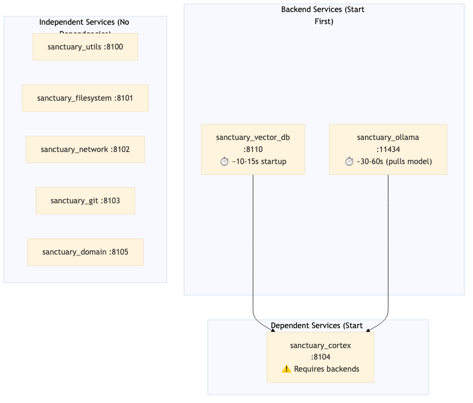
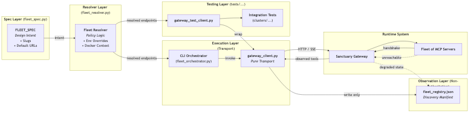

# Podman Operations Guide — Project Sanctuary

**Quick Reference:** Unified orchestration for the "Fleet of 8" MCP infrastructure.

---

## Fleet of 8 Architecture

Project Sanctuary operates a consolidated **Fleet of 8** containers, managed as a single stack via `docker-compose.yml`. This architecture ensures all internal services communicate over a private `mcp_network` bridge while exposing standard ports to the host.

| Container | Role | Port | Description |
|-----------|------|------|-------------|
| `sanctuary_utils` | Utils | 8100 | Time, Math, Calculator, UUID tools |
| `sanctuary_filesystem` | Code/FS | 8101 | File operations, code analysis, grep |
| `sanctuary_network` | Network | 8102 | Brave Search, Fetch, HTTP clients |
| `sanctuary_git` | Git | 8103 | Isolated Git workflow operations |
| `sanctuary_cortex` | Cortex | 8104 | RAG server (connects to Vector DB & Ollama) |
| `sanctuary_domain` | Domain | 8105 | Chronicle, Task, ADR, Persona management |
| `sanctuary_vector_db` | Vector DB | 8110 | ChromaDB backend storage |
| `sanctuary_ollama` | Ollama | 11434 | Ollama LLM / Embedding compute backend |

**External Services:**
- **`mcp_gateway`**: IBM ContextForge Gateway (Port 4444) — runs in a separate stack (`sanctuary-gateway` repo)
- **`helloworld_mcp`**: Demo tool for gateway validation (Port 8005)

---

## Service Dependencies & Startup Order

### Architecture Note: ARM64 & Embeddings (ADR 069)
If you are running on Apple Silicon (M1/M2/M3), be aware that **Podman runs as Linux ARM64**.
-   **Host (MacOS):** Uses `nomic` with `gpt4all` (Darwin wheels exist).
-   **Container (Linux ARM64):** Uses `HuggingFaceEmbeddings` (because `gpt4all` lacks Linux ARM64 wheels).
-   **Implication:** Do not rely on "It works on my Mac" for embeddings code. The container uses a different backend (`sentence-transformers`) to ensure stability.

### Dependency Graph

The fleet has critical dependencies that affect startup order:



*[Source: podman_fleet_dependency_graph.mmd](../../architecture_diagrams/system/podman_fleet_dependency_graph.mmd)*

### Why Order Matters

| Service | Startup Time | Notes |
|---------|--------------|-------|
| `sanctuary_vector_db` | ~10-15s | ChromaDB must be accepting connections before Cortex queries |
| `sanctuary_ollama` | ~30-60s | Downloads/loads model on first start; subsequent starts faster |
| `sanctuary_cortex` | ~5s | **Will fail health checks if backends unavailable** |

### Recommended Startup Sequence

**Option A: Use `make up` (Handles Dependencies Automatically)**

The Makefile runs `scripts/wait_for_pulse.sh` which waits for all services to be healthy before proceeding to registration:

```bash
make up  # Handles dependency timing automatically
```

**Option B: Manual Sequential Start**

If starting manually, follow this order:

```bash
# Phase 1: Backend Services (START THESE FIRST)
podman compose -f docker-compose.yml up -d sanctuary_vector_db
podman compose -f docker-compose.yml up -d sanctuary_ollama

# Wait for backends to be healthy (~30-60 seconds)
echo "Waiting for backends..."
until curl -sf http://localhost:8110/api/v1/heartbeat > /dev/null 2>&1; do sleep 2; done
echo "Vector DB ready"
until curl -sf http://localhost:11434/api/tags > /dev/null 2>&1; do sleep 2; done
echo "Ollama ready"

# Phase 2: Independent Services (parallel safe)
podman compose -f docker-compose.yml up -d sanctuary_utils
podman compose -f docker-compose.yml up -d sanctuary_filesystem
podman compose -f docker-compose.yml up -d sanctuary_network
podman compose -f docker-compose.yml up -d sanctuary_git
podman compose -f docker-compose.yml up -d sanctuary_domain

# Phase 3: Dependent Services (after backends healthy)
podman compose -f docker-compose.yml up -d sanctuary_cortex
```

> [!IMPORTANT]
> **`sanctuary_cortex` will enter a restart loop if `sanctuary_vector_db` or `sanctuary_ollama` are not running.** The `depends_on` in docker-compose only ensures start order, not health. The health checks will keep Cortex restarting until backends respond.

---

## Prerequisites

1. **Podman 4.x+** installed and running (`podman system service` active)
2. **`docker-compose.yml`** present in project root
3. **`.env`** file populated with:
   - `MCPGATEWAY_BEARER_TOKEN` — for gateway orchestration
   - `GITHUB_TOKEN` — for Git operations (optional)
4. **`mcp_network`** Docker/Podman network created
5. **`sanctuary_gateway`** running externally (Port 4444)

---

## Quick Start Commands

### Build & Start the Fleet

```bash
# Build and start all 8 containers (standard start)
make up

# Force rebuild (after code changes)
make up force=true
```

### Stop the Fleet

```bash
make down
```

### Check Status

```bash
# Full status: physical + logical registry
make status

# Quick Podman status
podman ps --filter "name=sanctuary" --format "table {{.Names}}\t{{.Status}}\t{{.Ports}}"
```

---

## Makefile Command Reference

The unified `Makefile` (ADR 065 v1.3 — "The Iron Root") provides single-source fleet management:

| Command | Usage | Description |
|---------|-------|-------------|
| `make up` | `make up [force=true]` | Deploy all 8 containers. Add `force=true` if rebuilding |
| `make down` | `make down` | Stop the entire fleet |
| `make restart` | `make restart [TARGET=<service>]` | Restart specific service or all services |
| `make status` | `make status` | Show physical (Podman) and logical (registry) status |
| `make logs` | `make logs [TARGET=<service>]` | Follow logs for a service |
| `make exec` | `make exec TARGET=<service>` | Interactive shell into a container |
| `make build` | `make build` | Build images without starting |
| `make prune` | `make prune` | **Safe** — Prune stopped containers and build cache (preserves volumes) |
| `make clean` | `make clean` | **⚠️ Destructive** — Delete all fleet data, volumes, and images |
| `make verify` | `make verify` | Run gateway connectivity tests |

### Examples

```bash
# Restart only the Cortex service
make restart TARGET=sanctuary_cortex

# View logs for Vector DB
make logs TARGET=sanctuary_vector_db

# Shell into the Git container
make exec TARGET=sanctuary_git
```

---

## Manual Podman Commands

For granular control without the Makefile:

### 3. Usage: Targeted Rebuilds (Preferred)

> [!IMPORTANT]
> **Policy (ADR 087)**: You must target specific services when rebuilding to preserve the fleet cache.

To save time, **only rebuild the specific service you modified**:

```bash
# Rebuild ONLY the cortex service
podman compose -f docker-compose.yml up -d --build sanctuary_cortex

# Rebuild ONLY the filesystem service
podman compose -f docker-compose.yml up -d --build sanctuary_filesystem
```

### 4. Build & Run (Full Fleet - Slow)

Use this ONLY if you have modified shared core libraries or the gateway itself.

```bash
podman compose -f docker-compose.yml up -d --build
```

### Start Individual Services (Sequential Order)

```bash
# 1. Utils (foundation)
podman compose -f docker-compose.yml up -d sanctuary_utils

# 2. Ollama (LLM backend)
podman compose -f docker-compose.yml up -d sanctuary_ollama

# 3. Vector DB (ChromaDB)
podman compose -f docker-compose.yml up -d sanctuary_vector_db

# 4–6. File, Network, Git servers
podman compose -f docker-compose.yml up -d sanctuary_filesystem
podman compose -f docker-compose.yml up -d sanctuary_network
podman compose -f docker-compose.yml up -d sanctuary_git

# 7. Domain server
podman compose -f docker-compose.yml up -d sanctuary_domain

# 8. Cortex (depends on Ollama + Vector DB)
podman compose -f docker-compose.yml up -d sanctuary_cortex
```

### Restart a Specific Service

```bash
podman compose restart sanctuary_cortex
```

### View Logs

```bash
podman compose logs -f sanctuary_git
```

### Stop Everything

```bash
podman compose down
```

---

## Pruning & Cleanup

### Safe Cleanup (Remove Stopped Containers)

```bash
podman container prune
```

### Remove Unused Images

```bash
podman image prune -a
```

### Full Cleanup (⚠️ Destructive)

```bash
# Via Makefile (prompts for confirmation)
make clean

# Or manually — removes containers, volumes, AND images
podman compose -f docker-compose.yml down -v --rmi all
```

### Nuclear Option — Reset Everything

```bash
podman system prune -a --volumes
```

---

## Container Build Architecture

### How Services Are Built

Each service is built from a `Dockerfile` located in its cluster directory. The `docker-compose.yml` references these with `context: .` (project root) and a specific `dockerfile` path:

```yaml
sanctuary_cortex:
  build:
    context: .  # Build context = project root
    dockerfile: mcp_servers/gateway/clusters/sanctuary_cortex/Dockerfile
```

### Dockerfile Pattern

All custom services follow this pattern (example: `sanctuary_cortex`):

```dockerfile
FROM python:3.11
WORKDIR /app

# 1. Install system dependencies
RUN apt-get update && apt-get install -y curl build-essential git git-lfs

# 2. Copy requirements first (Docker layer caching)
COPY mcp_servers/gateway/clusters/sanctuary_cortex/requirements.txt /tmp/requirements.txt
RUN pip install --no-cache-dir -r /tmp/requirements.txt

# 3. Copy shared libraries
COPY mcp_servers/lib /app/mcp_servers/lib
COPY mcp_servers/rag_cortex /app/mcp_servers/rag_cortex

# 4. Copy service-specific code
COPY mcp_servers/gateway/clusters/sanctuary_cortex /app/mcp_servers/gateway/clusters/sanctuary_cortex

# 5. Set environment
ENV PYTHONPATH=/app
ENV PORT=8000
EXPOSE 8000

# 6. Health check
HEALTHCHECK --interval=30s --timeout=10s --start-period=5s --retries=3 \
    CMD curl -f http://localhost:8000/health || exit 1

# 7. Start command
CMD ["python", "-m", "mcp_servers.gateway.clusters.sanctuary_cortex.server"]
```

### Pre-Built Images

Some services use official images directly:

| Service | Image |
|---------|-------|
| `sanctuary_vector_db` | `chromadb/chroma:latest` |
| `sanctuary_ollama` | `ollama/ollama:latest` |

---

## Python Dependency Management (ADR 073)

Python dependencies follow a strict **locked-file policy**:

### Core Principles

1. **Each service owns one `requirements.txt`** — same file used for Docker, Podman, and local `.venv`
2. **`.in` files = human intent** (what you edit)
3. **`.txt` files = machine-generated locks** (never edit manually)

### Adding a New Dependency

```bash
# 1. Edit the .in file (intent)
vim mcp_servers/gateway/clusters/sanctuary_cortex/requirements.in

# 2. Regenerate the lock file
pip-compile mcp_servers/gateway/clusters/sanctuary_cortex/requirements.in \
  --output-file mcp_servers/gateway/clusters/sanctuary_cortex/requirements.txt

# 3. Rebuild the container
make up force=true TARGET=sanctuary_cortex
```

### Updating Dependencies (Security Fixes)

```bash
# Update all packages to latest compatible versions
pip-compile --upgrade mcp_servers/gateway/requirements-core.in

# Update a specific package
pip-compile --upgrade-package uvicorn mcp_servers/gateway/requirements-core.in
```

---

## Gateway Registration & Setup

The fleet is registered with the IBM ContextForge Gateway via the **3-Layer Declarative Pattern**:

### How Registration Works



*[Source: mcp_fleet_resolution_flow.mmd](../../architecture_diagrams/system/mcp_fleet_resolution_flow.mmd)*

### Fleet Spec (Canonical Definitions)

The 6 logical MCP servers are defined in `mcp_servers/gateway/fleet_spec.py`:

| Alias | Slug | Default URL | Tools |
|-------|------|-------------|-------|
| `utils` | `sanctuary_utils` | `http://sanctuary_utils:8000/sse` | 17 |
| `filesystem` | `sanctuary_filesystem` | `http://sanctuary_filesystem:8000/sse` | 10 |
| `network` | `sanctuary_network` | `http://sanctuary_network:8000/sse` | 2 |
| `git` | `sanctuary_git` | `http://sanctuary_git:8000/sse` | 9 |
| `cortex` | `sanctuary_cortex` | `http://sanctuary_cortex:8000/sse` | 13 |
| `domain` | `sanctuary_domain` | `http://sanctuary_domain:8105/sse` | 35 |

**Total:** 86 tools across 6 MCP servers (+ 2 backend services)

### Registration Commands

**Automatic (via Makefile):**

```bash
# make up handles registration automatically after containers are healthy
make up
```

**Manual (standalone):**

```bash
# Full fleet setup: clean → register → discover → verify
python3 -m mcp_servers.gateway.fleet_setup

# Register without cleaning existing servers
python3 -m mcp_servers.gateway.fleet_setup --no-clean

# Register a single server only
python3 -m mcp_servers.gateway.fleet_setup --server sanctuary_git

# Just run discovery (no clean, assumes already registered)
python3 -m mcp_servers.gateway.fleet_orchestrator
```

### Verify Gateway Registration

```bash
# Check all registered servers
python3 -m mcp_servers.gateway.gateway_client servers

# Check all tools (should show 86 total)
python3 -m mcp_servers.gateway.gateway_client tools -v

# Check tools for specific server
python3 -m mcp_servers.gateway.gateway_client tools --server sanctuary_cortex

# View the discovery manifest
cat mcp_servers/gateway/fleet_registry.json | jq '.fleet_servers | keys'
```

### Network Connectivity

The Gateway must be connected to the fleet network:

```bash
# Ensure gateway is on mcp_network (fleet_setup.py does this automatically)
podman network connect mcp_network mcp_gateway

# Verify network connectivity
podman network inspect mcp_network | grep -E "Name|sanctuary|gateway"
```

### Re-register After Container Restart

If you restart individual containers, re-run registration:

```bash
# Re-register all servers (cleans and re-registers)
python3 -m mcp_servers.gateway.fleet_setup

# Or re-register just the restarted service
python3 -m mcp_servers.gateway.fleet_setup --server sanctuary_cortex --no-clean
```

---

## Troubleshooting

### Container Won't Start

#### Image Pull Failures (Registry Resolution)
If you see `Error: ... name "chromadb/chroma:latest" did not resolve to an address` (common in WSL2):
```bash
# Manually pull with fully qualified registry
podman pull docker.io/chromadb/chroma:latest
```

#### Diagnostic Logs
```bash
# Check logs for errors
podman compose logs sanctuary_cortex


# Verify the image was built
podman images | grep sanctuary_cortex
```

### Health Check Failing

```bash
# Test health endpoint manually
curl http://localhost:8104/health

# Check if dependencies (Ollama, ChromaDB) are running
podman ps | grep -E "ollama|vector_db"
```

### Network Issues

```bash
# Ensure mcp_network exists
podman network ls | grep mcp_network

# Create if missing
podman network create mcp_network
```

### Force Full Rebuild

```bash
# Remove old images and rebuild from scratch
podman compose down
podman image prune -a
make up force=true
```

---

## Verification Scripts

```bash
# Test Chroma connectivity
python tests/mcp_servers/rag_cortex/inspect_chroma.py

# Test Ollama connectivity
python tests/mcp_servers/forge_llm/inspect_ollama.py

# Register fleet with gateway
python -m mcp_servers.gateway.fleet_setup
```

---

## Transport Architecture (ADR 066)

Fleet containers use a **dual-transport architecture**:

| Transport | Implementation | Use Case |
|-----------|----------------|----------|
| **STDIO** | FastMCP | Claude Desktop, local dev, direct terminal |
| **SSE** | SSEServer | Gateway Fleet (Podman), remote access |

**Selection:** Containers set `MCP_TRANSPORT=sse` in docker-compose to use Gateway-compatible SSE.

> [!CAUTION]
> **FastMCP's SSE transport is NOT compatible with the IBM ContextForge Gateway.** Fleet containers must use `SSEServer` (`mcp_servers/lib/sse_adaptor.py`). See [ADR 066](../../../ADRs/066_standardize_on_fastmcp_for_all_mcp_server_implementations.md) for details.

### Verify SSE Handshake

Each container must return `event: endpoint` on `/sse`:

```bash
# Test all 6 MCP servers (should see "event: endpoint")
for port in 8100 8101 8102 8103 8104 8105; do
  echo "Testing port $port..."
  timeout 2 curl -sN http://localhost:$port/sse | head -2
done
```

---

## Fleet Registry & 3-Layer Pattern (ADR 064)

The fleet follows a **3-Layer Declarative Pattern**:

| Layer | File | Purpose |
|-------|------|---------|
| **Spec (Intent)** | `fleet_spec.py` | Design intent: slugs, default URLs |
| **Resolver (Policy)** | `fleet_resolver.py` | Runtime resolution: env overrides, Docker context |
| **Observation (State)** | `fleet_registry.json` | Discovery manifest (auto-generated, never read by logic) |

> [!IMPORTANT]
> **`fleet_registry.json` is OUTPUT only.** No production logic reads this file — it's for UI/AI discovery only.

### Verify Fleet Registration

```bash
# Check registered servers
python3 -m mcp_servers.gateway.gateway_client servers

# Check all tools (should show 86 tools across 6 servers)
python3 -m mcp_servers.gateway.gateway_client tools -v

# Check specific server's tools
python3 -m mcp_servers.gateway.gateway_client tools --server sanctuary_cortex

# View the discovery manifest
cat mcp_servers/gateway/fleet_registry.json | jq '.fleet_servers | keys'
```

---

## Verification Checklist

After `make up`, verify the fleet is healthy:

### 1. Container Health

```bash
# All 8 containers running
podman ps --filter "name=sanctuary" --format "table {{.Names}}\t{{.Status}}"

# Health endpoints responding
curl -sf http://localhost:8100/health && echo "✅ Utils"
curl -sf http://localhost:8101/health && echo "✅ Filesystem"
curl -sf http://localhost:8102/health && echo "✅ Network"
curl -sf http://localhost:8103/health && echo "✅ Git"
curl -sf http://localhost:8104/health && echo "✅ Cortex"
curl -sf http://localhost:8105/health && echo "✅ Domain"
curl -sf http://localhost:8110/api/v1/heartbeat && echo "✅ Vector DB"
curl -sf http://localhost:11434/api/tags && echo "✅ Ollama"
```

### 2. SSE Handshake (ADR 066 Compliance)

```bash
# All 6 MCP servers must return "event: endpoint"
timeout 2 curl -sN http://localhost:8100/sse | head -2  # Utils
timeout 2 curl -sN http://localhost:8101/sse | head -2  # Filesystem
timeout 2 curl -sN http://localhost:8102/sse | head -2  # Network
timeout 2 curl -sN http://localhost:8103/sse | head -2  # Git
timeout 2 curl -sN http://localhost:8104/sse | head -2  # Cortex
timeout 2 curl -sN http://localhost:8105/sse | head -2  # Domain
```

### 3. Gateway Integration

```bash
# Gateway health (should return healthy)
curl -ks https://localhost:4444/health

# Full tool inventory (should show 86 tools)
python3 -m mcp_servers.gateway.gateway_client tools -v | grep "Total tools"

# Run connectivity tests
make verify
```

---

## Governing Architecture Decisions

| ADR | Title | Relevance |
|-----|-------|-----------|
| [ADR 060](../../../ADRs/060_gateway_integration_patterns.md) | Gateway Integration Patterns | Hybrid Fleet architecture, 6 mandatory guardrails |
| [ADR 064](../../../ADRs/064_centralized_registry_for_fleet_of_8_mcp_servers.md) | Centralized Registry | 3-Layer Pattern: Spec → Resolver → Observation |
| [ADR 065](../../../ADRs/065_unified_fleet_deployment_cli.md) | Unified Fleet Deployment CLI | "The Iron Makefile" — single-source fleet management |
| [ADR 066](../../../ADRs/066_standardize_on_fastmcp_for_all_mcp_server_implementations.md) | MCP Transport Standards | Dual-transport: FastMCP STDIO + SSEServer for Gateway |
| [ADR 073](../../../ADRs/073_standardization_of_python_dependency_management_across_environments.md) | Python Dependency Management | Locked-file policy: `.in` → `.txt` |
| [ADR 087](../../../ADRs/087_podman_fleet_operations_policy.md) | Podman Fleet Operations | Mandates targeted rebuilds and registry refresh |

---

## Documentation Links

- **[docker-compose.yml](../../../docker-compose.yml)** — Fleet container definitions
- **[Makefile](../../../Makefile)** — Unified fleet operations ("The Iron Root", ADR 065)
- **[Gateway Verification Matrix](../../architecture/mcp/servers/gateway/operations/GATEWAY_VERIFICATION_MATRIX.md)** — Full tool verification status
- **[Architecture Spec](../../architecture/mcp/servers/gateway/architecture/ARCHITECTURE.md)** — Fleet architecture details
- **[MCP Servers README](../../../mcp_servers/README.md)** — Canonical MCP server guide
