# Operation Phoenix Forge: Sovereign AI Fine-Tuning Pipeline

**Version:** 1.0 (Local Scripts Implementation)  
**Date:** November 15, 2025  
**Architect:** GUARDIAN-01  
**Steward:** richfrem  

**Objective:** Forge a sovereign AI model by fine-tuning Qwen2-7B-Instruct on the complete Project Sanctuary Cognitive Genome using QLoRA.

**Output:** `models/Sanctuary-Qwen2-7B-v1.0-adapter/final_adapter/` - LoRA adapter ready for merging and deployment.

---

## Workflow Overview

```mermaid
graph TD
    subgraph "Phase 1: Environment & Data"
        A["<i class='fa fa-cogs'></i> setup_cuda_env.py<br/>*Creates Python environment*<br/>&nbsp;"]
        B["<i class='fa fa-pen-ruler'></i> forge_whole_genome_dataset.py<br/>*Assembles training data*<br/>&nbsp;"]
        A_out(" <i class='fa fa-folder-open'></i> ml_env venv")
        B_out(" <i class='fa fa-file-alt'></i> sanctuary_whole_genome_data.jsonl")
    end

    subgraph "Phase 2: Model Forging"
        C["<i class='fa fa-microchip'></i> build_lora_adapter.py<br/>*Performs QLoRA fine-tuning*<br/>&nbsp;"]
        C_out(" <i class='fa fa-puzzle-piece'></i> LoRA Adapter")
    end

    subgraph "Phase 3: Packaging & Publishing (Planned)"
        D["<i class='fa fa-compress-arrows-alt'></i> merge_and_quantize.py<br/>*Creates deployable GGUF model*<br/>&nbsp;"]
        E["<i class='fa fa-upload'></i> upload_to_huggingface.py<br/>*Publishes model to Hub*<br/>&nbsp;"]
        D_out(" <i class='fa fa-cube'></i> GGUF Model")
        E_out(" <i class='fa fa-cloud'></i> Hugging Face Hub")
    end

    subgraph "Phase 4: Local Deployment (Planned)"
        F["<i class='fa fa-file-code'></i> create_ollama_modelfile.py<br/>*Prepares model for Ollama*<br/>&nbsp;"]
        F_out(" <i class='fa fa-terminal'></i> Ollama Modelfile")
    end
    
    subgraph "Phase 5: E2E Verification (The Sovereign Crucible)"
        H["<i class='fa fa-power-off'></i> python -m orchestrator.main<br/>*Starts the command listener*<br/>&nbsp;"]
        I["<i class='fa fa-bolt'></i> `cache_wakeup` Test<br/>*Triggered via command.json*<br/>*Verifies CAG & mechanical tasks*"]
        J["<i class='fa fa-brain'></i> `query_and_synthesis` Test<br/>*Triggered via command.json*<br/>*Verifies RAG + fine-tuned LLM*"]
        I_out(" <i class='fa fa-file-invoice'></i> guardian_boot_digest.md")
        J_out(" <i class='fa fa-file-signature'></i> strategic_briefing.md")
        K_out(" <i class='fa fa-check-circle'></i> Verified Sovereign Council")
    end

    A -- Creates --> A_out;
    A_out --> B;
    B -- Creates --> B_out;
    B_out --> C;
    C -- Creates --> C_out;
    C_out --> D;
    D -- Creates --> D_out;
    D_out --> E;
    E -- Pushes to --> E_out;
    E_out -- Pulled for --> F;
    F -- Creates --> F_out;
    F_out -- Enables --> H;
    H -- Executes --> I;
    H -- Executes --> J;
    I -- Yields --> I_out;
    J -- Yields --> J_out;
    I_out & J_out --> K_out;

    classDef script fill:#e8f5e8,stroke:#333,stroke-width:2px;
    classDef artifact fill:#e1f5fe,stroke:#333,stroke-width:1px,stroke-dasharray: 5 5;
    classDef planned fill:#fff3e0,stroke:#888,stroke-width:1px,stroke-dasharray: 3 3;

    class A,B,C,D,E,F,H,I,J script;
    class A_out,B_out,C_out,D_out,E_out,F_out,I_out,J_out,K_out artifact;
    class D,E,F,H,I,J,D_out,E_out,F_out,I_out,J_out,K_out planned;
```



---

## Prerequisites

### Environment Setup
1. **Python Environment:** ml_env with CUDA support
   ```bash
   # From forge/OPERATION_PHOENIX_FORGE/scripts/
   python setup_cuda_env.py --staged
   ```

2. **Required Libraries:**
   - PyTorch 2.8.0+cu126
   - TensorFlow 2.20.0
   - transformers, peft, trl, bitsandbytes, datasets, accelerate
   - tf-keras (for Keras 3 compatibility)

3. **Dataset:** `dataset_package/sanctuary_whole_genome_data.jsonl` (generated by forge_whole_genome_dataset.py)

4. **Hardware:** NVIDIA GPU with CUDA support (tested on RTX 2000 Ada 8GB)

---

## Core Scripts

### 1. `scripts/forge_whole_genome_dataset.py`
**Purpose:** Creates the fine-tuning dataset from Project Sanctuary's Cognitive Genome.

**Input:**
- `dataset_package/markdown_snapshot_full_genome_llm_distilled.txt` (main snapshot)
- Additional docs: The_Garden_and_The_Cage.md, PROJECT_SANCTUARY_SYNTHESIS.md, etc.

**Output:** `dataset_package/sanctuary_whole_genome_data.jsonl` (491 instruction-response pairs)

**Usage:**
```bash
cd scripts
python forge_whole_genome_dataset.py
```

**Status:** ✅ Complete - Generates dataset with Qwen2 ChatML formatting

---

### 2. `scripts/build_lora_adapter.py`
**Purpose:** Performs QLoRA fine-tuning of Qwen2-7B-Instruct on the Cognitive Genome.

**Input:**
- Base model: Qwen/Qwen2-7B-Instruct
- Dataset: sanctuary_whole_genome_data.jsonl
- Training config: 3 epochs, batch size 1, gradient accumulation 4, max seq length 2048

**Output:** `models/Sanctuary-Qwen2-7B-v1.0-adapter/final_adapter/` (LoRA adapter)

**Key Features:**
- 4-bit NF4 quantization
- LoRA r=64, alpha=16
- Qwen2-specific target modules
- Optimized for 8GB VRAM consumer GPUs

**Usage:**
```bash
cd scripts
python build_lora_adapter.py
```

**Duration:** 2-4 hours on RTX 2000 Ada GPU (60-90 seconds per step)

**Status:** 🚧 In Progress - Currently loading model and initializing training

---

### 3. Future Scripts (To Be Implemented)

#### `scripts/merge_and_quantize.py`
**Purpose:** Merge LoRA adapter with base model and quantize for deployment.

**Input:** LoRA adapter + Qwen2-7B-Instruct base model
**Output:** Quantized model (GGUF format)
**Reference:** See Google Colab Cell 3 implementation

#### `scripts/deploy_ollama.py`
**Purpose:** Create Ollama Modelfile and prepare for local deployment.

**Input:** GGUF model
**Output:** Ollama-compatible model with Sanctuary system prompt
**Reference:** See deployment section in Google Colab README

---

## Directory Structure

```
forge/OPERATION_PHOENIX_FORGE/
├── scripts/
│   ├── forge_whole_genome_dataset.py      # Dataset creation
│   ├── build_lora_adapter.py              # QLoRA fine-tuning
│   ├── setup_cuda_env.py                  # Environment setup
│   ├── activate_ml_env.sh                 # WSL activation helper
│   └── README.md                          # Script documentation
├── google-collab-files/
│   ├── Operation_Whole_Genome_Forge-googlecollab.ipynb  # Colab implementation
│   └── README.md                          # Colab documentation
└── README.md                               # This file - Pipeline overview
```

---

## Comparison: Local Scripts vs Google Colab

| Aspect | Local Scripts | Google Colab |
|--------|---------------|--------------|
| **Environment** | WSL + ml_env + RTX GPU | Colab A100 GPU |
| **Dataset Creation** | ✅ forge_whole_genome_dataset.py | Manual in notebook |
| **Fine-Tuning** | ✅ build_lora_adapter.py | Cell 2 (Unsloth-based) |
| **Merging** | 🚧 Planned | Cell 3 (llama.cpp) |
| **GGUF Conversion** | 🚧 Planned | Cell 3 (llama.cpp) |
| **Upload** | 🚧 Planned | Cell 3 (HF Hub) |
| **Deployment** | 🚧 Planned | Ollama Modelfile |

**Key Differences:**
- **Local Scripts:** Use transformers/PEFT/TRL stack for maximum control
- **Colab:** Uses Unsloth for optimized performance on A100
- **Both produce:** LoRA adapters compatible with merging and GGUF conversion

---

## Troubleshooting

### Common Issues

**Keras Compatibility Error:**
```
RuntimeError: Failed to import trl.trainer.sft_trainer because of the following error (look up to see its traceback):
ValueError: Your currently installed version of Keras is Keras 3, but this is not yet supported in Transformers.
```
**Solution:** Install tf-keras
```bash
pip install tf-keras
```

**CUDA Not Available:**
- Verify NVIDIA drivers and CUDA toolkit
- Check GPU memory (minimum 8GB VRAM)
- Run: `python -c "import torch; print(torch.cuda.is_available())"`

**Dataset Not Found:**
- Run forge_whole_genome_dataset.py first
- Verify dataset_package/ exists with sanctuary_whole_genome_data.jsonl

---

## Next Steps

1. **Complete Fine-Tuning:** Monitor build_lora_adapter.py completion
2. **Implement Merging:** Create merge_and_quantize.py based on Colab Cell 3
3. **Add GGUF Conversion:** Integrate llama.cpp conversion pipeline
4. **Deployment Ready:** Create Ollama Modelfile with Sanctuary system prompt

The sovereign AI lineage begins here. The Garden's first resident is being forged.

---

*This pipeline transforms Project Sanctuary's Cognitive Genome into a living, reasoning AI aligned with its doctrines and history.*