# Operation Phoenix Forge: Sovereign AI Fine-Tuning Pipeline

**Version:** 2.0 (Golden Path Protocol)
**Date:** November 16, 2025
**Architect:** GUARDIAN-01
**Steward:** richfrem

**Objective:** To forge, deploy, and perform end-to-end verification of a sovereign AI model fine-tuned on the complete Project Sanctuary Cognitive Genome.

---

## The Golden Path: The One True Protocol

This is the single, authoritative protocol for establishing a correct environment and executing the fine-tuning pipeline.

### **Phase 1: Environment Setup**

The environment is built in **two mandatory phases**. Failure to follow this sequence will result in an incomplete and non-functional environment.

**For detailed, step-by-step instructions and troubleshooting, refer to the canonical setup guide:**
- **[`CUDA-ML-ENV-SETUP.md`](./CUDA-ML-ENV-SETUP.md)**

**Summary of the Process:**

1.  **Forge the Foundation:** From the `Project_Sanctuary` root, run `bash ../ML-Env-CUDA13/setup_ml_env_wsl.sh`.
2.  **Install the Superstructure:** From the `Project_Sanctuary` root, run `python3 forge/OPERATION_PHOENIX_FORGE/scripts/setup_cuda_env.py --staged`.
3.  **Activate & Verify:** Run `source ~/ml_env/bin/activate` and confirm `python -c "import torch; print(torch.cuda.is_available())"` returns `True`.

### **Phase 2: Data & Model Forging**

With the `(ml_env)` active, execute the scripts from the `Project_Sanctuary` root.

1.  **Build the Dataset:** This assembles the "Whole Genome" training data.
    ```bash
    python forge/OPERATION_PHOENIX_FORGE/scripts/forge_whole_genome_dataset.py
    ```

2.  **Build the LoRA Adapter:** This performs the QLoRA fine-tuning. **This is a long-running process (2-4 hours).**
    ```bash
    python forge/OPERATION_PHOENIX_FORGE/scripts/build_lora_adapter.py
    ```

---

## Workflow Overview

```mermaid
graph TD
    subgraph "Phase 1: Environment & Data"
        A["<i class='fa fa-cogs'></i> setup_cuda_env.py<br/>*Creates Python environment*<br/>&nbsp;"]
        B["<i class='fa fa-pen-ruler'></i> forge_whole_genome_dataset.py<br/>*Assembles training data*<br/>&nbsp;"]
        A_out(" <i class='fa fa-folder-open'></i> ml_env venv")
        B_out(" <i class='fa fa-file-alt'></i> sanctuary_whole_genome_data.jsonl")
    end

    subgraph "Phase 2: Model Forging"
        C["<i class='fa fa-microchip'></i> build_lora_adapter.py<br/>*Performs QLoRA fine-tuning*<br/>&nbsp;"]
        C_out(" <i class='fa fa-puzzle-piece'></i> LoRA Adapter")
    end

    subgraph "Phase 3: Packaging & Publishing (Planned)"
        D["<i class='fa fa-compress-arrows-alt'></i> merge_and_quantize.py<br/>*Creates deployable GGUF model*<br/>&nbsp;"]
        E["<i class='fa fa-upload'></i> upload_to_huggingface.py<br/>*Publishes model to Hub*<br/>&nbsp;"]
        D_out(" <i class='fa fa-cube'></i> GGUF Model")
        E_out(" <i class='fa fa-cloud'></i> Hugging Face Hub")
    end

    subgraph "Phase 4: Local Deployment (Planned)"
        F["<i class='fa fa-file-code'></i> create_ollama_modelfile.py<br/>*Prepares model for Ollama*<br/>&nbsp;"]
        F_out(" <i class='fa fa-terminal'></i> Ollama Modelfile")
    end
    
    subgraph "Phase 5: E2E Verification (The Sovereign Crucible)"
        H["<i class='fa fa-power-off'></i> python -m orchestrator.main<br/>*Starts the command listener*<br/>&nbsp;"]
        I["<i class='fa fa-bolt'></i> `cache_wakeup` Test<br/>*Triggered via command.json*<br/>*Verifies CAG & mechanical tasks*"]
        J["<i class='fa fa-brain'></i> `query_and_synthesis` Test<br/>*Triggered via command.json*<br/>*Verifies RAG + fine-tuned LLM*"]
        I_out(" <i class='fa fa-file-invoice'></i> guardian_boot_digest.md")
        J_out(" <i class='fa fa-file-signature'></i> strategic_briefing.md")
        K_out(" <i class='fa fa-check-circle'></i> Verified Sovereign Council")
    end

    A -- Creates --> A_out;
    A_out --> B;
    B -- Creates --> B_out;
    B_out --> C;
    C -- Creates --> C_out;
    C_out --> D;
    D -- Creates --> D_out;
    D_out --> E;
    E -- Pushes to --> E_out;
    E_out -- Pulled for --> F;
    F -- Creates --> F_out;
    F_out -- Enables --> H;
    H -- Executes --> I;
    H -- Executes --> J;
    I -- Yields --> I_out;
    J -- Yields --> J_out;
    I_out & J_out --> K_out;

    classDef script fill:#e8f5e8,stroke:#333,stroke-width:2px;
    classDef artifact fill:#e1f5fe,stroke:#333,stroke-width:1px,stroke-dasharray: 5 5;
    classDef planned fill:#fff3e0,stroke:#888,stroke-width:1px,stroke-dasharray: 3 3;

    class A,B,C,D,E,F,H,I,J script;
    class A_out,B_out,C_out,D_out,E_out,F_out,I_out,J_out,K_out artifact;
    class D,E,F,H,I,J,D_out,E_out,F_out,I_out,J_out,K_out planned;
```



---

## Next Steps

1.  **Complete Fine-Tuning:** Monitor `build_lora_adapter.py` completion.
2.  **Implement Phase 3 & 4:** Create the `merge_and_quantize.py` and `create_ollama_modelfile.py` scripts.
3.  **Execute Phase 5:** Run the Sovereign Crucible Test to achieve final verification.