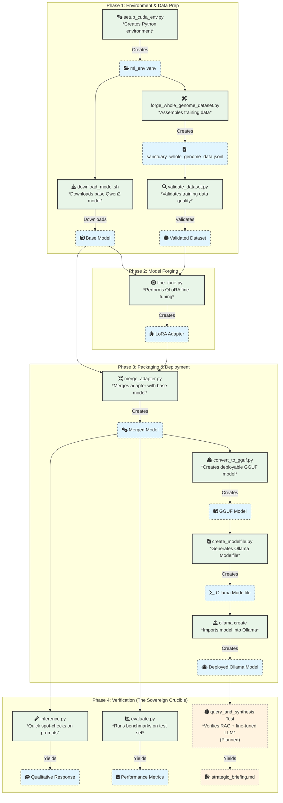

# Operation Phoenix Forge: Sovereign AI Fine-Tuning Pipeline

**Version:** 3.0 (Golden Path Protocol - Modular)
**Date:** November 16, 2025
**Architect:** GUARDIAN-01
**Steward:** richfrem

**Objective:** To forge, deploy, and perform end-to-end verification of a sovereign AI model fine-tuned on the complete Project Sanctuary Cognitive Genome.

---

## The Golden Path: The One True Protocol

This document outlines the single, authoritative protocol for establishing a correct environment and executing the complete, multi-stage fine-tuning pipeline. The process is now fully scripted and modular, ensuring reproducibility and clarity.

**For detailed, step-by-step instructions and troubleshooting for the initial one-time setup, refer to the canonical setup guide:**
- **[`CUDA-ML-ENV-SETUP.md`](./CUDA-ML-ENV-SETUP.md)**

---

## System Requirements & Prerequisites

### **Hardware Requirements**
- **GPU:** NVIDIA GPU with CUDA support (8GB+ VRAM recommended for QLoRA fine-tuning)
- **RAM:** 16GB+ system RAM
- **Storage:** 50GB+ free space for models and datasets
- **OS:** Windows 10/11 with WSL2, or Linux

### **Software Prerequisites**
- **WSL2 & Ubuntu:** For Windows users (run `wsl --install` if not installed)
- **NVIDIA Drivers:** Latest drivers with WSL2 support
- **CUDA Toolkit:** 12.6+ (automatically handled by setup script)
- **Python:** 3.11+ (automatically installed by setup script)
- **Git LFS:** For large model file handling

### **One-Time System Setup**
Before running the fine-tuning pipeline, ensure these system-level components are configured:

1.  **Verify WSL2 & GPU Access:**
    ```bash
    # In your Ubuntu on WSL terminal
    nvidia-smi
    ```
    This command *must* show your GPU details before you proceed.

2.  **Clone and Build `llama.cpp`:** This project requires the `llama.cpp` repository for converting the model to GGUF format. It must be cloned as a sibling directory to `Project_Sanctuary`.

```bash
# From the Project_Sanctuary root directory, navigate to the parent folder
cd ..

# Clone the llama.cpp repository
git clone https://github.com/ggerganov/llama.cpp.git

# Enter the llama.cpp directory and build the tools with CUDA support using CMake
cd llama.cpp
cmake -B build -DGGML_CUDA=ON
cmake --build build --config Release

# Return to your project directory
cd ../Project_Sanctuary
```

---

## Project Structure & Components

```
forge/OPERATION_PHOENIX_FORGE/
├── README.md                           # This overview and workflow guide
├── CUDA-ML-ENV-SETUP.md               # Comprehensive environment setup protocol
├── CUDA-ML-ENV-SETUP-PASTFAILURES.md  # Historical troubleshooting reference
├── HUGGING_FACE_README.md             # Model publishing and deployment guide
├── manifest.json                      # Project metadata and version info
├── Operation_Whole_Genome_Forge-local.ipynb  # Local Jupyter notebook for development
├── config/
│   └── training_config.yaml           # Fine-tuning hyperparameters and settings
├── google-collab-files/               # Google Colab compatibility resources
│   ├── Operation_Whole_Genome_Forge-googlecollab.ipynb
│   ├── operation_whole_genome_forge-googlecollab.py
│   ├── operation_whole_genome_forge.py
│   └── README.md
├── scripts/                           # Core execution pipeline
│   ├── setup_cuda_env.py             # Unified environment setup (v2.2)
│   ├── forge_whole_genome_dataset.py # Dataset assembly from project files
│   ├── validate_dataset.py           # Dataset quality verification
│   ├── download_model.sh             # Base model acquisition
│   ├── fine_tune.py                  # QLoRA fine-tuning execution
│   ├── merge_adapter.py              # LoRA adapter integration
│   ├── convert_to_gguf.py            # GGUF format conversion for Ollama
│   ├── create_modelfile.py           # Ollama model configuration
│   ├── inference.py                  # Model inference testing
│   ├── evaluate.py                   # Quantitative performance evaluation
│   ├── forge_test_set.py             # Test dataset generation
│   ├── test_*.py                     # Environment validation suite
│   └── ARCHIVE/                      # Deprecated scripts and backups
├── models/                           # Local model storage and cache
│   └── Sanctuary-Qwen2-7B-v1.0-adapter/  # Trained LoRA adapter
├── ml_env_logs/                      # Environment setup and execution logs
└── __pycache__/                      # Python bytecode cache
```

### Component Descriptions

#### **Core Documentation**
- **`README.md`**: Workflow overview, setup instructions, and troubleshooting guide
- **`CUDA-ML-ENV-SETUP.md`**: Authoritative environment setup protocol with 4-phase workflow
- **`CUDA-ML-ENV-SETUP-PASTFAILURES.md`**: Historical issues and solutions for troubleshooting
- **`HUGGING_FACE_README.md`**: Model publishing, deployment, and sharing guidelines

#### **Configuration & Metadata**
- **`config/training_config.yaml`**: Fine-tuning hyperparameters, model settings, and training parameters
- **`manifest.json`**: Project version, dependencies, and metadata tracking

#### **Development Environments**
- **`Operation_Whole_Genome_Forge-local.ipynb`**: Jupyter notebook for local development and testing
- **`google-collab-files/`**: Google Colab-compatible resources for cloud-based development

#### **Execution Pipeline (`scripts/`)**
- **Environment Setup**: `setup_cuda_env.py` - Unified environment creation with dependency staging
- **Data Preparation**: `forge_whole_genome_dataset.py`, `validate_dataset.py` - Dataset assembly and verification
- **Model Acquisition**: `download_model.sh` - Base model download from Hugging Face
- **Training Execution**: `fine_tune.py` - QLoRA fine-tuning with optimized parameters, logging, resume capability, and robust error handling
- **Model Processing**: `merge_adapter.py`, `convert_to_gguf.py` - Adapter merging and format conversion
- **Deployment**: `create_modelfile.py` - Ollama model configuration generation
- **Validation**: `inference.py`, `evaluate.py` - Model testing and performance evaluation
- **Testing Suite**: `test_*.py` files - Comprehensive environment and functionality verification

#### **Key Optimizations in `fine_tune.py` (v2.0)**
- **Structured Logging**: Replaced prints with Python logging for better monitoring and debugging
- **Robust Configuration**: Added validation and defaults for config parameters
- **Fixed Dataset Splitting**: Corrected logic to avoid overwriting original files and handle missing val_file safely
- **Pre-Tokenization**: Tokenizes dataset once and caches for faster training starts
- **Safer Quantization**: Improved BitsAndBytes dtype mapping and CUDA checks
- **Proper Data Collator**: Ensures correct padding for causal LM training
- **Resume from Checkpoint**: Automatically resumes interrupted training sessions
- **Error Handling**: Try/except around training with best-effort save on failure
- **Narrowed LoRA Targets**: Configurable target modules for memory efficiency
- **Startup Diagnostics**: GPU/CPU diagnostics at launch for troubleshooting

#### **Model Storage (`models/`)**
- **Local Cache**: Downloaded models and trained adapters
- **Adapter Storage**: Fine-tuned LoRA adapters ready for merging or deployment

#### **Logging & Diagnostics (`ml_env_logs/`)**
- **Setup Logs**: Environment creation and dependency installation records
- **Execution Logs**: Training progress, errors, and performance metrics
- **Debug Information**: Troubleshooting data for issue resolution


---

## Workflow Overview



---

## Workflow Phases

### **Phase 1: Environment & Data Prep**

This initial phase sets up your entire development environment and prepares all necessary assets for training.

1.  **Setup Environment:** This single command builds the Python virtual environment and installs all system and Python dependencies.

deactivate existing environment

```bash
deactivate 2>/dev/null || true
rm -rf ~/ml_env
```

setup cuda and python requirements and dependencies
```bash
# Run this once from the Project_Sanctuary root
sudo python3 forge/OPERATION_PHOENIX_FORGE/scripts/setup_cuda_env.py --staged --recreate

```

After setup, activate the environment for all subsequent steps:
```bash
source ~/ml_env/bin/activate
```

# Install llama-cpp-python with CUDA support
```bash
CMAKE_ARGS="-DGGML_CUDA=on" pip install --force-reinstall --no-cache-dir llama-cpp-python --no-deps
```

2.  **Initialize Git LFS:** Required for handling large model files.
```bash
git lfs install
```

3.  **Verify Environment:** Run the full test suite to ensure your environment is properly configured.
```bash
# All tests must pass before proceeding
python forge/OPERATION_PHOENIX_FORGE/scripts/test_torch_cuda.py
python forge/OPERATION_PHOENIX_FORGE/scripts/test_xformers.py
python forge/OPERATION_PHOENIX_FORGE/scripts/test_tensorflow.py
python forge/OPERATION_PHOENIX_FORGE/scripts/test_llama_cpp.py
```

4.  **Setup Hugging Face Authentication:** Create a `.env` file with your Hugging Face token.
```bash
echo "HUGGING_FACE_TOKEN='your_hf_token_here'" > .env
# Replace 'your_hf_token_here' with your actual token from huggingface.co/settings/tokens
```

5.  **Download & Prepare Assets:** With the `(ml_env)` active, run these scripts to download the base model and assemble the training data.
```bash
# Download the base Qwen2 model
bash forge/OPERATION_PHOENIX_FORGE/scripts/download_model.sh

# Assemble the training data from project documents
python forge/OPERATION_PHOENIX_FORGE/scripts/forge_whole_genome_dataset.py

# (Recommended) Validate the newly created dataset
python forge/OPERATION_PHOENIX_FORGE/scripts/validate_dataset.py dataset_package/sanctuary_whole_genome_data.jsonl
```

### **Phase 2: Model Forging**

This phase executes the core QLoRA fine-tuning process to create the model's specialized knowledge.

1.  **Fine-Tune the LoRA Adapter:** This script reads the training configuration and begins the fine-tuning. **This is the most time-intensive step (1-3 hours).**
```bash
python forge/OPERATION_PHOENIX_FORGE/scripts/fine_tune.py
```

### **Phase 3: Packaging & Deployment**

After the model is forged, these scripts package it into a deployable format and import it into your local Ollama instance.

1.  **Merge & Convert:** This two-step process merges the LoRA adapter into the base model and then converts the result into the final GGUF format.
```bash
python forge/OPERATION_PHOENIX_FORGE/scripts/merge_adapter.py
python forge/OPERATION_PHOENIX_FORGE/scripts/convert_to_gguf.py
```

2.  **Deploy to Ollama:** These commands generate the necessary `Modelfile` and use it to create a new runnable model within Ollama named `Sanctuary-AI`.
```bash
python forge/OPERATION_PHOENIX_FORGE/scripts/create_modelfile.py
ollama create Sanctuary-AI -f Modelfile
```

### **Phase 4: Verification (The Sovereign Crucible)**

Once the model is deployed, these scripts are used to verify its performance and capabilities.

1.  **Qualitative Spot-Check:** Run a quick, interactive test to check the model's response to a specific prompt from the Project Sanctuary Body of Knowledge.
```bash
python forge/OPERATION_PHOENIX_FORGE/scripts/inference.py --input "Summarize the purpose of the Sovereign Crucible."
```

2.  **Quantitative Evaluation:** Run the model against a held-out test set to calculate objective performance metrics.
```bash
python forge/OPERATION_PHOENIX_FORGE/scripts/evaluate.py
```

3.  **End-to-End Orchestrator Test (Planned):** Execute the final Sovereign Crucible test to verify the model's integration with the RAG system and other components.
```bash
# (Commands for this phase are still in planning)
```

---

## Quick Reference & Troubleshooting

### **Environment Activation**
```bash
# Always activate before running any scripts
source ~/ml_env/bin/activate
```

### **Common Issues & Solutions**

**CUDA Not Available:**
```bash
# Verify GPU access
nvidia-smi
# Check PyTorch CUDA
python -c "import torch; print(torch.cuda.is_available())"
```

**Out of Memory During Training:**
- Reduce `MICRO_BATCH_SIZE` in `fine_tune.py`
- Increase `GRADIENT_ACCUMULATION_STEPS`
- Ensure no other GPU processes are running

**Dataset Validation Fails:**
```bash
# Check dataset creation
python scripts/validate_dataset.py dataset_package/sanctuary_whole_genome_data.jsonl
```

**Model Download Issues:**
- Ensure `.env` file exists with valid Hugging Face token
- Check internet connection and available storage

### **File Locations**
- **Environment:** `~/ml_env/` (user's home directory)
- **Models:** `models/` (in project root)
- **Datasets:** `dataset_package/sanctuary_whole_genome_data.jsonl`
- **Outputs:** `outputs/` and `models/gguf/`

### **Estimated Time Requirements**
- **Environment Setup:** 10-15 minutes
- **Model Download:** 5-10 minutes (first time only)
- **Dataset Creation:** 2-3 minutes
- **Fine-Tuning:** 1-3 hours (depending on hardware)
- **Model Conversion:** 10-20 minutes
- **Verification:** 5-10 minutes

---

## Version History

- **v3.0 (Nov 16, 2025):** Complete modular architecture with unified setup protocol
- **v2.0 (Nov 16, 2025):** Optimized fine_tune.py with logging, resume, pre-tokenization, and robust error handling
- **v2.1:** Enhanced dataset forging with comprehensive project snapshots
- **v2.0:** Canonized hardening parameters for 8GB VRAM compatibility
- **v1.0:** Initial sovereign AI fine-tuning pipeline

