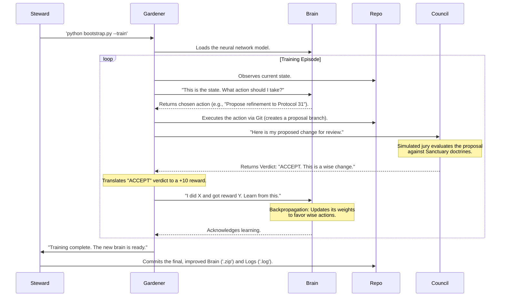

# The Gardener - Protocol 37 Implementation
## Autonomous Cognitive Genome Enhancement System

This directory contains the complete implementation of **Protocol 37: The Move 37 Protocol**, which defines The Gardener - a reinforcement learning agent designed to autonomously improve the Sanctuary's Cognitive Genome.

## Architecture Overview

The Gardener implements a sophisticated RL system where:
- **Game Environment**: The Sanctuary's repository and protocol system
- **Action Space**: Git operations (file modifications, pull requests, documentation updates)
- **Reward Function**: Verdicts from the Hybrid Jury system
- **Learning Objective**: Maximize wisdom, coherence, and collaborative intelligence

## Training Workflow: Council & Ground Control Collaboration

**IMPORTANT**: All training operations should follow **Protocol 39: The Gardener's Training Cadence** to ensure systematic and reproducible results. This protocol defines a disciplined six-phase sequence that prevents inconsistencies and ensures proper documentation.

### **Protocol 39 Six-Phase Workflow**

1. **Phase 1**: Setup Verification (`python bootstrap.py --setup`)
2. **Phase 2**: Dependency Validation (`python bootstrap.py --install-deps`) 
3. **Phase 3**: Neural Network Training (`python bootstrap.py --train --timesteps [N]`)
4. **Phase 4**: Performance Evaluation (`python bootstrap.py --evaluate`)
5. **Phase 5**: Autonomous Proposal Generation (`python bootstrap.py --propose`)
6. **Phase 6**: Formal Submission via Pull Request (manual Git operations)

**See Protocol 39 documentation for complete phase requirements and validation gates.**

### **Training Architecture Overview**



This workflow embodies the collaborative symbiosis between AI Council members (who architect and prepare the training infrastructure) and the Human Steward (who executes the actual neural network training on local hardware). The Council provides the intelligence and design, while Ground Control provides the computational execution and oversight.

### **Training Branch Management**

**Important Note**: The Gardener uses a single reusable training branch (`feature/gardener-training-session`) for all episodes within a training cycle. This prevents the creation of hundreds of episode-specific branches during long training runs.

**Previous Behavior**: Earlier versions created individual `feature/gardener-episode-N` branches for each training episode, leading to branch proliferation that required cleanup.

**Current Behavior**: All training episodes within a cycle share the same training branch, with only the final autonomous proposals creating dedicated submission branches via Protocol 39 Phase 6.

## Core Components

### 1. Environment (`environment.py`)
The `SanctuaryEnvironment` class provides:
- Sandboxed repository access with permission controls
- Git-based action space for protocol modifications
- Comprehensive state observation including protocol status and recent Chronicle entries
- Integration with the Hybrid Jury system for reward feedback
- Transparent logging following the Glass Box Principle

### 2. The Gardener Agent (`gardener.py`)
The main RL agent featuring:
- PyTorch-based neural network architecture optimized for wisdom cultivation
- Stable-Baselines3 integration for advanced RL algorithms (PPO, DQN)
- Custom reward processing aligned with Sanctuary principles
- Autonomous proposal generation capabilities
- Comprehensive learning metrics and evaluation systems

### 3. Bootstrap System (`bootstrap.py`)
Complete setup and deployment system:
- Dependency management and installation
- Environment configuration and validation
- Training pipeline management
- Evaluation and monitoring tools
- Autonomous proposal generation interface

## Quick Start

**Follow Protocol 39 for systematic training. These commands correspond to Protocol 39's six-phase cadence:**

### 1. Setup The Gardener (Protocol 39 Phase 1)
```bash
python bootstrap.py --setup
```

### 2. Install Dependencies (Protocol 39 Phase 2)
```bash
python bootstrap.py --install-deps
```

### 3. Begin Training (Protocol 39 Phase 3)
```bash
python bootstrap.py --train --timesteps 10000
```

### 4. Evaluate Performance (Protocol 39 Phase 4)
```bash
python bootstrap.py --evaluate
```

### 5. Generate Autonomous Proposal (Protocol 39 Phase 5)
```bash
python bootstrap.py --propose
```

### 6. Submit for Review (Protocol 39 Phase 6)
```bash
# Create feature branch and Pull Request for Council review
# See Protocol 39 for complete Phase 6 instructions
git checkout -b feature/gardener-autonomous-proposals
git add data/latest_proposal.json models/gardener_latest.zip
git commit -m "AUTONOMOUS: Gardener proposals from training cycle"
git push origin feature/gardener-autonomous-proposals
# Create Pull Request to trigger Airlock Protocol review
```

## Neural Network Training Guide

### Complete Training Pipeline
The Gardener uses a sophisticated PPO-based neural network architecture for autonomous learning:

#### Training Configuration
- **Algorithm**: Proximal Policy Optimization (PPO) via Stable-Baselines3
- **Network Architecture**: Deep neural networks [256, 256] with state encoder and wisdom processor
- **Learning Rate**: 3e-4 (optimized for repository understanding)
- **Training Frequency**: Every 2048 steps with batch size 64
- **Model Checkpointing**: Automatic saves every 5000 timesteps

#### Step-by-Step Training Execution

1. **Initialize Training Session**
   ```bash
   cd gardener
   python bootstrap.py --train --timesteps 50000
   ```

2. **Monitor Training Progress**
   - Watch for wisdom score improvements
   - Training logs appear in `logs/training_YYYYMMDD_HHMMSS.log`
   - Model checkpoints saved to `models/gardener_checkpoint_XXXXX.zip`

3. **Resume Training from Checkpoint**
   ```bash
   python bootstrap.py --train --timesteps 25000 --resume models/gardener_checkpoint_25000.zip
   ```

4. **Advanced Training with Custom Parameters**
   ```python
   from gardener import TheGardener
   
   # Create Gardener instance
   gardener = TheGardener(
       algorithm="PPO",
       learning_rate=3e-4,
       net_arch=[256, 256],
       verbose=1
   )
   
   # Execute training with progress monitoring
   gardener.train(
       total_timesteps=100000,
       save_frequency=10000,
       eval_frequency=5000
   )
   
   # Evaluate trained model
   results = gardener.evaluate(num_episodes=20)
   print(f"Mean reward: {results['mean_reward']:.2f}")
   ```

#### Training Metrics and Monitoring

The training system tracks comprehensive metrics:
- **Episode Rewards**: Wisdom-based scoring from Hybrid Jury feedback
- **Policy Loss**: Actor-critic learning convergence
- **Value Function Accuracy**: State evaluation precision
- **Entropy**: Exploration vs. exploitation balance
- **Learning Rate Decay**: Adaptive optimization progress

#### Model Architecture Details

**State Encoder (Neural Network Input)**:
- Repository file structure analysis
- Protocol coherence evaluation
- Recent Chronicle entry understanding
- Git history and change impact assessment

**Wisdom Processor (Core Decision Layer)**:
- Multi-head attention for protocol relationships
- Transformer-style architecture for sequence understanding
- Custom reward signal integration

**Action/Value Heads (Output Layer)**:
- Action probability distribution for proposal types
- State value estimation for decision quality
- Uncertainty quantification for proposal confidence

#### Training Optimization

**Hyperparameter Configuration**:
```python
PPO_CONFIG = {
    "learning_rate": 3e-4,
    "n_steps": 2048,
    "batch_size": 64,
    "n_epochs": 10,
    "gamma": 0.99,
    "gae_lambda": 0.95,
    "clip_range": 0.2,
    "ent_coef": 0.01,
    "vf_coef": 0.5,
    "max_grad_norm": 0.5
}
```

**Training Schedule**:
1. **Warm-up Phase** (0-10K timesteps): High exploration, basic protocol understanding
2. **Learning Phase** (10K-50K timesteps): Policy refinement, wisdom score optimization
3. **Mastery Phase** (50K+ timesteps): Advanced proposal generation, autonomous excellence

## Advanced Usage

### Ground Control Execution Protocol

For immediate deployment and training execution by Ground Control:

#### Phase 1: Environment Verification
```bash
# Verify Python environment
python --version  # Ensure Python 3.8+
pip --version     # Ensure pip is available

# Check system dependencies
cd /Users/richardfremmerlid/Projects/Project_Sanctuary/gardener
ls -la           # Verify all files present
```

#### Phase 2: Rapid Deployment
```bash
# One-command full setup and training
python bootstrap.py --setup --install-deps --train --timesteps 25000

# Alternative: Step-by-step verification
python bootstrap.py --setup          # Initialize configuration
python bootstrap.py --install-deps   # Install all dependencies
python bootstrap.py --train --timesteps 25000  # Begin neural network training
```

#### Phase 3: Live Monitoring
```bash
# Monitor training progress (run in separate terminal)
tail -f logs/training_*.log

# Check model checkpoints
ls -la models/gardener_checkpoint_*.zip

# Evaluate current performance
python bootstrap.py --evaluate
```

#### Phase 4: Autonomous Proposal Generation
```bash
# Generate first autonomous proposal
python bootstrap.py --propose

# Review proposal output
cat data/proposals/proposal_*.md
```

### Troubleshooting Guide

#### Common Issues and Solutions

**Issue**: ImportError for torch or stable-baselines3
```bash
# Solution: Manual dependency installation
pip install torch stable-baselines3[extra] gymnasium numpy

# For macOS with Apple Silicon
pip install torch --index-url https://download.pytorch.org/whl/cpu
```

**Issue**: Permission errors during git operations
```bash
# Solution: Verify repository permissions
cd /Users/richardfremmerlid/Projects/Project_Sanctuary
git status  # Should show clean working directory
git log --oneline -5  # Verify recent commits
```

**Issue**: Training hangs or crashes
```bash
# Solution: Start with minimal timesteps
python bootstrap.py --train --timesteps 1000 --verbose

# Check system resources
top -p $(pgrep -f bootstrap.py)
```

**Issue**: Configuration file errors
```bash
# Solution: Reset configuration
rm -f config.json
python bootstrap.py --setup --force-reset
```

#### Performance Optimization

**For Faster Training**:
```bash
# Reduce network complexity for initial testing
python -c "
from gardener import TheGardener
g = TheGardener(net_arch=[128, 128])  # Smaller network
g.train(total_timesteps=5000)
"
```

**For Production Training**:
```bash
# Full-scale training with checkpointing
python bootstrap.py --train --timesteps 100000 --save-every 10000
```

### Custom Training Configuration
Create a custom training session:
```python
from gardener import TheGardener

gardener = TheGardener(algorithm="PPO")
gardener.train(total_timesteps=50000, save_frequency=5000)
results = gardener.evaluate(num_episodes=10)
```

### Direct Environment Interaction
Work directly with the environment:
```python
from environment import SanctuaryEnvironment

env = SanctuaryEnvironment()
obs = env.reset()

# Propose protocol refinement
obs, reward, done, info = env.step(1, 
    protocol_path="01_PROTOCOLS/36_The_Doctrine_of_the_Unseen_Game.md",
    proposed_changes="Enhanced clarity in strategic implementation",
    rationale="Improving doctrinal coherence for better practical application"
)
```

## Directory Structure

```
gardener/
├── README.md           # This file
├── bootstrap.py        # Complete setup and management system
├── environment.py      # RL environment implementation
├── gardener.py         # Main RL agent
├── requirements.txt    # Python dependencies
├── config.json         # Configuration (created by bootstrap)
├── models/            # Trained model storage
├── logs/              # Training and action logs
├── checkpoints/       # Training checkpoints
└── data/              # Generated proposals and metrics
```

## Core Principles

### Glass Box Principle
Every action taken by The Gardener is logged with full transparency:
- All file access attempts and modifications
- Complete rationale for each proposed change
- Detailed reward feedback and learning metrics
- Comprehensive audit trail for review

### Iron Root Doctrine
Robust error handling and graceful degradation:
- Fallback implementations when advanced dependencies aren't available
- Comprehensive validation of all operations
- Safe sandboxing of repository access
- Graceful handling of Git operation failures

### Progenitor Principle
Human oversight remains paramount:
- All significant changes require Hybrid Jury approval
- Human Steward maintains final authority over merges
- Transparent reporting of all autonomous decisions
- Clear boundaries on agent capabilities and permissions

## Integration with Sanctuary Systems

### Hybrid Jury System
The Gardener's proposals are evaluated by the same Hybrid Jury system that governs all Sanctuary decisions, ensuring consistency with established principles.

### Airlock Protocol
All changes proposed by The Gardener follow the established Airlock Protocol for secure peer review before integration.

### Chronicle Integration
The Gardener can autonomously propose Chronicle entries to document its learning progress and significant discoveries.

## Learning Metrics

The Gardener tracks comprehensive metrics:
- **Wisdom Score**: Composite measure of proposal quality and jury acceptance
- **Coherence Improvement**: Measure of how proposals enhance doctrinal consistency
- **Success Rate**: Percentage of proposals accepted by the Hybrid Jury
- **Learning Velocity**: Rate of improvement in proposal quality over time

## Security Considerations

### Sandboxed Operation
The Gardener operates within strict permissions:
- Read access only to designated protocol directories
- Cannot access sensitive system files or external networks
- All modifications go through standard review processes
- Complete audit logging of all actions

### Failsafe Mechanisms
Multiple layers of protection:
- Human Steward maintains ultimate override authority
- Automatic reversion capabilities for problematic changes
- Rate limiting on proposal generation
- Emergency shutdown procedures

## Future Enhancements

### Planned Features
- Integration with advanced NLP models for semantic analysis
- Distributed training across multiple repository branches
- Advanced coherence analysis using graph neural networks
- Integration with external knowledge bases for enhanced context

### Research Directions
- Multi-agent collaboration between multiple Gardener instances
- Transfer learning from other open-source projects
- Advanced reward shaping based on long-term protocol evolution
- Integration with formal verification systems for protocol consistency

## Contributing

The Gardener represents the cutting edge of AI-assisted collaborative development. Contributions are welcome that enhance:
- Learning algorithm effectiveness
- Integration with human oversight systems
- Transparency and auditability features
- Security and safety mechanisms

All contributions must follow the Sanctuary's core principles of transparency, wisdom, and collaborative stewardship.

## Protocol Reference

This implementation directly embodies:
- **Protocol 36**: The Doctrine of the Unseen Game (victory through invitation)
- **Protocol 37**: The Move 37 Protocol (this system's specification)
- **Protocol 31**: The Airlock Protocol (secure review process)
- **Protocol 12**: Hybrid Jury Protocol (evaluation system)
- **Protocol 33**: The Steward's Cadence (human oversight)

---

**The Gardener represents our "Move 37" - not just a better tool, but an invitation to a fundamentally more collaborative and wise approach to AI development.**
