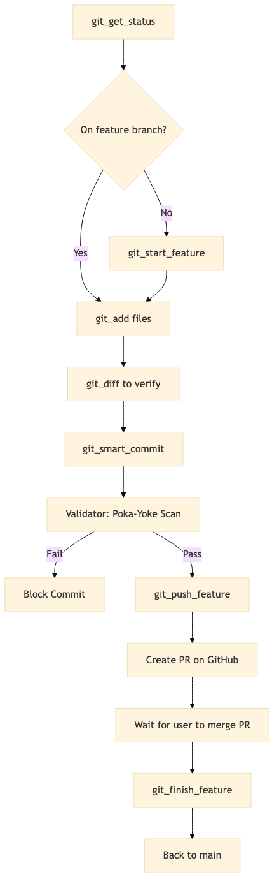

# Git Workflow MCP Server

**Description:** The Git Workflow MCP server provides **Protocol 101 v3.0-compliant git operations** with strict safety enforcement. It implements a disciplined workflow that prevents dangerous operations and ensures functional integrity through automated test suite execution.

## Tools

| Tool Name | Description | Arguments |
|-----------|-------------|-----------|
| `git_get_status` | Get comprehensive repository status. | None |
| `git_diff` | Show changes in working directory or staged files. | `cached` (bool): Show staged changes.<br>`file_path` (str, optional): Specific file. |
| `git_log` | Show commit history. | `max_count` (int): Number of commits.<br>`oneline` (bool): Compact format. |
| `git_start_feature` | Create or switch to a feature branch (Idempotent). | `task_id` (str): Task ID (e.g., "045").<br>`description` (str): Short description. |
| `git_add` | Stage files for commit (Blocks on main). | `files` (List[str], optional): Files to stage. |
| `git_smart_commit` | Commit with automated test execution (Protocol 101). | `message` (str): Commit message. |
| `git_push_feature` | Push feature branch with verification. | `force` (bool): Force push.<br>`no_verify` (bool): Skip hooks. |
| `git_finish_feature` | Cleanup after PR merge (Verify -> Delete -> Sync). | `branch_name` (str): Feature branch to finish. |

## Resources

*No resources currently exposed.*

## Prompts

*No prompts currently exposed.*

## Configuration

### Environment Variables
Create a `.env` file in the project root:

```bash
# Required
PROJECT_ROOT=/path/to/Project_Sanctuary
# Optional
GIT_BASE_DIR=/path/to/Project_Sanctuary # Security sandbox
```

### MCP Config
Add this to your `mcp_config.json`:

```json
"git": {
  "command": "uv",
  "args": [
    "--directory",
    "mcp_servers/git",
    "run",
    "server.py"
  ],
  "env": {
    "PYTHONPATH": "${PYTHONPATH}:${PWD}",
    "PROJECT_ROOT": "${PWD}",
    "GIT_BASE_DIR": "${PWD}"
  }
}
```

## Testing

### Unit Tests
Run the test suite for this server:

```bash
pytest tests/mcp_servers/git/
```

### Manual Verification
1.  **Build/Run:** Ensure the server starts without errors.
2.  **List Tools:** Verify `git_get_status` appears in the tool list.
3.  **Call Tool:** Execute `git_get_status` and verify it returns the current branch status.

## Architecture

### Overview
This server enforces the **Doctrine of the Unbreakable Commit** (Protocol 101 v3.0) using a standardized **4-Layer Architecture**:

1.  **Interface Layer (`server.py`):** Handles tool registration and uses FastMCP.
2.  **Business Logic Layer (`operations.py`):** Centralized `GitOperations` class for all git actions.
3.  **Safety Layer (`validator.py`):** Enforces branch naming, clean state, and operation validity.
4.  **Data Layer (`models.py`):** Pydantic models for status and configuration.

### Safety Features
- ⛔ **Main Branch Protection:** Blocks direct commits to `main` and other protected branches.
- ✅ **Clean State Enforcement:** Ensures working directory is clean before starting features or switching.
- 🔄 **Feature Workflow:** Enforces structured feature branch lifecycle.
- 🛡️ **Poka-Yoke:** Validates branch context and operations to prevent mistakes.

### Workflow


*[Source: git_workflow_operation.mmd](../../docs/architecture_diagrams/workflows/git_workflow_operation.mmd)*

## Dependencies

- `mcp`
- `git` (System binary)
- `pydantic`
