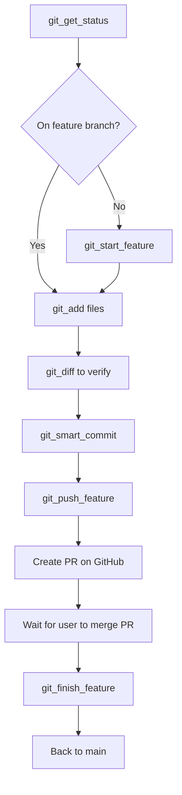

# Git Workflow MCP Server

**Domain:** `project_sanctuary.system.git_workflow`  
**Version:** 2.1.0  
**Status:** Production Ready (Protocol 101 v3.0 Compliant)

---

## Overview

The Git Workflow MCP server provides **Protocol 101 v3.0-compliant git operations** with strict safety enforcement for feature development. It implements a **disciplined workflow** that prevents dangerous operations and ensures functional integrity through automated test suite execution.

**Key Principles:**
- ✅ **Safety First:** Never commit to `main`, one feature at a time
- ✅ **Verify Before Trust:** All operations verify state before proceeding
- ✅ **Merge Before Delete:** Feature branches can only be deleted after PR merge
- ✅ **Functional Coherence:** Automated test suite execution via Protocol 101 v3.0

> [!IMPORTANT]
> **Safety Documentation:** See [SAFETY.md](SAFETY.md) for comprehensive safety features and workflow enforcement details.

---

## Quick Start

### Prerequisites

1. **Python 3.11+**
2. **Git** installed and configured
3. **GitHub** account with repository access

### Start the MCP Server

**Local Development:**
```bash
cd /Users/richardfremmerlid/Projects/Project_Sanctuary
python3 -m mcp_servers.system.git_workflow.server
```

**Via Claude Desktop:**
Already configured in `claude_desktop_config.json`. Just restart Claude.

---

## Operations (8)

### Safe Operations (Read-Only)

#### `git_get_status()`
Get comprehensive repository status.

**Returns:**
- Current branch name
- Staged, modified, and untracked files
- All local branches (with current branch marked)
- List of feature branches (for safety checks)
- Remote tracking info: upstream branch, ahead/behind counts
- `is_clean` flag (true if no changes)

**Example:**
```python
git_get_status()
# Returns: "Branch: feature/task-123-test\nStaged Files: file1.py, file2.py\n..."
```

#### `git_diff(cached, file_path)`
Show changes in working directory or staged files.

**Examples:**
```python
git_diff(cached=False)  # Unstaged changes
git_diff(cached=True)   # Staged changes
git_diff(file_path="core/git/git_ops.py")  # Specific file
```

#### `git_log(max_count, oneline)`
Show commit history.

**Examples:**
```python
git_log(max_count=10, oneline=False)  # Last 10 commits (detailed)
git_log(max_count=5, oneline=True)    # Last 5 commits (compact)
```

---

### Workflow Operations (Require Safety Checks)

#### `git_start_feature(task_id, description)` - Idempotent ✅

Create or switch to a feature branch.

**Safety Checks:**
- ✅ Blocks if another feature branch exists (one at a time)
- ✅ Requires clean working directory for new branch creation
- ✅ Idempotent: safe to call multiple times

**Example:**
```python
git_start_feature("045", "smart-git-mcp")
# Creates: feature/task-045-smart-git-mcp
```

**Idempotent Behavior:**
- Already on branch → Success (no-op)
- Branch exists elsewhere → Checkout to it
- Branch doesn't exist → Create and checkout

---

#### `git_add(files)` - Blocks on Main ⛔

Stage files for commit.

**Safety Checks:**
- ⛔ Blocks if on `main` branch
- ⛔ Blocks if not on `feature/` branch

**Example:**
```python
git_add(["file1.py", "file2.py"])  # Stage specific files
git_add()  # Stage all changes (git add -A)
```

---

#### `git_smart_commit(message)` - Protocol 101 v3.0 ⭐

Commit staged files with automatic test suite execution.

**Safety Checks:**
- ⛔ Blocks if on `main` branch
- ⛔ Blocks if not on `feature/` branch
- ⛔ Blocks if no files are staged

**What it does:**
1. Verifies you're on a feature branch
2. Verifies files are staged
3. Commits staged files
4. **Pre-commit hook automatically runs `./scripts/run_genome_tests.sh`**
5. All tests must pass for commit to proceed

**Example:**
```python
git_smart_commit("Implement feature X")
# Result: Commit only if all tests pass
```

---

#### `git_push_feature(force, no_verify)` - Blocks on Main ⛔

Push current feature branch to origin with remote hash verification.

**Safety Checks:**
- ⛔ Blocks if on `main` branch
- ⛔ Blocks if not on `feature/` branch
- ✅ Verifies remote hash matches local hash after push

**Example:**
```python
git_push_feature()
# Returns: "Verified push to feature/task-123-test (Hash: abc123de)"
```

**Parameters:**
- `force` (bool): Force push (use with caution)
- `no_verify` (bool): Bypass pre-push hooks

---

#### `git_finish_feature(branch_name)` - Merge Verification Required ⭐

Cleanup after PR is merged on GitHub.

**Safety Checks:**
- ⛔ Blocks if branch name is `main`
- ⛔ Blocks if branch name is not `feature/`
- ⛔ Blocks if working directory is dirty
- ⛔ **Blocks if branch is NOT merged into `main`** (prevents data loss)

**What it does:**
1. Verifies branch is merged into `main` (pulls `main` first to ensure up-to-date)
2. Checkout `main`
3. Pull latest `main`
4. Delete local feature branch
5. Delete remote feature branch

**Example:**
```python
git_finish_feature("feature/task-046-configure-mcp")
# Result: "Finished feature. Verified merge, deleted local/remote branches, and synced main."
```

> [!WARNING]
> This operation **requires** that your PR is merged on GitHub first. It will fail if the branch is not merged.

---

## Complete Workflow

```
1. git_get_status()
   → Check current state

2. git_start_feature("046", "configure-mcp-client")
   → Creates feature/task-046-configure-mcp-client

3. (Make your changes)

4. git_diff(cached=False)
   → Review unstaged changes

5. git_add(["file1.py", "file2.py"])
   → Stage files

6. git_diff(cached=True)
   → Review staged changes

7. git_smart_commit("Add MCP client configuration")
   → Commit (tests run automatically via pre-commit hook)

8. git_push_feature()
   → Push to GitHub

9. (Create PR on GitHub manually)

10. (Review and merge PR on GitHub)

11. git_finish_feature("feature/task-046-configure-mcp-client")
    → Cleanup local branch and sync main
```

---

## Safety Features

> [!IMPORTANT]
> See [SAFETY.md](SAFETY.md) for comprehensive safety documentation.

### Removed Operations

- **`git_sync_main`** - Removed entirely (unsafe standalone operation)
  - **Rationale:** Agents were pulling main prematurely, before PR merge
  - **Alternative:** Sync happens automatically in `git_finish_feature` after merge verification

### Workflow Enforcement



### Security Features

1. **Base Directory Restriction:** Set `GIT_BASE_DIR` to restrict operations
2. **Path Sanitization:** All file paths validated to prevent directory traversal
3. **No Destructive Operations:** `git reset --hard`, `git rebase`, `git push --force` not exposed
4. **Merge Verification:** Cannot delete unmerged branches

---

## Configuration

### Environment Variables

| Variable | Description | Default |
|----------|-------------|---------|
| `REPO_PATH` | Repository root path | `.` (current directory) |
| `GIT_BASE_DIR` | Security sandbox (optional) | None |
| `PROJECT_ROOT` | Project root for PYTHONPATH | Required |

### Claude Desktop Config

```json
{
  "mcpServers": {
    "git_workflow": {
      "displayName": "Git Workflow MCP",
      "command": "/usr/local/bin/python3",
      "args": ["-m", "mcp_servers.system.git_workflow.server"],
      "env": {
        "PYTHONPATH": "/Users/richardfremmerlid/Projects/Project_Sanctuary",
        "PROJECT_ROOT": "/Users/richardfremmerlid/Projects/Project_Sanctuary",
        "GIT_BASE_DIR": "/Users/richardfremmerlid/Projects/Project_Sanctuary"
      },
      "cwd": "/Users/richardfremmerlid/Projects/Project_Sanctuary"
    }
  }
}
```

---

## Testing

### Test Suites

- **Unit Tests:** `tests/test_git_ops.py` (10 tests)
- **Safety Tests:** `tests/mcp_servers/git_workflow/test_tool_safety.py` (20 tests)
- **Total:** 30 tests, 100% passing ✅

### Running Tests

```bash
# All git tests
pytest tests/test_git_ops.py tests/mcp_servers/git_workflow/ -v

# Safety tests only
pytest tests/mcp_servers/git_workflow/test_tool_safety.py -v

# Specific test
pytest tests/mcp_servers/git_workflow/test_tool_safety.py::TestGitToolSafety::test_finish_feature_blocks_unmerged -v
```

---

## Troubleshooting

### "Cannot stage files on main branch"
**Cause:** Attempted `git_add` on `main`  
**Solution:** Run `git_start_feature` first

### "No files staged for commit"
**Cause:** Attempted `git_smart_commit` without staging  
**Solution:** Run `git_add` first

### "Branch is NOT merged into main"
**Cause:** Attempted `git_finish_feature` before PR merge  
**Solution:** Merge PR on GitHub first, then retry

### "Existing feature branch(es) detected"
**Cause:** Attempted to create second feature branch  
**Solution:** Finish current feature branch first with `git_finish_feature`

### Test Suite Failed
```
Error: Commit rejected - tests failed
```
**Solution:** Fix failing tests before committing. Run `./scripts/run_genome_tests.sh` to see failures.

---

## Related Documentation

- **[SAFETY.md](SAFETY.md)** - Comprehensive safety features documentation
- [Protocol 101 v3.0: The Doctrine of Absolute Stability](../../../01_PROTOCOLS/101_The_Doctrine_of_the_Unbreakable_Commit.md)
- [MCP Operations Inventory](../../../docs/mcp/mcp_operations_inventory.md)
- [ADR 037: MCP Git Migration Strategy](../../../ADRs/037_mcp_git_migration_strategy.md)

---

**Last Updated:** 2025-11-30  
**Maintainer:** Project Sanctuary Team  
**Version:** 2.1.0 (Safety-Enhanced)
