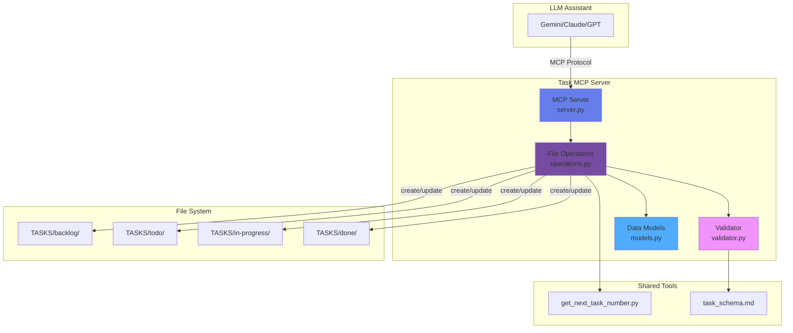

# Task MCP Server

**Domain:** `project_sanctuary.document.task`  
**Version:** 0.1.0  
**Status:** In Development

---

## Overview

The Task MCP server manages task files in the `TASKS/` directory structure. It provides tools for creating, updating, moving, reading, listing, and searching tasks following the canonical task schema.

**Key Principle:** File operations only - No Git commits (follows separation of concerns)

---

## Quick Start

### Start the MCP Server

**Option 1: Run Locally (Development - No Container)**
```bash
cd mcp_servers/task
source ../../.venv/bin/activate
python server.py
```
*Use this for development, debugging, and quick testing. No Podman required.*

**Option 2: Run in Podman Container (Production)**
```bash
# From project root
podman run -d \
  --name task-mcp \
  -v /Users/richardfremmerlid/Projects/Project_Sanctuary/TASKS:/app/TASKS:rw \
  -v /Users/richardfremmerlid/Projects/Project_Sanctuary/tools:/app/tools:ro \
  -p 8080:8080 \
  task-mcp:latest
```
*Use this for production deployment. Runs in isolated Podman container. View in **Podman Desktop** app.*

**Verify Running:**
```bash
# Check status (should show Up or Exited(0))
podman ps -a | grep task-mcp

# View logs
podman logs task-mcp
```

**Note:** Both options run the same MCP server code. The container version provides isolation and reproducibility.

### Run Tests

```bash
# Activate virtual environment
source .venv/bin/activate

# Run all unit tests
python -m pytest tests/mcp_servers/task/test_operations.py -v

# Run end-to-end workflow test
python tests/mcp_servers/task/test_e2e_workflow.py

# Run specific test
python -m pytest tests/mcp_servers/task/test_operations.py::TestCreateTask::test_create_task_success -v
```

### Create a Task

```python
from mcp_servers.task.operations import TaskOperations
from mcp_servers.task.models import TaskPriority, TaskStatus
from pathlib import Path

# Initialize
project_root = Path.cwd()
task_ops = TaskOperations(project_root)

# Create task
result = task_ops.create_task(
    title="Implement New Feature",
    objective="Add feature X to improve user experience",
    deliverables=[
        "Feature implementation",
        "Unit tests",
        "Documentation"
    ],
    acceptance_criteria=[
        "Feature works as expected",
        "Tests pass",
        "Docs updated"
    ],
    priority=TaskPriority.HIGH
)

print(f"Created: {result.file_path}")
```

### Update a Task

```python
# Update task priority
result = task_ops.update_task(
    task_number=37,
    updates={"priority": TaskPriority.CRITICAL}
)

# Move task to in-progress
result = task_ops.update_task_status(
    task_number=37,
    new_status=TaskStatus.IN_PROGRESS,
    notes="Starting work on this task"
)

print(f"Updated: {result.file_path}")
```

### Search and List Tasks

```python
# Search for tasks
results = task_ops.search_tasks("authentication")
for task in results:
    print(f"#{task['number']}: {task['title']}")

# List in-progress tasks
tasks = task_ops.list_tasks(status=TaskStatus.IN_PROGRESS)
print(f"Found {len(tasks)} in-progress tasks")
```

---

## Architecture



**Related Diagrams:**
- [Task MCP Class Diagram](../../docs/mcp/diagrams/task_mcp_class.mmd)
- [MCP Ecosystem Overview](../../docs/mcp/diagrams/mcp_ecosystem_class.mmd)

---

## Operations

### 1. create_task

**Purpose:** Create a new task file

**Preconditions:**
- Task number must be unique (auto-generated if not provided)
- Title, objective, deliverables, and acceptance criteria are required
- Dependencies must reference existing tasks (if specified)

**Input:**
```python
create_task(
    title: str,                          # Required
    objective: str,                      # Required
    deliverables: List[str],             # Required (min 1)
    acceptance_criteria: List[str],      # Required (min 1)
    priority: TaskPriority = MEDIUM,     # Optional
    status: TaskStatus = BACKLOG,        # Optional
    lead: str = "Unassigned",            # Optional
    dependencies: str = None,            # Optional
    related_documents: str = None,       # Optional
    notes: str = None,                   # Optional
    task_number: int = None              # Optional (auto-generated)
)
```

**Output:**
```python
FileOperationResult {
    file_path: "TASKS/backlog/037_implement_feature.md",
    content: "# TASK: Implement Feature\n...",
    operation: "created",
    task_number: 37,
    status: "success",
    message: "Task #037 created successfully"
}
```

**Example:**
```python
result = task_mcp.create_task(
    title="Implement User Authentication",
    objective="Add secure user authentication to the application",
    deliverables=[
        "Login page with email/password",
        "JWT token generation",
        "Protected routes middleware"
    ],
    acceptance_criteria=[
        "Users can log in with valid credentials",
        "Invalid credentials show error message",
        "Protected routes require authentication"
    ],
    priority=TaskPriority.HIGH,
    dependencies="Requires #036"
)
# Returns: { file_path: "TASKS/backlog/037_implement_user_authentication.md", ... }
```

---

### 2. update_task

**Purpose:** Update an existing task's metadata or content

**Preconditions:**
- Task must exist
- Updates must maintain schema validity

**Input:**
```python
update_task(
    task_number: int,        # Required
    updates: Dict[str, any]  # Required
)
```

**Output:**
```python
FileOperationResult {
    file_path: "TASKS/backlog/037_implement_feature.md",
    content: "# TASK: Implement Feature (Updated)\n...",
    operation: "updated",
    task_number: 37,
    status: "success",
    message: "Task #037 updated successfully"
}
```

**Example:**
```python
result = task_mcp.update_task(
    task_number=37,
    updates={
        "priority": TaskPriority.CRITICAL,
        "lead": "GUARDIAN-02",
        "deliverables": [
            "Login page with email/password",
            "JWT token generation",
            "Protected routes middleware",
            "Password reset functionality"  # Added
        ]
    }
)
```

---

### 3. update_task_status

**Purpose:** Change task status (moves file between directories)

**Preconditions:**
- Task must exist
- New status must be valid

**Input:**
```python
update_task_status(
    task_number: int,          # Required
    new_status: TaskStatus,    # Required
    notes: str = None          # Optional
)
```

**Output:**
```python
FileOperationResult {
    file_path: "TASKS/in-progress/037_implement_feature.md",
    content: "# TASK: Implement Feature\n...",
    operation: "moved",
    task_number: 37,
    status: "success",
    message: "Task #037 moved to in-progress"
}
```

**Status Transitions:**
```
backlog → todo → in-progress → done
   ↓        ↓         ↓
blocked (stays in in-progress dir)
```

**Example:**
```python
result = task_mcp.update_task_status(
    task_number=37,
    new_status=TaskStatus.IN_PROGRESS,
    notes="Starting implementation. Assigned to GUARDIAN-02."
)
# File moves from TASKS/backlog/ to TASKS/in-progress/
```

---

### 4. get_task

**Purpose:** Retrieve a specific task by number

**Preconditions:**
- Task must exist

**Input:**
```python
get_task(task_number: int)  # Required
```

**Output:**
```python
{
    "number": 37,
    "title": "Implement User Authentication",
    "status": "in-progress",
    "priority": "Critical",
    "lead": "GUARDIAN-02",
    "file_path": "TASKS/in-progress/037_implement_user_authentication.md",
    "content": "# TASK: Implement User Authentication\n..."
}
```

**Example:**
```python
task = task_mcp.get_task(37)
print(task["title"])  # "Implement User Authentication"
```

---

### 5. list_tasks

**Purpose:** List tasks with optional filters

**Preconditions:**
- None (returns empty list if no tasks match)

**Input:**
```python
list_tasks(
    status: TaskStatus = None,      # Optional filter
    priority: TaskPriority = None   # Optional filter
)
```

**Output:**
```python
[
    {
        "number": 37,
        "title": "Implement User Authentication",
        "status": "in-progress",
        "priority": "Critical",
        "lead": "GUARDIAN-02",
        "file_path": "TASKS/in-progress/037_implement_user_authentication.md"
    },
    {
        "number": 38,
        "title": "Add Unit Tests",
        "status": "in-progress",
        "priority": "High",
        "lead": "Unassigned",
        "file_path": "TASKS/in-progress/038_add_unit_tests.md"
    }
]
```

**Example:**
```python
# Get all tasks in progress
in_progress = task_mcp.list_tasks(status=TaskStatus.IN_PROGRESS)

# Get all critical priority tasks
critical = task_mcp.list_tasks(priority=TaskPriority.CRITICAL)

# Get all tasks (no filters)
all_tasks = task_mcp.list_tasks()
```

---

### 6. search_tasks

**Purpose:** Search tasks by content (full-text search)

**Preconditions:**
- None (returns empty list if no matches)

**Input:**
```python
search_tasks(query: str)  # Required
```

**Output:**
```python
[
    {
        "number": 37,
        "title": "Implement User Authentication",
        "status": "in-progress",
        "priority": "Critical",
        "file_path": "TASKS/in-progress/037_implement_user_authentication.md",
        "matches": [
            "Add secure user authentication to the application",
            "JWT token generation",
            "Protected routes require authentication"
        ]
    }
]
```

**Example:**
```python
# Search for tasks mentioning "authentication"
results = task_mcp.search_tasks("authentication")

# Search for tasks mentioning "GUARDIAN-02"
guardian_tasks = task_mcp.search_tasks("GUARDIAN-02")
```

---

## Connecting to Claude Desktop

To use the Task MCP server with Claude Desktop, you need to register it in Claude's MCP configuration.

### Step 1: Locate Claude Desktop Config

The config file is at:
```bash
cd ~/Library/Application\ Support/Claude/
nano claude_desktop_config.json
```

### Step 2: Add Task MCP Server

Edit the config file and add the Task MCP server:

```json
{
  "mcpServers": {
    "task-mcp": {
      "command": "/Users/richardfremmerlid/Projects/Project_Sanctuary/.venv/bin/python",
      "args": [
        "-m",
        "mcp_servers.task.server"
      ],
      "env": {
        "PYTHONPATH": "/Users/richardfremmerlid/Projects/Project_Sanctuary",
        "PROJECT_ROOT": "/Users/richardfremmerlid/Projects/Project_Sanctuary"
      },
      "cwd": "/Users/richardfremmerlid/Projects/Project_Sanctuary"
    }
  }
}
```

**Note:** We use absolute paths to the virtual environment python executable to avoid `ENOENT` errors.

### Step 3: Restart Claude Desktop

1. Quit Claude Desktop completely
2. Reopen Claude Desktop
3. The Task MCP server will be available

### Step 4: Verify Connection

In Claude Desktop, you should see the Task MCP server listed in the MCP servers panel. You can now use natural language:

```
"Create a high priority task to implement user authentication"
"List all tasks in progress"
"Move task #037 to done"
"Search for tasks about authentication"
```

### Troubleshooting

**Server not showing up:**
- Check the config file syntax (valid JSON)
- Ensure Python path is correct
- Check Claude Desktop logs: `~/Library/Logs/Claude/`

**Permission errors:**
- Ensure the virtual environment is activated
- Check file permissions on TASKS directory

---

## Safety Rules

1. **Task Number Uniqueness** - Cannot create duplicate task numbers
2. **Circular Dependencies** - Validates dependency references exist
3. **Schema Compliance** - All tasks must follow `TASKS/task_schema.md`
4. **File Path Safety** - All operations restricted to `TASKS/` directory
5. **No Deletion** - Tasks cannot be deleted (archive by moving to done)
6. **No Git Operations** - File operations only (separation of concerns)

---

## Running in Podman

### Build the Image

```bash
cd mcp_servers/task
podman build -t task-mcp:latest .
```

### Run the Container

```bash
podman run -d \
  --name task-mcp \
  -v /Users/richardfremmerlid/Projects/Project_Sanctuary/TASKS:/app/TASKS:rw \
  -v /Users/richardfremmerlid/Projects/Project_Sanctuary/tools:/app/tools:ro \
  -p 8080:8080 \
  task-mcp:latest
```

**Volume Mounts:**
- `TASKS/` - Read/write access for task file operations
- `tools/` - Read-only access for `get_next_task_number.py`

**Port Mapping:**
- `8080:8080` - MCP protocol communication

### Run in Podman Desktop

1. Open **Podman Desktop**
2. Go to **Images** tab
3. Find `task-mcp:latest`
4. Click **▶️ play button**
5. Configure:
   - **Port:** `8080:8080`
   - **Volume 1:** `/path/to/TASKS:/app/TASKS:rw`
   - **Volume 2:** `/path/to/tools:/app/tools:ro`
   - **Name:** `task-mcp`
6. Click **Start Container**

### Verify Running

```bash
# Check container status
podman ps | grep task-mcp

# View logs
podman logs task-mcp

# Test health endpoint
curl http://localhost:8080/health
```

---

## Development

### Project Structure

```
mcp_servers/task/
├── __init__.py          # Package initialization
├── models.py            # Data models (TaskSchema, FileOperationResult)
├── validator.py         # Schema and safety validation
├── operations.py        # File operations (create, update, move, etc.)
├── server.py            # MCP server implementation
├── Dockerfile           # Container definition
└── README.md            # This file
```

### Local Testing (Without Container)

```bash
# Activate virtual environment
source .venv/bin/activate

# Install dependencies
pip install mcp

# Run tests
python -m pytest tests/mcp_servers/task/

# Run server locally
cd mcp_servers/task
python server.py
```

---

## Dependencies

- **Python 3.11+**
- **MCP SDK:** `pip install mcp`
- **Project Tools:** `get_next_task_number.py`
- **Task Schema:** `TASKS/task_schema.md`

---

## Related Documentation

- [MCP Architecture](../../docs/mcp/architecture.md)
- [MCP Setup Guide](../../docs/mcp/setup_guide.md)
- [Task Schema](../../TASKS/task_schema.md)
- [ADR 034: Containerize MCP Servers](../../ADRs/034_containerize_mcp_servers_with_podman.md)
- [Prerequisites Guide](../../docs/mcp/prerequisites.md)
- [Task #031: Implement Task MCP](../../TASKS/backlog/031_implement_task_mcp.md)

---

## Troubleshooting

### Task Number Already Exists

**Error:** `Task #037 already exists in backlog/`

**Solution:** Use auto-generated task number (don't specify `task_number`)

### Validation Failed

**Error:** `Schema validation failed: At least one deliverable is required`

**Solution:** Ensure all required fields are provided:
- title
- objective
- deliverables (min 1)
- acceptance_criteria (min 1)

### File Not Found

**Error:** `Task #037 not found`

**Solution:** Verify task exists:
```python
task = task_mcp.get_task(37)
if task is None:
    print("Task does not exist")
```

---

**Last Updated:** 2025-11-26  
**Maintainer:** Project Sanctuary Team
