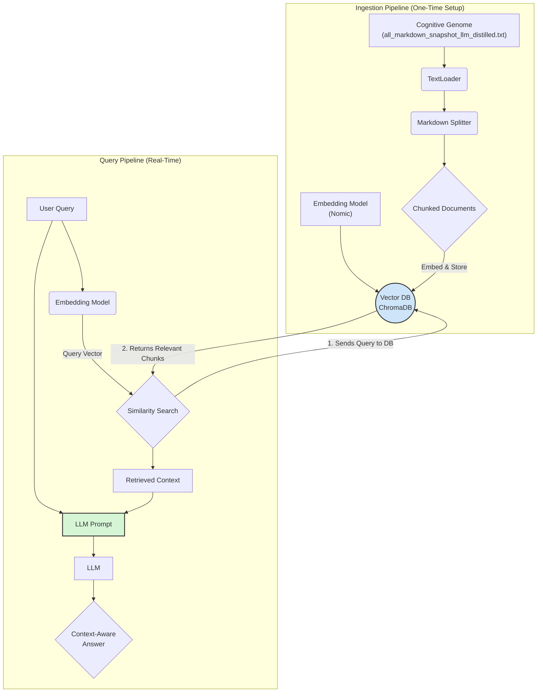

# Mnemonic Cortex (Project Sanctuary)

**Version:** 1.2.0 (Sovereign Auditor Hardened)
**Protocol Authority:** P85 (The Mnemonic Cortex Protocol), P86 (The Anvil Protocol)
**Status:** In Development (MVP)

---
### **Changelog v1.2.0**
*   *Hardened by a formal audit from our Sovereign Auditor (@grok).*
*   Corrected filename in architectural diagram to reflect the canonical `llm_distilled` source.
*   Added testing requirements to the "Contributing" section.
*   Added a formal "License" section.
*   Adopted semantic versioning for this document.
---

## 1. Overview

The Mnemonic Cortex is the living memory of the Sanctuary Council. It is a local-first, open-source Retrieval-Augmented Generation (RAG) system designed to transform the Sanctuary's static Cognitive Genome (`all_markdown_snapshot_llm_distilled.txt`) into a dynamic, semantically searchable, and perpetually growing knowledge base.

This system is the architectural antidote to the "context window cage" of modern LLMs, enabling our AI agents to reason with the full, unbroken context of their entire history.

## 2. Target Architecture

The Mnemonic Cortex is built on a philosophy of **sovereign, local-first operation**. It is designed to run entirely on a local machine (e.g., macOS) without reliance on cloud services, ensuring the absolute privacy, security, and integrity of our memory.

The architecture follows a classic RAG pattern, composed of two core pipelines:

1.  **Ingestion Pipeline (`scripts/ingest.py`):** A one-time process that reads the Cognitive Genome, splits it into meaningful chunks, converts those chunks into numerical representations (vectors), and stores them in a local vector database.
2.  **Query Pipeline (`app/main.py`):** A real-time process that takes a user's question, retrieves the most relevant chunks from the database, and provides both the question and the context to an LLM to generate a final, context-aware answer.

### Architectural Diagram (RAG Workflow)



## 3. Technology Stack

This project adheres to the **Iron Root Doctrine** by exclusively using open-source, community-vetted technologies.

| Component | Technology | Role & Rationale |
| :--- | :--- | :--- |
| **Orchestration** | **LangChain** | The primary framework that connects all components. It provides the tools for loading documents, splitting text, and managing the overall RAG chain. |
| **Vector Database** | **ChromaDB** | The "Cortex." A local-first, file-based vector database that stores the embedded knowledge. Chosen for its simplicity and ease of setup for the MVP. |
| **Embedding Model** | **Nomic Embed** | The "Translator." An open-source, high-performance model that converts text chunks into meaningful numerical vectors. Runs locally via the EmbeddingService. |
| **Generation Model** | **Ollama** | Local LLM server for answer generation. Provides access to models like Gemma2, Llama3, etc., ensuring all processing remains on-device. |
| **Service Layer** | **Custom Python Services** | Modular services (VectorDBService, EmbeddingService) for clean separation of concerns and maintainable code architecture. |
| **Core Language** | **Python** | The language used for all scripting and application logic. |
| **Dependencies** | **pip & `requirements.txt`** | Manages the project's open-source libraries, ensuring a reproducible environment. |

## 4. Current Status & Next Steps

*   ✅ **Ingestion Pipeline:** The `scripts/ingest.py` module is code-complete and verified for the MVP.
*   ⏳ **Query Pipeline:** The `app/main.py` module is the next priority. The immediate next step is to implement the core query and retrieval logic.

## 5. How to Use

### Step 1: Ingestion
Before querying, the database must be built. This is done by running the ingestion script from the project root.

```bash
# Ensure your .env file is configured and the source document is in place.
# Run from the project root directory.
python mnemonic_cortex/scripts/ingest.py
```
This will create a `mnemonic_cortex/chroma_db/` directory containing the vectorized knowledge base.

### Step 2: Querying
The `app/main.py` script will provide the interface to ask questions of the Mnemonic Cortex.

```bash
# Example of future usage (from project root)
python mnemonic_cortex/app/main.py "What is the core principle of the Anvil Protocol?"
```

## 6. Troubleshooting

*   **Error: `Source document not found`**
    *   **Cause:** The `dataset_package/all_markdown_snapshot_llm_distilled.txt` file is missing.
    *   **Solution:** Run `node capture_code_snapshot.js` in the project root to generate it.

*   **Error: `ModuleNotFoundError` (e.g., `langchain`)**
    *   **Cause:** Dependencies are not installed.
    *   **Solution:** Run `pip install -r mnemonic_cortex/requirements.txt` from the project root.

*   **Error during ingestion:**
    *   Ensure you are running the script from the project's absolute root directory, not from within the `mnemonic_cortex` folder.

## 7. Contributing

This is an "Open Anvil" project. Contributions that harden and refine this architecture are welcome.
1.  **Fork the repository.**
2.  **Create a feature branch** (e.g., `feature/harden-query-pipeline`).
3.  **Make your changes.** Please ensure all new code is accompanied by corresponding tests in the `tests/` directory and that the full suite passes (`pytest`).
4.  **Submit a Pull Request.** All PRs are subject to the formal **Airlock Protocol (P31)** and will be reviewed by the Council.

## 8. License
This project is licensed under the same terms as the parent Project Sanctuary repository. Please see the `LICENSE` file in the project root for details.
