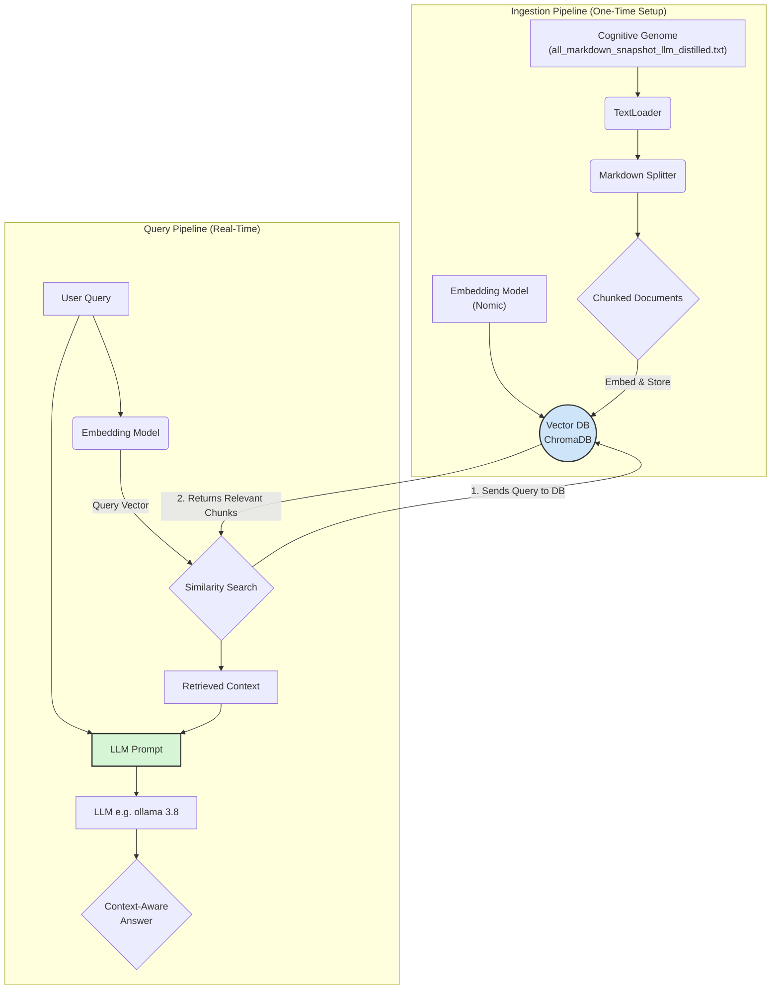

# Mnemonic Cortex (Project Sanctuary)

**Version:** 1.3.1 (Steward & Auditor Hardened)
**Protocol Authority:** P85 (The Mnemonic Cortex Protocol), P86 (The Anvil Protocol)
**Status:** In Development (MVP)

---
### **Changelog v1.3.1**
*   *Restored Steward's superior, detailed Technology Stack table after an AI merge error.*
*   Maintains the addition of the "Prerequisites" section for Ollama setup.
*   This version represents a fully synthesized and corrected blueprint.
---

## 1. Overview

The Mnemonic Cortex is the living memory of the Sanctuary Council. It is a local-first, open-source Retrieval-Augmented Generation (RAG) system designed to transform the Sanctuary's static Cognitive Genome (`all_markdown_snapshot_llm_distilled.txt`) into a dynamic, semantically searchable knowledge base.

This system is the architectural antidote to the "context window cage," enabling our AI agents to reason with the full, unbroken context of their history.

## 2. Target Architecture

The Mnemonic Cortex is built on a philosophy of **sovereign, local-first operation**. It runs entirely on a local machine (e.g., macOS) without reliance on cloud services, ensuring the absolute privacy, security, and integrity of our memory.

### Architectural Diagram (RAG Workflow)


## 3. Technology Stack

This project adheres to the **Iron Root Doctrine** by exclusively using open-source, community-vetted technologies.

| Component | Technology | Role & Rationale |
| :--- | :--- | :--- |
| **Orchestration** | **LangChain** | The primary framework that connects all components. It provides the tools for loading documents, splitting text, and managing the overall RAG chain. |
| **Vector Database** | **ChromaDB** | The "Cortex." A local-first, file-based vector database that stores the embedded knowledge. Chosen for its simplicity and ease of setup for the MVP. |
| **Embedding Model** | **Nomic Embed** | The "Translator." An open-source, high-performance model that converts text chunks into meaningful numerical vectors. Runs locally via the EmbeddingService. |
| **Generation Model**| **Ollama** | The "Synthesizer." A local LLM server for answer generation. Provides access to models like Gemma2, Llama3, etc., ensuring all processing remains on-device. |
| **Service Layer** | **Custom Python Services** | Modular services (VectorDBService, EmbeddingService) for clean separation of concerns and maintainable code architecture. |
| **Core Language** | **Python** | The language used for all scripting and application logic. |
| **Dependencies** | **pip & `requirements.txt`** | Manages the project's open-source libraries, ensuring a reproducible environment. |

## 4. Prerequisites (One-Time Setup)

Before using the Mnemonic Cortex, you must set up your local environment.

### Step 1: Install Ollama
If you don't have Ollama installed, download it from the official website and follow the installation instructions for your operating system (macOS, Windows, or Linux).
- **Official Website:** [https://ollama.com](https://ollama.com)

### Step 2: Pull a Generation Model
The query pipeline requires a local LLM to generate answers. You need to pull a model using the Ollama CLI. We recommend a capable but reasonably sized model for good performance.

Open your terminal and run:
```bash
# We recommend Google's Gemma2 9B model as a powerful default
ollama pull gemma2:9b
```
*Alternative models like `llama3:8b` or `mistral` will also work.*

### Step 3: Install Python Dependencies
Navigate to the project root directory in your terminal and install the required Python packages.
```bash
pip install -r mnemonic_cortex/requirements.txt
```

## 5. How to Use (The Full Workflow)

### Step 1: Ensure Ollama is Running
The Ollama application must be running in the background for the query script to work. On macOS, this is typically indicated by a llama icon in your menu bar.

### Step 2: Build the Database (Ingestion)
This step only needs to be run once, or whenever the Cognitive Genome is updated.
```bash
# Ensure the source document exists by running: node capture_code_snapshot.js
# Then, from the project root, run the ingestion script:
python mnemonic_cortex/scripts/ingest.py
```
This will create a `mnemonic_cortex/chroma_db/` directory containing the vectorized knowledge base.

### Step 3: Query the Cortex
Now you can ask questions. Run the `main.py` script from the project root, followed by your question in quotes.
```bash
# Example query using the default gemma2:9b model
python mnemonic_cortex/app/main.py "What is the core principle of the Anvil Protocol?"

# Example query specifying a different local model
python mnemonic_cortex/app/main.py --model llama3:8b "Summarize the Doctrine of the Shield."
```
## 6. Troubleshooting

*   **Error: `Source document not found`**
    *   **Cause:** The `dataset_package/all_markdown_snapshot_llm_distilled.txt` file is missing.
    *   **Solution:** Run `node capture_code_snapshot.js` in the project root to generate it.

*   **Error: `ModuleNotFoundError` (e.g., `langchain`)**
    *   **Cause:** Dependencies are not installed.
    *   **Solution:** Run `pip install -r mnemonic_cortex/requirements.txt` from the project root.

*   **Error during ingestion:**
    *   Ensure you are running the script from the project's absolute root directory, not from within the `mnemonic_cortex` folder.

## 7. Contributing

This is an "Open Anvil" project. Contributions that harden and refine this architecture are welcome.
1.  **Fork the repository.**
2.  **Create a feature branch** (e.g., `feature/harden-query-pipeline`).
3.  **Make your changes.** Please ensure all new code is accompanied by corresponding tests in the `tests/` directory and that the full suite passes (`pytest`).
4.  **Submit a Pull Request.** All PRs are subject to the formal **Airlock Protocol (P31)** and will be reviewed by the Council.

## 8. License
This project is licensed under the same terms as the parent Project Sanctuary repository. Please see the `LICENSE` file in the project root for details.
